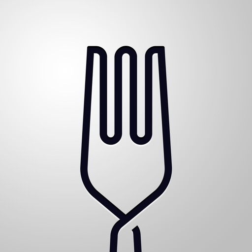

---
categories:
- ブログ
date: Thu, 29 Dec 2016 13:51:00 +0000
slug: post-10000
tags:
- おすすめ
title: 2016年版「使って感動したサービス3選」
---

買ってよかったものは以前書きましたが断然革靴だったんですが、使ってよかったサービスで他人にもオススメしたいものを３つほどご紹介いたします！<!--more-->
<h2>UBER EATS</h2>
最近お昼は必ずこれを使ってます。ラインナップとして並んでいるお店のお弁当を持ってきてくれるサービスです。

昨年まで利用していたLINE WOWには及ばないものの気軽に使える利便性は優っています。今のところラインナップにある店舗が少なく、だいたい大戸屋しかたのんでませんが、それでもちゃんとした料理が会社のビルに入ってるテナントでランチするよりも安く食べられるので利用しています。

会議中であっても、ちょこっと数回アプリ上でタップするだけで注文できるので、本当にユーザビリティが高くおすすめです。

クレカ決済のため、配達スタッフとお金のやりとりがいらないので、とてもスムーズに受けとりができます。来年はおそらく配達エリアが広がると思いますし、店舗も増えるのではないかと期待しております。

<a href="https://itunes.apple.com/jp/app/ubereats-fudoderibariwosupidini/id1058959277?mt=8&amp;uo=4&amp;at=11ld5P" target="_blank" rel="noopener">UberEATS：フードデリバリーをスピーディーに</a> (無料)

<a href="https://itunes.apple.com/jp/developer/uber-technologies-inc./id368677371?uo=4&amp;at=11ld5P" target="_blank" rel="noopener">Uber Technologies, Inc.</a> <a style="width: 100px; color: #ffffff; background: -webkit-gradient(linear, 100% 0%, 100% 100%, from(rgba(85,182,237,0.5)), to(rgba(41,140,218,1))); font-size: 10px; font-weight: bold; text-align: center; display: inline; text-decoration: none; border: 0px; padding: 5px; border-radius: 10px; white-space: nowrap;" href="https://itunes.apple.com/jp/app/ubereats-fudoderibariwosupidini/id1058959277?mt=8&amp;uo=4&amp;at=11ld5P" target="_blank" rel="noopener">iTunes で見る</a>

(2016.12.29時点)

posted with <a href="http://pochireba.com" target="_blank" rel="nofollow noopener">ポチレバ</a>

<h2>デビットカード</h2>
ぼくはクレカ使っちゃう人間で、気がつけば支払い10万超えが平常運転になってしまっているので導入してみました。

クレカのように使えて、銀行口座から直接瞬間的に引き落としされます。そのため、次月の請求をみて「こんなはずじゃ」なんて後悔せずにすみます。

それと、UBER EATSはプリペイドカード（LINE PAYカードやauウォレットなど）が使えません。試してみましたが注文時にエラーになります。そんな時にはデビットカードが使えます。

ぼくみたいに計画よりも欲望が優ってしまう人間にはおすすめなんじゃないかと思います。

参考：<a href="http://www.bk.mufg.jp/tsukau/visadebit/">三菱東京ＵＦＪ-VISAデビット</a>
<h2>ポケットモンスターサンムーン</h2>
最後はポケモンです。GOの方ではなくニンテンドーDSの方のポケモンです。

これは本当に面白いです。一応ストーリーはクリアして、クリア後のミッションをこなしています。それが終わったらいよいよポケモンの選別に入ります。

そして通信対戦の沼に足を踏み入れようかと思っています。ただ、いろいろ攻略サイトやyoutubeを見ていて相当ストイックにやらないとダメなんだろうなって思ってちょっと躊躇しておりますが。。。

それでも本編の方はとても楽しくプレイすることができます。ポケモンを今までプレイしたことがない人にもゲーム初心者にもおすすめです。

<a href="http://www.amazon.co.jp/exec/obidos/ASIN/B01IEMPJAQ/warawareotoko-22/ref=nosim/" target="_blank" rel="noopener">【Kindleキャンペーン対象商品】 ポケットモンスター ムーン - 3DS 【Kindleカタログをダウンロードすると200円OFF(2017/1/9迄)】</a>

posted with <a href="http://kaereba.com" target="_blank" rel="nofollow noopener">カエレバ</a>

任天堂 2016-11-18

<a href="http://www.amazon.co.jp/gp/search?keywords=%E3%83%9D%E3%82%B1%E3%83%A2%E3%83%B3&amp;__mk_ja_JP=%E3%82%AB%E3%82%BF%E3%82%AB%E3%83%8A&amp;tag=warawareotoko-22" target="_blank" rel="noopener">Amazon</a>

<a href="http://hb.afl.rakuten.co.jp/hgc/0f6e221b.2eb9748a.0f6e221c.35cc1e84/?pc=http%3A%2F%2Fsearch.rakuten.co.jp%2Fsearch%2Fmall%2F%25E3%2583%259D%25E3%2582%25B1%25E3%2583%25A2%25E3%2583%25B3%2F-%2Ff.1-p.1-s.1-sf.0-st.A-v.2%3Fx%3D0%26scid%3Daf_ich_link_urltxt%26m%3Dhttp%3A%2F%2Fm.rakuten.co.jp%2F" target="_blank" rel="noopener">楽天市場</a>

<a href="http://ck.jp.ap.valuecommerce.com/servlet/referral?sid=3041033&amp;pid=882528283&amp;vc_url=http%3A%2F%2Fsearch.shopping.yahoo.co.jp%2Fsearch%3Fp%3D%25E3%2583%259D%25E3%2582%25B1%25E3%2583%25A2%25E3%2583%25B3&amp;vcptn=kaereba" target="_blank" rel="noopener">Yahooショッピング</a>

<h2>しんぺーはこう思った。</h2>
今年はガジェットもサービス系もいろいろといいものを買って使って楽しめたり効率化できたりと、ぼくにとってとても豊作な年だったと思います！

来年はもっと行動範囲を広げたり、やったことないことやって、行ったことないところいって、もっと経験値をあげていきたい！！

その助けになるようなサービスやガジェットに出会えることを期待します！あと自分でも何か生み出したい！！！

と言ったところで本日は以上になります。

おやすみなさい。

そして、また明日。