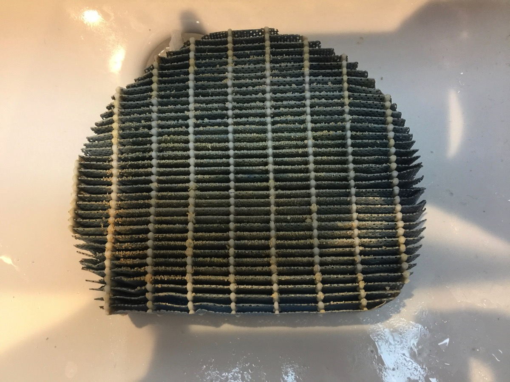
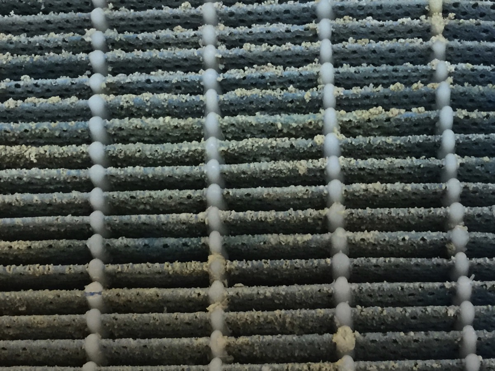
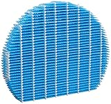
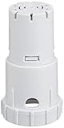
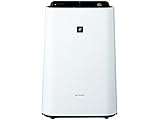

---
categories:
- レビュー
date: Fri, 30 Dec 2016 11:36:58 +0000
slug: post-10006
tags:
- おすすめ
title: 加湿空気清浄機がすっげー臭いから洗浄剤使ったら驚くほど匂いが取れた！
---

なんか部屋がすっげー靴みたいな匂いすんなーと思って数日、どうも使ってるシャープの加湿空気清浄機が原因と気がつきました。そこでいろいろと調べた結果、フィルター交換を行ったんですが、数日するとまた臭くなってきました。そこで今度は洗浄剤を使って見ました。すると嘘のように臭いが消えましたので、本日はそのご紹介です。<!--more-->
<h2>加湿器洗浄剤</h2>
洗浄剤といいまいたが、正確には除菌剤です。

<a href="https://www.amazon.co.jp/%E5%8A%A0%E6%B9%BF%E5%99%A8%E3%81%AE%E9%99%A4%E8%8F%8C%E3%82%BF%E3%82%A4%E3%83%A0-%E6%B6%B2%E4%BD%93%E3%82%BF%E3%82%A4%E3%83%97-%E7%84%A1%E9%A6%99%E6%96%99-%E7%B5%A6%E6%B0%B4%E3%82%BF%E3%83%B3%E3%82%AF%E5%86%85%E3%81%AE%E9%99%A4%E8%8F%8C-%E3%83%8C%E3%83%A1%E3%83%AA%E9%98%B2%E6%AD%A2%E5%B0%82%E7%94%A8%E9%99%A4%E8%8F%8C%E5%89%A4-500ml/dp/B002WG8M0K/ref=as_li_ss_il?ie=UTF8&amp;qid=1483096525&amp;sr=8-1&amp;keywords=%E5%8A%A0%E6%B9%BF%E5%99%A8%E3%80%80%E6%B4%97%E6%B5%84%E5%89%A4&amp;linkCode=li3&amp;tag=warawareotoko-22&amp;linkId=b23e85630648707aa02606deb236ed11" target="_blank" rel="noopener"></a>

ぼくが使っている加湿器は気化式のため構造上菌が繁殖しやすくなっています。そのためフィルターを交換しても、すぐに臭いが発生してしまったようです。

タンクに水が2L入るので、規定の量の薬剤を入れていつもどおり過失するだけです。

ただし、臭いの原因は水とそこに発生する菌ですので定期的に薬剤を入れて除菌する必要があります。
<h2>フィルターなどの部品の手入れも1年に1回くらいはやってもいいかも</h2>
メーカーのページなどでは長期間交換する必要がないと書いてあるところもありますが、絶対に定期的に、できればシーズンごとに交換した方がいい気がします。

その証拠がこちらの写真

アップで見てみるとこれ。

カルキがつきまくってます。これを新品に交換します。

<a href="http://www.amazon.co.jp/exec/obidos/ASIN/B002TO4N26/warawareotoko-22/ref=nosim/" target="_blank" rel="noopener">シャープ 加湿フィルター 加湿空気清浄機用 FZ-Y80MF</a>

posted with <a href="http://kaereba.com" target="_blank" rel="nofollow noopener">カエレバ</a>

シャープ(SHARP)

<a href="http://www.amazon.co.jp/gp/search?keywords=FZ-Y80MF&amp;__mk_ja_JP=%E3%82%AB%E3%82%BF%E3%82%AB%E3%83%8A&amp;tag=warawareotoko-22" target="_blank" rel="noopener">Amazon</a>

<a href="http://hb.afl.rakuten.co.jp/hgc/0f6e221b.2eb9748a.0f6e221c.35cc1e84/?pc=http%3A%2F%2Fsearch.rakuten.co.jp%2Fsearch%2Fmall%2FFZ-Y80MF%2F-%2Ff.1-p.1-s.1-sf.0-st.A-v.2%3Fx%3D0%26scid%3Daf_ich_link_urltxt%26m%3Dhttp%3A%2F%2Fm.rakuten.co.jp%2F" target="_blank" rel="noopener">楽天市場</a>

<a href="http://ck.jp.ap.valuecommerce.com/servlet/referral?sid=3041033&amp;pid=882528283&amp;vc_url=http%3A%2F%2Fsearch.shopping.yahoo.co.jp%2Fsearch%3Fp%3DFZ-Y80MF&amp;vcptn=kaereba" target="_blank" rel="noopener">Yahooショッピング</a>

ちなみについでも他の部品も交換すると効果も倍増するでしょう！！

カートリッジも交換しました。

<a href="http://www.amazon.co.jp/exec/obidos/ASIN/B009ODJPMI/warawareotoko-22/ref=nosim/" target="_blank" rel="noopener">シャープ 加湿空気清浄機用 Ag+イオンカートリッジ FZ-AG01K1</a>

posted with <a href="http://kaereba.com" target="_blank" rel="nofollow noopener">カエレバ</a>

シャープ(SHARP)

<a href="http://www.amazon.co.jp/gp/search?keywords=FZ-AG01K1&amp;__mk_ja_JP=%E3%82%AB%E3%82%BF%E3%82%AB%E3%83%8A&amp;tag=warawareotoko-22" target="_blank" rel="noopener">Amazon</a>

<a href="http://hb.afl.rakuten.co.jp/hgc/0f6e221b.2eb9748a.0f6e221c.35cc1e84/?pc=http%3A%2F%2Fsearch.rakuten.co.jp%2Fsearch%2Fmall%2FFZ-AG01K1%2F-%2Ff.1-p.1-s.1-sf.0-st.A-v.2%3Fx%3D0%26scid%3Daf_ich_link_urltxt%26m%3Dhttp%3A%2F%2Fm.rakuten.co.jp%2F" target="_blank" rel="noopener">楽天市場</a>

<a href="http://ck.jp.ap.valuecommerce.com/servlet/referral?sid=3041033&amp;pid=882528283&amp;vc_url=http%3A%2F%2Fsearch.shopping.yahoo.co.jp%2Fsearch%3Fp%3DFZ-AG01K1&amp;vcptn=kaereba" target="_blank" rel="noopener">Yahooショッピング</a>

で、フィルター交換をすると驚くほどタンクの水が早く減ります。それだけカルキの付着で正常な運転が阻害されていたということでしょうか。
<h2>しんぺーはこう思った。</h2>
喉を痛めないための加湿器で、帰って健康を害しては元も子もありません。
そして空気清浄するはずなのに、臭いにおいを撒き散らしても意味がありません。

ちゃんとメンテナンスをすることで正常に動作してくれます。
大掃除のついでにこのあたりも交換してみてはいかがでしょうか。

と言ったところで本日は以上になります。

おやすみなさい。

そして、また明日。

<a href="http://www.amazon.co.jp/exec/obidos/ASIN/B0149Z0XD0/warawareotoko-22/ref=nosim/" target="_blank" rel="noopener">シャープ 加湿空気清浄機 プラズマクラスター搭載 ホワイト KC-F50-W</a>

posted with <a href="http://kaereba.com" target="_blank" rel="nofollow noopener">カエレバ</a>

シャープ(SHARP)

<a href="http://www.amazon.co.jp/gp/search?keywords=KC-F50-W&amp;__mk_ja_JP=%E3%82%AB%E3%82%BF%E3%82%AB%E3%83%8A&amp;tag=warawareotoko-22" target="_blank" rel="noopener">Amazon</a>

<a href="http://hb.afl.rakuten.co.jp/hgc/0f6e221b.2eb9748a.0f6e221c.35cc1e84/?pc=http%3A%2F%2Fsearch.rakuten.co.jp%2Fsearch%2Fmall%2FKC-F50-W%2F-%2Ff.1-p.1-s.1-sf.0-st.A-v.2%3Fx%3D0%26scid%3Daf_ich_link_urltxt%26m%3Dhttp%3A%2F%2Fm.rakuten.co.jp%2F" target="_blank" rel="noopener">楽天市場</a>

<a href="http://ck.jp.ap.valuecommerce.com/servlet/referral?sid=3041033&amp;pid=882528283&amp;vc_url=http%3A%2F%2Fsearch.shopping.yahoo.co.jp%2Fsearch%3Fp%3DKC-F50-W&amp;vcptn=kaereba" target="_blank" rel="noopener">Yahooショッピング</a>

