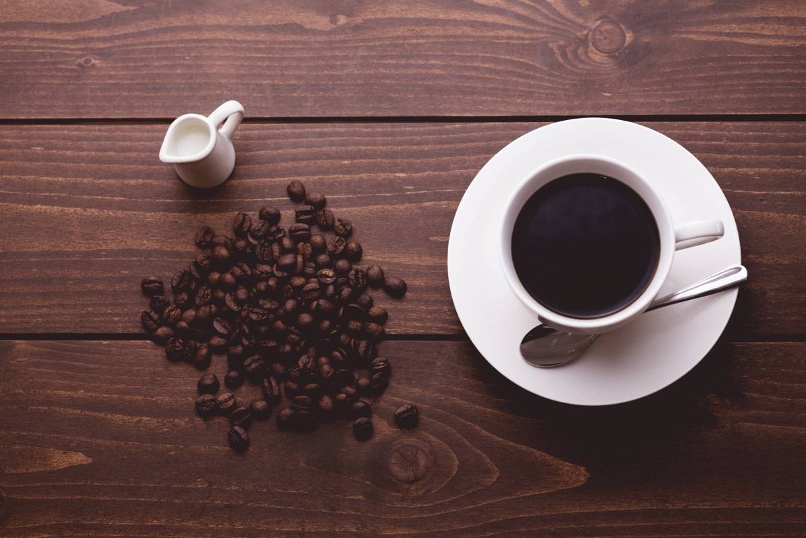
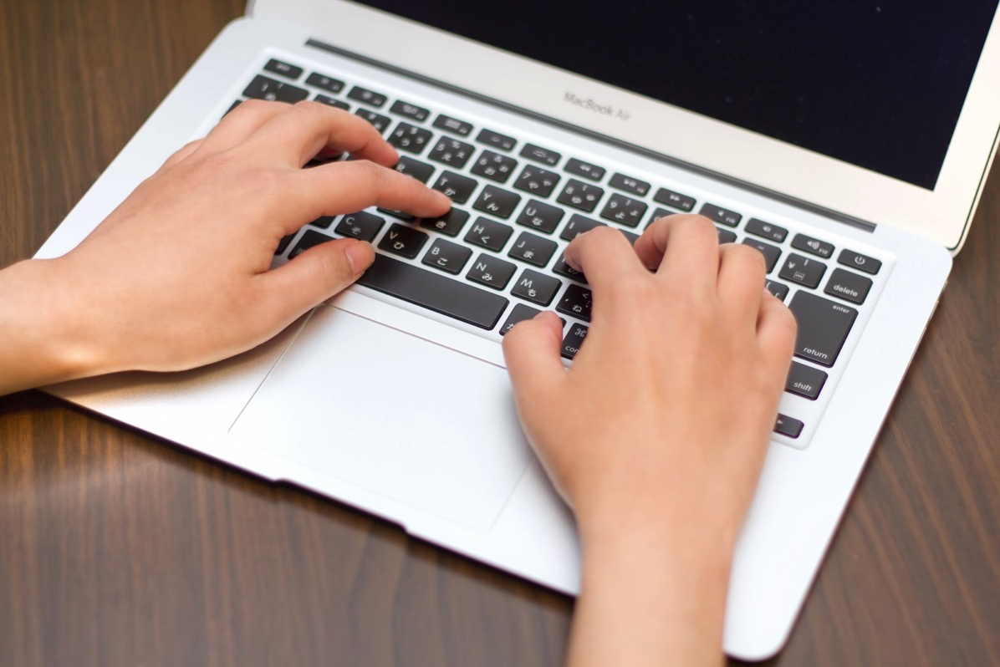
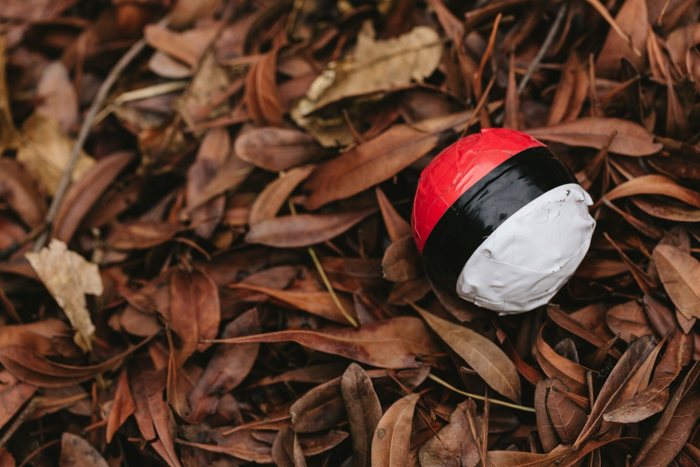

---
categories:
- トラウマ
date: Sat, 31 Dec 2016 14:26:31 +0000
slug: post-10008
tags:
- ブログ
title: 昨日までのぼくと明日からのぼく
---

今年ももう終わりですね。今年は今までの人生で最速で過ぎ去って行ったような気がします。体感でめちゃくちゃ早かった。年始に目標とかやりたいこととかをリスト化したんですが、今どんくらい達成できて、それを踏まえて来年どうしなりたいかなんかを考えてみました。<!--more-->
<h2>昨日までのぼく</h2>
冒頭にも書きましたが今年は人生最速で過ぎていきました。ただ、だからといって記憶に残っていないかというとそうではなく、割と濃い一年だったと思います。ただ、年始に決めた目標がどれくらい達成できたかというと、そんなにはできていません。

今エバーノートを見返してみて驚きましたが、一個も達成してなかったわwww

いやーどんだけーwww　ただその代わりにやり遂げたっぽいこととか習慣化したこともいくつかあります。
<h3>コーヒー断ち</h3>

コーヒーを飲むようになってから、これだけ長期にわたってコーヒーを飲まなかったのは初めてです。実際には多分7月くらいに始めて11月くらいまで一滴も飲まなかった気がします。

で、何が変わったかというと便秘っぽくなったのと後は頭が重くなる感じとか、眠過ぎてゾンビになることがなくなりました。
<h3>ブログ毎日更新</h3>

これも7月くらいからずっと毎日してるかなーと思ったら、そんなことなくて9月からでした。9月21日からみたいです。

毎日更新した結果、PVが下がりました。まぁ低品質な記事をたくさん書いてたので仕方ありません。もっと高品質な記事を書けるように精進するしかありません。

ただ、なんで毎日更新しようかと思ったかというと理由は2つ。

何度かこのブログで紹介しているアメリカのyoutuberのCasey Neistat
この人は毎日動画投稿をしていますが、クリエイティブな挑戦としてスタートしました。

もう一つが、日本のyoutuberのラファエル。今年頭角を表した今一番勢いのある人です。この人も毎日動画投稿をしています。

この2人から「一流とは淡々とする努力できること」だと思いました。だから今は、低品質であっても毎日投稿することに意味があると考え、毎日投稿しています。これからも多分しばらくは続けると思います。
<h3>ポケモンGO</h3>

さんざん書いてきていますが、<strong>まだ</strong>やっています。新種も2種類ほど孵化しました。

金銀ポケモンほとんど知りませんし、予習のつもりでやりはじめたハートゴールドですが、サンムーンやり始めたら止まっちゃいました。

これもとりあえずしばらくはまだ続けます。ただ、積極的にはおそらくやらないかなーと思います。会社の行き帰りとかにGOプラスつけたりする程度です。
<h2>明日からのぼく</h2>
<strong>とくにかくいろいろな技術を習得したい。</strong>

社会人経験も数年たって、今足りないものってなんなのよって考えると<strong>技術</strong>

<strong>圧倒的な技術</strong>

ブログもそう。
来年ではじめて4年くらいたちますが、ぜんっぜん見られてません。4年もやってれば数十万PVとかのブログはざらにあります。しかし、まーったくそうなっていないし、そうなる気配もありません。もっと読まれるような文章や読んだ人の役にたつようなことを書けるようになりたい。

攻殻機動隊的に言うとネット上に<strong>もっと自分の因子を撒き散らしたい。</strong>
<h3>少額での株式投資</h3>
貯金できないマンだったんですがようやく欲しいものとかが揃ってきて、その支払いも終わり、ようやく貯金できそうです。そこで、勉強も兼ねて１万円くらいの少額の投資というものをやってみたいと思います。それで増えた減ったで一喜一憂してみたいなぁと

なお少額というのは、以前株で失敗したことがあって怖いなーと思ってるからです。どんな失敗をしたかというと買ったJAL株が翌週に1円になったとか、Appleの株と思って買ったら中古車販売のアップルインターナショナルだったとかです。
<h3>プレッパーとしての活動</h3>
プレッパーって知ってますか？災害や戦争がきても生き延びれるように備えを行う人たちのことをいいます。

日本は地震大国。先の大震災のように、生きているうちに絶対にあと数回は大きな地震が起こるでしょう。それが起こっても生き残れるように準備をしたと思います。

そのためには、まず体づくり。最後は自分の体だけで生きていかなければいけません。だから自分を鍛えねばと思うのです。

で、運動といえば秋口からちょっとだけ、腕立てをやってました。おかげで少し痩せました。

ただ、胃腸炎になってしまってからはなし崩し的に中断してしまいました。なので、少し自分を追い込むような形で、負荷をかけていきたいと思います。

あとは、家庭菜園で食べられ植物を育てるとか、、、
<h3>技術習得のための動画投稿</h3>
別にYoutuberになりたいわけではなくもないんですが、表現としての動画に興味があります。自分で商品紹介したり、検証動画撮ったりするのも微妙なんで、自作のアニメーションとか何やらをやって見たいと思います。ただ、どちらかというと投稿よりも制作の方に興味があるので、そっちの方を勉強しながら頑張って見たいと思います。
<h3>欲しいアプリがないから自分でアプリ開発したい</h3>
欲しいものがあるのですが、実物を買うとなると結構な値段がします。アプリでも代用できるのですが、ドンピシャで使いたいと思えるようなものがありません。

そこで自分で作ってやりたいな！と思っております。

実は昨年の目標でも、アプリ開発というのを掲げていた形跡がエバーノートに残っておりましたw　ただ、新しくMacBook Proを買いましたので勉強し直して、ばっちりリリースさせたいと思います！
<h2>しんぺーはこう思った。</h2>
まだまだありますが、具体的なものはそんなところです。

上にあげたものは定期的に進捗報告をしていこうかなと思います。あとは来年は行けるLIVEは全部行きたいし、遠征もできればしていきたいと思います！！

今年も一年当ブログを拝読いただきまことにありがとうございました。
それではあと数時間ですが、良いお年を！

と言ったところで本日は以上になります。

おやすみなさい。

そして、また来年も宜しくお願いいたします。