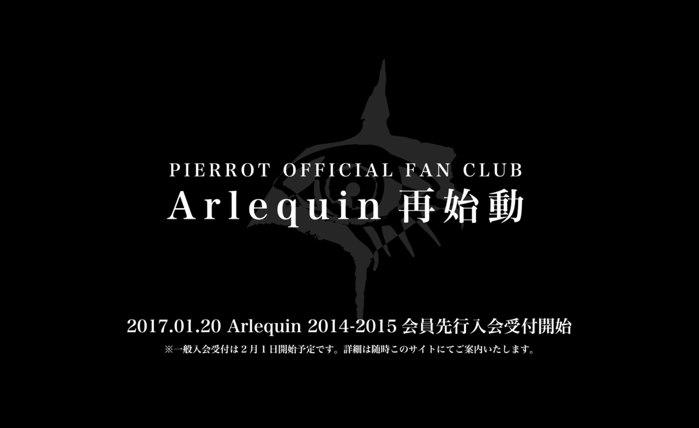
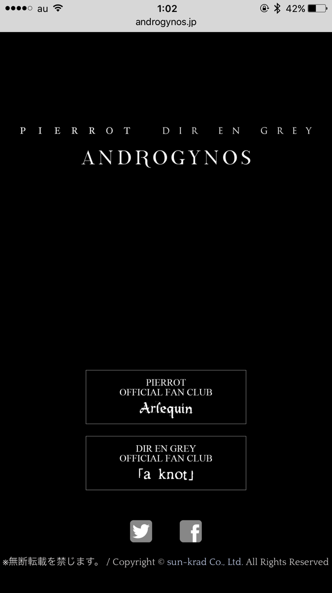
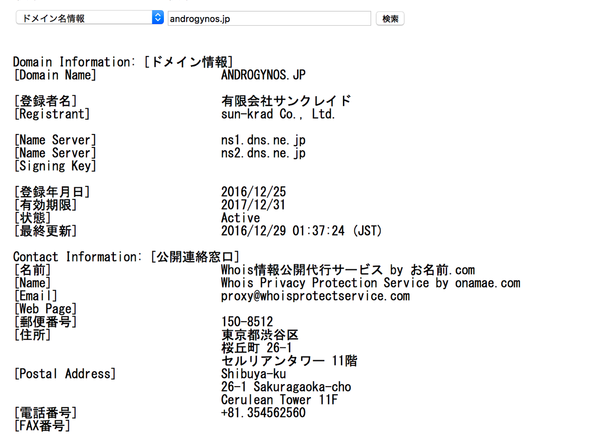

---
categories:
- ANDROGYNOS
date: Sat, 31 Dec 2016 16:09:00 +0000
slug: post-10017
tags:
- androgynos
- DIR EN GREY
- pierrot
title: androgynos（アンドロジナス）とは？7月7日8日横浜アリーナにてPIERROTとDIR EN GREY奇跡のLIVE
---

PIERROTとDIR EN GREYの謎のプロジェクト「ANDROGYNOS」についてのまとめです。更新情報あれば随時追記していきます。

最新情報はここから（2017年2月12日時点）

そして、明かされたプロジェクトの一端

<blockquote class="twitter-tweet" data-lang="ja">
2017.2.12(sun)  14:00 新宿アルタビジョン
&mdash; ANDROGYNOS (@androgynosJP) <a href="https://twitter.com/androgynosJP/status/830068818261135363">2017年2月10日</a></blockquote>

横浜アリーナにて2days

7月7日　- a view of the Megiddo -
7月8日　- a view of the Acro -

LIVEの概要に関してはまだ詳細は不明です。

<iframe width="560" height="315" src="https://www.youtube.com/embed/1pNCvvQNbn4" frameborder="0" allowfullscreen></iframe>

が、これは宗教戦争の集結なんて生易しいものではなかった。すでに大人となった我々バンギャと社会、会社、家庭、世間との新たな戦争の始まりだった。

ぼくたちが10代の頃感じていた閉塞感、疎外感、開放感、全能感

それを今こそ蘇らせ、丘に集結し、リアルと戦えという教祖同士からの教義なのだ。

今ここに誓う。

万難苦難排し、有給を取得し、血みどろのチケット争奪戦を勝ち抜き、

かならず、かならず、かならず、ごくが初めてLIVEに参戦したあの場所

1999年9月9日に２階席の9列目99番の席で観ていたあの会場に

からならず生きてたどり着くことを誓う！！！！！！

みんなも死ぬんじゃねーーーーぞおおおおおお

初日が平日なのは日曜日休めるようにという教祖様たちの気遣いだ！！！！！

<!--more-->

過去情報はここから（2017年1月21日時点）色々と予想が外れてるw

<h2>androgynosとは</h2>

（こ、ここからは冷静に。。以下は発表前情報をリアルタイムで投稿してたものです。そのうち修正します。）

アンドロジナス。ギリシャ語で両性具有を指します。

（前回のDIR EN GREYのツアーのSEにGARBAGEというバンドのandrogynyという曲が流れていました。こちらは両性具有の英語の名詞です。）

PIERROTとDIR EN GREYのファンであることを意味するのかな？とか思います。ぴったりのタイトルでしょう。ただ、これが何を意味するのかは今の所不明です。

<strong>まー対バンやるんだろうけどさ</strong>
<blockquote class="twitter-tweet" data-lang="ja">

PIERROT

DIR EN GREY

ANDROGYNOS<a href="https://t.co/23KEeypGvT">https://t.co/23KEeypGvT</a> <a href="https://t.co/gIMR9xDciy">pic.twitter.com/gIMR9xDciy</a>

— ANDROGYNOS (@androgynosJP) <a href="https://twitter.com/androgynosJP/status/815211864212664320">2016年12月31日</a></blockquote>

PIERROTの方のリンクを踏むと「PIERROT再始動」の文字が。再結成でもなく解散ライブでもない、継続される活動なのでしょうか。なんとなくそんな気がします。
（ちなみに後述しますが、このファンクラブには入会しておいた方がいいと思います。）

前回のDICTATORS CIRCUS FINALの時の資金調達のためのファンクラブ会員は、1月20日より先行会員となれるようです。

<a href="http://www.arlequin.jp/">http://www.arlequin.jp/</a>

ちなみにサイト自体はsun-kradがコピーライトになっています。

whoisで登録情報を調べますと登録もやはりサンクレです。

ということで主体はDIR EN GREYでしょうか。今年結成20周年なので、何かしらの大きなイベントを行う可能性もあります。その相手として選んだのが当時（ファン同士が勝手に）ライバル視されていたPIERROTを選んだというのは濃厚でしょう。

<a href="http://www.androgynos.jp/">http://www.androgynos.jp/</a>

で、ここで注目したいのがサイトの有効期限です。2017年12月31日となっています。ということはやはり、このサイトは今年限定で何かしらのイベントのために作られたものだと思われます。

また、両者のファンクラブのリンクのみということはファンクラブに入会しておくことで何かしらのメリットが得られるのでしょう。考えられるのは次の3つ
<ul>
 	<li>VIP席（お土産つき）※LIVEやるなら</li>
 	<li>グッズ通販※LIVEやるなら</li>
 	<li>チケット先行※LIVEやるなら</li>
</ul>
最後のチケット先行は確実にあると思います。当然チケット争奪戦は想像を絶する過酷なものになるでしょう。ということでPIERROTとDIR EN GREYの両方のファンクラブに入ることで少しでもチケット確保の確率が上がると思われます。

あと、最後にもーしかしたらなんですが、これ

ファンクラブ限定LIVEの可能性がある気がします。。。

LIVE映像も当然発売されるかと思います。ただ、PIERROTは今や3者別の事務所ですしDIR EN GREY側との利益折半の比率とかもめんどくさいと思います。（まぁそんなことだけではないと思うのですが。）それだったら、両者のファンクラブ限定で販売した方が後腐れなくていいのではとか思ったり。その場合は、パッケージと編集カットが別になってるとかね。両方買わないとダーメよみたいなw

あと超絶蛇足ですが、これをきっかけにPIERROTがサンクレ移籍になったりしてねw

<h2>LIVEはいつなのか各バンドのスケジュール確認して予想してみた</h2>
LIVEやるにしても、じゃいつ頃なのよ。ってことでそれぞれのバンドのスケジュール調べてみました。

どうしよリキッドルームとかそれくらいの規模だったら・・・超プレミアチケットになる、、、絶対に入れない、、、こわい。。。。
<h3>Angelo</h3>
キリト、Kohta、Takeoの所属するバンドです。
今のところ発表ないみたいですが、キリトはブログできっちり情報更新しています。

→<a href="http://ameblo.jp/kiritoofficial/entry-12233824193.html">日刊思考回路（キリトフィシャルブログ）</a>

暴れる＝LIVEやるのは確実ですな。
<h3>LM.C</h3>
Aijiのバンドです。おそらく今回のイベントの一番のキーマンでしょう。ファンクラブ向けに何かしらメッセージを発信しているかもしれませんので、誰かこっそり教えてください。

PIERROT解散も再結成も超ざっくりいうとこの人とキリトの確執だったりもすると思うんですよ。当然この人を口説いたのはDIR EN GREYリーダーの薫のはずです。後述しますが薫とは飲み友達。

当然PIERROTにもルナフェスやVJSの誘いはあったと思います。YoshikiやSUGIZOから。それでも多分Aijiが断ったんだと思う。（知らんけど）きっとAijiのことだから、何か譲れないものがそこにはあったんだと思う。それを口説きおとした薫を抱きしめたい←

で、LM.Cのスケジュールですが2月〜5月までびーっしりLIVE入ってます。ツアー中です。

もうこの時点で、6月まではLIVEなさそうですね。
<h3>ALvino</h3>
ギター潤のバンドです。4月5月と全国ツアー中です！！！

やっぱり6月以降だな。

ということで<strong>上半期はなさそう！！！となると7月〜10月くらい？？</strong>

<h3>各会場の状況も見てみた</h3>
日本武道館、さいたまスーパーアリーナ、幕張メッセ

上半期までのスケジュールしかでていません。その中には入っていません。
<h3>DIR EN GREY</h3>
そんで主催（と思われる）DIR EN GREYです。ツアーが1月、2月そして4月と入っています。
現在20周年を記念した過去のアルバムをベースにしたツアーをおよそ2ヶ月やって1~２ヶ月間あけてまたやるーっていうのを繰り返し中です。今年4本やると最新のアルバムに追いつくという形になります。（THE MARROW OF A BONEとUROBOROSが発表済み、Withering to death.とMACABREが未発表）

１〜2月 UROBOROS
4月　THE MARROW OF A BONE
6月? ????
8月? ????

とかで、その後は次のアルバムの制作に入るのかと思っていました。そんで来年はそのアルバムを引っさげてのツアーと武道館かしらとか考えていました。ただ、このツアーが実はこのイベントのための布石である可能性も浮上してきました。

なお各メンバーの状況ですが、ボーカル京のsukekiyoは、2月にツアーを行います。

ギターのDieのDECAYSは今の所発表なさそうです。

<strong>で、結論</strong>

<strong>上半期はない！10月以降に開催されるはず！</strong>
<h2>DIR EN GREYとPIERROTの関係は？</h2>
上にも書きましたがデビューが同じ時期、ベースのToshiyaがPIERROTでローディ的なことをやったことがあったりとか。

また薫とaijiは飲み友達だったりして、最近ですと一昨年のBooXmasにてTTTというバンドでセッションしたりもしてます。

あとはsukekiyoのアルバムにキリトが参加したりもしましたね。

その他にもファンが勝手に作り上げたのかどうかわからない因縁が多数あります。当時のLIVE会場ではお互いのバンド名を口に出すのすら憚られました。

なお、PIERROTについて知らない若い方はこちらのリンクなんかを漁ってみてください。
→<a href="https://www.warawareotoko.com/category/pierrot/">https://www.warawareotoko.com/category/pierrot/</a>

<h2>小ネタ</h2>

どうやらかの聖地「神宮橋」に「あの丘」が現れたようだ・・・

<iframe src="https://www.google.com/maps/embed?pb=!1m14!1m8!1m3!1d222.45295499632496!2d139.70237532954323!3d35.66963372958896!3m2!1i1024!2i768!4f13.1!3m3!1m2!1s0x60188cbab4f63c91%3A0xf99e35f62fb7c86a!2z5p2x5Lqs6YO95riL6LC35Yy656We5a6u5YmNIOODoeOCruODieOBruS4mA!5e0!3m2!1sja!2sjp!4v1484926549515" width="600" height="450" frameborder="0" style="border:0" allowfullscreen></iframe>

<h2>しんぺーはこう思った。</h2>

そうか、ぼくはこの時のために産まれたんだね。

やっとわかったよ

と言ったところで本日は以上になります。

おやすみなさい。

そして、また明日。