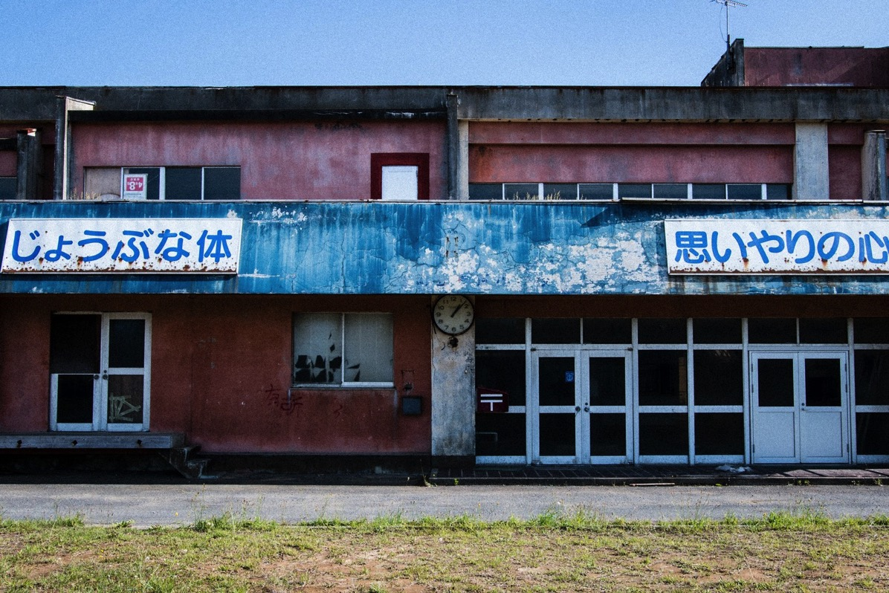

---
categories:
- ゲーム
date: Tue, 03 Jan 2017 14:03:04 +0000
slug: post-10052
tags:
- ゲーム
title: ぼくだけ？正月ってポストアポリカプス感がすごくないですか？
---

正月のポストアプリカプス感がすっごい好きです。街中シャッターしまってて、誰も歩いてなくて、開いてるお店があってもすっごい行列できてて炊き出しみたいだし、なんか世紀末感ただよっててすごい好きです。ということでお正月の街の雰囲気を見て、ふとポストアポカリプス感を感じられるぼくの好きなゲームやアニメをご紹介いたします。
<h2>ポストアポカリプスとは</h2>

終末もののゲームやら映画やら小説やら

wikipediaには次のようなことが書いてありました。
<blockquote>終末もの（しゅうまつもの）あるいは破滅もの（はめつもの）とは、フィクションのサブジャンルの一つで、大規模な戦争、大規模な自然災害、爆発的に流行する疫病などの巨大な災害、あるいは超越的な事象によって、文明や人類が死に絶える様を描くもの（Apocalyptic fiction）、あるいは文明が死に絶えた後の世界を描くもの（Post-apocalyptic fiction）である。</blockquote>
まぁ簡単にいうと北斗の拳とかマッドマックスみたいな、あーゆー感じです。個人的にはあーゆー系はあんまり好きではないです。あそこまでいかずにもう少し文明よりの、文明とかが微妙に残ってる感じのが好きです。<!--more-->
<h2>THE LAST OF US</h2>
このゲームをやるためにPS3を購入しました。

突如なぞのウィルスが発生し人々が凶暴化し人を襲い始めます。ありがちなゾンビパニックゲームです。

が、ちょっと違っているのがゾンビのパンデミックが始まった世界が舞台ではありません。パンデミックが始まって20年後の文明が滅び、かろうじて少数の人間が軍の統制下で生活をしているという世界が舞台です。

そこは文明が滅びているため物資や食料も少なく、わずかな資源に人が群がり違いに争います。あるものは己の信念のために、あるものは生存のために、あらゆる手段を尽くします。

ゲーム自体は、数年前にPS3で発売していますが、リマスター版がPS4でも発売しています。また、次回作の発売が発表されています。おそらく2018年くらいになるのではないでしょうか。正確な時期は発表されていませんが、おそらくだいぶ先になると思います。

それに備えて今から買ってプレイするのもいいのではないでしょうか！
<h3>おもしろいところ</h3>
このゲーム何が面白いかって言うとそのリアルさです。
ゲームだからと言って銃弾や回復薬は無限ではありません。かなり少ない。

また、文明崩壊20年後の世界観もかなりリアルです。ボロボロになった高層ビルだけでなく、そこに息づく人間模様もリアルです。暴徒や組織だって軍に争うものなど、パンデミック直後の混乱や争いが終息したであろう後はきっとそういうステージに進むんだろうなって気がします。

それとあらゆる映画へのオマージュがちりばめられていて、あーこういうシーン見たことあるーって思うはず。

プレイ自体もアクションですが、なんとなくパズルちっくで頭使うし（物音をたてて敵の気をそらしたり）、それでいてサクサク進めるので寝る前にちょっとって感じのプレイスタイルでも、飽きずにクリアできると思います。

あとマルチプレイがかなり面白いです。数年たった今でも普通にマッチングしますし、おそらく次回作発売まで普通にプレイできるくらいの人口はいるんじゃないかと思います。本当に面白い。

<a href="http://www.amazon.co.jp/exec/obidos/ASIN/B00LGFD3UM/warawareotoko-22/ref=nosim/" target="_blank" rel="noopener">The Last of Us Remastered 【CEROレーティング「Z」】 - PS4</a>

posted with <a href="http://kaereba.com" target="_blank" rel="nofollow noopener">カエレバ</a>

ソニー・インタラクティブエンタテインメント 2014-08-21

<a href="http://www.amazon.co.jp/gp/search?keywords=THE%20LAST%20OF%20US&amp;__mk_ja_JP=%E3%82%AB%E3%82%BF%E3%82%AB%E3%83%8A&amp;tag=warawareotoko-22" target="_blank" rel="noopener">Amazon</a>

<a href="http://hb.afl.rakuten.co.jp/hgc/0f6e221b.2eb9748a.0f6e221c.35cc1e84/?pc=http%3A%2F%2Fsearch.rakuten.co.jp%2Fsearch%2Fmall%2FTHE%2520LAST%2520OF%2520US%2F-%2Ff.1-p.1-s.1-sf.0-st.A-v.2%3Fx%3D0%26scid%3Daf_ich_link_urltxt%26m%3Dhttp%3A%2F%2Fm.rakuten.co.jp%2F" target="_blank" rel="noopener">楽天市場</a>

<a href="http://ck.jp.ap.valuecommerce.com/servlet/referral?sid=3041033&amp;pid=882528283&amp;vc_url=http%3A%2F%2Fsearch.shopping.yahoo.co.jp%2Fsearch%3Fp%3DTHE%2520LAST%2520OF%2520US&amp;vcptn=kaereba" target="_blank" rel="noopener">Yahooショッピング</a>

<iframe src="https://www.youtube.com/embed/qsCyu7ivVAQ" width="560" height="315" frameborder="0" allowfullscreen="allowfullscreen"></iframe>
<h2>METRO REDUX</h2>
元々はゲーム実況者の2BROの弟者がやってたのを見て面白そうだなと思ってプレイしました。

実はプレステではやらずにPCのみでプレイしました。その後原作の小説を読みどっぷり世界観にはまりました。

SFベースのホラーアクションFPSといった感じですかね。
ストーリーは近未来。核戦争後に放射能を恐れた人類は地下鉄の奥深くに避難し生活しいる世界。場所はロシア。

しかし、地下世界は平和ではなく、地上から異形のミュータントがわずかに残った人間を攻撃しにやってくる。主人公のアルチョムが住む駅は特に苛烈な攻撃を受けており、そのままでは壊滅してしまう。他の駅に助けを求めるために危険な地上や未知の線路を行くアルチョムの冒険が始まる！といったストーリー。

地下鉄の閉塞感と迫り来る正体不明の獣、そして緊迫するストーリーが生み出す緊張感はかなりのもの。
<h3>おもしろいところ</h3>
サクサク進める！これぞアクションゲーム！って感じ。

特に難しいことはなくストーリーも一本道。でも、そらでいて単調ではない。その理由が敵の数の多さ。強力な敵が大量に襲いかかってくるので、緊張感が途切れることなくプレイできる。

さらに、それに見合った武器のバラエティ。様々な武器が登場し、それぞれカスタマイズもできるので自分の戦闘スタイルで色々といじって楽しめるのもいい。

あと原作の小説は日本語訳もでてるので読んでみる価値あり。楽しすぎて通勤時に降りる駅を超えまくってしまいました。。。

<a href="http://www.amazon.co.jp/exec/obidos/ASIN/B00M1JTHRK/warawareotoko-22/ref=nosim/" target="_blank" rel="noopener">メトロ リダックス - PS4</a>

posted with <a href="http://kaereba.com" target="_blank" rel="nofollow noopener">カエレバ</a>

スパイク・チュンソフト 2014-10-30

<a href="http://www.amazon.co.jp/gp/search?keywords=METRO%20REDUX&amp;__mk_ja_JP=%E3%82%AB%E3%82%BF%E3%82%AB%E3%83%8A&amp;tag=warawareotoko-22" target="_blank" rel="noopener">Amazon</a>

<a href="http://hb.afl.rakuten.co.jp/hgc/0f6e221b.2eb9748a.0f6e221c.35cc1e84/?pc=http%3A%2F%2Fsearch.rakuten.co.jp%2Fsearch%2Fmall%2FMETRO%2520REDUX%2F-%2Ff.1-p.1-s.1-sf.0-st.A-v.2%3Fx%3D0%26scid%3Daf_ich_link_urltxt%26m%3Dhttp%3A%2F%2Fm.rakuten.co.jp%2F" target="_blank" rel="noopener">楽天市場</a>

<a href="http://ck.jp.ap.valuecommerce.com/servlet/referral?sid=3041033&amp;pid=882528283&amp;vc_url=http%3A%2F%2Fsearch.shopping.yahoo.co.jp%2Fsearch%3Fp%3DMETRO%2520REDUX&amp;vcptn=kaereba" target="_blank" rel="noopener">Yahooショッピング</a>

<a href="http://www.amazon.co.jp/exec/obidos/ASIN/4093567115/warawareotoko-22/ref=nosim/" target="_blank" rel="noopener">Metro2033 上</a>

posted with <a href="http://kaereba.com" target="_blank" rel="nofollow noopener">カエレバ</a>

ドミトリー グルホフスキー 小学館 2010-06-21

<a href="http://www.amazon.co.jp/gp/search?keywords=%20Metro2033%20&amp;__mk_ja_JP=%E3%82%AB%E3%82%BF%E3%82%AB%E3%83%8A&amp;tag=warawareotoko-22" target="_blank" rel="noopener">Amazon</a>

<a href="http://hb.afl.rakuten.co.jp/hgc/0f6e221b.2eb9748a.0f6e221c.35cc1e84/?pc=http%3A%2F%2Fsearch.rakuten.co.jp%2Fsearch%2Fmall%2F%2520Metro2033%2520%2F-%2Ff.1-p.1-s.1-sf.0-st.A-v.2%3Fx%3D0%26scid%3Daf_ich_link_urltxt%26m%3Dhttp%3A%2F%2Fm.rakuten.co.jp%2F" target="_blank" rel="noopener">楽天市場</a>

<a href="http://ck.jp.ap.valuecommerce.com/servlet/referral?sid=3041033&amp;pid=882528283&amp;vc_url=http%3A%2F%2Fsearch.shopping.yahoo.co.jp%2Fsearch%3Fp%3D%2520Metro2033%2520&amp;vcptn=kaereba" target="_blank" rel="noopener">Yahooショッピング</a>

<a href="http://www.amazon.co.jp/exec/obidos/ASIN/4093567123/warawareotoko-22/ref=nosim/" target="_blank" rel="noopener">Metro2033 下</a>

posted with <a href="http://kaereba.com" target="_blank" rel="nofollow noopener">カエレバ</a>

ドミトリー グルホフスキー 小学館 2010-06-21

<a href="http://www.amazon.co.jp/gp/search?keywords=%20Metro2033%20&amp;__mk_ja_JP=%E3%82%AB%E3%82%BF%E3%82%AB%E3%83%8A&amp;tag=warawareotoko-22" target="_blank" rel="noopener">Amazon</a>

<a href="http://hb.afl.rakuten.co.jp/hgc/0f6e221b.2eb9748a.0f6e221c.35cc1e84/?pc=http%3A%2F%2Fsearch.rakuten.co.jp%2Fsearch%2Fmall%2F%2520Metro2033%2520%2F-%2Ff.1-p.1-s.1-sf.0-st.A-v.2%3Fx%3D0%26scid%3Daf_ich_link_urltxt%26m%3Dhttp%3A%2F%2Fm.rakuten.co.jp%2F" target="_blank" rel="noopener">楽天市場</a>

<a href="http://ck.jp.ap.valuecommerce.com/servlet/referral?sid=3041033&amp;pid=882528283&amp;vc_url=http%3A%2F%2Fsearch.shopping.yahoo.co.jp%2Fsearch%3Fp%3D%2520Metro2033%2520&amp;vcptn=kaereba" target="_blank" rel="noopener">Yahooショッピング</a>

<h2>ドラえもん のび太の鉄人兵団</h2>
ゲームじゃないけどこれ好き。けっこうポストアポカリプス感ある。

異世界から送り込まれたロボットのパーツをのび太が組み立てるものの、そのロボットが実は地球侵略を目的にしたものであることを知り、それを阻止すべくドラえもんたちと戦う話。

ロボットはかなり巨大なため、ドラえもんに鏡の中の虚構の世界を作り出してもらいそこで組みたてる。そのため、その世界は現実と左右非対称なこととのび太たち以外は誰もいないことを除いては現実世界と全くおんなじ。多分ぼくの中のポストアポカリプス好きの根本にあるのはこの景色だと思う。

小さい頃からこの映画はリアルに1000回以上見てる。

いつもの景色なんだけど、誰もいない。お正月ってこういう感じがする。

ちなみに感動もできるしストーリーも面白いので映画自体はおすすめです。
<h3>おもしろいところ</h3>
敵勢力と先頭の前にスーパーでみんなで買い物するんだけどそのシーンがすごい好き。

鏡の世界で誰もいないんだけど、スーパーっていう日常感があってそのミスマッチがなんともいえない。

<a href="http://www.amazon.co.jp/exec/obidos/ASIN/B003RS7QW2/warawareotoko-22/ref=nosim/" target="_blank" rel="noopener">映画ドラえもん のび太と鉄人兵団【映画ドラえもん30周年記念・期間限定生産商品】 [DVD]</a>

posted with <a href="http://kaereba.com" target="_blank" rel="nofollow noopener">カエレバ</a>

大山のぶ代 ポニーキャニオン 2010-09-03

<a href="http://www.amazon.co.jp/gp/search?keywords=%E9%89%84%E4%BA%BA%E5%85%B5%E5%9B%A3&amp;__mk_ja_JP=%E3%82%AB%E3%82%BF%E3%82%AB%E3%83%8A&amp;tag=warawareotoko-22" target="_blank" rel="noopener">Amazon</a>

<a href="http://hb.afl.rakuten.co.jp/hgc/0f6e221b.2eb9748a.0f6e221c.35cc1e84/?pc=http%3A%2F%2Fsearch.rakuten.co.jp%2Fsearch%2Fmall%2F%25E9%2589%2584%25E4%25BA%25BA%25E5%2585%25B5%25E5%259B%25A3%2F-%2Ff.1-p.1-s.1-sf.0-st.A-v.2%3Fx%3D0%26scid%3Daf_ich_link_urltxt%26m%3Dhttp%3A%2F%2Fm.rakuten.co.jp%2F" target="_blank" rel="noopener">楽天市場</a>

<a href="http://ck.jp.ap.valuecommerce.com/servlet/referral?sid=3041033&amp;pid=882528283&amp;vc_url=http%3A%2F%2Fsearch.shopping.yahoo.co.jp%2Fsearch%3Fp%3D%25E9%2589%2584%25E4%25BA%25BA%25E5%2585%25B5%25E5%259B%25A3&amp;vcptn=kaereba" target="_blank" rel="noopener">Yahooショッピング</a>

<h2>しんぺーはこう思った。</h2>
お正月休みも明日で終わり。

明後日からまた会社です。

結局休みっていってもだらけるというか、なんかやってて思ってたことなんか一個もできないんだよね〜だから日常の中で時間見つけて少しずつ積み上げてくしかないんじゃないかな〜と思うのです。

と言ったところで本日は以上になります。

おやすみなさい。

そして、また明日。