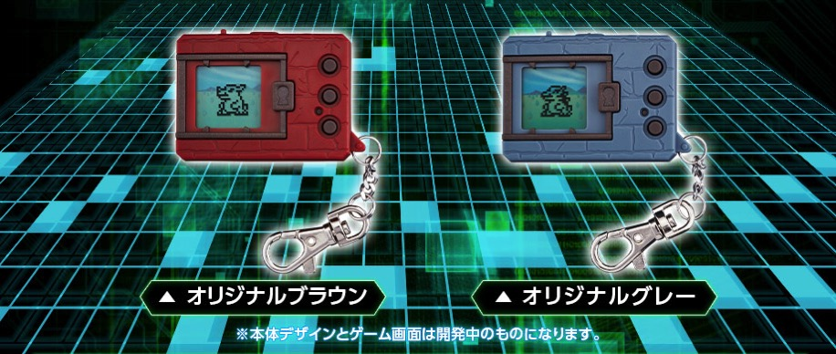

---
categories:
- レビュー
date: Sat, 07 Jan 2017 13:28:31 +0000
slug: post-10071
tags:
- レトロ
title: 懐かしい！デジモンの復刻版がでるらしいので早速予約した！
---

デジモンをご存知でしょうか？ポケモンじゃないよ？1997年に発売した携帯型液晶玩具です。簡単にいうとデジタルモンスターと呼ばれるモンスターを小さな液晶画面の中で育てて進化させたりして強化し、他人のデジモンと戦わせたりする玩具です。同じような商品に「たまごっち」というのがありますが、あれは愛らしい容姿で女の子をターゲットとしたものでしたが、デジモンはカッコいいモンスターがモチーフとなっており、完全に男の子向けとなっています。また、テレビアニメも放送され人気を博しました。

その初代デジモンの液晶型玩具がほぼ当時のまんまの形で再登場するってことで、さっそく予約いたしました！！本日はそのご紹介です。興味ある方はぜひ予約を！！
<h2>デジモンとは？</h2>
正直、どうみても前年の1996年に発売したポケモンのパクリです。

ただ、ポケモンと違うのは向こうはゲームボーイというハードで機能するのに対し、デジモンはデジモンという玩具でのプレイするものです。その点が根本的に違います。ゲームと玩具という違いですね。

また、デジモンは交換や収集といった概念がなく、基本生まれたデジモンを死ぬまで育てます。また、ポケモンのように種類があって進化していくのではなく、自分の育てかたなどによって進化の枝が変わっていきます。

糞の掃除をしなかったり、食事を与えないなどのネグレクト気味に育てた場合と頻繁にコミュニケーションしたりトレーニングしたりした場合とで、異なる進化を遂げます。ちょっと面白そうでしょ？

ポケモンは経験値で進化していくのに対し、こちらは育成で進化していきます。<!--more-->
<h2>復刻版がむかしとちょっと違うところ</h2>

<ul>
 	<li>過去に発売された全てのデジモンが登場。総数150以上</li>
 	<li>特殊な条件で出現するデジモンが全5種存在</li>
 	<li>20周年記念の新デジモンが登場</li>
 	<li>同時に２体の育成が可能。その組みあわせでさらに進化条件がきまるデジモンが存在する</li>
</ul>
それと昔は卵から最終進化まで一週間くらいかかっていたのですが、今回は2日と短縮されています。時代の流れですね。
<h2>どこで買えるの？</h2>
バンダイプレミアムでの限定です。

商品詳細は次の通り

予約期間は2017年1月6日〜3月27日23時まで。商品の発送は6月を予定。

<strong>気になるお値段は3,500円</strong>

<a href="http://digimon.net/20th/">http://digimon.net/20th/</a>
<h2>しんぺーはこう思った。</h2>
こんな商品アプリでだせよと思うじゃん？

でもあえてレトロな形で出すところがめちゃくちゃ乙だとおもうんですよね〜

もちろんソッコーで予約しました！気になる方はぜひ

と言ったところで本日は以上になります。

おやすみなさい。
そして、また明日。