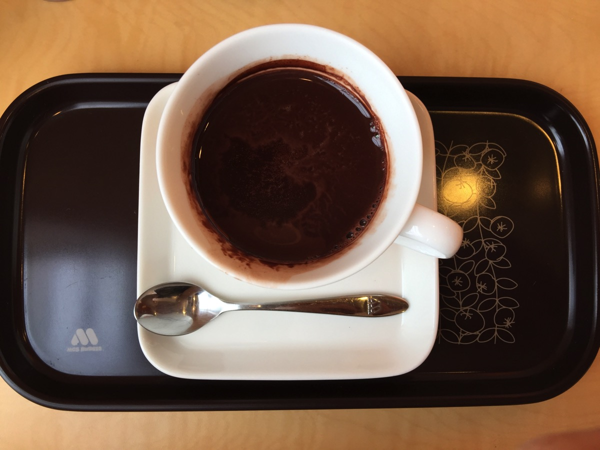
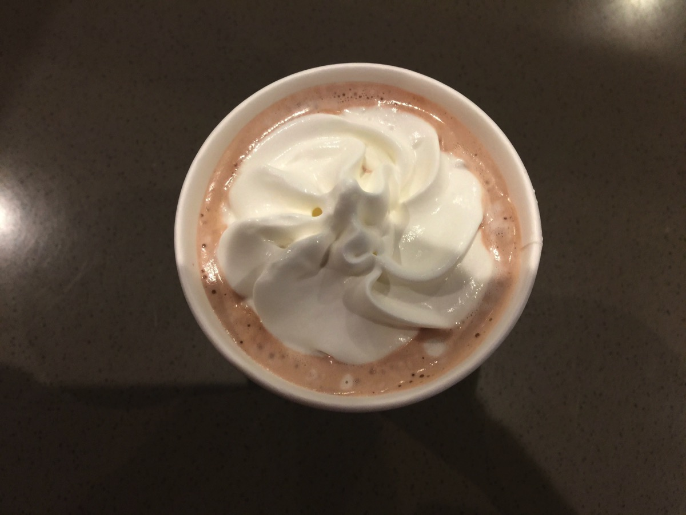
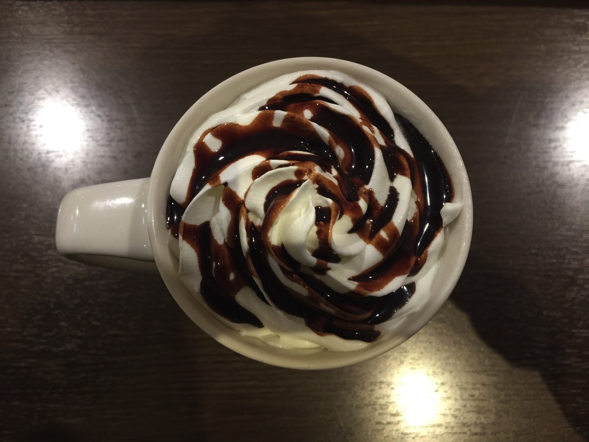
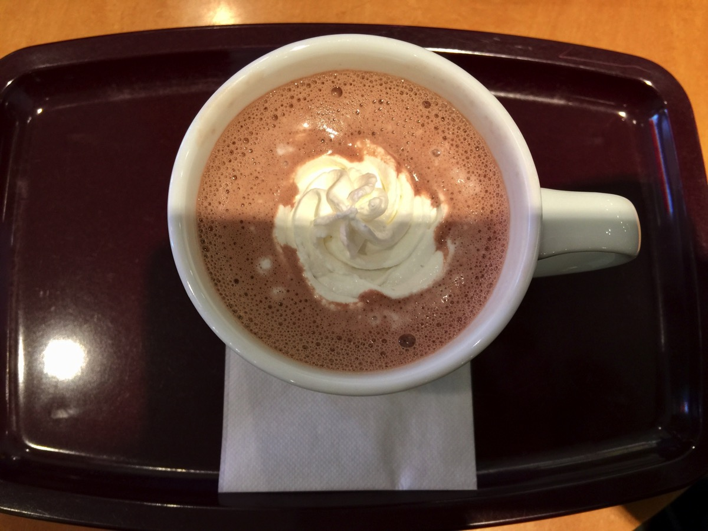
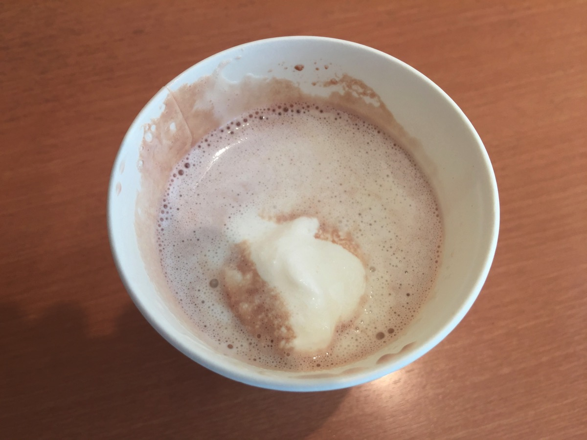

---
categories:
- ブログ
date: Mon, 09 Jan 2017 13:09:58 +0000
slug: post-10083
tags:
- 比較してみた
title: コーヒーチェーンとか5社のココアを飲んで味や価格の比較してみた
---

昨年コーヒー断ちしている期間に飲んでいたのがココア、ということでどこのココアが一番美味しいのか気になってたので比較してみました！点数はあくまで味についてではなく印象でつけています。それに基づいてぼくなりの総合点もつけてみました。味についても感想をそれぞれ書いていますので、参考までにとうぞ<!--more-->
<h2>モスバーガー：総合点　★☆☆☆☆</h2>

モスのココアは苦味があります。少し大人向けだと思う。特別進んで飲もうとは思いませんが、まぁハンバーガー屋なんでドリンクはこんなもんでしょうと言う感じ。

価格:270円
甘さ:★★☆☆☆
苦味:★★★☆☆
さっぱり:★★★☆☆
しつこさ:★★☆☆☆
<h2>スターバックス：総合点 ★☆☆☆☆</h2>

スタバのココアはチョコフレーバーのお湯って感じ。これにお金を払う意味ある？ってのがぼく個人的な感想です。値段も一番高いし、進んでぼくがこれを飲むことはありませんね。

価格:370円
甘さ:★★★☆☆
苦味:★☆☆☆☆
さっぱり:★★★★☆
しつこさ:★☆☆☆☆

スタバは昔プレミアムホットチョコレートというリッチなココアがありました。それはそれは美味しかったです。復活したらば、間違いなく美味しいと心から思えるココアだと思います！
<h2>タリーズ：総合点 ★★★☆☆</h2>

なんと意外な結果に。比較したココアの中で最もリッチな作りでした。ホイップの上にココアシロップもかかってて、最もチョコの存在感を感じました。ただし、味は少し好みが分かれるかもしれません。ちょっと甘ったるさを感じます。そして一番高い！！スタバよりも高い！

価格:400円
甘さ:★★★★★
苦味:☆☆☆☆☆
さっぱり:☆☆☆☆☆
しつこさ:★★★☆☆
<h2>エクセルシオール：総合点 ★★★★☆</h2>

会社のビルに入ってるので普段これを一番飲んでます。エクセルシオールのココアは甘くてココアって感じがします。クリームが乗ってるのも良いです。しっかりとした甘さですが、もたれるようなしつこさはありません。ココアを飲んでるぜっていうガツンとした感じがします。ただ、結構あまいのでダイエット中とかは飲まない方がいいと思います。

価格:360円
甘さ:★★★★☆
苦味:☆☆☆☆☆
さっぱり:★☆☆☆☆
しつこさ:★★★☆☆
<h2>ドトール：総合点 ★★★★☆</h2>

比較してみて改めて気がついたけどドトールのココアは量が少ない。テイクアウトだと完全にコスパ悪すぎ。ただ味は本当に美味しい。これで他と同じくらいの量だったら最強です。

価格:290円
甘さ:★★★☆☆
苦味:★☆☆☆☆
さっぱり:★★☆☆
しつこさ:★★☆☆☆
<h2>しんぺーはこう思った。</h2>
点数全体感でちょこっと調整しました！ドトールが予想通り優勝！ただしタリーズも健闘という感じでした。

今後毎週比較するような記事をあげていこうかなと思います。

今回はけっこう差がはっきりとしていたので比較しやすかったです。

と言ったところで本日は以上になります。

おやすみなさい。
そして、また明日。