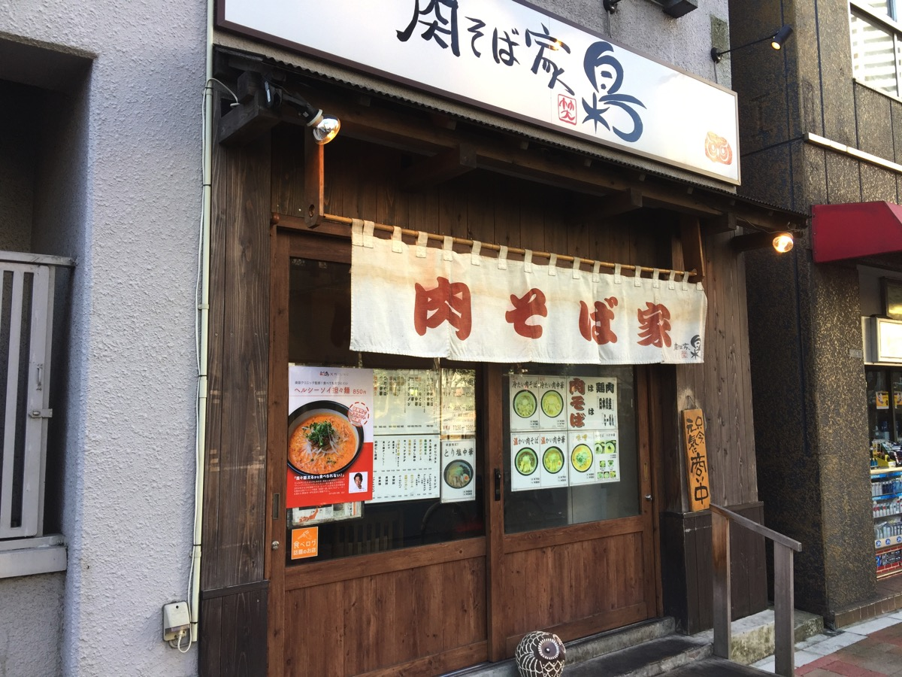
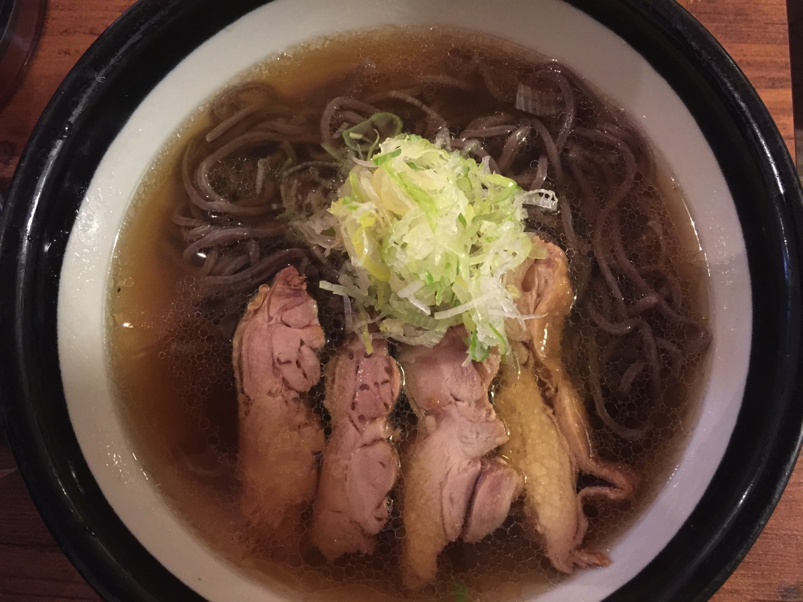
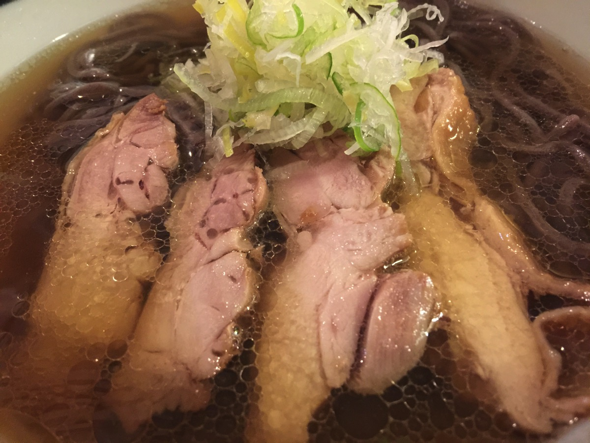
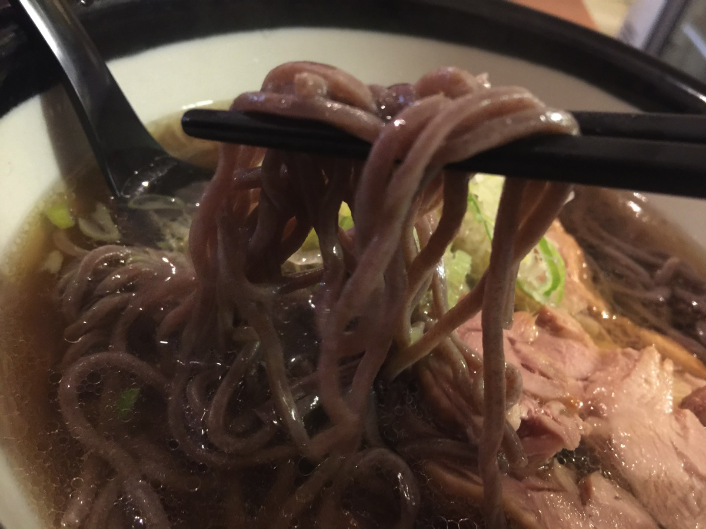

---
categories:
- グルメ
date: Tue, 10 Jan 2017 03:47:00 +0000
slug: post-10087
tags:
- そば
title: 西新宿のラーメン屋「肉そば家フクロウ」行ってきた。
---

今年の目標は飲食店の新規開拓50軒！第1弾は西新宿のラーメン屋「肉そばフクロウ(笑梟)」のご紹介です。

新宿というか、もうほぼ初台。新宿の果ての果て、都庁を越えたらランチできるようなお店はほぼない！と思ってましたが昔ながらの小さなお店がそこそこありました。土地もちが運用しつつ生活するためにマンションや雑居ビルをたてて、その１階が飲食店みたいな建物が立ち並ぶ中にその店はありました。<!--more-->

ラーメン屋と思って行っけど、蕎麦ですね完全に。ラーメンぽくアレンジしていますが、汁も蕎麦のソレですし、麺も完全に蕎麦。そうらつまり蕎麦屋ですここ。

山形の郷土料理とも言える蕎麦らしいです。本場では冷たい麺で食べるらしいのですが、寒かったので温かいものを注文してしまいました。

汁は、ラーメンの様に濃くなくサラッとしています。ただし肉の脂が滲み出ていて物足りない感じはしませんでした。

麺はモチモチとしていて、しっかりとした歯ごたえがあります。そしてメインの肉は味がしっかりとした味付けがしてあって、美味しかったです。

<strong><a href="https://tabelog.com/tokyo/A1304/A130401/13115476/" target="_blank">肉そば家 笑梟</a></strong>

<strong>関連ランキング：</strong><a href="https://tabelog.com/rstLst/soba/">そば（蕎麦）</a> | <a href="https://tabelog.com/tokyo/A1304/A130401/R7444/rstLst/">西新宿五丁目駅</a>、<a href="https://tabelog.com/tokyo/A1304/A130401/R6754/rstLst/">都庁前駅</a>、<a href="https://tabelog.com/tokyo/A1304/A130401/R7443/rstLst/">西新宿駅</a>

<h2>しんぺーはこう思った。</h2>

来週も新たなお店を開拓したく思います！ガツンとしたラーメン屋にいきたいな〜

と言ったところで本日は以上になります。  おやすみなさい。

そして、また明日。