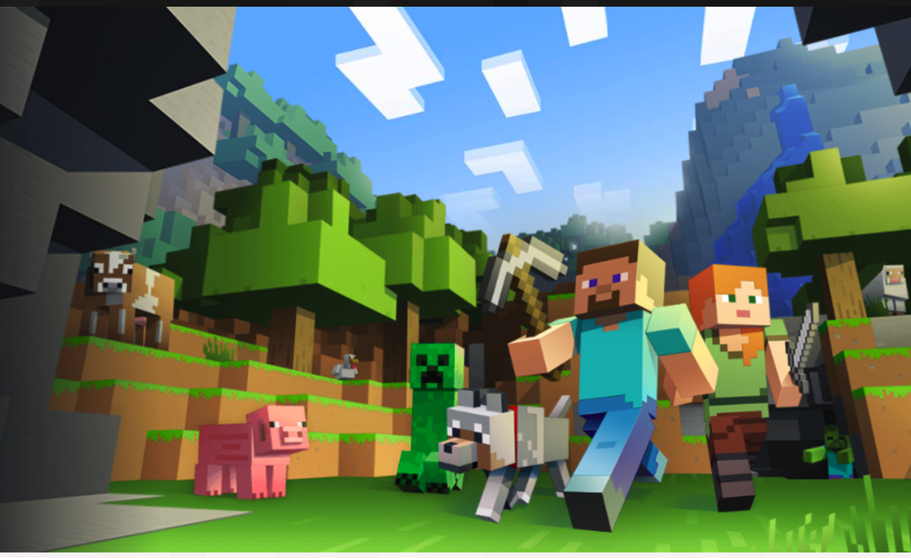

---
categories:
- レビュー
date: Wed, 11 Jan 2017 13:10:00 +0000
slug: post-10100
tags:
- amazonプライムミュージック
- minecraft
title: MinecraftのPC版BGMのサントラがAmazonプライムミュージックで聴ける！
---

MinecraftのPC版をプレイしたことありますか？すごい癒しの音楽で聴いてるだけでリラックスしてきて、やがて眠くなります。スマホ版のMinecraft PEしかやったことがない人は多分聴いたことがないと思います。なぜなら今の所、スマホ版にはBGMがないので。そのため、アクションした際の音のみだと思います。

そんな癒しのサウンドトラック「Minecraft -Volume Alpha」がAmazonプライムミュージックで聴けるのです！<!--more--><h2>Minecraftとは？</h2>

世界的にヒットしている箱庭ゲーです。広大なオープンワールドで生活するゲームです。土を掘ったり、木を切ったり、組み立てたり、家畜を飼育したり、作物を育てたり、モンスターと戦ったり、ダンジョンに宝探しに行ったり、とにかく何をするにも自由。自分好みの建築物をひたすら作るもよし、強固な武器を作って強大な敵に立ち向かうもよし。子どもから大人まで対象年齢を問わないゲームです。

もともとはPCゲームでしたが、今ではプレステなどのコンシューマー機やスマホ版も出たりして、さらに幅広くプレイされています。

<h2>MinecraftのBGMがAmazonプライムミュージックで聴ける</h2>

冒頭にも述べましたが、PC版のゲーム中に流れるBGMがすっごい癒しのリラックスサウンドで聴いてると自然と眠ベッドの中で聴くのに最適

スマートフォン版のMinecraft PEをプレイする時にもこのBGMを流しながらならすっごい雰囲気がでます。

そんなMinecraftのサウンドトラックは2種類あります。Minecraft -Volume Alphaと-Volime Betaです。両方ともAmazonプライムミュージックで聴くことができます。

<h2>しんぺーはこう思った。</h2>

PC版プレイ中にいっつも眠くなっちゃうですよね〜
この音楽のせいです。ゲーム自体もゆったりしてるし

あとMinecraftといえば電車の中で立ちながらやってる中学生どうにかして！

と言ったところで本日は以上になります。  おやすみなさい。
そして、また明日。