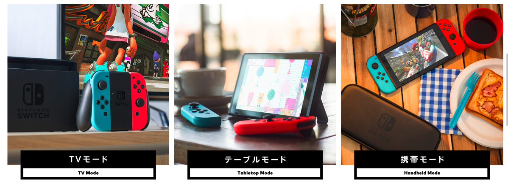
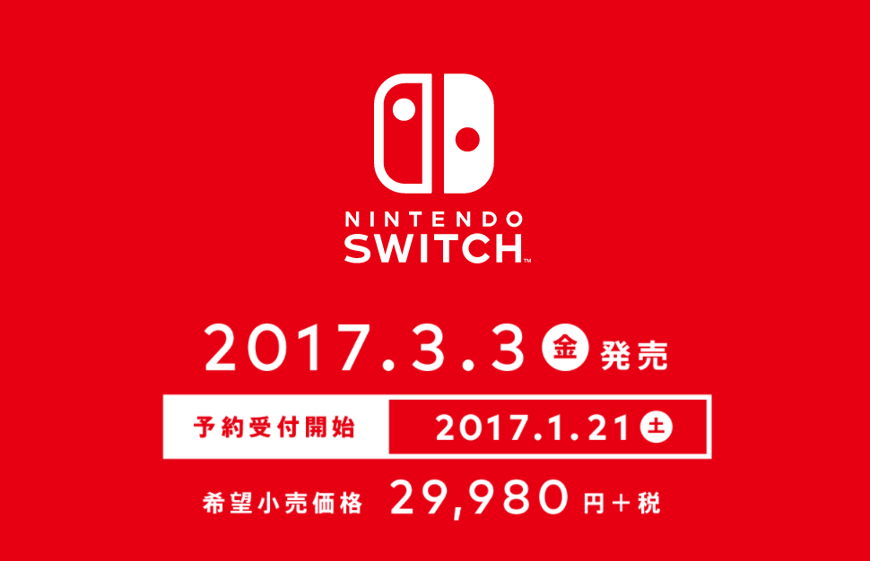

---
categories:
- ゲーム
date: Fri, 13 Jan 2017 13:19:00 +0000
slug: post-10114
tags:
- ニンテンドースイッチ
title: ニンテンドースイッチの見守り機能で思い出した子どもの頃の我が家のルール
---

ニンテンドースイッチたぶん買いますわ。スプラトゥーンもやりたいし、マリオもやりたい。でももっとやりたいのはたぶん実装されるであろうアーカイブのレトロゲームをやりたいから。

中でも1番やりいのは風来のシレンとマザー2ね。ぶっちゃけニンテンドーDSでも出来るし、スーファミを持ってるからそのままテレビに繋げれば出来るわけなんだけど。

でも、たぶん買いますわ！<!--more--><h2>ニンテンドースイッチとは？</h2>

<iframe width="560" height="315" src="https://www.youtube.com/embed/KLCG8VPaHjM" frameborder="0" allowfullscreen></iframe>

ニンテンドーが今年発売する新しいゲーム機です。テレビに接続してもプレイできるし、付属の液晶画面でもプレイできるみたいです。ポータブルゲームとテレビゲームの中間という感じでしょうか。一番のポイントはゲーム機本体というよりも様々なスタイルに<strong>スイッチ</strong>できるように設計されたコントローラーでしょう。通常のゲームコントローラーのようにしても使えるし、液晶画面に接続すればポータブルゲーム機だし、コントローラー部分単体でも使用できるみたいです。このへんwiiっぽさがあります。

<h2>Nintendo みまもり Switch</h2>

<iframe width="560" height="315" src="https://www.youtube.com/embed/AVS9Dqgpo3g" frameborder="0" allowfullscreen></iframe>

で、色々機能を調べてたらなんと<strong>保護者向け機能</strong>がついてるらしいんだわ。

スマホアプリで約束の時間を設定しておけば、アラームがなって終了時間をお知らせしてくれます。決めた時間を越えてプレイされている場合、強制的に電源を落とすこともできる機能らしい。曜日別にも設定できる。どのソフトをどれくらい遊んだかをレポートで見ることもできる。

これってすっごい画期的じゃないですか？電源切れた瞬間、ニンテンドーDSのスイッチをつける子どもたちの姿が思い浮かびますが、まぁそれはさておき、そういやうちもテレビゲームやっていい時間の制限があったなーって思い出しました。

それが、今思えば短すぎなんですが<strong>毎週土曜日30分だけ</strong>

どうですか？短かくない？今のゲームがいかに早くプレイできるとか、インスタントになってるからといっても30分で区切りをつけるのは中々難しいんでないでしょうか。

当時のファミコンやスーファミでそんか時間制限つけられてたわけですよ。そうなるとどうするかっていうと、親の目を盗んでやるようになるんけですよ。

朝めちゃくちゃ早く起きてやる。とか見回りに来た時に隠すとか誤魔化すとか。

きっと現代の子どもたちそうなるんだろうなぁとふと思ったのでした。

<h2>で、なんでニンテンドースイッチが欲しいか</h2>

冒頭にも書きましたが多分実装されるであろう過去のゲームをプレイできるアーカイブ機能でプレイしたいゲームがあるからです。それは風来のシレンとマザー2です。

ただし、スーパーファミコン持ってるんで普通にテレビにコンバーター経由でhdmi出力すればプレイできるんですがね。それでも欲しいなと思ったのは多分ポケモンのせいかなと。

ポケモンを久しぶりにプレイして、忘れていた任天堂ブランドへの愛着とか信頼が戻ってきた感じがします。

最終的にはニンテンドースイッチがDSと統合されるのであればポケモンもそっちででることになるんでしょうけど。まーどうなるんことやら。だいぶ先のことのような気がします。

あとプレステに比べて安いのもいい。<strong>29,980円で1月21日予約開始の3月3日発売。</strong>

参考：<a href="https://www.nintendo.co.jp/hardware/switch/index.html">https://www.nintendo.co.jp/hardware/switch/index.html</a>

<h2>しんぺーはこう思った。</h2>

と、ここまで書いてきて、こっち買うのもいいけどPSVR買うのでもいいんじゃないかとふと思った。いずれ出るであろうラストオブアス2はもしかしたらVR対応かもしれないし。。。

んー迷う。

と言ったところで本日は以上になります。  おやすみなさい。
そして、また明日。