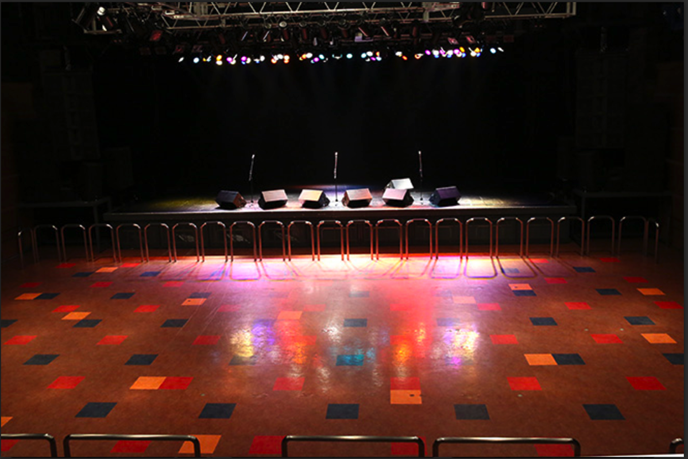
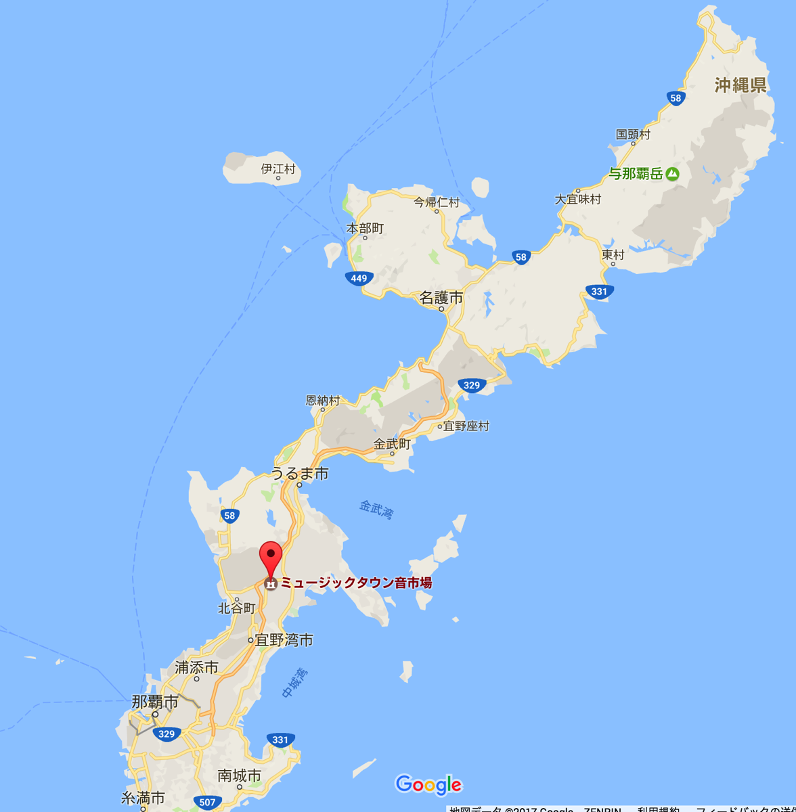

---
categories:
- DIR EN GREY
date: Sat, 14 Jan 2017 11:20:00 +0000
slug: post-10119
tags:
- DIR EN GREY
title: DIR EN GREYが次のツアーでやる「沖縄ミュージックタウン音市場」について調べてみた
---

DIR EN GREYが次のツアーでLIVEとしては実質初上陸の沖縄に参戦しようと考えています。でも沖縄っていったことないし、会場周辺の様子も、そもそもどこにホテルとったらいいのかもわからない。ということでくGoogleマップで見てみました。<!--more--><h2>会場について</h2>

会場は「沖縄ミュージックタウン音市場」
那覇市から車で1時間くらいみたいです。キャパシティはオールスタンディングで1,100人

サイトの画像によるとそんなに広くなさそうです。

引用元：<a href="http://www.otoichiba.jp/hall/">http://www.otoichiba.jp/hall/</a>

周辺には時間潰せそうなところはなさそう・・・モスバーガーくらい？
<iframe src="https://www.google.com/maps/embed?pb=!1m18!1m12!1m3!1d3575.734202070193!2d127.79718431503264!3d26.335104983379825!2m3!1f0!2f0!3f0!3m2!1i1024!2i768!4f13.1!3m3!1m2!1s0x34e5120d95fd481b%3A0x6f3d6d1d0b61f0ed!2z44Of44Ol44O844K444OD44Kv44K_44Km44Oz6Z-z5biC5aC0!5e0!3m2!1sja!2sjp!4v1484394368259" width="600" height="450" frameborder="0" style="border:0" allowfullscreen></iframe>

那覇空港からどんくらい離れているかというと、すっごい離れてます。バスとか乗り逃したらアウトですねこれ。レンタカーとか借りる方がもしかしていい？

参考：<a href="http://www.otoichiba.jp/">沖縄ミュージックタウン音市場</a>

<h2>ゴールデンウィークだからホテルがめっちゃ高い</h2>

そうなんです。ゴールデンウィーク中なんですよ。ということでホテルがめっちゃ高い。
よくわからないので翌日かの有名な美ら海水族館とかもいきたいな〜とか思って、LIVE会場と水族館の中間くらいのホテル見て見たら60000万円以上すんのね。マジで。2名料金じゃないですよ。1名料金ですよ。たぶんゴルフ場に隣接してるホテルだったから多分そういう層が宿泊するんでしょう。でも、全体的にめちゃくちゃたかそう・・・どうしよう・・・尻込み中

<noscript></noscript>

<h2>しんぺーはこう思った。</h2>

沖縄とかいったことないし、すっごい不安なんですが・・・基地が近いしどんな感じなんだろうか

不安です。ホテルとかどこにとろうかな。おすすめあったら教えてください。

と言ったところで本日は以上になります。  おやすみなさい。
そして、また明日。