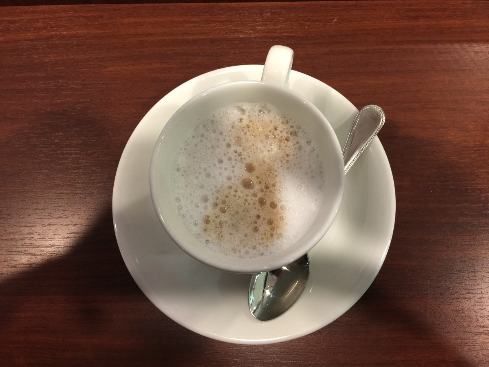
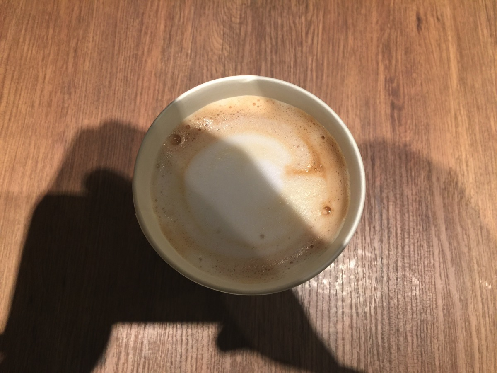
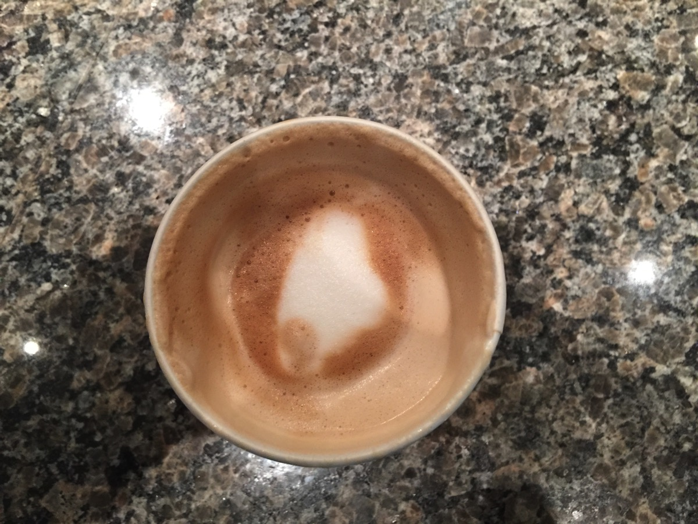
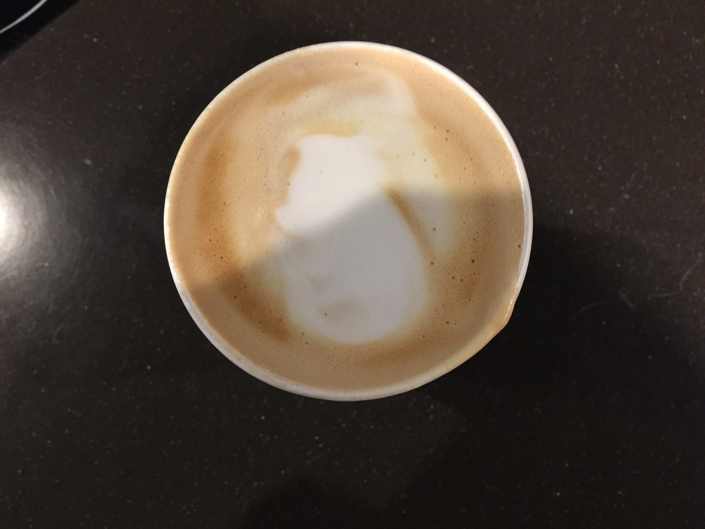

---
categories:
- ブログ
date: Mon, 16 Jan 2017 14:33:00 +0000
slug: post-10125
tags:
- 比較してみた
title: コーヒーチェーンのラテをに飲み比べて味や値段の比較してみた
---

比較記事第2弾です。今回はラテです。

ラテとはエスプレッソをミルクでわった飲み物です。ミルクを泡立てた際のフォームミルクとスチームミルクの甘味で、エスプレッソの苦味を中和しつつ味わうようなドリンクです。イタリアではコーヒー牛乳という意味でエスプレッソでもコーヒーでもどちらもラテと呼ぶそうです。日本ではコーヒーが入っているものをカフェオレと呼ぶ場合があります。

<h2>ドトール</h2>

smallサイズ270円

全自動で機械で抽出するタイプ。ボタンを押すとスチームミルクとフォームミルクとエスプレッソらしきものがポタポタと垂れてくる。美味しいとはいえない。量も少ない。コスパは悪いと思います。

苦味:★★☆☆☆
甘み:★☆☆☆☆
しつこさ:★★☆☆☆<!--more--><h2>エクセルシオール</h2>

ショートサイズ340円

思いのほか不味くなかった。甘味も苦味もある。ただエクセルシオールの場合エスプレッソの管理がスタバほど厳しくないみたいなので、品質のバラツキはありそう。

エスプレッソは酸化する前に飲むと甘味がある。ちなみに10秒程度で参加する。そうすると苦くなるので、その前にミルクを入れて飲むんだけど、エクセルシオールは平気で参加させるので。

苦味:★☆☆☆☆
甘み:★★★☆☆
しつこさ:★★☆☆☆

<h2>タリーズ</h2>

ショートサイズ360円(注文したのはトール410円)

温度規定がないのかつくりミスかめちゃくちゃ熱かった。けど寒いのでちょうどいいかも。気遣い？

味は不味くないけど少ししつこい感じする。舌に絡まるような。たぶんそういうミルクを使ってるんだと思う。好みの問題かも。スタバのミルクよりちょっと濃厚な印象。

苦味:★☆☆☆☆
甘み:★★★☆☆
しつこさ:★★★☆☆

<h2>スターバックス</h2>

ショートサイズ356円

フォームミルクが柔らかく空気を含んでいるので甘みを感じる。苦味も薄れているのでコーヒーが嫌いな人でも飲める飲み物。美味しいと思う。

苦味:★☆☆☆☆
甘み:★★★☆☆
しつこさ:★★☆☆☆

<h2>しんぺーはこう思った。</h2>

さすが自分のところのブランド名がついてるだけあってスタバのスターバックスラテが1番美味しかった。

飲み比べてみてわかったけど、ラテはどこのお店もそこまで味に大差はなかった。作り方による味の違いはあるけれど、どこかが特別に癖があったり、特別薄かったりとかはなかった。どれも平均点以上という感じでした。

とりあえず無難に時間潰す目的で入るならラテを注文するのが1番無難なのではと思いました。

といったところで本日は以上です。おやすみなさい。
そして、また明日。