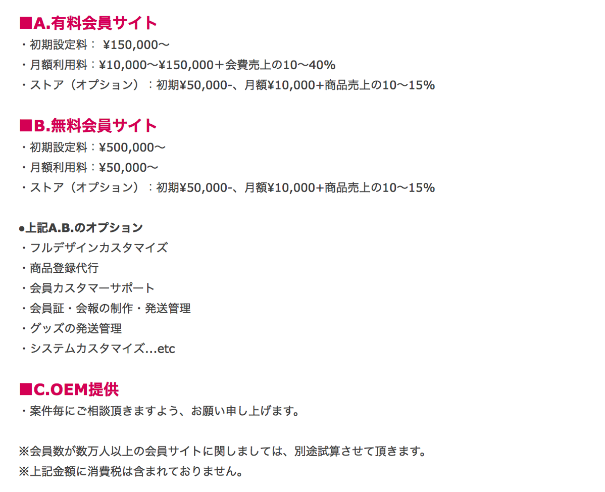
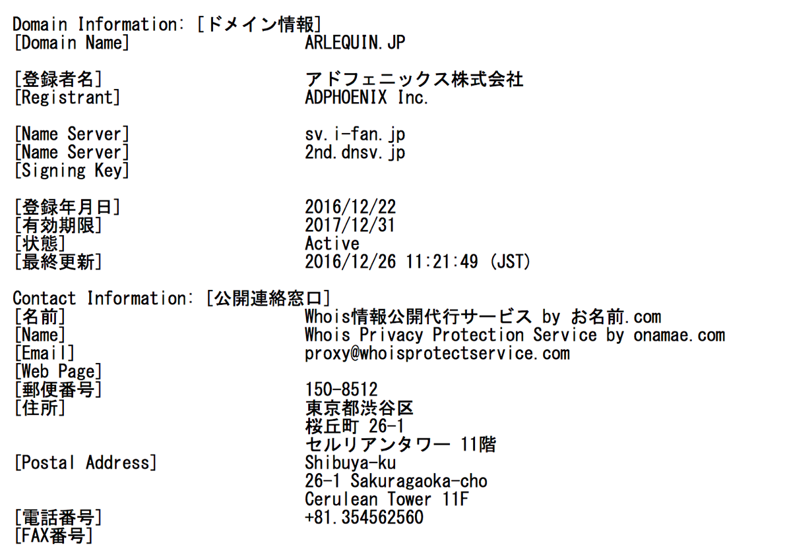

---
categories:
- PIERROT
date: Fri, 20 Jan 2017 13:34:00 +0000
slug: post-10148
tags:
- pierrot
title: PIERROTのファンクラブ「Arlequin」を運営する「ifan」について調べてみた
---

本日ANDROGYNOSに動きがありました。PIERROTのファンクラブである「Arlequin」の先行入会が始まりました。前回の復活時にファンクラブに入会していた人が優先的に入れるというものです。

入会のメリットとしては、会費が安くなるというもの。あとは会報だったり諸々あるみたいですが、その辺は準備中ぽいです。

さて、そのファンクラブを運営するのが「i-fan」という会社？みたいです。前回の復活時もここでした。そこでどんな会社か気になったので調べてみました。<!--more--><h2>ifanとは？</h2>

<a href="http://i-fan.info/">http://i-fan.info/</a>

<a href="https://www.adphoenix.jp/company/">アドフェニックス株式会社</a>が運用するファンクラブの運用を代行してくれるサービスです。

だいたい会費総額の10~40%くらいで運用してくれるみたいです。

<a href="http://i-fan.info/content1/?no=256F3nvcsS6schS9cdC">http://i-fan.info/content1/?no=256F3nvcsS6schS9cdC</a>

今回「Arlequin」の更新を行った人数がどれくらいかわかりませんが、最終的に10,000人いくとして1人5,000円くらいだから、およそ50,000,000円の会費収入があって、そのうち半分前後がとられるとして20,000,0000円がPIERROTの運転資金になるのかなーなんて思ったりします。

2000万円で何ができるだろか（今年こそは有効に会員還元してくれよな！）

あと、この金の出所がどこかも気になります。今回ANDROGYNOSはDIR EN GREY側が主体となっています。それはドメイン名から予想されるのですが、Arlequinのドメインはアドフェニックスが登録しているのです。

sun-kradに委託を受けたアドフェニックスが運営しているのか、それともキリト側の会社が委託して運用しているのか。おそらく後者ではないかと思います。前回の復活時にもおそらく同じドメインだったので、キリト側なのかなと思いました。で、この話が出てきたので再度ドメイン更新してアドフェニックスに発注かけたのかなという感じでしょうか。

あと気になったのが結構なアーティストがifanを使ってるということ。cali≠gariもそうだし、LM.CもALvinoもここ使ってた。河村隆一とかも。

<h2>ちなみにDIR EN GREYはe-fan clubというのを使ってるっぽい</h2>

そうたぶんe-fan clubという<a href="https://www.tapirs.co.jp/">株式会社テイパーズ</a>が行っているサービスを使ってるっぽい。
a knotのクレカ払いの請求がテイパーズやe-fan clubになっているのはそのため。

ちなみにTicket everyを運営しているのもこの会社のグループです。（参考：<a href="https://www.warawareotoko.com/2016/11/12/post-9684/">Ticket everyについてちょっと調べてみた</a>）

<h2>しんぺーはこう思った。</h2>

ということで、いろんな会社がいろんな事業やってるんですね〜
とりあえずはArlequin更新しておきました！何がおこるかわかんないけど！

いちおうね！

と言ったところで本日は以上になります。  おやすみなさい。
そして、また明日。