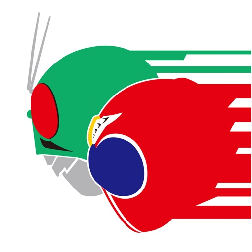

---
categories:
- アニメ
date: Sat, 21 Jan 2017 13:50:11 +0000
slug: post-10156
tags:
- 仮面ライダー
title: 仮面ライダーエグゼイドのスピンオフに王蛇でるらしい！かなりきになる！
---

現在放送中の仮面ライダーエグゼイドのスピンオフで新しく「仮面ライダーブレイブ」が配信するらしいです。そして、なんとそこに仮面ライダー龍騎に出てきた仮面ライダー王蛇が敵として登場するっちゅーことでかなり胸熱なので、本日は仮面ライダー龍騎の魅力と王蛇についてご紹介いたします。<!--more--><h2>仮面ライダー龍騎とは</h2>

今から10年以上前の2002年に放送していた仮面ライダーシリーズです。

当時流行していたカードゲームの要素を取り入れ、さらにモンスターと契約することで力を借りて、自分を強化して戦うのが特徴的です。

また、ライダーの基本デザインが統一されていて、契約モンスターによって特色が分けられている見た目なのもかっこよかったです。当然技やモンスターのギミックも全く違っていて本当にかっこよかった。後にも先にもこのシリーズはかなり異色だったのではないかとぼくは思っています。

ストーリーは平成ライダーの中でも結構ダークな部類に入るのかと思います。13人のライダーがそれぞれ殺し合い、最後に残ったものが自分の望みを叶えるとうものです。

そして、その戦いに身を投じるものの理由も様々で、それがまた深みがあって面白かったです。

<h3>仮面ライダー王蛇とは</h3>

そして、仮面ライダー王蛇はオウジャと読みます。昔、オウダって言ってた気もしなくないけど。。。記憶が不確かかつ未確認。

こいつはかなり特殊で、通常1種類のモンスターとしか契約できないのに３種類のモンスターと契約しています。デフォルトはキングコブラですが、それ以外に倒したライダーから奪ったサイとエイを従えており、さらにこの3種を合成した技も使います。

また、中の人は凶悪犯でかなり凶暴なサイコパスで、戦う理由も戦いたいからとか言い出すタイプです。

そんな凶悪なライダーが今回エグゼイドのスピンオフに参戦決定ということでどうなるのか楽しみです！

<h3>そのほかにも仮面ライダータイガもでるっぽい</h3>

で、気になったのが各ニュースみても王蛇のことしか言ってないんだけど、どうも仮面ライダータイガも出てくるっぽい

こいつも龍騎の13人ライダーのうちの1人。白虎と契約したライダーです。

なお仮面ライダー龍騎を見たいな〜と思ったかた、huluにありますのでどうぞ

youtubeでも無料配信やってます。と思ったら無料じゃなくなってた！

<noscript></noscript>

<h2>配信はどうやってみるの？</h2>

なお、仮面ライダーブレイブはどうやってみるのかというと、東映特撮ファンクラブというアプリで有料会員登録すると見れるみたいです。

<a href="https://itunes.apple.com/jp/app/dong-ying-te-cuofankurabu/id1036040552?mt=8&uo=4&at=11ld5P" target="_blank" >東映特撮ファンクラブ</a>&nbsp;(無料)

<a href="https://itunes.apple.com/jp/developer/toei-company-ltd/id1036040551?uo=4&at=11ld5P" target="_blank" >TOEI COMPANY,LTD</a>&nbsp;<a href="https://itunes.apple.com/jp/app/dong-ying-te-cuofankurabu/id1036040552?mt=8&uo=4&at=11ld5P" target="_blank" style="width:100px;color:#ffffff;background:#298CDA;font-size:10px;font-weight:bold;text-align:center;display:inline;text-decoration:none;border:0px;padding:5px;border-radius:10px;background:-moz-linear-gradient(rgba(85,182,237,0.5), rgba(41,140,218,1));background:-webkit-gradient(linear, 100% 0%, 100% 100%, from(rgba(85,182,237,0.5)), to(rgba(41,140,218,1)));white-space: nowrap;">iTunes で見る</a>

(2017.01.21時点)

posted with <a href="http://pochireba.com" rel="nofollow" target="_blank">ポチレバ</a>

ぼくはエグゼイド本編ほとんど見逃しているので、ちゃんと見てから見たいなと思います。

<h2>しんぺーはこう思った。</h2>

基本的に龍騎のライダーは鏡の中の世界であるミラーワールドが戦いの舞台なので、どうやって戦うのかきになるところ！

と言ったところで本日は以上になります。  おやすみなさい。
そして、また明日。