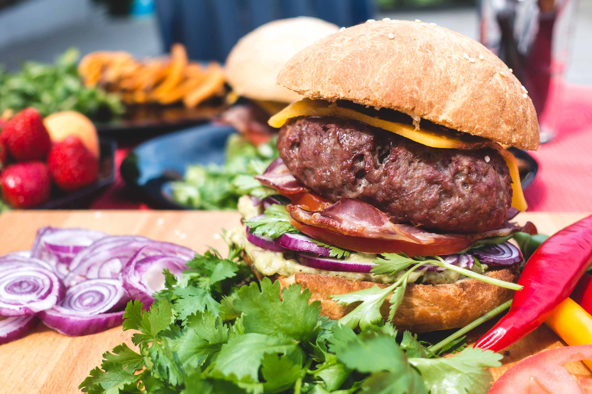

---
categories:
- Uber Eats
date: Sat, 28 Jan 2017 14:21:02 +0000
slug: post-10184
tags:
- Uber Eats
title: 出前サービス比較。用途にあった使い方をするのがベスト！
---

今まで何度も書いてきましたが会社周りにランチ飲食店がなくて、よくUBER EATSを利用するのですが調べてみたら他にもいくつかデリバリー系サービスがありました。本日はざっと調べてみた結果をまとめてみましたのでご紹介いたします。

<!--more-->

<h2>携帯代金と合わせて決済できるのが便利そうな「dデリバリー」</h2>

docomoが運営するデリバリーサービスです。

提携店舗は11,000店舗で全国で利用できます。
支払いは現金、クレジットカード、<strong>dポイント、ケータイ払い</strong>が可能です。携帯料金と合わせて支払いができるのは何かと便利そうです。

また、たまったdポイントを支払いに充当可能。利用にはdアカウントが必要です。なお、dアカウントはdocomoユーザーでなくても作ることができますので、softbank、auユーザーでも利用可能です。

<a href="https://delivery.dmkt-sp.jp/">https://delivery.dmkt-sp.jp/</a>

<h2>個人的に今後化ける可能性があると思ってる「出前館」</h2>

おそらくデリバリー系サービスでは最も知名度があるのではないでしょうか。最近LINEが出資し、今後のサービス拡充が期待されています。LINEは以前、最強のデリバリーサービス「LINE WOW」を運営していましたが、そこで得た知見を今回の提携にも利用する可能性が高いとぼくは考えています。そうなるとかなり使い勝手がいいサービスが産まれるんじゃないかと期待しています。

公表データでは、提携店舗は全国10,000店舗以上。利用には登録が必要ですが、yahooID、Amazonでも利用ができます。支払いは基本、商品受け取り時に代金引換か店舗によってはクレカ払いも可能です。

<a href="https://demae-can.com/">https://demae-can.com/</a>

<h2>手軽さとスピーディーさなら「uber eats」</h2>

最近ほぼ毎日使っていますが、手軽さなら間違いなくuberです。クレカ払いなので財布に触らずにスマホのみで完結します。

また、uberの配達スタッフが今どのあたりまで来ているかなどの細かな状況を確認できるのもよいです。ただし、提携店舗が100店舗ほどなのとサービスエリアが限られているため、まだ一部の人にしかメリットが享受できません。

ただ、エリアが限られている分、かなりスピーディーに届けてくれます。忙しい方にぴったりです。

<a href="https://www.ubereats.com/tokyo/">https://www.ubereats.com/tokyo/</a>

<h2>高級店舗も配達してくれる「ファインダイン」</h2>

いまいちパッとしない印象です。もっと広告を出して宣伝すべきだと思うのですが。。。割と単価高めの店舗が多いみたいです。配達はファインダインが行なっています。なお利用可能時間は、ランチ11:00-14:00、ディナー17:00-22:00　土日11:00-22:00となっています。最低注文金額2,000円からで支払いは現金、クレカ払い。

サービスエリアは23区内では割と広めに展開していて大田区、品川区、渋谷区、新宿区、杉並区、世田谷区、台東区、中央区、千代田区、豊島区、中野区、文京区、港区、目黒区の一部となっています。

<a href="https://www.finedine.jp/topsph/">https://www.finedine.jp/topsph/</a>

<h2>デリバリーサービスはこれからが群雄割拠</h2>

個人的な予想ですが今後色々なデリバリーサービスが増えてくるのではないかと思います。そして、その覇者となるのがLINE＝出前館なのか、UBER EATSなのかはわかりません。

ただし、ユーザー側からすると今現在は自分にあった使いやすいものを使ったらいいと思います。dポイントを貯めているのであればdデリバリーを使えばいいし、手軽さを重視するならuber eatsを使えばいいと思います。タイミングで使い分けてもいいでしょう。忙しかったらuberがおすすめです。

<h2>しんぺーはこう思った。</h2>

どんどん充実していったらいいな〜と思います。

と言ったところで本日は以上になります。  おやすみなさい。
そして、また明日。