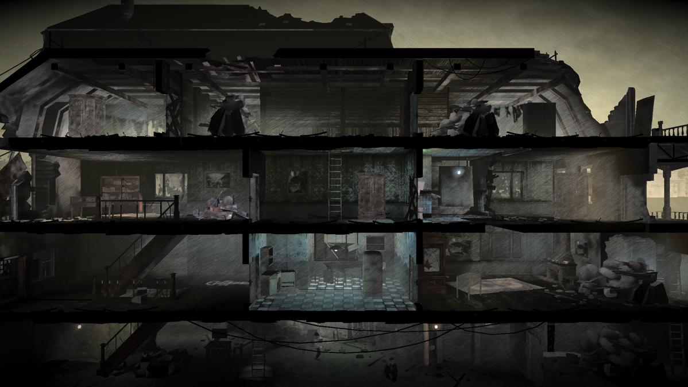
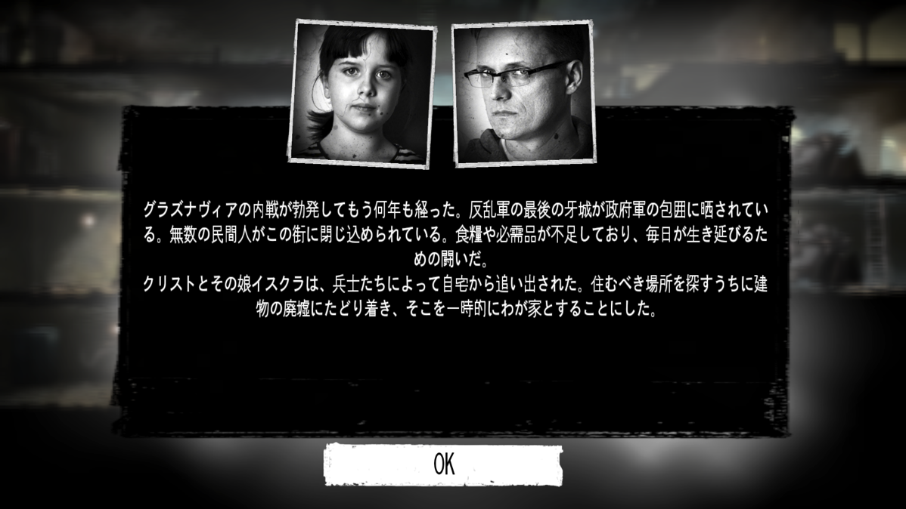
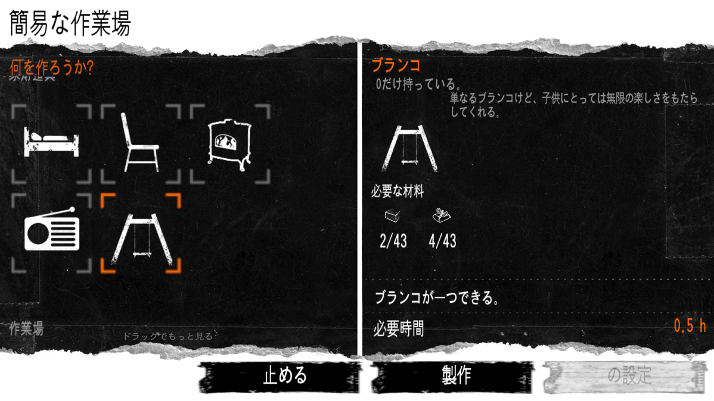
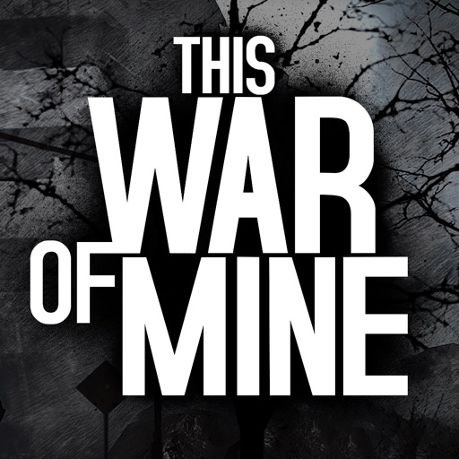

---
categories:
- アプリ
date: Mon, 30 Jan 2017 12:30:00 +0000
slug: post-10194
tags:
- アプリ
title: 鬱ゲーム「The war of mine」がアップデートしててとてもじゃないけどプレイ出来なかった。
---

戦争をする側のゲームはよくありますが、戦禍の中生き残ろうとする市民側がプレイヤーというゲームは少ないのではないでしょうか。さらにいうと実際の戦争を主題にしており、極限の人間の心理状態がかなりリアルに表現されています。

そんな「The war of mine」はPCゲームとしてsteamからダウンロードできます。今回はそのスマホ版のご紹介です。なんですが、これがプレイするのが結構つらそう。リリースしてからすぐに買ってやってたんですが、久しぶりに立ち上げてみたらアップデートされてて課金コンテンツが増えてたのでダウンロードしてプレイしてみよーと軽いノリだったんですが•••

<h2>そもそもが鬱ゲーム</h2>

戦争で荒廃した街の廃墟でいかに生き抜くかというゲームで、昼は住みかにしてる廃墟で作業をして夜はよその廃墟で資源収集というフェーズで1ヶ月生き延びればいいクリアです。

基本パラメーターは疲労度と空腹度の他に気分があり、このあたりのバランスをとりながらターンを進めていきます。働けば疲労度が増して休めば回復し、食糧を食べないとお腹が減ってそのままだと餓死します。また、気分が滅入ったりすると鬱状態となり正常に作業を行わなくなりやがて自ら命を絶つ場合もあります。

どうですか、このゲーム•••

あと資源収集フェーズでは他人の家に侵入し略奪を働くことも可能です。ただし、その場合罪悪感から鬱状態に陥りやすくなります。そんな時はアルコールを作って摂取して陽気に忘れたりします。これもリアル

食糧がなかったら地下室に罠を張ってネズミを捕って食べたり。あるいは資源を元に物々交換したり兵隊と取引したり

とまぁ、そんなゲームです。

いやーな気持ちになります。<!--more--><h2>アップデートしたらさらに鬱要素増えた</h2>

でま、まだそれはそれでゲームとして楽しめたんですよ。でもこのダウンロードコンテンツはさらに嫌な気分になります。ぼくは本当に嫌な気分になったので、まだ途中までしかやってません。

今回はなんと子どもという新たな要素が加わっています。親と子どもを操作して生き延びるんですが、子どもはおもちゃとか遊びがないとどうも気分パラメーターが低下するみたいです。いや、マジで勘弁して

ぼくは、操作できるキャラクターが親と子どもしかいない時に子どもを残して資源収集にいったら、泥棒に侵入されて子どもが怪我してました。

いや、ほんとにやめて

やっと仲間が増えたのでなんとか作業分担できるようになりそうですが、、、

でも、この先どうなっちゃうのかを想像するのすら嫌なので、もうプレイできそうにない

<h2>しんぺーはこう思った。</h2>

どうでしょうか、本当に嫌な気分になる鬱ゲームです。

ただ、ゲーム性としては作業効率を考える系のゲームなのでそういうのが好きな人は面白いかもしれません。ぼくはこういうの好きなので、作業効率を工夫する部分はサクサクと勧められました。まぁでも嫌な気分になることは間違いないです。仲間が負傷しても、気分回復させるアルコールがあるからあえて見殺しにしたりとかもできるんですが、なんかそうできなかったり。誰かが死んだりしたら、もうそこからそのプレイやめちゃったりとかね

とりあえずまぁまぁ楽しい・・・くはないけど面白いゲームなのでおすすめです。

ただ、今値段気がついたんですがめっちゃ高かった・・・それでもプレイして見たい方、どうぞ

と言ったところで本日は以上になります。  おやすみなさい。
そして、また明日。

<a href="https://itunes.apple.com/jp/app/this-war-of-mine/id982175678?mt=8&uo=4&at=11ld5P" target="_blank" >This War of Mine</a>&nbsp;(1,800円)

<a href="https://itunes.apple.com/jp/developer/11-bit-studios-s.a./id427155206?uo=4&at=11ld5P" target="_blank" >11 bit studios s.a.</a>&nbsp;<a href="https://itunes.apple.com/jp/app/this-war-of-mine/id982175678?mt=8&uo=4&at=11ld5P" target="_blank" style="width:100px;color:#ffffff;background:#298CDA;font-size:10px;font-weight:bold;text-align:center;display:inline;text-decoration:none;border:0px;padding:5px;border-radius:10px;background:-moz-linear-gradient(rgba(85,182,237,0.5), rgba(41,140,218,1));background:-webkit-gradient(linear, 100% 0%, 100% 100%, from(rgba(85,182,237,0.5)), to(rgba(41,140,218,1)));white-space: nowrap;">iTunes で見る</a>

(2017.01.30時点)

posted with <a href="http://pochireba.com" rel="nofollow" target="_blank">ポチレバ</a>

