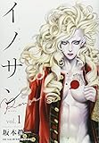

---
categories:
- sukekiyo
date: Wed, 01 Feb 2017 14:56:39 +0000
slug: post-10209
tags:
- sukekiyo
title: 京ソロコラボの「イノサン Rouge」読んだことないから調べてみた
---

今日発表がありましたが、京ソロで漫画の「イノサン」とコラボTシャツが発売するそうです。正直その漫画聞いたことも見たこともなかったので、とりあえずkindleで1巻買ってみました。が、読む前に少しwikipediaで調べて見ました。ネタバレいやだからあらすじまで踏み込まずに概要だけでやめましたがw<!--more-->
<h2>イノサン Rougeとは</h2>
<blockquote>坂本眞一による日本の漫画作品。「イノサン」とはフランス語のInnocentで、英語の「イノセント」に相当する。『週刊ヤングジャンプ』（集英社）2013年9号より連載2015年20号まで連載された。基本的に巻末に掲載されていた。
続編『イノサン Rouge（ルージュ）』の連載が同じ集英社の『グランドジャンプ』2015年12号より開始された。</blockquote>
なるほど、連載年数が割と短い気がします。なおかつ巻末掲載ということはあれだ、ジャンプでいうところの幕張とかマサルさん的な立ち位置ってことですね。要は一部の玄人向けってことですね。知らんけど

内容は、フランス革命の時代らしく歴史漫画っぽいです。実在の人物シャルル＝アンリ・サンソンという死刑執行人が主人公で、処刑・拷問・解剖といった表現がリアルに描かれているらしい。もうこの時点で「あ、なるほど」と思わざる得ない。

ということで、今のところ無印の「イノサン」は全９巻で、Rougeの方は4巻まででてるっぽい。

平成版のベルばらみたいな劇画っぽさもある感じの絵

とりあえずこれから1巻ずつ読んでいきたいと思います。面白かったらTシャツ買おう。
<h2>京ソロのコラボTシャツ</h2>
<blockquote class="twitter-tweet" data-lang="ja">

京×坂本眞一による漫画『イノサン Rouge ルージュ』とのコラボレーションとして公式グッズ発売決定！(S)<a href="https://t.co/5F9zmIorAH">https://t.co/5F9zmIorAH</a><a href="https://t.co/rerU9QbN8B">https://t.co/rerU9QbN8B</a> <a href="https://t.co/WLOfHq8zn6">pic.twitter.com/WLOfHq8zn6</a>

— 京 (@kyo_official) <a href="https://twitter.com/kyo_official/status/826628314030759936">2017年2月1日</a></blockquote>

イラストの上部に京の目がプリントされてるTシャツ。ジャケットもでるみたい。

本人そうとう嬉しかったのか立て続けに2回もツイートしてるw　sukekiyoや京ソロの醍醐味はやはり<strong>本人が好きなものを好きなようにできる・・・のを我々が眺められる！！！！</strong>ってところだよね！
<blockquote class="twitter-tweet" data-lang="ja">

ふふふとフフフがふふっとなってますね。
またふふふが１つ増えました。

ありがとうございます。

ふふふ

京

— 京 (@kyo_official) <a href="https://twitter.com/kyo_official/status/826455760083181569">2017年1月31日</a></blockquote>

<blockquote class="twitter-tweet" data-lang="ja">

今もふふふはあそこでフフッと出ているが
陽昇らずば、全て謎は解き明かさん。

京

— 京 (@kyo_official) <a href="https://twitter.com/kyo_official/status/826459604385046528">2017年1月31日</a></blockquote>

<h2>しんぺーはこう思った。</h2>
確か以前、なんかのインタビューかアンケートかで「東京喰種」面白いって言ってた気がするからそっちともコラボしてほしいなぁ。

めちゃくちゃ個人的なこというとハンターハンターとか。。。

と言ったところで本日は以上になります。

おやすみなさい。

<a href="http://www.amazon.co.jp/exec/obidos/ASIN/408890267X/warawareotoko-22/" target="_blank" rel="noopener">イノサン Rouge ルージュ 1 (ヤングジャンプコミックス)</a>

posted with <a href="http://kaereba.com" target="_blank" rel="nofollow noopener">カエレバ</a>

坂本 眞一 集英社 2015-10-19

<a href="http://www.amazon.co.jp/gp/search?keywords=%E3%82%A4%E3%83%8E%E3%82%B5%E3%83%B3%20&amp;__mk_ja_JP=%E3%82%AB%E3%82%BF%E3%82%AB%E3%83%8A&amp;tag=warawareotoko-22" target="_blank" rel="noopener">Amazon</a>

<a href="https://hb.afl.rakuten.co.jp/hgc/0f6e221b.2eb9748a.0f6e221c.35cc1e84/?pc=http%3A%2F%2Fsearch.rakuten.co.jp%2Fsearch%2Fmall%2F%25E3%2582%25A4%25E3%2583%258E%25E3%2582%25B5%25E3%2583%25B3%2520%2F-%2Ff.1-p.1-s.1-sf.0-st.A-v.2%3Fx%3D0%26scid%3Daf_ich_link_urltxt%26m%3Dhttp%3A%2F%2Fm.rakuten.co.jp%2F" target="_blank" rel="noopener">楽天市場</a>

<a href="//ck.jp.ap.valuecommerce.com/servlet/referral?sid=3041033&amp;pid=882528283&amp;vc_url=http%3A%2F%2Fsearch.shopping.yahoo.co.jp%2Fsearch%3Fp%3D%25E3%2582%25A4%25E3%2583%258E%25E3%2582%25B5%25E3%2583%25B3%2520&amp;vcptn=kaereba" target="_blank" rel="noopener">Yahooショッピング</a>

