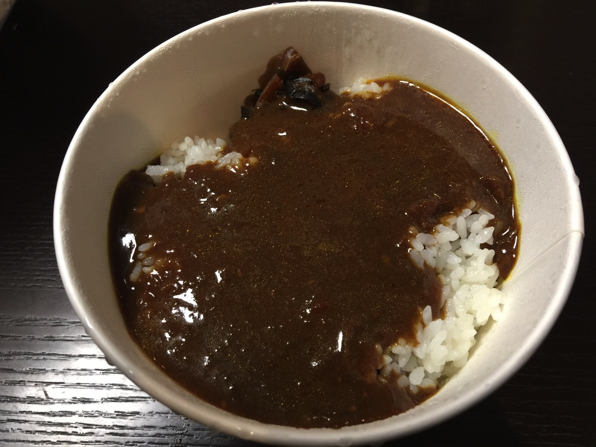
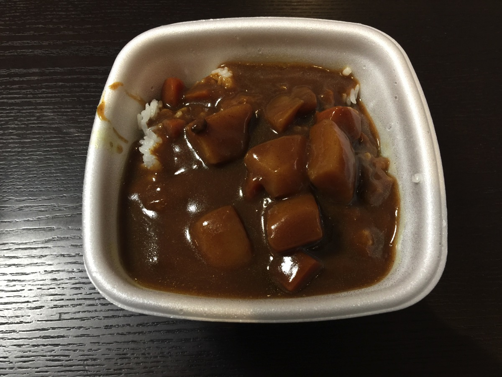

---
categories:
- ブログ
date: Fri, 03 Feb 2017 13:11:52 +0000
slug: post-10218
tags:
- 比較してみた
title: 牛丼チェーンのカレーライス比較してみた
---

牛丼チェーンのカレーが何気にコスパがいいので吉野家、松屋など食べて比較してみました。<!--more-->
<h2>松屋のカレーはぴりぴり辛い！</h2>

並盛：330円 646kcal
大盛：430円 861kcal

とにかくピリッと辛いです。写真で伝わるかわからないけど脂がてっかてかに浮いております。しょっぱいです。

一口で体にあんまりよくないだろうなという確認。とにかくしょっぱ辛い
<h2>吉野家のカレーは2種類！どちらもめちゃくちゃうまい！</h2>

写真は旨辛カレー。若干からさがありますが、そこまでピリッとしません。優しい辛さです。それでいて、物足りなさは感じないとても満足のいくカレーです。いかにもカレーライス！！！という感じのカレーです。

並盛 350円 610kcal
大盛 450円 724kcal

松屋とりも20円高いけどカロリーは低い。

これ以外にも辛さを若干抑えたこく旨カレーがあります。どちらかのルーを選択できるようになっています。

並盛 350円 569kcal
大盛 450円 683kcal

さすが、牛丼一筋でずっとやってきた歴史があるだけはあります。牛丼以外のメニューですらこだわりを感じます。

正直このカレーのコスパの前ではココイチは霞みますね。
<h2>しんぺーはこう思った。</h2>
比較してみたけどやっぱり吉野家のカレーライスうまかった！次すき家のカレーも食べてみようと思います。食べしだい追記いたします！！

と言ったところで本日は以上になります。

おやすみなさい。
そして、また明日。