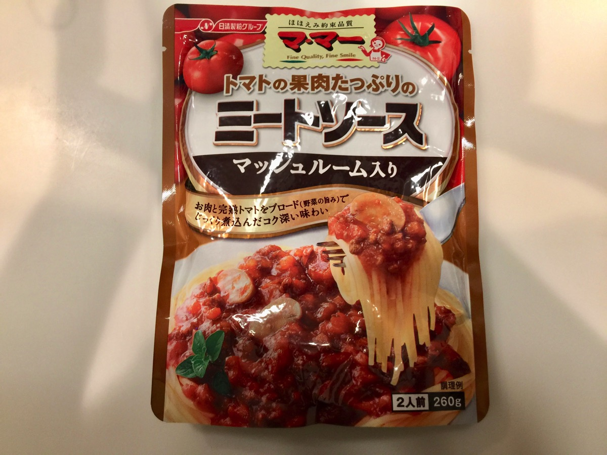
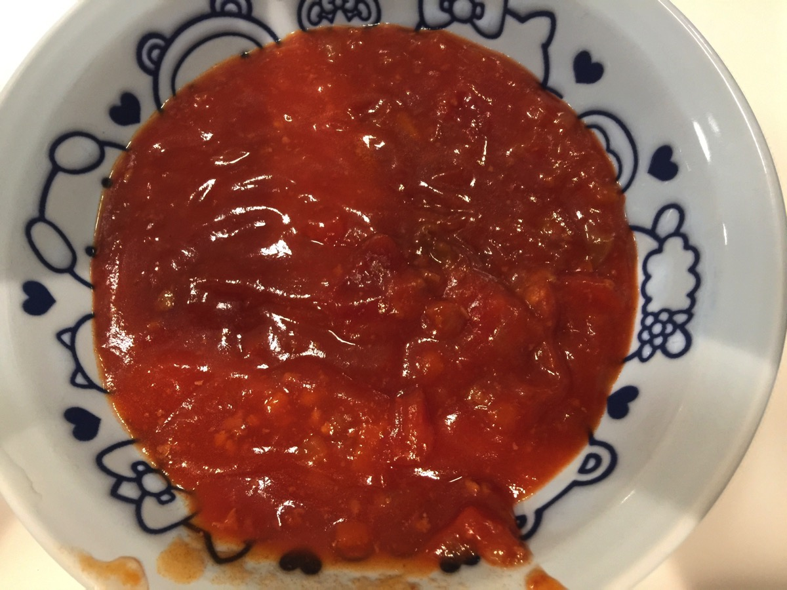
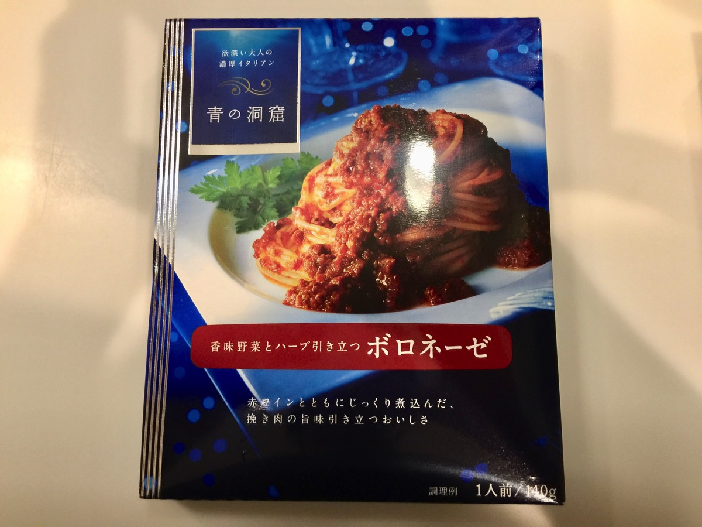
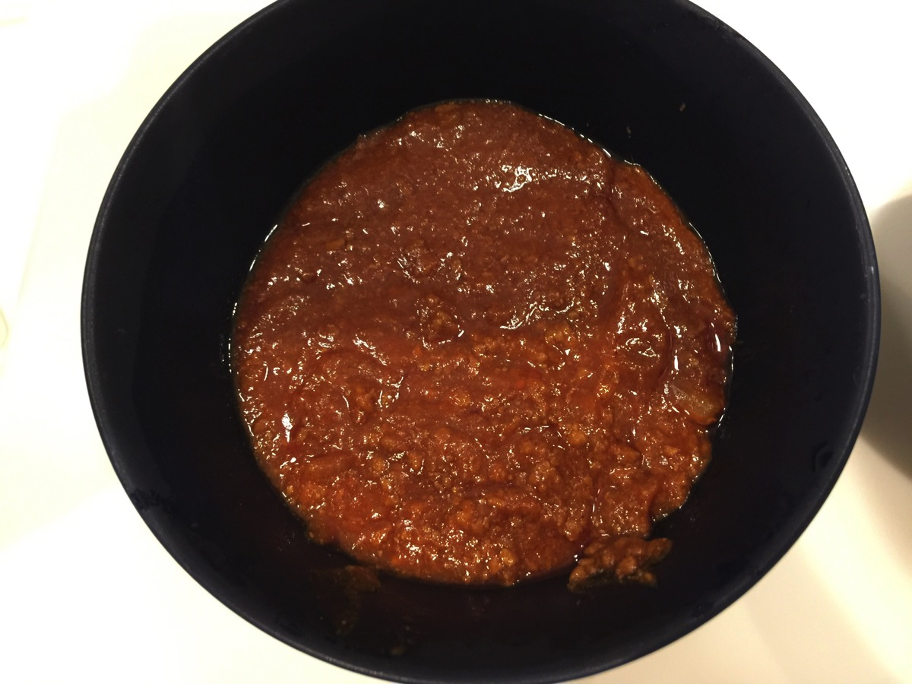
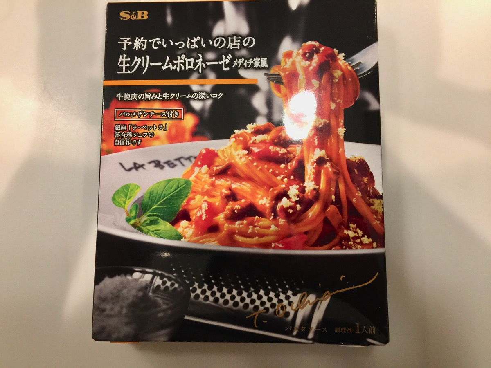
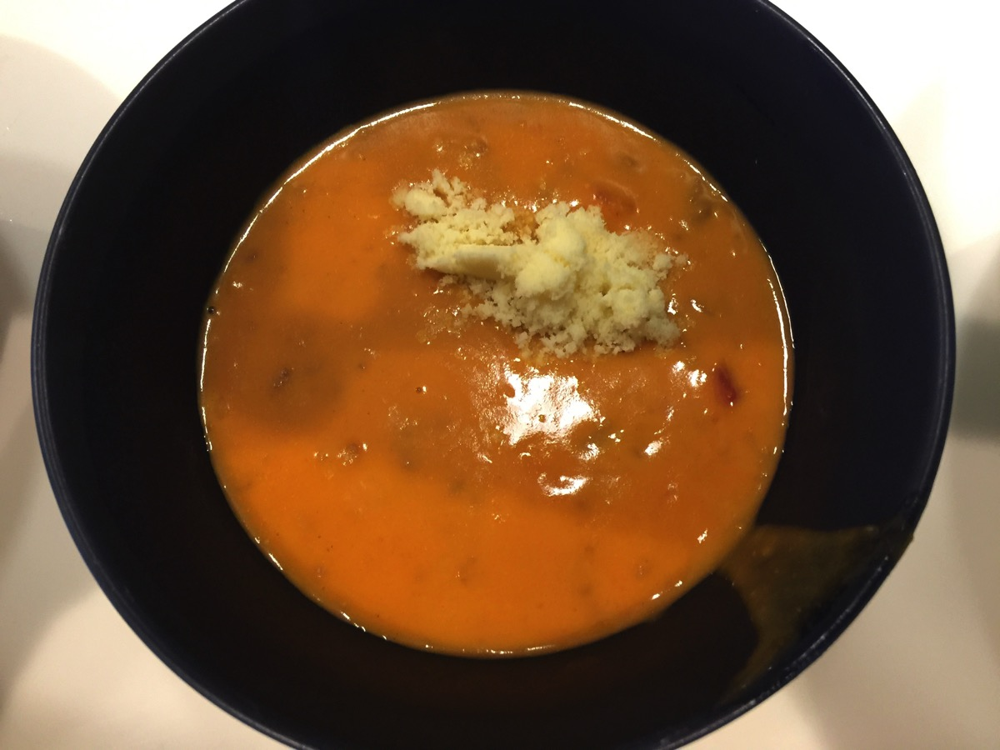

---
categories:
- ブログ
date: Wed, 08 Feb 2017 13:34:44 +0000
slug: post-10233
tags:
- 比較してみた
title: スーパーで売ってるスパゲティのレトルトソースを比較してみた
---

帰りのスーパーでなんとなくミートソース系のソースを3つ買って食べ較べてみたので今週の比較記事はそれをご紹介いたします。<!--more-->
<h2>マ・マー「トマトの果肉たっぷりのミートソース」</h2>
マッシュルーム入ってった？

もっともスタンダードなソースではないでしょうか。量ももっとも多くコスパ最強と思われます。

ただ、味は安っぽい感じがして無難ちゃ無難な味です。全体的に酸味がありつつ、コクがないのが安っぽいと感じる原因だと思います。

今回他の2種類はボロネーゼなのに対してこれだけミートソースなので厳密な比較にはなりませんが。。。

（器は銀行口座開設かなんかのおまけのキティちゃんwwww）
<h2>青の洞窟「香味野菜とハーブ引き立つボロネーゼ」</h2>
ハーブ感はない

大人の味です。値段もマ・マーに比べると多少高くなっています。コクがあけど、かすかに酸味があります。それでいて喉にピリっとくる辛さも兼ね備えています。

ひき肉もしっかりと入っており、なかなか美味しかったです。

今回の3種類の中ではぼくは断然こちらをお勧めいたします。

<h2>S＆B「予約でいっぱいの店の生クリームボロネーゼメディチ家風」</h2>
予約でいっぱいというのもよくわからないし、さらにレオナルド・ダヴィンチのパトロンをしていたメディチ家のもよくわかりません。。

これも厳密な比較になってないんですが、クリーム系のボロネーゼでした。トッピングでパルメザンチーズもついていて、チーズの味がしっかりとでておりました。

トマト系のソースよりもカルボナーラとかミルク、チーズ系が好きな人にはこちらがお勧めですね。

<h2>しんぺーはこう思った。</h2>
とりあえず、サブタイトルつけたやつら全員出てこい。全員意味がわからん。

ミートソースで比較してみようと思っていたのですが諸々間違ってしまいました。ただ、スパゲティで簡単に夕食をすませようというときでも、ソースを複数買って食べ比べるとちょっとはリッチな気分になれるので、おすすめですw

メーカーにより味つけが全く異なっているので面白いと思います。

と言ったところで本日は以上になります。

おやすみなさい。
そして、また明日。