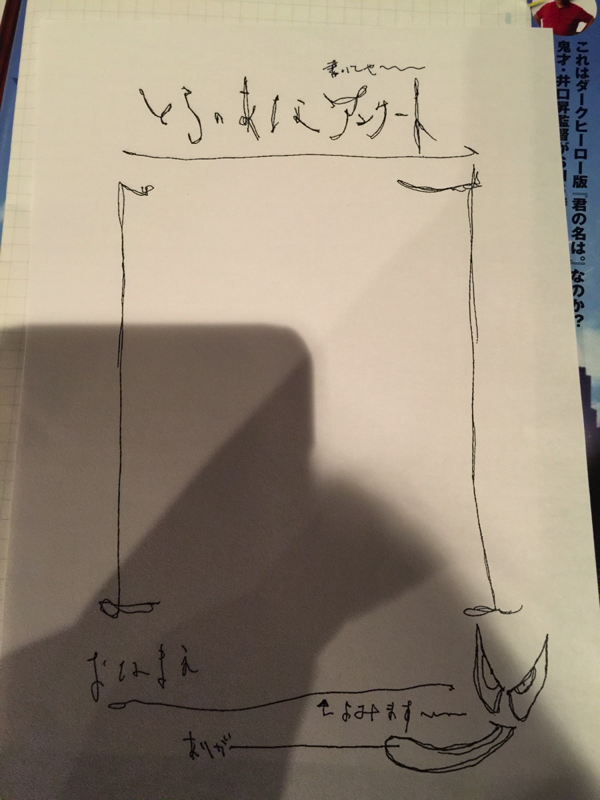
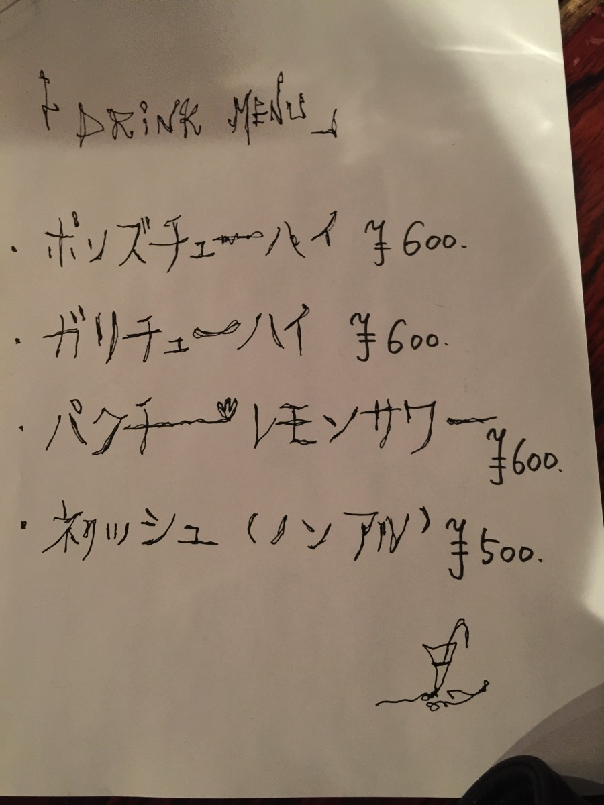
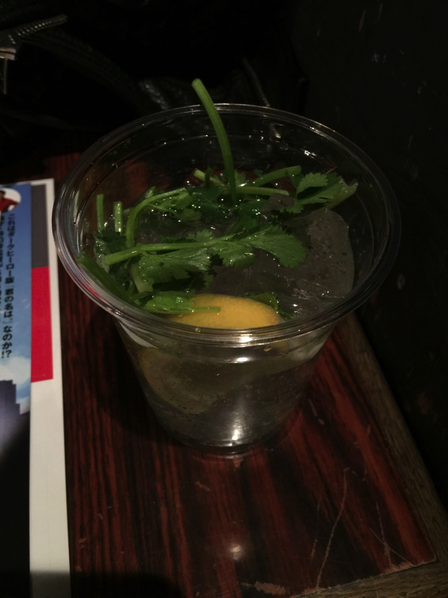
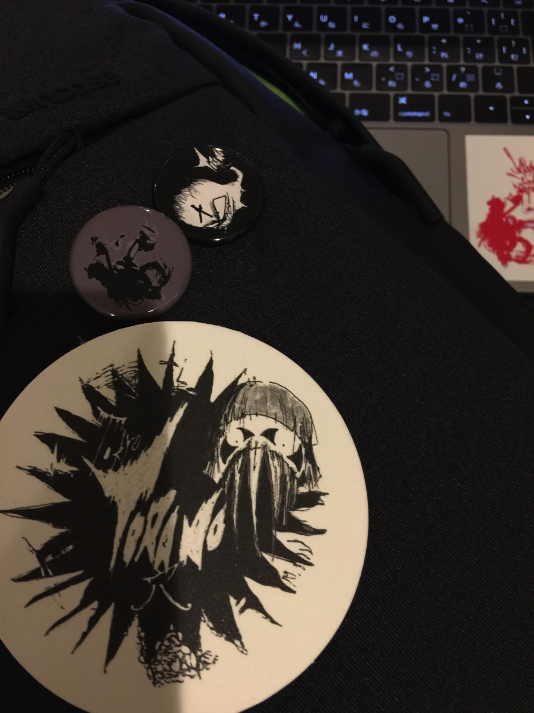

---
categories:
- 各メンバーの個人イベントレポなど
date: Sat, 11 Feb 2017 12:36:48 +0000
slug: post-10250
tags:
- DIR EN GREY
- イベントレポ
- 虎の穴
title: 【イベントレポ】DIR EN GREY 薫トークイベント「東京虎ノ穴」深夜の部＠ロフトワンプラス
---

DIR EN GREYのギター薫のトークイベント「虎ノ穴」　前回は薫初の本「薫の読弦」発表記念イベントとして開催されましたが、今回はジョー横溝氏とともに単独のイベントとして開催しました。そして前回よりおパワーアップし、今回は東京と大阪にて開催されます。

さて、帰宅して一眠りしてたらAndrogynosの発表に間に合わない時間になっちゃったので自宅待機でございますので、昨日のレポをまとめたいと思います。

前回のイベントの時の様なテーマが決まっていて質問形式で進行するというよりも、限りなくフリトークに近い形で進んいきました。ここでしか聞けないような超絶レア話や酔っ払ったおっさんが曖昧な知識でなんとなく語りあう居酒屋トークみたいな感じでした！！！ということで早速いってみましょう。<!--more--><h2>イベントレポ：前半</h2>

ジョーさんのみが最初登場し、上手に着座
挨拶もそこそこに薫を呼び込む。すると会場全体から黄色い悲鳴

薫がメガネをかけておった。。。かっこえええ

ジョー「この時間は普段何をしてるんですか？」

薫「作業してるか、酒飲みながら映画みてるか」

ジョー「最近観た映画は？」

薫「シンゴジラ」

そこからラジオやってたあたりが最初にゴジラ上陸の地でぶっ潰されたという話

<h3>バイトの話、バンドのお金の話、リーダーの話</h3>

ジョー「バイトは何を？」

薫「たこ焼き」

ジョー「たこ焼き屋だけ？」なぜか薫が一個しかバイトをしていないと思い込んでる節

以下薫がやってきたバイト
たこ焼き屋、野球場の売り子、ペットショップの後片付け、日雇い

DIR EN GREYになるまでバイト続けてたけど、バイトが禁止だったので親に借金して家賃払ったりリハ代など出してもらってた。なお今の事務所ではない。

上京したときは京と一緒に住んでいた。

（このあたりでおもむろに白ワイン、赤ワイン、ビールが運ばれてくる）

ジョー「リーダーの役目って？」

薫「最初、うちのバンドリーダーとかいなくて、みんなで決めてこうって感じだったけど、めんどくさくなったのか、やってくれと言われてやるようになった。」

ジョー「リーダー手当とかない？」

薫「もらいましょうか」

ジョー「他のメンバーでリーダーやらせるとしたら」

薫「真面目な話するとToshiya。ダメな人は京。」表現者として責任をもたせたりしたくない。京にはバランス考えさせたくない「DieとShinyaはどっちもマイペースだからダメ。そもそもShinyaは会話できない」

<h3>曲作りの話</h3>

ジョー「ふだん曲作りの時酒は飲むの？」

薫「もうえーわーってなるからぜったい飲まない。LIVEも飲まない。疲れるから。あと飲むと真っ赤になるから」

このあたりでジョー氏トークショーと言ってしまい、薫にトークライブねと訂正される。にも関わらず以後トークイベントで統一。ちなみに次間違えたらイッキするとの公約

ジョー「一番大変だった曲は？」

薫「サステイン、詩踏み」みんな！これでいい！？聞いてみたら佳境に入ったあたりで爆弾落とす人がいるから、もっと早く言ってよ〜ってなる。（京？？？Toshiya？？）

このあたりで曲のタイトルの話に。薫が自分でも思い出せない曲があったり、読み方わからないのがあったり（メンバー間ではずっと通称や略称で使ってたので）なんとかかんとかインジェクション。最近は大抵京がつけるとのこと。

薫が気めたのはウロボロスのアルバムタイトル。直後に否定。

ウロボロスのタイトル決める時、かなり締め切り間際だったので、みんなで出し合ってそれをスタッフが書き留めた中から決定したので、自分かどうかも疑わしいとのこと。

なおARCHEは制作の初めにあらかじめ決めておいて、制作が開始された。（タイトルは京）

ラジオは、インターFMに中学の同級生がいたことがきっかけでスタートした。

曲の作り方の話

薫「一番大事にしてるのは4人のメンバーがのってくるということを大事にしてる。DIRの世界観からなるべく離れて曲を作ってから、そこから寄せて行く。」

表現の話

ジョー「メジャースポンサーがつくと、書けないことがでてくる。だいたい20万部以上だとそうなる。」

ザザデイの話

薫「前はなるべく内側とかは見せないようにって思ってた。でも日常とか、そういうのを見せて行く方がより伝わるのかなと思った。自分によって音楽で人生が変わったから、そういう力を持ったものであると思ってるし、残るものを作りたい。」「情報の処理が多くなって行く中で処理されないようなもの、音楽がそうでありたい。」

ジョー「自分の中でひっかかるものってどんなの？」

薫「昔と今の伝えやすいにくいの差がある。聞いてもらいやすいけど、伝えにくくなった。」

ジョー「フェイクニュースが多くて、真実かどうかよりも受けてが面白いかどうかだけが重要視される世の中。そんな時代にアーティストをやるってのはすごい非効率だし、まさにアーティストしかできない」

薫「コピーコントロールとか書けてコピーされなくするのは簡単だけど、ちゃんと聞いてくれてくれる人のためにやらないようにしてるし、悪いことにだけ見るよりも、いいことの方を広げていきたい。」

この辺りで前半終了で一旦休憩に。休憩中はクリム&ゾン(ピックちゃん)の短編アニメが三本流れました。

<h2>イベントレポ：後半</h2>

ジョーさんが現れて、みんなが席につくまでちょっとおしゃべり。と思ったら薫が唐突に現れてジョーさんと場所を交代。上手でも下手でも顔が見えるようにとのはからい。

ここからは多少テーマを決めてのトークがしばらく続きます。が、曖昧な知識で酔っ払いが居酒屋トークを繰り広げているようにしか見えなかった。。。

テーマはAmazon Go

ちょっと説明するとAmazonプライムアカウントを持っていたら、Amazon Goの店で会計不要で商品を持ち出せるようになるというもの。略奪や万引きしているようにしか見えない。

<iframe width="560" height="315" src="https://www.youtube.com/embed/NrmMk1Myrxc" frameborder="0" allowfullscreen></iframe>

ジョー「ア昔高速道路の料金所のバイトをしたことがあるけど、どれだけ早く捌けるかというのが重視されてた。アメリカに住んでいた時にスーパーいったら後ろに列ができようがお客さんとおしゃべりしてた。メリカと日本のサービスの違いはそういうところかなと思う。」

薫「Amazon Goは物を売るとか買うとかっていうもの、そのものを変えてしまいそう。闇ができる。」

この変本当に二人とも漠然と話してたw

このあたりから割と話が漠然としだす。買ったものがわかるってことですよね？みたいな

ジョー「suicaも誰がいつどこで何を買ったかがわかるようになってる。」

薫「わからない（電車乗らないからsuica使わないからか？）」

薫「家電あるんですが、毎月同じ時間に一回だけ鳴る。」

ジョー「京さんじゃないの？セットリストまだー？みたいな」

薫「調べてみたら、リストで自動で鳴らしてるらしい」

軽いホラー都市伝説

ジョー「洋服とかは？」

薫「自分は店で見て買う派」

ジョー「DIRのメンバーの服の趣味は？」

薫「Shinyaは服突っ込まれる。もっとこっちに寄せてこいみたいな。でも突っ込んでる人も正直うーん（Toshiyaのことか？）」

ジョー「グッズについてはみんな意見を言うの？」

薫「Shinya以外は言う」

ジョー「情報解禁について。キングコングの西野さんがクラウンドファンディングで絵本のジャケットを募集して話題になりましたけどどう思われます？」

<blockquote>『情報解禁』という文化が、いかに時代に合っていないかが見えてくる。

誰に向けて情報を解禁するつもり？

お客さんなんて、いないぜ？

宣伝費さえかければモノが売れた(純粋なお客さんがいた)1990年代じゃなくて、今、2016年だぜ？

クリエイターとオーディエンスの間に太い線を引いて、別の生き物としてしまう発想が古すぎるんだよ。化石、ガラパゴス、糞ダセー。

引用：<a href="http://lineblog.me/nishino/archives/9250121.html">まだ『情報解禁』とか言ってんの？</a>

</blockquote>

薫「彼の言ってることはいいと思う。でも、道理的だけど作品ではなくなるきがする。クリエーターだと思うけど、これやるとクリエーターとそうじゃない人の境がなくなる。そういう人はそういう人で（それぞれでいいと思う。）」

薫「全てが全ての人に届くわけではない、このイベントもニコ生でやってたらってのとここだけで少人数でやってたらってのが違うように。でも自分は閉鎖的な方が好き。」

<h3>アンケートコーナー</h3>

（ぼくはandrogynosについて質問書きましたが当然スルー）

ここからアンケートに答えてくコーナー

ジョー「カラオケで歌ったことある曲は？三択で」

薫「ウィンクのなんとななねったいぎょ、Xのサディスティックデザイア（これを聞いてX好きになった。）、ボーイのビーブルー」正解はビーブルー

薫「くしゃみで喉をやられるから小刻みにする」

その後DIR EN GREYの薫がクシュンクシュンクシュンってくしゃみするのかといじられまくる。ちなみにお父上はくしゃみしたあとポーっていうらしい。

ここで地元の友達の話に

氷室好きな友達がいる。価値判断が全て渋いか渋くないかという感じになる。この前氷室のLIVEに行った際にエンドロール？を（本当はダメだけど）スマホで撮っちゃった。（ここで会場からは「おいおいお前が撮っちゃあかんやろー的な「えー」という声が）それをそいつに送った。」

小学生中学生くらいの時はおにゃんこの新田恵利がタイプだったり、西宮球場におニャンコきてた。そこでマイケルジャクソンを見たことがある。近くの公園のジャングルジムの上から人だかりを見てたら、車が来てその中にいたマイケルを見た。帰って母親にいったら信じてもらえなかった。

その流れで、父親はクラシック好き、母親はビートルズ好きとの話をしてた。

薫「牡蠣にあたったことはある。」

薫「舘ひろしがあぶない刑事でタカという役で出てて、自分はあぶ刑事世代だからテレビ曲で見かけた時、おもわずタカ！って言ったら同室にいたラクリマのタカさんに反応された。」

ジョー「これはアウトです。」

薫「メンバーとの会話はShinyaと最後に話したのは覚えてない。今年に入ってからしゃべってない。Toshiyaは挨拶くらい。Dieは酔っ払ってる時しか喋ってない。京はこういう曲作ってみたいってこの前はなした。

薫「最後に5人でご飯いったのは5、6年前の天下一品」

※メモが散発的な書き方で繋がりがよくわからなくなっちゃってます、すいません。

・山賊焼きの話
薫「ツアーで山口にいったときにメンバー4人とスタッフで寺みたいなところに食事にいった。」

・メガネをかけてきたのはリクエストにこたえて（いや、まじでごちそうさまでした。）

・Q、Dieの憧れるところやダメなところ
　A、ない。もう常に酔っ払ってるし、飲みすぎ。体が心配。香港でLIVEやった時焼肉屋でみんなでご飯食べてる時、酔ってかなりうるさくなったらもうホテルに帰るようにっていって外だしたら暴れだしたから、お前誰や！って言われたから、これは泣かさなあかんなって思ってたら「あれ？薫くん」って気がついてすぐに帰った。で、1,2時間くらいしてホテル戻ったらエレベーターの目の前にいて「ほんまごめんな」って謝って来てみたらTシャツが裏返しだった。一度脱いだけど、このままじゃいけないと思って着てまってたんやな。かわいいな」

・ボロボロたまごの話

・チョコ好き。ビターなのが好き。

・薫がDIRの前の前にやってたバンドの時に作詞作曲した「シンパー」という曲の話
夜の部で盛り上がって休憩中に前のバンドのメンバーに連絡とったら、歌詞カード送られてきた。
正式タイトルは「クライン」「乾いた微風はジャスミンの香り」「触れた指先にそっと運命の予感」ジャスミンはカタカナ

この後ずっとこのネタでいじられる。

・映画「この世界の片隅に」もみた

・健康診断の話
町医者に行ったら（刺青入れてて血管見えないから）断られた（けど注射してもらった）

・気になっていること
「ウォーキング・デッド」京に「ドントブーズ」という映画を勧められた
「好きだと思うから見て！」と食い気味に言われた。で、時間作って見に行って「見に行ったよー」「どうだった？」「おもろかったよー」という会話をした

<iframe width="560" height="315" src="https://www.youtube.com/embed/ZG8gRHJ9sN0" frameborder="0" allowfullscreen></iframe>

<a href="http://www.amazon.co.jp/exec/obidos/ASIN/B01N5S7FCC/warawareotoko-22/" target="_blank" rel="noopener noreferrer">ドント・ブリーズ [Blu-ray]</a>
posted with <a href="http://kaereba.com" rel="nofollow noopener noreferrer" target="_blank">カエレバ</a>

ジェーン・レヴィ ソニー・ピクチャーズエンタテインメント 2017-03-22    

<a href="http://www.amazon.co.jp/gp/search?keywords=%E3%83%89%E3%83%B3%E3%83%88%E3%83%BB%E3%83%96%E3%83%AA%E3%83%BC%E3%82%BA&__mk_ja_JP=%E3%82%AB%E3%82%BF%E3%82%AB%E3%83%8A&tag=warawareotoko-22" target="_blank" rel="noopener noreferrer">Amazon</a>

<a href="https://hb.afl.rakuten.co.jp/hgc/0f6e221b.2eb9748a.0f6e221c.35cc1e84/?pc=http%3A%2F%2Fsearch.rakuten.co.jp%2Fsearch%2Fmall%2F%25E3%2583%2589%25E3%2583%25B3%25E3%2583%2588%25E3%2583%25BB%25E3%2583%2596%25E3%2583%25AA%25E3%2583%25BC%25E3%2582%25BA%2F-%2Ff.1-p.1-s.1-sf.0-st.A-v.2%3Fx%3D0%26scid%3Daf_ich_link_urltxt%26m%3Dhttp%3A%2F%2Fm.rakuten.co.jp%2F" target="_blank" rel="noopener noreferrer">楽天市場</a>

<a href="//ck.jp.ap.valuecommerce.com/servlet/referral?sid=3041033&pid=882528283&vc_url=http%3A%2F%2Fsearch.shopping.yahoo.co.jp%2Fsearch%3Fp%3D%25E3%2583%2589%25E3%2583%25B3%25E3%2583%2588%25E3%2583%25BB%25E3%2583%2596%25E3%2583%25AA%25E3%2583%25BC%25E3%2582%25BA&vcptn=kaereba" target="_blank" rel="noopener noreferrer">Yahooショッピング</a>

<h2>物販</h2>

缶バッチは、全6種セットで1,000円だと思ってたらそんなことなくて、2個セットで1,000円３パターンって感じでした。スケジュール帳はみてないけど、中身すっごいらしいですよ。ほぼ写真集みたいな感じらしい。そして買うつもりのないステッカーを思わず買っちゃった。薫の唇がうつってたから。

あとブルゾンは肌触りがすっごいいい！もう少しあったかくなったら重宝しそう。ただサイズがめっちゃ大きい。開場中に現れたジョー横溝氏が羽織ってたけどMサイズをそれで大体フィットしてるくらいでした。本人はLを買うと言ってましたけど、170前後の男性でもLはでかいと思う。

<h2>店内システム</h2>

次回参戦の方のために書いておきますが、ステージがある居酒屋って感じ。奥には座敷的なのもあるけど、基本はステージに向かって丸椅子が並べてある感じ。壁際にはテーブルがある席もある。トイレは男女兼用で、男性用便器と個室が同じ空間にあるからめちゃくちゃ気まずいし、女性多いイベントだと男はトイレいきずらいと思う。もうなるべく先にトイレいって水分とらないで我慢してた方がいいと思う。

店内に入店する時番号がついた札を渡されます。これが伝票がわりになるので身につけておきましょう。またかならず500円以上のオーダーをする決まりになっていますので、お酒飲まな買うても何か頼みましょう。

店員さんがまわっているのでメニュー見て注文を伝えると札の番号聞かれるので見せると、精算時に番号でいくらかわかる仕組みになっています。

なお、今回のメニューはこんな感じ

<ul>
	<li>ポンズチューハイ　600円</li>
	<li>ガリチューハイ　600円</li>
	<li>パクチーレモンサワー　600円</li>
	<li>ネクッシュ 500円</li>
</ul>

どれもなんとなくやばそうなので、味自体が変容してなさそうなパクチーレモンサワーを頼みました。そしてパクチーが口に入らないように飲みました。

コースターとバッジとステッカー。

<h2>しんぺーはこう思った。</h2>

生まれて始めて始発の新宿駅で電車を待ちました。けっこう人乗るんだなw

そんなことはどうでもいい！！！とにかくだ！！とにかくめちゃくちゃ楽しかったぞ！！
そして大阪ではな薫がたこ焼きを焼くらしいから！！！いいなーーーー！！！

そっか、誕生日だからサービスなんだな！うらやま！それとスケジュール帳がもう相当やばいらしい。日常系のオフショットとかだったらほすぃ

だれか中身ちょっと見せて

と言ったところで本日は以上になります。  おやすみなさい。
そして、また明日。

<noscript></noscript>