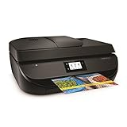

---
categories:
- レビュー
date: Sat, 18 Feb 2017 14:41:34 +0000
slug: post-10296
tags:
- ガジェット
title: hpの複合機導入しました。あると全然違う！自宅にプリンターがある幸せ。
---

いつもプリントする必要がある時はセブンイレブンのマルチコピー機を使っています。しかし、先日確定申告に行こうと思って諸々準備してたら形式によってはセブンイレブンのコピー機が認識してくれないものがあって、その日は結局確定申告に行くのを諦めてしまいました。こりゃいかんと思いたって、すぐに自宅用のプリンターをAmazonで購入いたしました。するとどうでしょう。今までいちいちセブンイレブンに行っていた手間がなくなっただけでなく、諸々の手間や時間を省くことができることに気がつきました。あとスキャナもついているので何か便利です。ということで本日は複合機のご紹介です。<!--more--><h2>hpの複合機</h2>

今回購入したのはこちら

<a href="http://www.amazon.co.jp/exec/obidos/ASIN/B0179MK6IW/warawareotoko-22/" target="_blank" >HP プリンター インクジェット 複合機 Officejet 4650 F1H96A#ABJ</a>
posted with <a href="http://kaereba.com" rel="nofollow" target="_blank">カエレバ</a>

 ヒューレット・パッカード 2015-11-13    

<a href="http://www.amazon.co.jp/gp/search?keywords=HP%20%E3%83%97%E3%83%AA%E3%83%B3%E3%82%BF%E3%83%BC%20%E3%82%A4%E3%83%B3%E3%82%AF%E3%82%B8%E3%82%A7%E3%83%83%E3%83%88%20%E8%A4%87%E5%90%88%E6%A9%9F%20Officejet%204650&__mk_ja_JP=%E3%82%AB%E3%82%BF%E3%82%AB%E3%83%8A&tag=warawareotoko-22" target="_blank" >Amazon</a>

<a href="https://hb.afl.rakuten.co.jp/hgc/0f6e221b.2eb9748a.0f6e221c.35cc1e84/?pc=http%3A%2F%2Fsearch.rakuten.co.jp%2Fsearch%2Fmall%2FHP%2520%25E3%2583%2597%25E3%2583%25AA%25E3%2583%25B3%25E3%2582%25BF%25E3%2583%25BC%2520%25E3%2582%25A4%25E3%2583%25B3%25E3%2582%25AF%25E3%2582%25B8%25E3%2582%25A7%25E3%2583%2583%25E3%2583%2588%2520%25E8%25A4%2587%25E5%2590%2588%25E6%25A9%259F%2520Officejet%25204650%2F-%2Ff.1-p.1-s.1-sf.0-st.A-v.2%3Fx%3D0%26scid%3Daf_ich_link_urltxt%26m%3Dhttp%3A%2F%2Fm.rakuten.co.jp%2F" target="_blank" >楽天市場</a>

<a href="//ck.jp.ap.valuecommerce.com/servlet/referral?sid=3041033&pid=882528283&vc_url=http%3A%2F%2Fsearch.shopping.yahoo.co.jp%2Fsearch%3Fp%3DHP%2520%25E3%2583%2597%25E3%2583%25AA%25E3%2583%25B3%25E3%2582%25BF%25E3%2583%25BC%2520%25E3%2582%25A4%25E3%2583%25B3%25E3%2582%25AF%25E3%2582%25B8%25E3%2582%25A7%25E3%2583%2583%25E3%2583%2588%2520%25E8%25A4%2587%25E5%2590%2588%25E6%25A9%259F%2520Officejet%25204650&vcptn=kaereba" target="_blank" >Yahooショッピング</a>

hpの複合機で、スキャンもできるしコピーもできるしファックスもできるやつです。また有線・無線に対応しており、windowsもmacにも対応しております。

また驚いたんですが、iPhoneからそのままプリンターにデータ飛ばしてプリントできるんですね、最近のって。

あと、スキャナは自炊とかじゃなければこれで十分です。

インクはカートリッジが2つ入れられるようになっていて、黒とカラーになっています。1つだいたい2000円します。黒が切れても黒色は出力できるようなので実質両方とも使い切って交換ができるっぽいです。この辺よくわかりませんが。

<h2>プリンターあえて買わないと思っている方にいいたい。持ってると安心感違うということ</h2>

だいたいあえて持っていない人って次のように思ってるでしょ

<ul>
	<li>そんなに使わない</li>
	<li>インクが高い</li>
	<li>邪魔</li>
</ul>

そんなに使わない！からこそ安めのものを持っておいていいのかなと今は思います。使わないからコンビニですませようとか思ってると、今回のぼくのように失敗します。世の中には意外と紙が必要な場合がまだまだあります。そんな時に焦らずにスムーズに行動できるようにあった方がいいかと思います！

インクは確かに高い！でも逆にそんなに使わないから滅多に買わないと思えばいいかな、、、ここは割り切りが必要かも！

邪魔！そうこれは致し方なし！！複合機だからめちゃくちゃデカかった、、、でかさを考えずに売れてるからってこの機種を選びましたが結構でかい！このために何か専用の棚を買いたいくらい大きかった。もっとコンパクトなの探せばありそう。。。

でも、それでも安心感が違う！これで咄嗟の時に焦らなくなるのかと思うともう本当に安心感が違う！

<h2>しんぺーはこう思った。</h2>

とりあえず印刷はこれでOK

確定申告やらなんやらで急に紙提出が必要になるシーンはよくありますので、買ってよかった！

ただ、やっぱり複合機なのでスキャナの機能は普通でした。自炊とかは当然できないでしょう。そのうち自炊用のscan snapとか買いたいと思います。

と言ったところで本日は以上になります。  おやすみなさい。
そして、また明日。