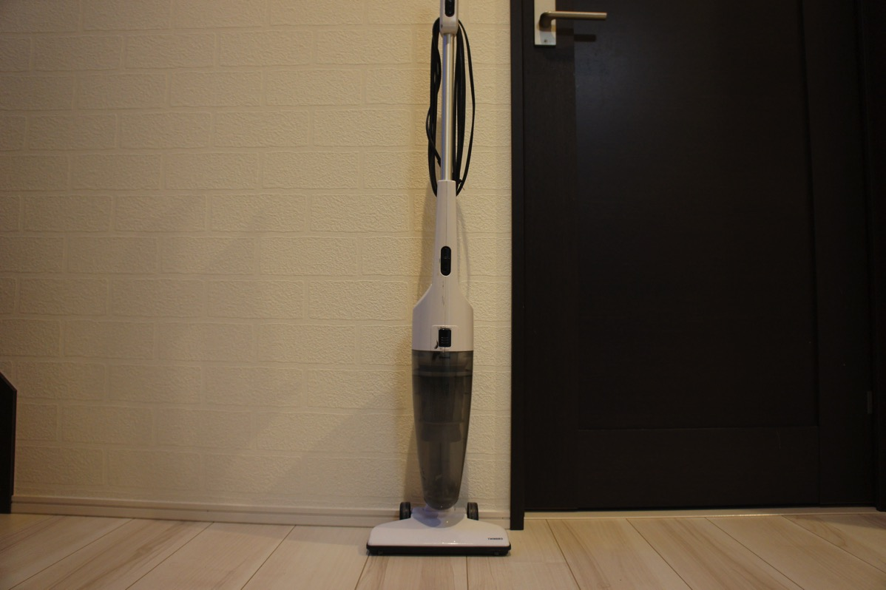
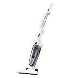

---
categories:
- レビュー
date: Sat, 25 Feb 2017 14:59:00 +0000
slug: post-10314
tags:
- 掃除機
title: Amazonランキング1位のスティック型掃除機はちょっとした掃除ならぜんぜんOK
---

普段時間がないのであまり掃除機をがっつりかけません。その代わり、ロボット掃除機を毎晩かけて寝ています。そのため目立ったほこりやゴミはほとんどありません。しかし、段差があるところやちょっとした隅っこのようなロボット掃除機が入れないところなんかはゴミがたまりがちです。そこで、どうしても掃除機が必要になるんですが、コスパのいい掃除機を持っていますのでご紹介いたします。<!--more-->それがこちら、「ツインバード サイクロンスティック型クリーナー スケルトンブラック TC-E123SBK」

<h2>この商品の特徴は安さと軽さ</h2>

それは安いところ！そして軽くて持ち運びしやすいところ！
以上！！

<strong>軽いので、階段とかをほうき掃除感覚でかけることができます。</strong>

<strong>コードがかなり長い</strong>のでひっかかることなど気にせずに持ち運ぶことができます。なお、<strong>音はそれなりに大きい</strong>方ではないかと思います。

<h2>気になったところ</h2>

ちょっとここが気になるというのが２点あります。

一つはゴミの出し方がめんどくさい点。ボタン一つでポンとすてられるわけではありません。本体を外して、中のフィルターを取り外して捨てるのですがこれがめんどくさい。フィルターにほこりがついて吸引力も下がるからフィルターも掃除しなきゃいけないし。

もう一つは、ヘッドの脆弱さです。普通の掃除機だとブラシが付いていたり吸い口が大きくなっていたりと工夫がされているものですが、これはとくにそういったものはありません。ゴミを集めやすくするためだけに掃除機にありがちなT字構想のヘッドになっています。細かなゴミを集めるわけでもなく、ただ吸引力で吸い込むだけです。

そのため吸引力がさがると吸い込みません。まぁこれは他の一般的な掃除機全般に言えることだと思いますが。

<h2>こんな人におすすめ</h2>

一人暮らしでワンルームとかに住んでいる人やメインの掃除機以外にもう一つ欲しい人とか

ようはがっつり掃除をやらない人向けの掃除機です。

<h2>しんぺーはこう思った。</h2>

とりあえず、だいぶ使ってきたので性能が落ちてきた気がしますし、もっとがっつりと掃除機をかけたいと思いますので買い替えを検討しています。

と言ったところで本日は以上になります。  おやすみなさい。
そして、また明日。

<a href="http://www.amazon.co.jp/exec/obidos/ASIN/B0098D4GYG/warawareotoko-22/" target="_blank" >ツインバード サイクロンスティック型クリーナー スケルトンブラック TC-E123SBK</a>
posted with <a href="http://kaereba.com" rel="nofollow" target="_blank">カエレバ</a>

 ツインバード工業(TWINBIRD) 2012-09-14    

<a href="http://www.amazon.co.jp/gp/search?keywords=TC-E123SBK&__mk_ja_JP=%E3%82%AB%E3%82%BF%E3%82%AB%E3%83%8A&tag=warawareotoko-22" target="_blank" >Amazon</a>

<a href="https://hb.afl.rakuten.co.jp/hgc/0f6e221b.2eb9748a.0f6e221c.35cc1e84/?pc=http%3A%2F%2Fsearch.rakuten.co.jp%2Fsearch%2Fmall%2FTC-E123SBK%2F-%2Ff.1-p.1-s.1-sf.0-st.A-v.2%3Fx%3D0%26scid%3Daf_ich_link_urltxt%26m%3Dhttp%3A%2F%2Fm.rakuten.co.jp%2F" target="_blank" >楽天市場</a>

<a href="//ck.jp.ap.valuecommerce.com/servlet/referral?sid=3041033&pid=882528283&vc_url=http%3A%2F%2Fsearch.shopping.yahoo.co.jp%2Fsearch%3Fp%3DTC-E123SBK&vcptn=kaereba" target="_blank" >Yahooショッピング</a>

