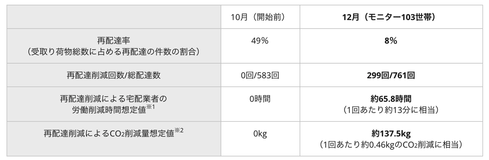
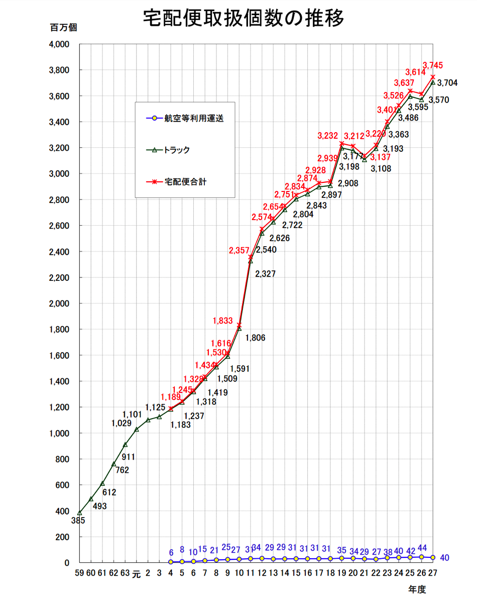
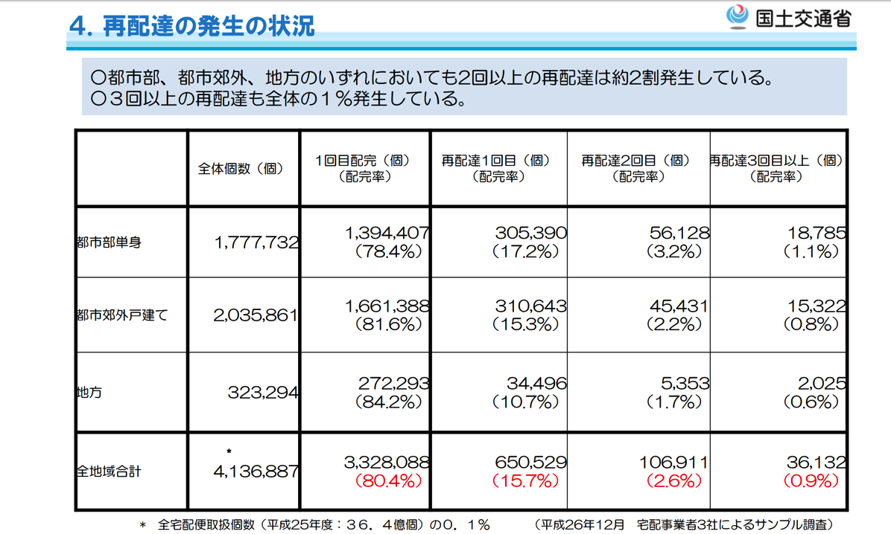
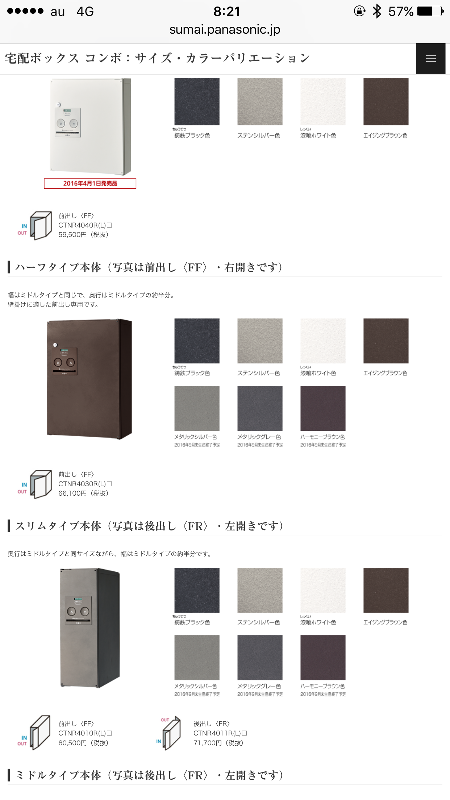

---
categories:
- ブログ
date: Tue, 28 Feb 2017 22:11:58 +0000
slug: post-10326
tags:
- ブログ
title: ヤマトさんがたいへん！ということでなんで大変なのか調べてみたら本当に大変そうだった
---

ヤマト運輸がAmazonなどのネット通販の普及により、慢性的な人手不足かつ長時間労働等で従業員の働く環境が悪化しているらしい。そこで、昼の時間帯の時間指定配送の取りやめを検討したり、労働組合側から荷受け量の制限が求められたりしているらしい。

参考：ヤマト運輸 人手不足で宅配サービスを抜本見直しへ（NHKニュース）

確かに、Amazonで注文したものはプライム対象商品だとその日に届いたりする。けど、ちょうど家にいなくて受け取れなかったりすると再配達になったりして、結局翌日受け取りになってたりするので、契約の関係で一生懸命運んでくれたのに、プライム会員からしてみたら注文したものが自動で最速受け取りになってるからあまりそのことを意識してなかったりする。

だからぼくは最近時間帯指定をして、なるべく再配達にならないようにしているんですが、それもそれでその時間帯に外出できなかったりして不便だったりする。

じゃあコンビニ受け取りにすればいいじゃないという意見もあると思うけど、それもそれで色々不便。サイズが大きいものだったら、取りに行って持って帰ってくるのも大変だし、何よりコンビニ側もスペース確保が大変だと思う。

そこで考えたんですが、宅配ボックスを設置すればいいんじゃね？

マンションとかだとすでに設置されているところもあったりするけど、おそらく設置されてないマンションや設置スペースがない住宅もあると思う。しかし、なるべく再配達を減らすなら宅配ボックスをヤマト自身が有料でレンタルするっていうサービスを始めたら売り上げもあがるし、囲い込みにもなるし、再配達抑制にもなっていいんじゃないのかしら。

実際実証実験も行われているみたいで宅配ボックスの設置により再配達が49%から8%に減少したらしい。

引用元：<a href="http://news.panasonic.com/jp/press/data/2017/02/jn170224-1/jn170224-1.html">福井県あわら市、パナソニック株式会社による
「宅配ボックス実証実験」中間報告</a><!--more--><h2>そもそも再配達ってどれくらい発生してるのか？</h2>

じゃあ、どんくらいの割合で再配達が発生しているのかっていうことを見ていきたいんだけど、その前に世の中でどれくらいの荷物が配達されてるのかってのを調べてみてびっくり

国土交通省の発表によると2015年37億4,493万個の宅配便取扱個数があり、2014年に比べると1億3,439万個増加しているらしい。

億単位で増加してるっちゅうことで、ネット通販の普及がどれくらいすごいかってのがわかる。

グラフだとどれくらい増加してるか一目瞭然

引用元：<a href="http://www.mlit.go.jp/common/001139889.pdf">平成２７年度宅配便取扱実績関係資料（PDF形式）</a>

ちなみに割合でいうと27年度だけでみると、およそ半分くらいがヤマトさん
いやーそりゃ人でも足りなくなるだろうし、それによりさらに大変にもなりまさー

で、再配達の数だけどまたまた国土交通省の資料から

引用元：<a href="http://www.mlit.go.jp/common/001106424.pdf">国土交通省 第１回　宅配の再配達の削減に向けた受取方法の多様化の促進等に関する検討会について 【資料１】宅配の再配達の削減に向けた検討の進め方について（事務局）</a>

この資料作成当時の数字だけど、なんと15%が再配達ということらしい。個人的には思ったより少ない印象だけど、配達数が増えている中での割合だとすると相当数にあたいするのでしょう。

そりゃ、単身者だったら日中家にいないだろうから受け取れないのはわかる。それと共働きの世帯も増えていることを考えると、今後この割合はどんどん高くなっていくことが考えられる。

この資料の続きには再配達抑制のための取り組みが書かれてて、コンビニ受け取りの施策やマンションの配達ロッカーによる抑止効果についても言及されている。

あと、以前他のニュースで駅構内への配達ロッカーの設置の実証実験についても報道されてたっけ。

<h2>配達ボックスの仕組み</h2>

各社の取り組みや数字はわかった。じゃ再配達抑止に効果的とされる配達ボックスってなんなのよってことで詳しく調べてみました。

マンションなどに設置されているタイプで古い型のものだとこんな感じ

<ul>
<li>運送会社が荷物を入れる</li>
<li>ボックス内に印鑑が置かれている場合はそれで捺印</li>
<li>ボックスをしめて暗証番号を不在票に記載し郵便受けに不在票を投函</li>
<li>受取をする人は不在票に記載された暗証番号を元にボックスを開けて受取</li>
</ul>

ただし、この古いタイプだと郵便受けから暗証番号を抜き取られて荷物が盗まれるような事があったみたいで、使用を規制している運送会社もあるみたいです。他にもカードキーで開閉するタイプ等もあり、最近ではセキュリティ面の向上が図られているみたいです。

また、印鑑なんか他人がほいほい押せるような所に置いておいていーんかい？と思ったら、なんとボックス内にシャチハタを設置して外から伝票を差し入れて押印する仕様のものもあるみたいです。すごーい

<h2>宅配ボックスの相場は5000円〜50000円以上</h2>

で、一戸建て向けのものだと後から設置するのが一般的だと思います。個人で設置できる宅配ボックスの値段をざっと調べてみました。

安いもので5000円とか7000円くらいみたいです。
ただ、それだとご覧の通り盗難される恐れがめちゃくちゃありそう。ワイヤーで取り付けられてるけど、切れないわけではないし、鋭利な刃物で本体を切られる可能性がないとも言えなさそう。

<iframe style="width:120px;height:240px;" marginwidth="0" marginheight="0" scrolling="no" frameborder="0" src="https://rcm-fe.amazon-adsystem.com/e/cm?ref=qf_sp_asin_til&t=warawareotoko-22&m=amazon&o=9&p=8&l=as1&IS2=1&detail=1&asins=B00U87R7WY&linkId=7b7c6ca22e790af1948a958949205987&bc1=FFFFFF&lt1=_blank&fc1=333333&lc1=0066C0&bg1=FFFFFF&f=ifr">
    </iframe>

<iframe style="width:120px;height:240px;" marginwidth="0" marginheight="0" scrolling="no" frameborder="0" src="https://rcm-fe.amazon-adsystem.com/e/cm?ref=qf_sp_asin_til&t=warawareotoko-22&m=amazon&o=9&p=8&l=as1&IS2=1&detail=1&asins=B01D0S7Q7S&linkId=7a53485f6ac1fc09edda28320b804c27&bc1=ffffff&lt1=_blank&fc1=333333&lc1=0066c0&bg1=ffffff&f=ifr">
    </iframe>

なのでやはりこれくらい堅牢なものがいいかと。ただし値段がめちゃくちゃ高い。5万前後はする。

<h2>そこで提案というかお願い</h2>

とりあえず15%の再配達をどうにかしなくちゃということと、宅配ボックスが効果があるという数字がでてるのなら宅配ボックスレンタルサービスをヤマトさんがやったらいいんじゃないかと思ったり。

もちろん有料で。月額500円〜1000円くらいなら払ってもいい。払いたくない人はコンビニとかで受け取ればいいし。だいたいAmazonで注文してるヘビーユーザーは1人で毎日注文しまくってるんだから、受け取れないのでストレスたまってる人は払うんじゃないかと。安易ですが。

あとは今後宅配ボックスを戸建てでも標準でつけるのが多くなったり。そのへんハウスメーカーも工夫すればよい。というかヤマトさんから働きかけてもいいのでは。

あと労働組合も総量規制とかいう前に新たなビジネスの提案とかはしないのかしら。してるのかもだけど。

人ごとだから勝手言ってますがすいません。なるべくぼくも時間帯指定とかコンビニ受取とか利用しますわ。

あとは受取を会社にして席までもってきてもらったりはしてるけど。

<h2>しんぺーはこう思った。</h2>

ヤマトさん！ぼくらのヤマトさん！がんばれ！あなたが倒れたらもう国内には赤帽しかのこってないぞ！

といったところで本日は以上です。おやすみなさい。
そして、また明日。