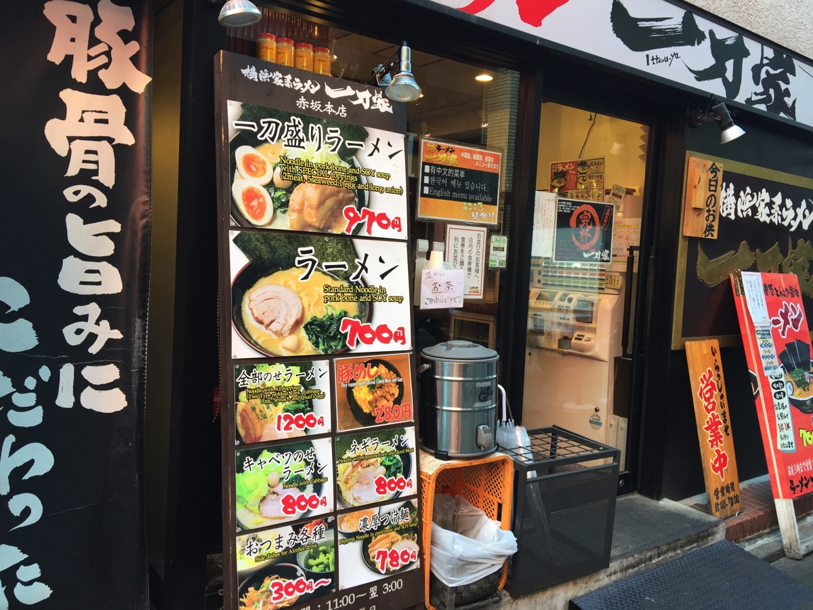
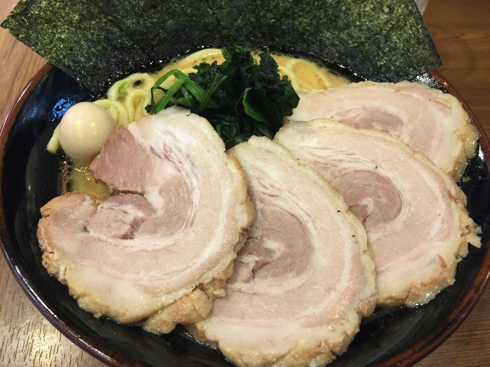
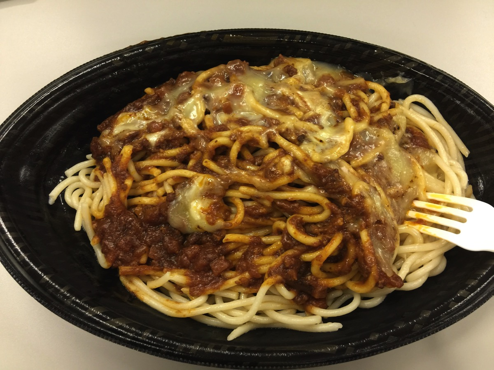
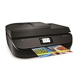
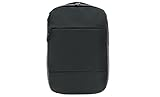
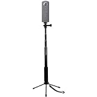
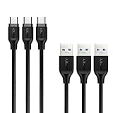
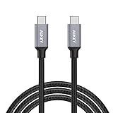

---
categories:
- ブログ
date: Sat, 04 Mar 2017 14:59:42 +0000
slug: post-10339
tags:
- ブログ
title: 2017年2月版「行った！見た！買った！」
---

毎月月末付近か翌月頭にやっていこうと思います。その月に食べに行った飲食店、Youtubeで見た動画、買ったものをご紹介です。

ただし、あくまで体験談で、よかった！おすすめ！というものではありません。ただの感想です。月次の自分の行動まとめみたいな感覚ですね。ということでいってみましょう。

それと2月はとくに目新しい動画はありませんでした。<!--more--><h2>2月行った店</h2>

2月はあまり新規開拓できませんでした。

<h3>横浜家系ラーメン一刀家</h3>

LIVEで赤坂に行った際にいきました。久しぶりにこってりの家系カーメンを食べました。チャーシューもぼく好みでとても美味しかったです。

<strong><a href="https://tabelog.com/tokyo/A1308/A130801/13159359/" target="_blank">横浜家系ラーメン一刀家</a></strong>

<strong>関連ランキング：</strong><a href="https://tabelog.com/rstLst/ramen/">ラーメン</a> | <a href="https://tabelog.com/tokyo/A1308/A130801/R113/rstLst/">赤坂駅</a>、<a href="https://tabelog.com/tokyo/A1308/A130801/R117/rstLst/">赤坂見附駅</a>、<a href="https://tabelog.com/tokyo/A1308/A130802/R6102/rstLst/">溜池山王駅</a>

<h3>俺たちのナポリタン</h3>

行ったわけではなくUBER EATSで新しく追加されたお店だったので注文してみました。
太麺に濃厚なソースが絡んでいてなかなか美味しかったです。

ナポリタンの店なのにミートソースのチーズトッピングで注文しました。でも美味しかったです。

<strong><a href="https://tabelog.com/tokyo/A1309/A130902/13168732/" target="_blank">俺たちのナポリタン</a></strong>

<strong>関連ランキング：</strong><a href="https://tabelog.com/rstLst/pasta/">パスタ</a> | <a href="https://tabelog.com/tokyo/A1309/A130902/R10511/rstLst/">四ツ谷駅</a>、<a href="https://tabelog.com/tokyo/A1309/A130903/R10514/rstLst/">四谷三丁目駅</a>、<a href="https://tabelog.com/tokyo/A1309/A130903/R192/rstLst/">曙橋駅</a>

<h2>2月買ったもの</h2>

何気に買いまくってた。。。3月に支払いがやばいかも。。でもどれも買ってよかったものばかり！失敗したものはほぼなしだったと思う！どれも必要なものばかりでした。

中でもリュックとプリンター

リュックは全く同じものを数年前に購入していました。古くなって壊れてきたので新しく購入しましたが、やはりいいものです！

あとプリンターは確定申告以外にもスキャンしたりとかで大活躍中。もっと早く買っておけばよかった。

<a href="http://www.amazon.co.jp/exec/obidos/ASIN/B0179MK6IW/warawareotoko-22/" target="_blank" >HP プリンター インクジェット 複合機 Officejet 4650 F1H96A#ABJ</a>
posted with <a href="http://kaereba.com" rel="nofollow" target="_blank">カエレバ</a>

 ヒューレット・パッカード 2015-11-13    

<a href="http://www.amazon.co.jp/gp/search?keywords=B0179MK6IW&__mk_ja_JP=%E3%82%AB%E3%82%BF%E3%82%AB%E3%83%8A&tag=warawareotoko-22" target="_blank" >Amazon</a>

<a href="https://hb.afl.rakuten.co.jp/hgc/0f6e221b.2eb9748a.0f6e221c.35cc1e84/?pc=http%3A%2F%2Fsearch.rakuten.co.jp%2Fsearch%2Fmall%2FB0179MK6IW%2F-%2Ff.1-p.1-s.1-sf.0-st.A-v.2%3Fx%3D0%26scid%3Daf_ich_link_urltxt%26m%3Dhttp%3A%2F%2Fm.rakuten.co.jp%2F" target="_blank" >楽天市場</a>

<a href="//ck.jp.ap.valuecommerce.com/servlet/referral?sid=3041033&pid=882528283&vc_url=http%3A%2F%2Fsearch.shopping.yahoo.co.jp%2Fsearch%3Fp%3DB0179MK6IW&vcptn=kaereba" target="_blank" >Yahooショッピング</a>

<a href="http://www.amazon.co.jp/exec/obidos/ASIN/B019MGGD7Q/warawareotoko-22/" target="_blank" >[インケース] INCASE CITY COLLECTION COMPACT BACKPACK バックパック CL55452 [並行輸入品]</a>
posted with <a href="http://kaereba.com" rel="nofollow" target="_blank">カエレバ</a>

<a href="http://www.amazon.co.jp/gp/search?keywords=CL55452&__mk_ja_JP=%E3%82%AB%E3%82%BF%E3%82%AB%E3%83%8A&tag=warawareotoko-22" target="_blank" >Amazon</a>

<a href="https://hb.afl.rakuten.co.jp/hgc/0f6e221b.2eb9748a.0f6e221c.35cc1e84/?pc=http%3A%2F%2Fsearch.rakuten.co.jp%2Fsearch%2Fmall%2FCL55452%2F-%2Ff.1-p.1-s.1-sf.0-st.A-v.2%3Fx%3D0%26scid%3Daf_ich_link_urltxt%26m%3Dhttp%3A%2F%2Fm.rakuten.co.jp%2F" target="_blank" >楽天市場</a>

<a href="//ck.jp.ap.valuecommerce.com/servlet/referral?sid=3041033&pid=882528283&vc_url=http%3A%2F%2Fsearch.shopping.yahoo.co.jp%2Fsearch%3Fp%3DCL55452&vcptn=kaereba" target="_blank" >Yahooショッピング</a>

theta用の自撮り棒。4月の沖縄遠征の時に何かで使う予定。

<a href="http://www.amazon.co.jp/exec/obidos/ASIN/B01LSD9SY6/warawareotoko-22/" target="_blank" >MyArmor 自撮り棒 （30～93cm） 一脚 アルミ合金製 iPhone/Gopro/カメラ/スマートフォン用 軽量・頑丈 伸縮自在 セルカ棒 四段 延長 ポール カメラスタンド 防水仕様（金属製折り畳み式三脚付き）</a>
posted with <a href="http://kaereba.com" rel="nofollow" target="_blank">カエレバ</a>

 MyArmor     

<a href="http://www.amazon.co.jp/gp/search?keywords=MyArmor%20%E8%87%AA%E6%92%AE%E3%82%8A%E6%A3%92&__mk_ja_JP=%E3%82%AB%E3%82%BF%E3%82%AB%E3%83%8A&tag=warawareotoko-22" target="_blank" >Amazon</a>

<a href="https://hb.afl.rakuten.co.jp/hgc/0f6e221b.2eb9748a.0f6e221c.35cc1e84/?pc=http%3A%2F%2Fsearch.rakuten.co.jp%2Fsearch%2Fmall%2FMyArmor%2520%25E8%2587%25AA%25E6%2592%25AE%25E3%2582%258A%25E6%25A3%2592%2F-%2Ff.1-p.1-s.1-sf.0-st.A-v.2%3Fx%3D0%26scid%3Daf_ich_link_urltxt%26m%3Dhttp%3A%2F%2Fm.rakuten.co.jp%2F" target="_blank" >楽天市場</a>

<a href="//ck.jp.ap.valuecommerce.com/servlet/referral?sid=3041033&pid=882528283&vc_url=http%3A%2F%2Fsearch.shopping.yahoo.co.jp%2Fsearch%3Fp%3DMyArmor%2520%25E8%2587%25AA%25E6%2592%25AE%25E3%2582%258A%25E6%25A3%2592&vcptn=kaereba" target="_blank" >Yahooショッピング</a>

今使ってるMac　Book Proの唯一の良いところ、それはiPhone充電で使うようなバッテリーで充電できちゃうところ。なのでUSBとUSB-Cタイプを購入

<a href="http://www.amazon.co.jp/exec/obidos/ASIN/B01CXNYY8A/warawareotoko-22/" target="_blank" >AUKEY USB C USB 3.0 ケーブル (1m*3本) Type C 機器対応 56Kレジスタ使用 高速データ転送 新しいMacBook Pro/MacBook/Nexus 5X/ChromeBook Pixel 他対応 CB-CMD3</a>
posted with <a href="http://kaereba.com" rel="nofollow" target="_blank">カエレバ</a>

 AUKEY（オーキー）     

<a href="http://www.amazon.co.jp/gp/search?keywords=B01CXNYY8A&__mk_ja_JP=%E3%82%AB%E3%82%BF%E3%82%AB%E3%83%8A&tag=warawareotoko-22" target="_blank" >Amazon</a>

<a href="https://hb.afl.rakuten.co.jp/hgc/0f6e221b.2eb9748a.0f6e221c.35cc1e84/?pc=http%3A%2F%2Fsearch.rakuten.co.jp%2Fsearch%2Fmall%2FB01CXNYY8A%2F-%2Ff.1-p.1-s.1-sf.0-st.A-v.2%3Fx%3D0%26scid%3Daf_ich_link_urltxt%26m%3Dhttp%3A%2F%2Fm.rakuten.co.jp%2F" target="_blank" >楽天市場</a>

<a href="//ck.jp.ap.valuecommerce.com/servlet/referral?sid=3041033&pid=882528283&vc_url=http%3A%2F%2Fsearch.shopping.yahoo.co.jp%2Fsearch%3Fp%3DB01CXNYY8A&vcptn=kaereba" target="_blank" >Yahooショッピング</a>

<a href="http://www.amazon.co.jp/exec/obidos/ASIN/B01DF5LV9A/warawareotoko-22/" target="_blank" >AUKEY USB C to USB Cケーブル USB2.0 (1m) Type-C 機器対応 ナイロン編み Quick Charge 3.0 超急速充電 最大3A給電 新しいMacBook Pro、MacBook、Nexus 6P、Nexus 5Xなどに対応 CB-CD5</a>
posted with <a href="http://kaereba.com" rel="nofollow" target="_blank">カエレバ</a>

 AUKEY（オーキー）     

<a href="http://www.amazon.co.jp/gp/search?keywords=B01DF5LV9A&__mk_ja_JP=%E3%82%AB%E3%82%BF%E3%82%AB%E3%83%8A&tag=warawareotoko-22" target="_blank" >Amazon</a>

<a href="https://hb.afl.rakuten.co.jp/hgc/0f6e221b.2eb9748a.0f6e221c.35cc1e84/?pc=http%3A%2F%2Fsearch.rakuten.co.jp%2Fsearch%2Fmall%2FB01DF5LV9A%2F-%2Ff.1-p.1-s.1-sf.0-st.A-v.2%3Fx%3D0%26scid%3Daf_ich_link_urltxt%26m%3Dhttp%3A%2F%2Fm.rakuten.co.jp%2F" target="_blank" >楽天市場</a>

<a href="//ck.jp.ap.valuecommerce.com/servlet/referral?sid=3041033&pid=882528283&vc_url=http%3A%2F%2Fsearch.shopping.yahoo.co.jp%2Fsearch%3Fp%3DB01DF5LV9A&vcptn=kaereba" target="_blank" >Yahooショッピング</a>

<h2>しんぺーはこう思った。</h2>

2月は仕事が割と忙しかった。。。体調も崩したし。。。毎日続けてきたブログ更新もできなかった日があったし

たぶんそういう時ってAmazonでポチる頻度が高い気がします。気をつけよう。。。

と言ったところで本日は以上になります。  おやすみなさい。
そして、また明日。