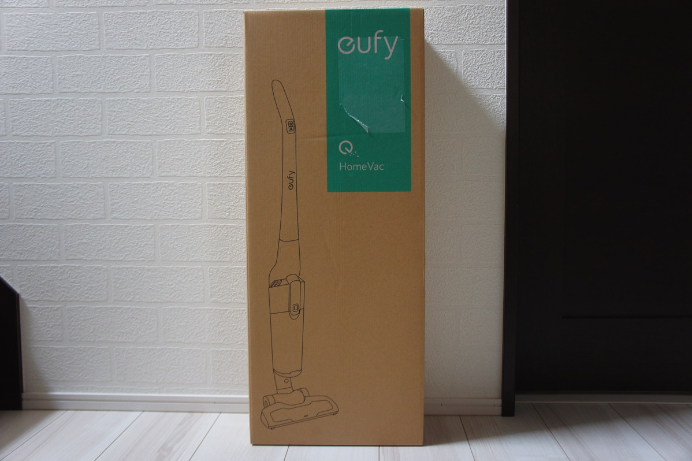
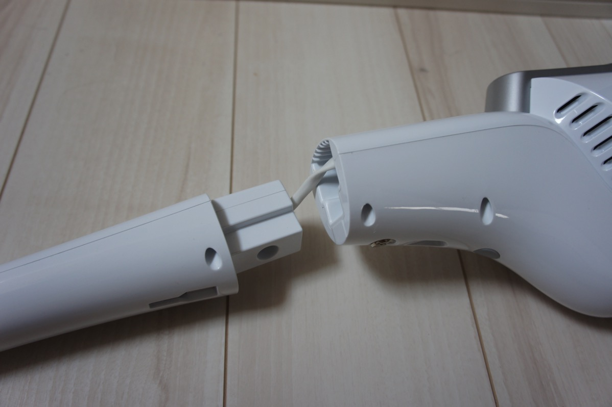
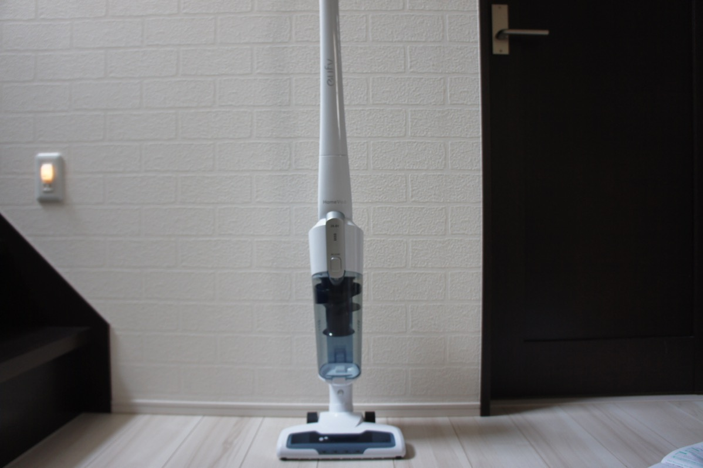
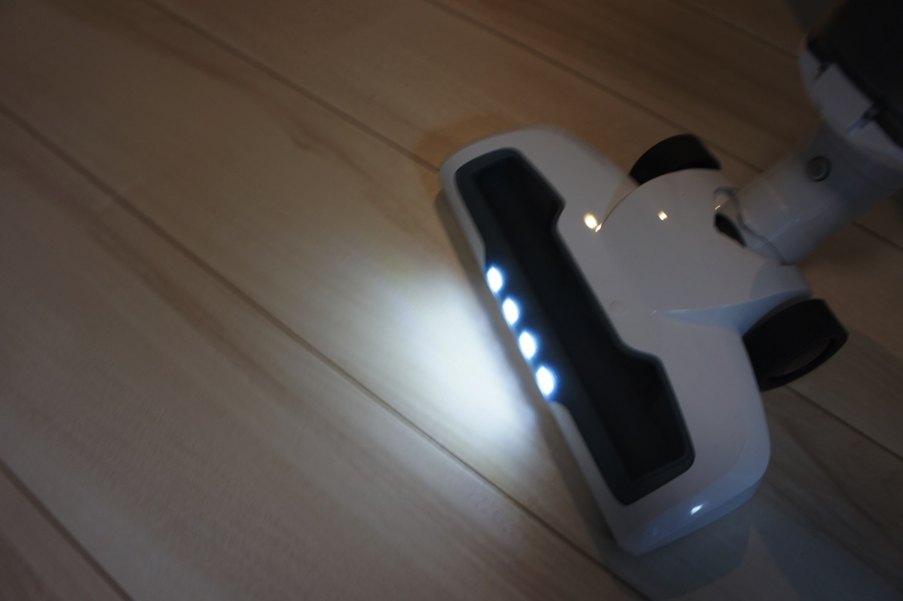
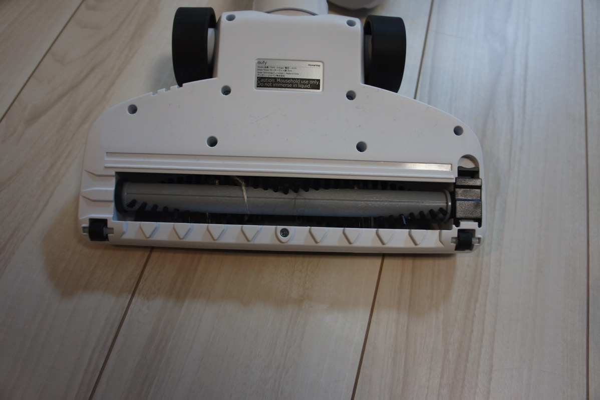
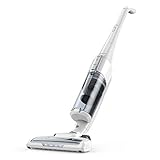

---
categories:
- レビュー
date: Sun, 05 Mar 2017 08:37:01 +0000
slug: post-10348
tags:
- Anker
title: コードレスだけど吸引力が強いサイクロン掃除機eufyの「HomeVac」
---

普段使っていた激安掃除機の性能がなんとなく落ちてきて、吸い込みが悪くなってきたので新しい掃除機を買いました。吸引力が強くなかなか使い勝手もよかったので本日はそのご紹介です。<!--more--><h2>コードレスだけど吸引力が強い</h2>

こちらのeufyというブランドはスマホのモバイルバッテリーで有名なANKERの家電ブランドです。そのためバッテリー性能にはある程度期待ができるはず！

梱包はこんな感じ。縦長のスティックタイプ掃除機なので組み立て式となっております。

接合部分はこんな感じで、そのまま押し込んでネジで止める形になっています。

組み立てるとこんな感じ

そして、掃除機のヘッド部分はゴミを照らせるようにLEDライトが取り付けられています。この機能がついている掃除機を初めて使いましたが、ゴミがあるのかないのかがはっきりわかって、とても便利です。

裏返すとゴミを巻き込むブラシがついています。掃除機起動中はこのブラシが高速回転して、ほとんど何もしなくても勝手に前に進んでくれます。

ちょっと使ってみた印象ですが、かなり吸引力が強いということ

ただ、ちょっとここが難点というのがいくつかありました。

あと、フィルター部品とかは水洗いできるとのことで、かなり便利だと思います。

<h2>改良点</h2>

まずサイクロン掃除機なのでしようがない部分かもしれませんが、ヘッドが大きくごついため、<strong>狭いスペースを掃除しきれない</strong>場合があります。

バッテリー容量は2200mAhで22分使用可能なようです。エコモードで50分くらい。

んー個人的には20分ってのが気になります。微妙に短い。しかも充電がなくなっても電源ケーブルがあるわけじゃないから、充電が終わるまで掃除の続きができないわけ。これコードレス掃除機の宿命なんだろうけど。ただ、ダイソンとかも大体それくらいのバッテリー容量なのでこの製品が別段劣っているというわけではない。ただ、単純にコードレスの弱点だと思います。

まぁせっかくANKERのブランドなんだからもっと使用時間を伸ばせてもいいなって単純に思いました。

<h2>しんぺーはこう思った。</h2>

届いてからいきなり使ったので、途切れ途切れで充電してました。それがけっこうストレスなんですが、それでも少し充電しただけで思ったり長い時間使えるので、まぁさすがANKERといったところでしょうか。

とりあえず、でも今後に期待！

と言ったところで本日は以上になります。  おやすみなさい。

<a href="http://www.amazon.co.jp/exec/obidos/ASIN/B01M7PMEY1/warawareotoko-22/" target="_blank" >eufy HomeVac (軽量コードレス掃除機)【最大50分間稼働 / サイクロンシステム / 大容量ダストホルダー】</a>
posted with <a href="http://kaereba.com" rel="nofollow" target="_blank">カエレバ</a>

 Anker     

<a href="http://www.amazon.co.jp/gp/search?keywords=%20eufy%20HomeVac&__mk_ja_JP=%E3%82%AB%E3%82%BF%E3%82%AB%E3%83%8A&tag=warawareotoko-22" target="_blank" >Amazon</a>

<a href="https://hb.afl.rakuten.co.jp/hgc/0f6e221b.2eb9748a.0f6e221c.35cc1e84/?pc=http%3A%2F%2Fsearch.rakuten.co.jp%2Fsearch%2Fmall%2F%2520eufy%2520HomeVac%2F-%2Ff.1-p.1-s.1-sf.0-st.A-v.2%3Fx%3D0%26scid%3Daf_ich_link_urltxt%26m%3Dhttp%3A%2F%2Fm.rakuten.co.jp%2F" target="_blank" >楽天市場</a>

<a href="//ck.jp.ap.valuecommerce.com/servlet/referral?sid=3041033&pid=882528283&vc_url=http%3A%2F%2Fsearch.shopping.yahoo.co.jp%2Fsearch%3Fp%3D%2520eufy%2520HomeVac&vcptn=kaereba" target="_blank" >Yahooショッピング</a>

