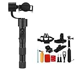
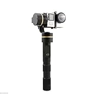
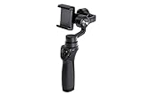
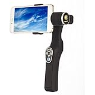

---
categories:
- レビュー
date: Mon, 06 Mar 2017 14:02:37 +0000
slug: post-10355
tags:
- ガジェット
title: 手ブレなしで撮影できるガジェット「ジンバル」が非常にきになる
---

ジンバルというものをご存知でしょうか？簡単にいうとカメラの手ぶれをなくすガジェットのことです。スタビライザーなんていう言い方もします。例えばこれにカメラやスマホ、Go Proなんかを設置して撮影すると歩いたり走ったりしてもまったく手ぶれしない動画を撮影することができるのです。ということで本日は今ぼくが一番気になっているガジェット「ジンバル」というものをご紹介いたします。<!--more--><h2>ジンバルで有名なメーカー3社</h2>

<iframe width="560" height="315" src="https://www.youtube.com/embed/OKHfR7-hpJc" frameborder="0" allowfullscreen></iframe>

もともとはケーシーおじさんのドリキンさんが使ってて知ったのですが、有名どころだと次の3社があるみたいです。

中国のZhiyunというメーカーです。

<a href="http://www.amazon.co.jp/exec/obidos/ASIN/B01AHXKOP0/warawareotoko-22/" target="_blank" >ZHIYUN　Z1-Smooth-C【新型】3軸手持ちジンバル　iPhone 5/ 5s/ 6 /6 Plus Galaxy Note3/4/5 等機種対応　7inch以内携帯用+ Andoer アルミ合金製 手持ち式 最大伸縮94cm 自撮り棒+Andoer 8in1 アクセサリーセット</a>
posted with <a href="http://kaereba.com" rel="nofollow" target="_blank">カエレバ</a>

 ZHIYUN     

<a href="http://www.amazon.co.jp/gp/search?keywords=B01AHXKOP0&__mk_ja_JP=%E3%82%AB%E3%82%BF%E3%82%AB%E3%83%8A&tag=warawareotoko-22" target="_blank" >Amazon</a>

<a href="https://hb.afl.rakuten.co.jp/hgc/0f6e221b.2eb9748a.0f6e221c.35cc1e84/?pc=http%3A%2F%2Fsearch.rakuten.co.jp%2Fsearch%2Fmall%2FB01AHXKOP0%2F-%2Ff.1-p.1-s.1-sf.0-st.A-v.2%3Fx%3D0%26scid%3Daf_ich_link_urltxt%26m%3Dhttp%3A%2F%2Fm.rakuten.co.jp%2F" target="_blank" >楽天市場</a>

<a href="//ck.jp.ap.valuecommerce.com/servlet/referral?sid=3041033&pid=882528283&vc_url=http%3A%2F%2Fsearch.shopping.yahoo.co.jp%2Fsearch%3Fp%3DB01AHXKOP0&vcptn=kaereba" target="_blank" >Yahooショッピング</a>

これも同じく中国のFeiyuというメーカー。Zhiyunに比べると値段が少し安い気がします。どっちがいいのかはイマイチわかりません。

<a href="http://www.amazon.co.jp/exec/obidos/ASIN/B00S5TWUPG/warawareotoko-22/" target="_blank" >FEIYU G4 3軸手持ちジンバル GOPRO3 3+ 4用 FY-G4 3-Axis Handheld Steady Gimbal (ゴールド)</a>
posted with <a href="http://kaereba.com" rel="nofollow" target="_blank">カエレバ</a>

 FEIYU     

<a href="http://www.amazon.co.jp/gp/search?keywords=B00S5TWUPG&__mk_ja_JP=%E3%82%AB%E3%82%BF%E3%82%AB%E3%83%8A&tag=warawareotoko-22" target="_blank" >Amazon</a>

<a href="https://hb.afl.rakuten.co.jp/hgc/0f6e221b.2eb9748a.0f6e221c.35cc1e84/?pc=http%3A%2F%2Fsearch.rakuten.co.jp%2Fsearch%2Fmall%2FB00S5TWUPG%2F-%2Ff.1-p.1-s.1-sf.0-st.A-v.2%3Fx%3D0%26scid%3Daf_ich_link_urltxt%26m%3Dhttp%3A%2F%2Fm.rakuten.co.jp%2F" target="_blank" >楽天市場</a>

<a href="//ck.jp.ap.valuecommerce.com/servlet/referral?sid=3041033&pid=882528283&vc_url=http%3A%2F%2Fsearch.shopping.yahoo.co.jp%2Fsearch%3Fp%3DB00S5TWUPG&vcptn=kaereba" target="_blank" >Yahooショッピング</a>

ドローンで有名なアメリカのメーカーDJIの製品。これもこれで高い。

<a href="http://www.amazon.co.jp/exec/obidos/ASIN/B01KUX9VT2/warawareotoko-22/" target="_blank" >【国内正規品】 DJI OSMO Mobile (3軸手持ちジンバル)</a>
posted with <a href="http://kaereba.com" rel="nofollow" target="_blank">カエレバ</a>

 DJI     

<a href="http://www.amazon.co.jp/gp/search?keywords=DJI%20OSMO%20Mobile&__mk_ja_JP=%E3%82%AB%E3%82%BF%E3%82%AB%E3%83%8A&tag=warawareotoko-22" target="_blank" >Amazon</a>

<a href="https://hb.afl.rakuten.co.jp/hgc/0f6e221b.2eb9748a.0f6e221c.35cc1e84/?pc=http%3A%2F%2Fsearch.rakuten.co.jp%2Fsearch%2Fmall%2FDJI%2520OSMO%2520Mobile%2F-%2Ff.1-p.1-s.1-sf.0-st.A-v.2%3Fx%3D0%26scid%3Daf_ich_link_urltxt%26m%3Dhttp%3A%2F%2Fm.rakuten.co.jp%2F" target="_blank" >楽天市場</a>

<a href="//ck.jp.ap.valuecommerce.com/servlet/referral?sid=3041033&pid=882528283&vc_url=http%3A%2F%2Fsearch.shopping.yahoo.co.jp%2Fsearch%3Fp%3DDJI%2520OSMO%2520Mobile&vcptn=kaereba" target="_blank" >Yahooショッピング</a>

<h2>vlogとか動画撮影に使いたいいい</h2>

沖縄遠征の時のために欲しかったり、あとはケーシーおじさんドリキンさんみたいに、リュックにくっつけて日常のログとして使いたい。

ただ、ちょっと高価なんですよね。いいカメラ持ってるわけじゃないし。あと上に載っけたジンバルはどれも3軸の製品。3点で水平を保っているため、かなりの安定感があります。ただそれも30000円オーバー

おそらくぼくは2軸のちょっと安めのものを買うことになりそう。しかも上のどのメーカーでもないよくわからないところのを買っちゃうと思います。例えばこんなの

<a href="http://www.amazon.co.jp/exec/obidos/ASIN/B01I9CM4FE/warawareotoko-22/" target="_blank" >TARION スマホ用 手持ち ジンバル スタビライザー ハンドルグリップ Bluetooth 手振れ防止 撮影安定化 handheld Gimbal 5.5インチ以内のスマートフォン対応 日本語取扱説明書（PDF）送信可</a>
posted with <a href="http://kaereba.com" rel="nofollow" target="_blank">カエレバ</a>

 TARION     

<a href="http://www.amazon.co.jp/gp/search?keywords=B01I9CM4FE&__mk_ja_JP=%E3%82%AB%E3%82%BF%E3%82%AB%E3%83%8A&tag=warawareotoko-22" target="_blank" >Amazon</a>

<a href="https://hb.afl.rakuten.co.jp/hgc/0f6e221b.2eb9748a.0f6e221c.35cc1e84/?pc=http%3A%2F%2Fsearch.rakuten.co.jp%2Fsearch%2Fmall%2FB01I9CM4FE%2F-%2Ff.1-p.1-s.1-sf.0-st.A-v.2%3Fx%3D0%26scid%3Daf_ich_link_urltxt%26m%3Dhttp%3A%2F%2Fm.rakuten.co.jp%2F" target="_blank" >楽天市場</a>

<a href="//ck.jp.ap.valuecommerce.com/servlet/referral?sid=3041033&pid=882528283&vc_url=http%3A%2F%2Fsearch.shopping.yahoo.co.jp%2Fsearch%3Fp%3DB01I9CM4FE&vcptn=kaereba" target="_blank" >Yahooショッピング</a>

<h2>しんぺーはこう思った。</h2>

３月はすでに掃除機買っちゃったし、来月は沖縄遠征控えてるからなるべく散財したくないんだけどな・・・

Androgynosのチケ代も確保しておかなければいけないし。。。

非常に悩みどころです。

安いのを買うかもと言いましたが、そんなの買うくらいならちゃんとしたのを買った方がいい気もするし、、

悩みどころ

と言ったところで本日は以上になります。  おやすみなさい。