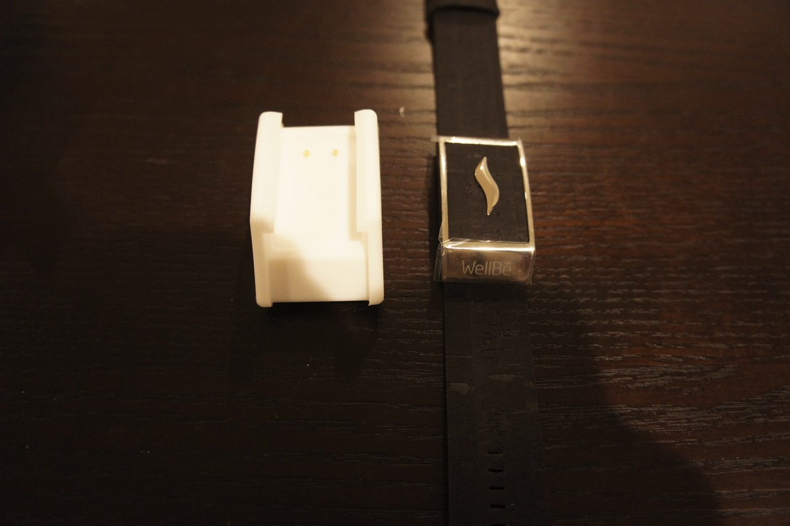
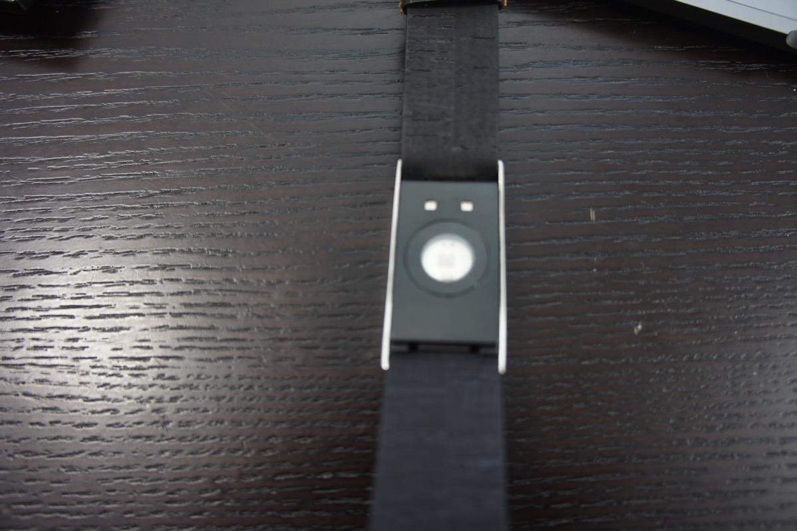

---
categories:
- レビュー
date: Fri, 10 Mar 2017 15:01:06 +0000
slug: post-10408
tags:
- ガジェット
title: indeagogoで出資した「the wellbe」が届いた！これでストレス【レス】な日常が待ってるはず！
---

indeagogoというクラウドファンディングサイトにて出資を募っていたガジェットがようやく届きました。2年越しです。本日はおそらく日本最速レビューを行いたいと思います。<!--more--><h2>indeagogoとは？</h2>

kickstertarや日本だとcampfireといったクラウドファンディングが有名だと思います。それらと同様に出資を集めた側と出資したい側をマッチングさせるサイトです。

ガジェットや映画やその他のあらゆるものを作りたい人たちが出資を募っています。誰よりも早く最新のガジェットを手にいれたい人なんかはこういったサイトを利用して、商品として販売される前に手にいれたりすることが可能になっています。

で、今回ぼくはthe wellbeというガジェットを手にいれました。出資したのは2年ほど前。なんでそんなに長くかかったのかというと、開発の進捗が芳しくなかったからです。

そう、クラウドファンディングで注意しなければいけないのは、実際にものが届かないことがあるということです。開発の頓挫や思わぬトラブルで開発者が失踪したりということもあり得ます。

と、いうことでほぼ博打みたいな感じですが、今回はどうにか手元に届きました。ながかった〜

<h2>the wellbeとは？</h2>

こちらの記事でもご紹介しましたが、ウェアラブルタイプのストレス計測系です。

心拍などを計測し、自分がストレスを感じた時間や場所を記録してくれます。また、場合によってはストレスを発散させるために、アラートを出してくれたりするそうです。

これを使ってストレスがない社会を作りたいらしいです。

参考：<a href="https://www.warawareotoko.com/2017/02/14/post-10274/">みんな心に宿る怒りをどう処理してるの？the wellbe</a>

で、実際に届いたものですが、こんな感じ。思っていた以上に小さいね。

充電しながらアプリでペアリングを開始します。すると5分くらいでペアリング完了。

基本的にwellbeの方では計測のみを行い、アプリ側で分析や諸々の表現を行うようです。
本体の裏側から緑色の透過ライトが出て心拍数を計測します。その際の場所と時間を記録してアプリ側に送信します。で最終的に1日が終わった時点で何時に一番ストレスが高かったかをグラフで表示してくれます。

また、それ以外にも数々のストレスを和らげる方法がまとめてあります。たとえば深呼吸とか

<h2>しんぺーはこう思った。</h2>

今のところアプリが英語のみなので、なかなか使いづらいかも

と言ったところで本日は以上になります。  おやすみなさい。

そして、また明日。