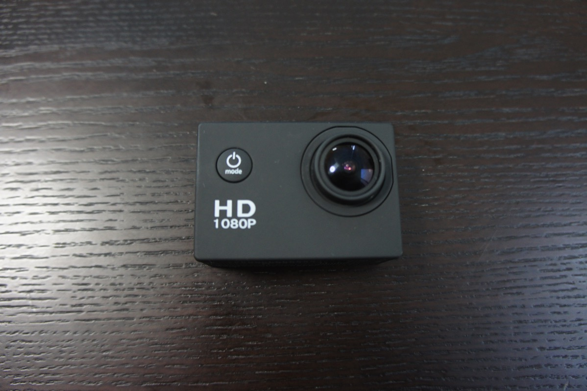
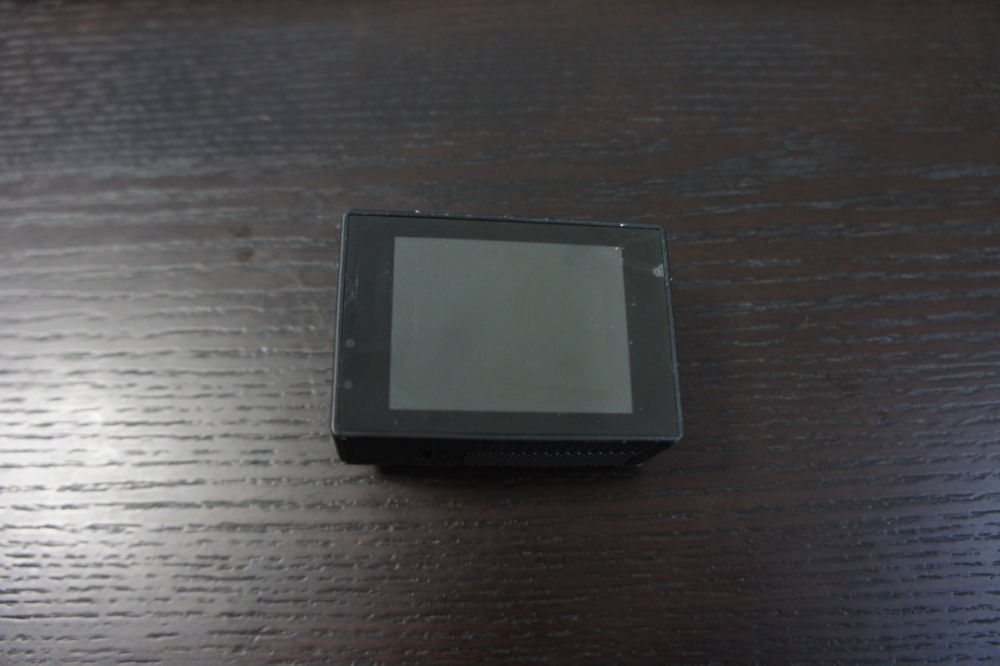
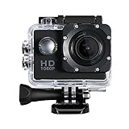

---
categories:
- レビュー
date: Sat, 11 Mar 2017 14:57:54 +0000
slug: post-10415
tags:
- ガジェット
title: 中華製アクションカム買ったら手ブレがひどすぎて使えるもんじゃなかった
---

Go Proが欲しかったんですが、高いので中華製の驚くほどやっすいアクションカムを買って使っています。が、今日歩きながら撮影したら手ブレがひどすぎてまるで使えないということが発覚しました。<!--more-->ぼくが購入したのはこちらのカメラ

Go Proが4、5万するのに対し、こちらは10分の1の値段。でも、性能はそこそこよくて、動画も綺麗に撮ることができます。

ただし、アクションカムとして致命的だと思うのが、手ブレが酷すぎること。まったく補正してくれない。ゴリラポッドつけてても同じく。

静止してタイムラプスとかには向いてるかもしれないけど、ちょっと歩きながらの撮影には向いてないかなぁ

もしかしたらGo Proでも同様なのかもしれないけど、とりあえず手ブレと画像ブレというか画像そのものの残像もひどい。繰り返しますが固定しての撮影はなかなか綺麗なのでジンバルとかつけたらそれなりのものが撮影できえると思われます。

あとは値段が何よりも激安なのでそれはそれでいいかなと

<h2>しんぺーはこう思った。</h2>

やはりジンバルの導入は待った無しか。。。

と言ったところで本日は以上になります。  おやすみなさい。
そして、また明日。

<a href="http://www.amazon.co.jp/exec/obidos/ASIN/B01E8VAPYM/warawareotoko-22/" target="_blank" >Qtuo アクションカメラ スポーツカメラ 水中撮影 30M防水 12MP 1080P フルHDカム 超広角レンズ付き 複数アクセサリー付き 自転車/オートバイ/ダイビング/水泳/スキー 対応 ブラック</a>
posted with <a href="http://kaereba.com" rel="nofollow" target="_blank">カエレバ</a>

 Qtuo     

<a href="http://www.amazon.co.jp/gp/search?keywords=B01E8VAPYM&__mk_ja_JP=%E3%82%AB%E3%82%BF%E3%82%AB%E3%83%8A&tag=warawareotoko-22" target="_blank" >Amazon</a>

<a href="https://hb.afl.rakuten.co.jp/hgc/0f6e221b.2eb9748a.0f6e221c.35cc1e84/?pc=http%3A%2F%2Fsearch.rakuten.co.jp%2Fsearch%2Fmall%2FB01E8VAPYM%2F-%2Ff.1-p.1-s.1-sf.0-st.A-v.2%3Fx%3D0%26scid%3Daf_ich_link_urltxt%26m%3Dhttp%3A%2F%2Fm.rakuten.co.jp%2F" target="_blank" >楽天市場</a>

<a href="//ck.jp.ap.valuecommerce.com/servlet/referral?sid=3041033&pid=882528283&vc_url=http%3A%2F%2Fsearch.shopping.yahoo.co.jp%2Fsearch%3Fp%3DB01E8VAPYM&vcptn=kaereba" target="_blank" >Yahooショッピング</a>

