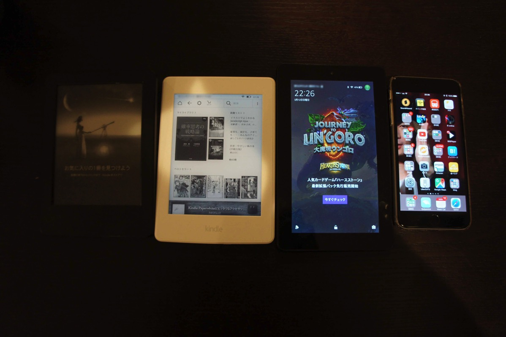
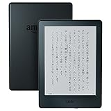
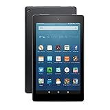
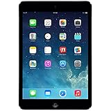
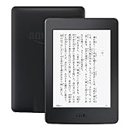
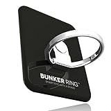

---
categories:
- レビュー
date: Sun, 12 Mar 2017 13:48:17 +0000
slug: post-10423
tags:
- ガジェット
- 比較してみた
title: 【kindle比較】電子書籍読むならkindle paper whiteがいいと思う。
---

本はもっぱらkindleで購入して、そのまま読まななんてことが往々にしてあるんですが、これじゃいかんと思って朝の通勤時に読もう読もうとしております。ただ、今iPhone6 plusのkindleアプリを使っているんですが、kindle用の書籍じゃないとかなりよみづらいんですよね。ということで、改めてkindleを使ってみたらめちゃくちゃ読みやすかったんで、改めて手持ちのkindle端末と過去に使ってきたものを比較してみたいと思います。<!--more-->

<strong>※比較対象の端末はどれも数年前に購入したものです。最新のものとはスペックが異なり、使用感が異なります。商品リンクは最新端末です。</strong>

<h2>kindle</h2>

ぼくが始めて買ったkidnleです。機能としてはkindle本を読むことができる！以上！
バックライトもないし、スムーズなページ送りができるわけでもない！初代ゲームボーイみたいな白黒の画面で文字を読むことになります。色的にジャンプとかの少年誌を読んでいる感覚に近いです。

ただ、その機能の薄さゆえものすごく気軽に読書ができます。めちゃくちゃ手荒に扱っても気になりません。

下手にカラーで映る端末だと画面割れを気にしてしまいどうしても丁寧に扱ってしましますが、そういった意味では紙の本に近いです。

なお、今手に入る端末は多少なりともアップデートされており、こちらに載っているものよりも少しパワーアップされていると思われます。

めちゃくちゃ気軽に本読みたい、多少読みにくくてもいいやってくらいの人はとりあえず持っておいて損はないと思う。

<a href="http://www.amazon.co.jp/exec/obidos/ASIN/B0186FESEE/warawareotoko-22/" target="_blank" >Kindle (Newモデル) Wi-Fi、ブラック、キャンペーン情報つきモデル、電子書籍リーダー</a>
posted with <a href="http://kaereba.com" rel="nofollow" target="_blank">カエレバ</a>

 Amazon 2016-07-20    

<a href="http://www.amazon.co.jp/gp/search?keywords=Kindle%20%28New%E3%83%A2%E3%83%87%E3%83%AB%29%20&__mk_ja_JP=%E3%82%AB%E3%82%BF%E3%82%AB%E3%83%8A&tag=warawareotoko-22" target="_blank" >Amazon</a>

<a href="https://hb.afl.rakuten.co.jp/hgc/0f6e221b.2eb9748a.0f6e221c.35cc1e84/?pc=http%3A%2F%2Fsearch.rakuten.co.jp%2Fsearch%2Fmall%2FKindle%2520%2528New%25E3%2583%25A2%25E3%2583%2587%25E3%2583%25AB%2529%2520%2F-%2Ff.1-p.1-s.1-sf.0-st.A-v.2%3Fx%3D0%26scid%3Daf_ich_link_urltxt%26m%3Dhttp%3A%2F%2Fm.rakuten.co.jp%2F" target="_blank" >楽天市場</a>

<a href="//ck.jp.ap.valuecommerce.com/servlet/referral?sid=3041033&pid=882528283&vc_url=http%3A%2F%2Fsearch.shopping.yahoo.co.jp%2Fsearch%3Fp%3DKindle%2520%2528New%25E3%2583%25A2%25E3%2583%2587%25E3%2583%25AB%2529%2520&vcptn=kaereba" target="_blank" >Yahooショッピング</a>

<h2>Fire HD</h2>

コスパ最強のエンタテイメント端末です。値段の割にあらゆる動画サイトやアプリが利用でき、さらにはkindle本がカラーで楽しめるという機能を持っています。

持っていて絶対損はしません！！が、ストレージが貧弱すぎる！！！
機能が豊富な分すぐにストレージがいっぱいになってしまいます。とくに動画をたくさんみようと思って、Amazonプライムビデオをダウンロードしようものなら漫画全巻なんか入れられるわけもなく、あっちを立てればこっちが立たず。

そのため、メモリーカードを購入して諸々のデータを外部保存しなければいけません。

ただ、なぜかぼくの場合購入したkindle本のデータがメモリーカードに移せず、漫画全巻をダウンロードしてスムーズに読むということができなかったので使うのやめちゃいました。

割と人を選ぶかも。漫画には向いていない気もします。

<a href="http://www.amazon.co.jp/exec/obidos/ASIN/B01AHBD6R0/warawareotoko-22/" target="_blank" >Fire HD 8 タブレット 16GB、ブラック</a>
posted with <a href="http://kaereba.com" rel="nofollow" target="_blank">カエレバ</a>

 Amazon 2016-09-21    

<a href="http://www.amazon.co.jp/gp/search?keywords=Fire%20HD%208%20%E3%82%BF%E3%83%96%E3%83%AC%E3%83%83%E3%83%88%2016GB&__mk_ja_JP=%E3%82%AB%E3%82%BF%E3%82%AB%E3%83%8A&tag=warawareotoko-22" target="_blank" >Amazon</a>

<a href="https://hb.afl.rakuten.co.jp/hgc/0f6e221b.2eb9748a.0f6e221c.35cc1e84/?pc=http%3A%2F%2Fsearch.rakuten.co.jp%2Fsearch%2Fmall%2FFire%2520HD%25208%2520%25E3%2582%25BF%25E3%2583%2596%25E3%2583%25AC%25E3%2583%2583%25E3%2583%2588%252016GB%2F-%2Ff.1-p.1-s.1-sf.0-st.A-v.2%3Fx%3D0%26scid%3Daf_ich_link_urltxt%26m%3Dhttp%3A%2F%2Fm.rakuten.co.jp%2F" target="_blank" >楽天市場</a>

<a href="//ck.jp.ap.valuecommerce.com/servlet/referral?sid=3041033&pid=882528283&vc_url=http%3A%2F%2Fsearch.shopping.yahoo.co.jp%2Fsearch%3Fp%3DFire%2520HD%25208%2520%25E3%2582%25BF%25E3%2583%2596%25E3%2583%25AC%25E3%2583%2583%25E3%2583%2588%252016GB&vcptn=kaereba" target="_blank" >Yahooショッピング</a>

<h2>iPad mini</h2>

あきらかにどのkindle端末よりも高スペック！！ただし！その分使うのにとても気を使います。手荒に使って画面にヒビでも入ったらたまったもんじゃありません。だって高価なんだもん。

他のkindle端末に比べてはるかに高価です。

その分ページ送りもすいすいいくし、ストレージもしっかりしてるし。他でも使う用途がある人にとっては、使用してもいいのではと思います。

kindleのみに使うというのはちょっと贅沢しずぎな感じがします。

ぼくはkindle本を読むのをメインに使っていましたが、手荒に扱って画面が少し欠けてしまって、そこから使うのをためらってしまい、結局売っちゃいました。

ただiPad mini持ってる人は改めてkindle買う必要はないきがする。

<a href="http://www.amazon.co.jp/exec/obidos/ASIN/B00H35RIAK/warawareotoko-22/" target="_blank" >アップル iPad mini Retinaディスプレイ Wi-Fiモデル 16GB ME276J/A スペースグレイ</a>
posted with <a href="http://kaereba.com" rel="nofollow" target="_blank">カエレバ</a>

 Apple Computer     

<a href="http://www.amazon.co.jp/gp/search?keywords=ipad%20mini&__mk_ja_JP=%E3%82%AB%E3%82%BF%E3%82%AB%E3%83%8A&tag=warawareotoko-22" target="_blank" >Amazon</a>

<a href="https://hb.afl.rakuten.co.jp/hgc/0f6e221b.2eb9748a.0f6e221c.35cc1e84/?pc=http%3A%2F%2Fsearch.rakuten.co.jp%2Fsearch%2Fmall%2Fipad%2520mini%2F-%2Ff.1-p.1-s.1-sf.0-st.A-v.2%3Fx%3D0%26scid%3Daf_ich_link_urltxt%26m%3Dhttp%3A%2F%2Fm.rakuten.co.jp%2F" target="_blank" >楽天市場</a>

<a href="//ck.jp.ap.valuecommerce.com/servlet/referral?sid=3041033&pid=882528283&vc_url=http%3A%2F%2Fsearch.shopping.yahoo.co.jp%2Fsearch%3Fp%3Dipad%2520mini&vcptn=kaereba" target="_blank" >Yahooショッピング</a>

<h2>iPhone6 plus</h2>

iPad miniほどの大きさはありませんが、それでも他のスマホよりも大きくkindleよりかは小さい。そして、手荒に扱うというか肌身離さず携帯するため、いつなんどきも読書ができると思いこの大きさを選びました。

この大きさを体験したらもう小さいサイズには戻れません。

が、最近になって物足りなさを感じています。というのもkindleに最適化されていない雑誌や専門書などを読む際にいちいちアップして読まなければいけなかったりするのが非常にめんどくさい。

これは読む本の傾向から、はっきりと使用者が変わると思います。専門書や雑誌なんかで最適化されていないものを読むのがメインの人には向いていません。漫画や最適化された文庫本なんかだったら読みやすいのですが。

読書習慣をこれからしっかりと身につけたいって人か、そこまで読書しないようなライトユーザーにおすすめかと。

<h2>kindle paperwhite</h2>

正直これが一番おすすめかも。バックライトが付いているから暗いところでも読めるし。

その分、ノーマルkindleよりもバッテリーの減りは早いですが、気になるほどじゃない。
また、iPad miniみたいに気を使って扱う必要もないし。ストレージも全く気にならない。漫画シリーズ丸々ダウンロードしても、ぜんぜんへっちゃら。

読書習慣がある人ならば、これを使うべきだとおすすめいたします！！

<a href="http://www.amazon.co.jp/exec/obidos/ASIN/B00QJDOM6U/warawareotoko-22/" target="_blank" >Kindle Paperwhite Wi-Fi、ブラック</a>
posted with <a href="http://kaereba.com" rel="nofollow" target="_blank">カエレバ</a>

 Amazon 2015-06-30    

<a href="http://www.amazon.co.jp/gp/search?keywords=%20Kindle%20Paperwhite%20Wi-Fi&__mk_ja_JP=%E3%82%AB%E3%82%BF%E3%82%AB%E3%83%8A&tag=warawareotoko-22" target="_blank" >Amazon</a>

<a href="https://hb.afl.rakuten.co.jp/hgc/0f6e221b.2eb9748a.0f6e221c.35cc1e84/?pc=http%3A%2F%2Fsearch.rakuten.co.jp%2Fsearch%2Fmall%2F%2520Kindle%2520Paperwhite%2520Wi-Fi%2F-%2Ff.1-p.1-s.1-sf.0-st.A-v.2%3Fx%3D0%26scid%3Daf_ich_link_urltxt%26m%3Dhttp%3A%2F%2Fm.rakuten.co.jp%2F" target="_blank" >楽天市場</a>

<a href="//ck.jp.ap.valuecommerce.com/servlet/referral?sid=3041033&pid=882528283&vc_url=http%3A%2F%2Fsearch.shopping.yahoo.co.jp%2Fsearch%3Fp%3D%2520Kindle%2520Paperwhite%2520Wi-Fi&vcptn=kaereba" target="_blank" >Yahooショッピング</a>

<h2>しんぺーはこう思った。</h2>

どの端末がいいというわけではなく、自分のスタイルによって使い分けてもいいのかなと思います。思いますが、kindle paperwhiteが可もなく不可もなく、かつ本棚をなくしてkindleだけにしたい！なんて欲求にも耐えられる端末だと思います。

そして、何よりいいところは持ちやすさと手軽さだ。他のタブレットやスマホと比べても多少手荒に扱うこともできます。

ただし、電車とかで落としてしまうと色々と面倒なのでバンカーリングなんかをつけて使うことをおすすめします。

と言ったところで本日は以上になります。 
おやすみなさい。 
そして、また明日。

<a href="http://www.amazon.co.jp/exec/obidos/ASIN/B009GETF2A/warawareotoko-22/" target="_blank" >BUNKER RING 3 (全5色) バンカーリング iPhone/iPad/iPod/Galaxy/Xperia/スマートフォン・タブレットPCを指1本で保持・落下防止・スタンド機能(ジェットブラック)</a>
posted with <a href="http://kaereba.com" rel="nofollow" target="_blank">カエレバ</a>

 i&PLUS     

<a href="http://www.amazon.co.jp/gp/search?keywords=B009GETF2A&__mk_ja_JP=%E3%82%AB%E3%82%BF%E3%82%AB%E3%83%8A&tag=warawareotoko-22" target="_blank" >Amazon</a>

<a href="https://hb.afl.rakuten.co.jp/hgc/0f6e221b.2eb9748a.0f6e221c.35cc1e84/?pc=http%3A%2F%2Fsearch.rakuten.co.jp%2Fsearch%2Fmall%2FB009GETF2A%2F-%2Ff.1-p.1-s.1-sf.0-st.A-v.2%3Fx%3D0%26scid%3Daf_ich_link_urltxt%26m%3Dhttp%3A%2F%2Fm.rakuten.co.jp%2F" target="_blank" >楽天市場</a>

<a href="//ck.jp.ap.valuecommerce.com/servlet/referral?sid=3041033&pid=882528283&vc_url=http%3A%2F%2Fsearch.shopping.yahoo.co.jp%2Fsearch%3Fp%3DB009GETF2A&vcptn=kaereba" target="_blank" >Yahooショッピング</a>

