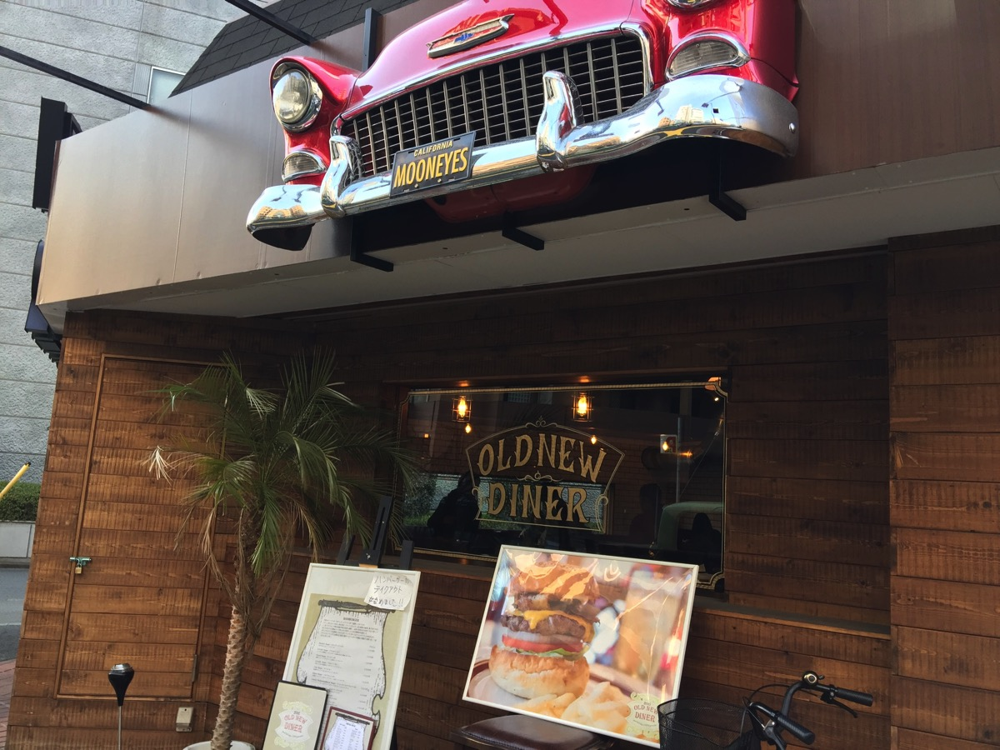
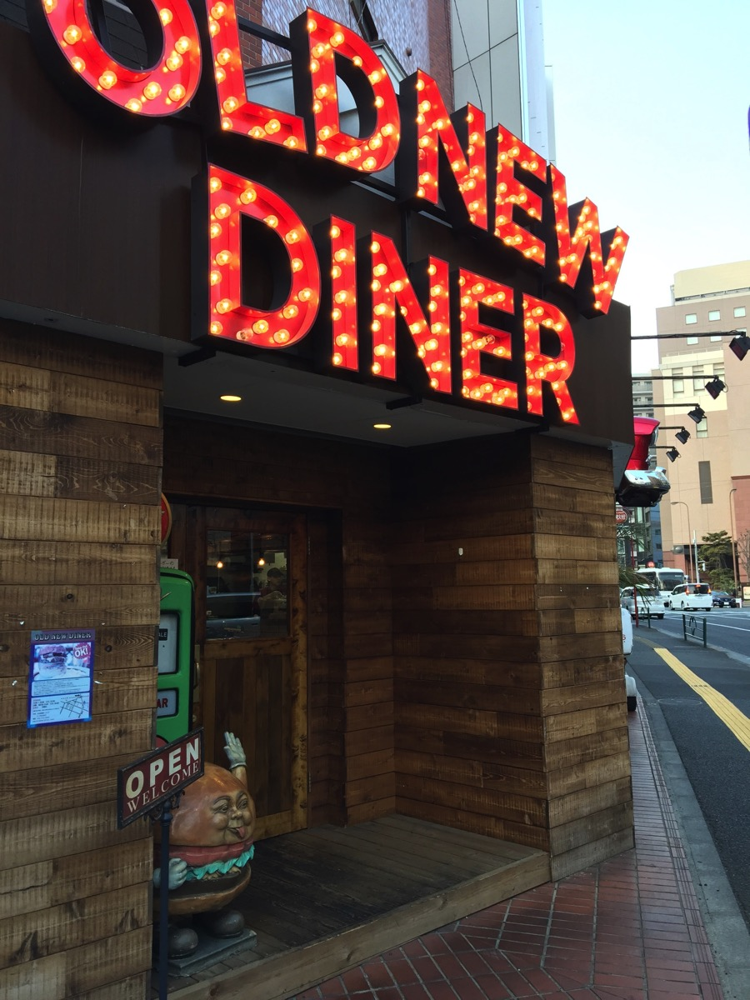
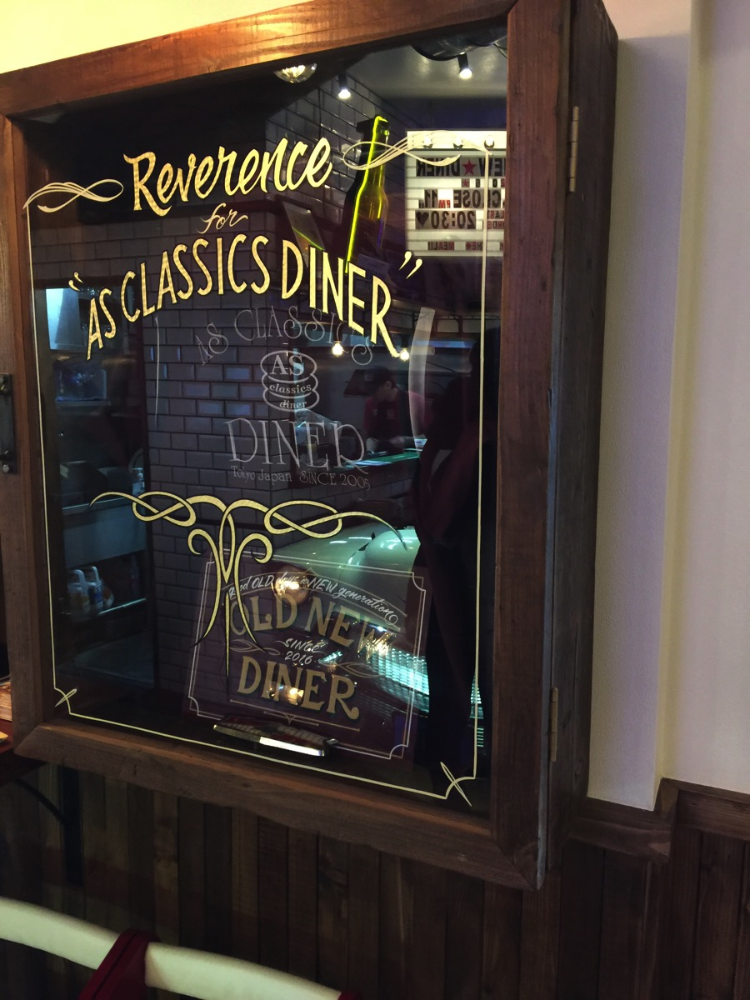
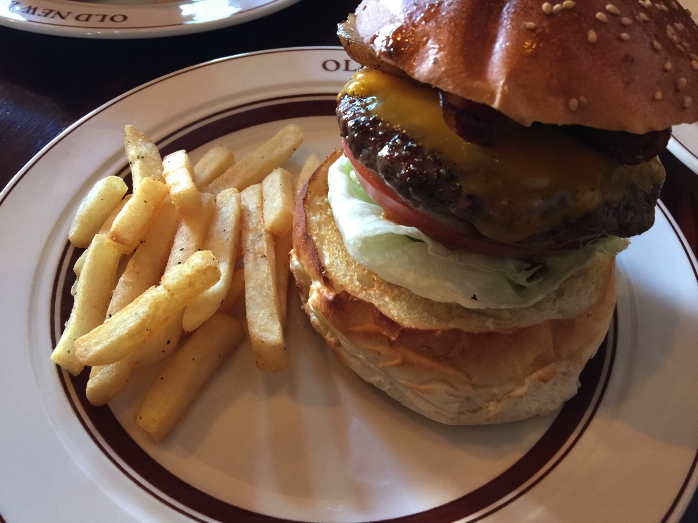

---
categories:
- グルメ
date: Sun, 12 Mar 2017 13:56:00 +0000
slug: post-10434
tags:
- ハンバーガー
title: 多摩地区最強ハンバーガー決定「ニューオールドダイナー」
---

目黒(駒澤大学駅)にAS CLASSIC DINNERハンバーガー屋がある。以前LINE WOWというデリバリーサービスを利用して数回食べたことがあったけど、わりと美味しかった記憶がある。そのAS CLASSIC DINNERから暖簾分けのような形だと思うけど、5年間修行した方が店長として東京都立川市に開いたお店がOLD NEW DINNER

さっそく食べにいってきたけど、おそらく多摩地区最強のハンバーガーと断ずるにいささかの躊躇なし！本日はそのご紹介です。<!--more--><h2>アクセス</h2>

立川駅北口の繁華街を抜けて、大通りまで数分歩いたところにあります。

時間や曜日やルートによってはちょっと怖い怪しい感じの道かも。大通りまで行くとそんなことありませんが。

車で行ってもコインパーキングが周りにあるからすぐ止められると思います。

<strong><a href="https://tabelog.com/tokyo/A1329/A132901/13196856/" target="_blank">オールドニューダイナー</a></strong>

<strong>関連ランキング：</strong><a href="https://tabelog.com/rstLst/hamburger/">ハンバーガー</a> | <a href="https://tabelog.com/tokyo/A1329/A132901/R7410/rstLst/">西国立駅</a>、<a href="https://tabelog.com/tokyo/A1329/A132901/R5960/rstLst/">立川駅</a>、<a href="https://tabelog.com/tokyo/A1329/A132901/R5964/rstLst/">立川南駅</a>

お店の外観も内観もオールドアメリカンスタイルで非常に凝った作りになっています。

女性も子供も入りやすい店内です。

<h2>普通に美味しい！ハイボリュームハイコストグルメバーガー</h2>

ベーコンチーズバーガーです。1550円となかなかのお値段ですが美味しい！何がおいしいって肉が美味しい。

とくにベーコンはラーメン屋のチャーシューかってくらい味がしっかりとしみ込んでいてとても美味しかった！！

多摩地区のハンバーガーといえば数店しか行ったことがありませんが、間違いなくここが一番美味しい！

おすすめです！

<h2>しんぺーはこう思った。</h2>

正直すっごいボリュームで隣の席に座ってた女の子の腹がめちゃくちゃ膨れてましたwマジでw

そして、ぼくも4時くらいに食べてその日夕飯いらないくらいでした。満足感マックスです！

と言ったところで本日は以上になります。 
おやすみなさい。 
そして、また明日。