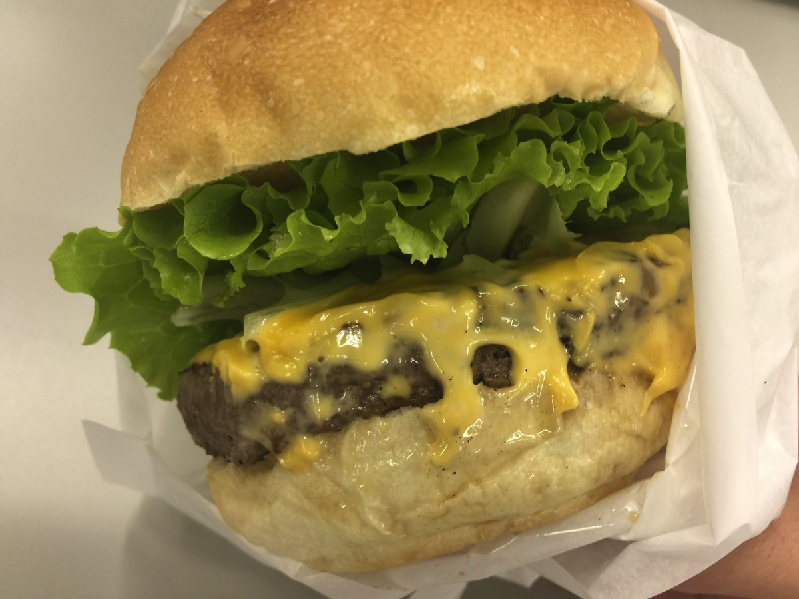
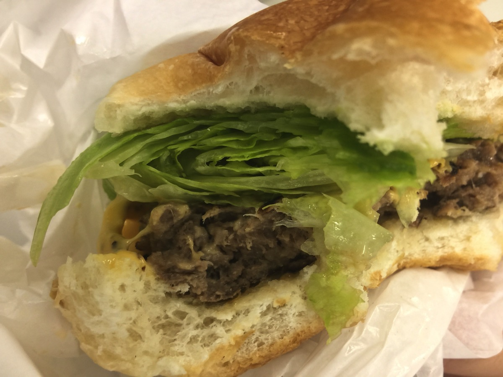

---
categories:
- Uber Eats
date: Wed, 15 Mar 2017 13:08:11 +0000
slug: post-10449
tags:
- ハンバーガー
title: Uber Eatsで注文したグルメバーガー「ハラカラ」が美味しいのでおすすめ（クーポンコード付き）
---

本日も利用しまいたUber Eats。最近はキャンペーンが終わって送料がかかるようになってしまったので、前みたいに毎日注文しているわけではなりませんが、それでも同僚数名を募って週１くらいで注文しています。

そして本日は、LINE WOWでハンバーガーを注文しまくっている時に注文したことがあったハラカラというお店をUberで注文。とても美味しいハンバーガーなので本日はそのご紹介です。<!--more--><h2>オリジナリィて溢れるメニューが売りのグルメバーガーショップ</h2>

以前は三軒茶屋の店舗のをLINEに持ってきてもらって食べたんですが、正直そっちの方が美味しかったかな。それでもとても美味しいグルメバーガーです。

今回は青山店からのデリバリーでした。

<strong><a href="https://tabelog.com/tokyo/A1306/A130602/13178177/" target="_blank">ハラカラ。 南青山店</a></strong>

<strong>関連ランキング：</strong><a href="https://tabelog.com/rstLst/hamburger/">ハンバーガー</a> | <a href="https://tabelog.com/tokyo/A1306/A130602/R2153/rstLst/">表参道駅</a>、<a href="https://tabelog.com/tokyo/A1306/A130603/R2209/rstLst/">外苑前駅</a>、<a href="https://tabelog.com/tokyo/A1306/A130603/R93/rstLst/">青山一丁目駅</a>

面白いのが、オリジナルメニューで梅しそとか大根おろしとかがが挟んであるバーガーがあるところ。ジャンクな感じが一切せず、体に良さそうなハンバーガーです。

とはいえ今日はスタンダードにチーズバーガーを注文しました。

野菜も丁寧にそして大量に織り込まれまくってます。

<h2>今ならぼくの紹介コードで1700円無料</h2>

少しでも興味持った方いましたら、こちらのクーポンコードを注文時に使って見てください。
注文料金から今なら1700円くらい安くなります。

eats-c2p8i

Uber Eatsの便利さ手軽さを一度体験すると、食事のために会社の外にでるのが非常に億劫になりますw

それと待っている間、配達スタッフの方の位置がGPSでわかるようになっているので、イライラも少ないです。とてもおすすめですので一度お試しあれ。

<h2>しんぺーはこう思った。</h2>

ちなみにクーポンコード使ってもらうとぼくの方にも同額のクーポンがもらえるような感じになっていますw

最初の一回しか使えないので、まだ使ったことがない方限定になりますがよかったらどうぞ。

と言ったところで本日は以上になります。 
おやすみなさい。 
そして、また明日。

<a href="https://itunes.apple.com/jp/app/ubereats-%E3%82%A6%E3%83%BC%E3%83%90%E3%83%BC%E3%82%A4%E3%83%BC%E3%83%84-%E3%83%95%E3%83%BC%E3%83%89%E3%83%87%E3%83%AA%E3%83%90%E3%83%AA%E3%83%BC%E3%82%92%E3%82%B9%E3%83%94%E3%83%BC%E3%83%87%E3%82%A3%E3%83%BC%E3%81%AB/id1058959277?mt=8&uo=4&at=11ld5P" target="_blank" >UberEATS (ウーバーイーツ) - フードデリバリーをスピーディーに</a>&nbsp;(無料)

<a href="https://itunes.apple.com/jp/developer/uber-technologies-inc/id368677371?uo=4&at=11ld5P" target="_blank" >Uber Technologies, Inc.</a>&nbsp;<a href="https://itunes.apple.com/jp/app/ubereats-%E3%82%A6%E3%83%BC%E3%83%90%E3%83%BC%E3%82%A4%E3%83%BC%E3%83%84-%E3%83%95%E3%83%BC%E3%83%89%E3%83%87%E3%83%AA%E3%83%90%E3%83%AA%E3%83%BC%E3%82%92%E3%82%B9%E3%83%94%E3%83%BC%E3%83%87%E3%82%A3%E3%83%BC%E3%81%AB/id1058959277?mt=8&uo=4&at=11ld5P" target="_blank" style="width:100px;color:#ffffff;background:#298CDA;font-size:10px;font-weight:bold;text-align:center;display:inline;text-decoration:none;border:0px;padding:5px;border-radius:10px;background:-moz-linear-gradient(rgba(85,182,237,0.5), rgba(41,140,218,1));background:-webkit-gradient(linear, 100% 0%, 100% 100%, from(rgba(85,182,237,0.5)), to(rgba(41,140,218,1)));white-space: nowrap;">iTunes で見る</a>

(2017.03.15時点)

posted with <a href="http://pochireba.com" rel="nofollow" target="_blank">ポチレバ</a>

