---
categories:
- レビュー
date: Fri, 17 Mar 2017 12:05:00 +0000
slug: post-10454
tags:
- The WellBe
- ガジェット
title: ストレス計測器「The WellBe」1週間使用レビュー
---

Indiegogoで出資し、2年越しでようやく届いたストレス計測器「The WellBe」を1週間使ってみた感想です。購入を考えている方やストレスで毎日ブチ切れそうな方におすすめのこのガジェットですが、どんな感じかをレビューしたいと思います！

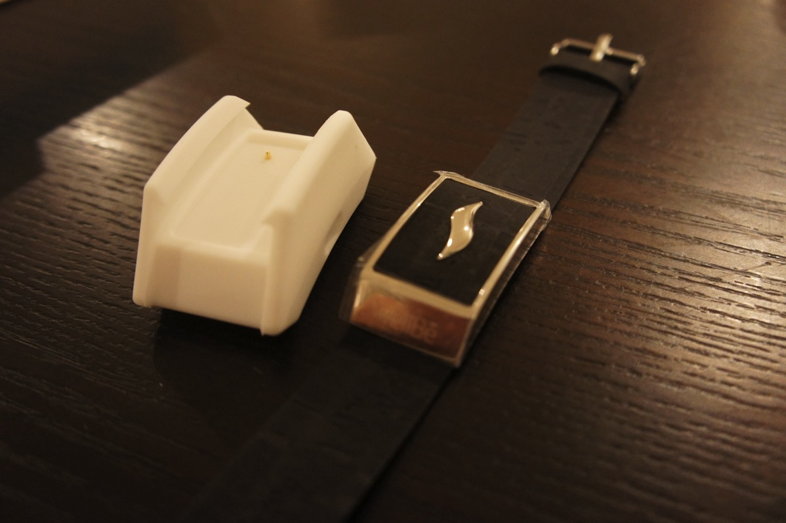
<h2>「The WellBe」とは？</h2>

<iframe src="https://player.vimeo.com/video/123248970" width="640" height="360" frameborder="0" allowfullscreen="allowfullscreen"></iframe>

簡単にいうと腕につけ、心拍を計ることでストレス度を計測してくれるウェアラブルガジェットです。

Apple Watchの様に本体裏側の肌と密着する部分から緑色の皮膚を投下する光を発し、それで血管を照らし心拍数を計測します。

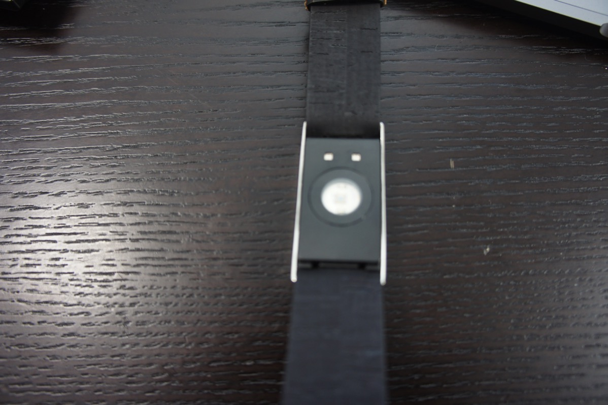

<strong>計測は自動でしてくれます。</strong>

スマホのアプリとBluetoothで連動し、計測したデータをスマホに送ります。1時間に1回自動で計測され、アプリと接続した際にデータが同期されます。接続さえしておけば、何もせずに自動で測定してくれるので、装着している事すら忘れてしまいます。

計測結果はアプリに同期させることでグラフにして可視化してくれます。さらに<strong>地図でどこでその心拍を計測したか</strong>、またスケジュールも同期させることで、具体的に何がトリガーとなりストレスになったのかを振り返れるようになっています。

さらに、<strong>心拍が異常値を示した時には通知してくれます。</strong>

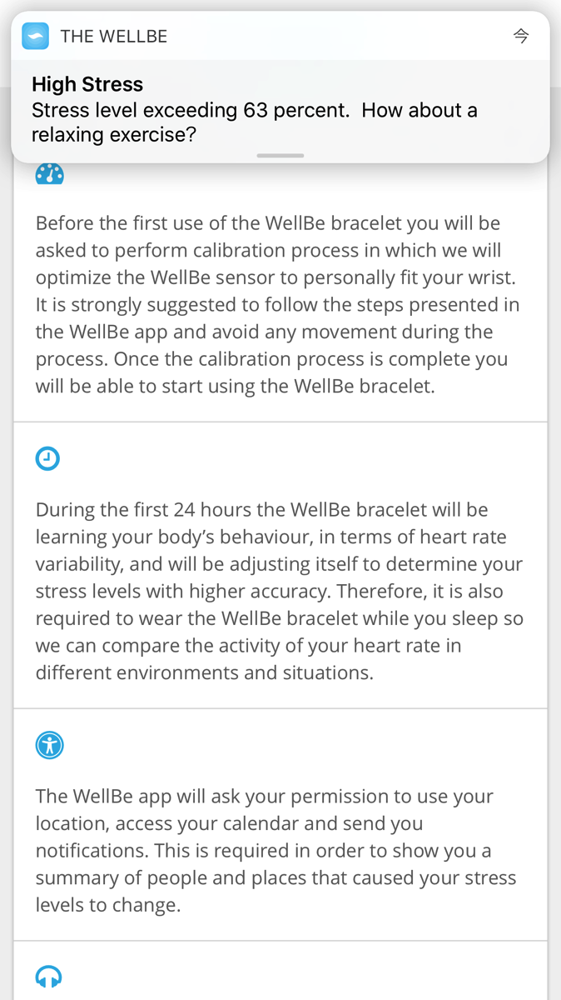

こちらはApple Watchに来た通知

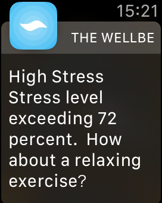

つまり一時的にストレスがたかまりブチ切れそうな時にアラートを出してくれるのです。これは非常にありがたいです。またブチ切れそうな時以外にも、自分が思わぬストレスに晒されているんだなという実感を持つことができます。

ちなみにThe WellBeのコンセプトは、「生活からストレスをなくすこと」です。そのため、ストレスを感じた際に、その解消方法も検索できるようになっています。

短時間でできるものから長い時間使って発散するものなど様々なストレス解消方法が紹介されています。

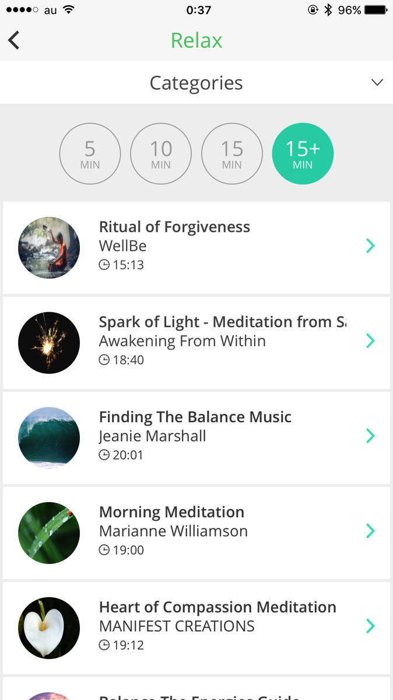

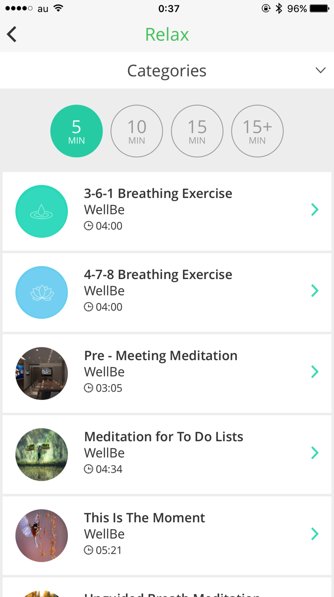
<h2>使ってみた感想</h2>
で、実際に1週間会社に行く時につけてたんですがびっくりしました。

月曜日のグラフです。真っ赤です。こんなにストレス感じてたの！？と驚いてしまうくらいです。

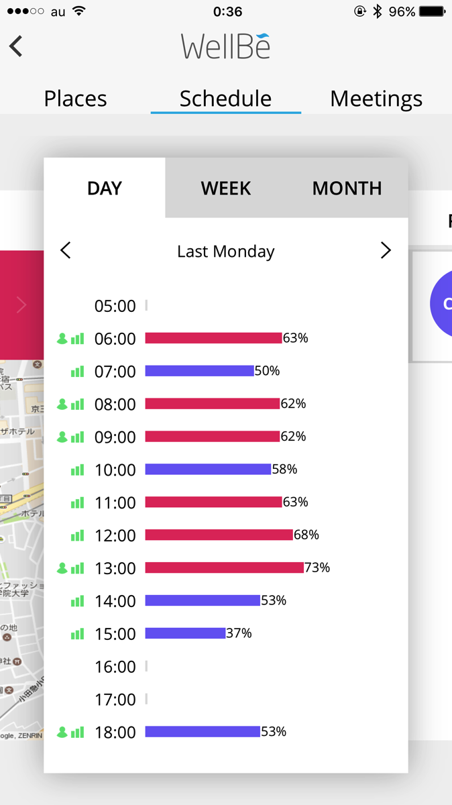

ただし、この日は打ち合わせばかりで確かに少しというかだいぶイラついていたかもしれません。

次、火曜日のグラフ。この日は打ち合わせが1つもなく、自分のやりたいことに時間をあてられました。素晴らしい。そん結果心も穏やかです。

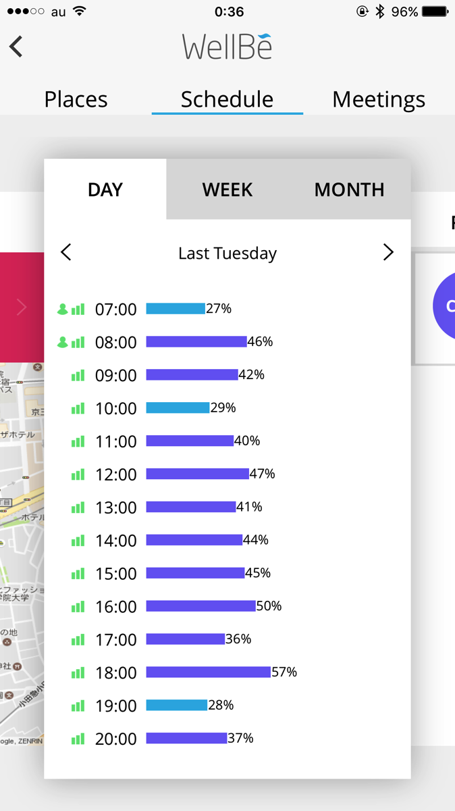

水曜日〜金曜日は多少レッドゾーン入ってるものもあるかと思いますが、基本的には穏やかに過ごせたんじゃないでしょうか。

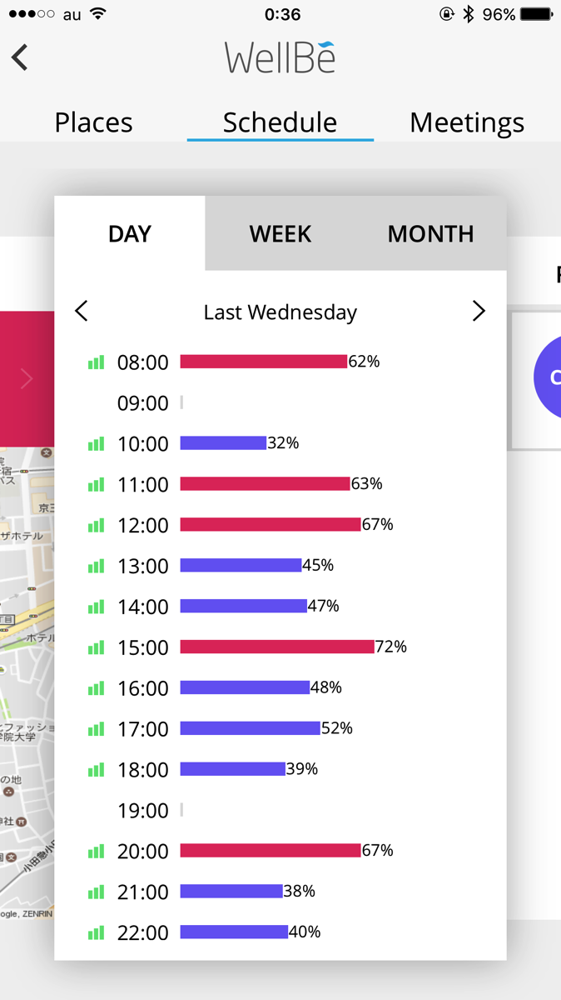

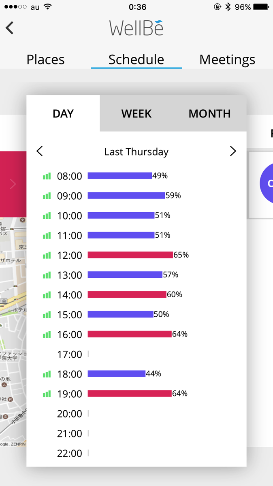

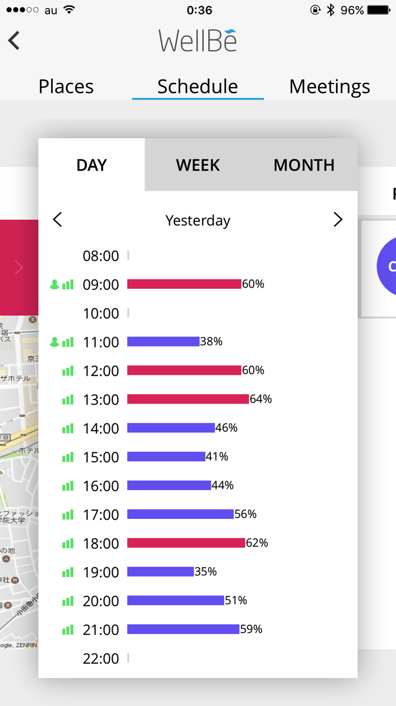

なかなか信憑性というか心拍とストレスには互換性がありそうです。信頼できるガジェットなんじゃないでしょうか。

ちなみに、こんなに小さいからバッテリーが1日持つのか心配でしたが、全く問題ありませんでした。アプリ上からバッテリー残量が確認できますが、余裕で1日もちました。

なお、今の所左手にApple Watch、右手にThe WellBeをつけていますが住み分けとしては、Apple Watchがエクササイズなどの活動量を計る、身体面でのガジェットだとすると、The WellBeは精神面の測定ガジェットと言えると思います。

Apple Watchに同様の機能を持ったアプリや機能が備われば無用になりそうですが、Apple Watchのバッテリーの力不足を補うことが前提になるため中々難しい気がします。その点The WellBeには通知機能やその他の不要な機能は一切ないため、バッテリーの心配も少なくてすみそうです。

しばらくは、このまま使い続けて自信の精神衛生の改善に利用したいと思います。

ブチ切れそうなくらいのストレス環境にいる方にはとってもオススメです。<!--more--><h2>購入方法</h2>
$149で公式サイトから購入できるようになっています。色は4種類から選べ、サイズは女性向け・男性向けとなっています。

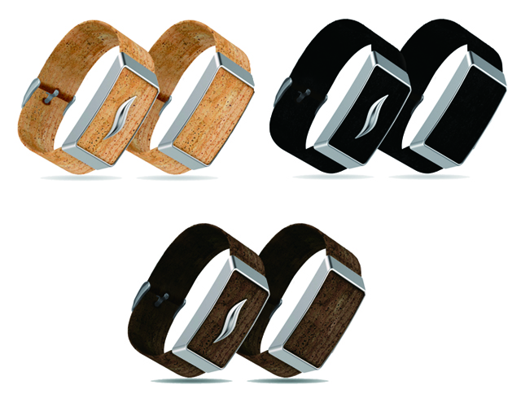

（色はnatural、black、brown、tricolorの4種類ですがサイト上だとnaturalとtricolorのちがいがわからない）

<a href="https://thewellbe.com/">https://thewellbe.com/</a>

ちなみにぼくはindiegogoというクラウドファンディングサイトで出資して受け取りました。

<a href="https://www.indiegogo.com/">https://www.indiegogo.com/</a>
<h2>しんぺーはこう思った。</h2>
両手に腕時計みたいなのをつけている状態なので多少きもい感じがしなくもないですが、片手に二つつけるよりもマシです。（試しました。）

今回、始めてクラウドファンディングで出資し、さらにそれが無事手元に届いたのでとても嬉しいです。誰よりも早く、最新のガジェットを手に入れられるクラウドファンディングはなんて素晴らしいんでしょうか！おそらく日本でこのガジェットを手にしているのは相当少ないんじゃないでしょうか？でも、ストレスフルな日本人にこそ必要なガジェットだと思いますので、少しでも興味がある方は是非購入をオススメします。

と言ったところで本日は以上になります。
おやすみなさい。
そして、また明日。