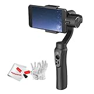

---
categories:
- レビュー
date: Mon, 20 Mar 2017 15:42:31 +0000
slug: post-10497
tags:
- ガジェット
- ジンバル
title: Zhiyunから激安高性能ジンバル発売決定「Smooth-Q」即予約しました
---

ジンバルが気になって気になって、毎日メルカリやらヤフオクやらで激安の中古が出てないかチェックしてたんですが、そうしたらZhiyunから激安のジンバル「Smooth-Q」がつい先日発表されたとのことで、ソッコー予約いたしました。性能とかまだ日本語の記事がほとんどなかったので英語の記事を読んだりして情報収集しましたので本日はそのご紹介です。

実際買いました！→<a href="https://www.warawareotoko.com/2017/04/09/post-10534/">激安ジンバル ZHIYUN「Smooth-Q」レビュー！軽くて手軽でいい！</a><!--more--><h2>ジンバルとは？</h2>

ここではカメラの電動スタビライザーのことを言っています。水平かつ、振動を少なくして撮影できるガジェットです。有名なメーカーでいうと中国のzhiyunやfeiyuがあります。それ以外だとアメリカのDJIなどが最近有名です。

構造としては電動モーターにより2軸もしくは3軸の制御をカメラに対してかけます。それにより、左右上下前後の揺れに対応します。

また、専用のアプリやジンバル本体との接続によりタイムラプスでの撮影や被写体を自動で追跡したりすることも出来ます。

このガジェットの使用により動画のクオリティが格段にあがります。

大体の相場は、プロ仕様の高いもので40-50万、普通クラスでも10万以下、スマホ用やアクションカム用のもので3-4万くらい。

ざっと見た感じだとDJI > Zhiyun > feiyu という感じの価格感

中国メーカーときいて「うわー」と思う方もいるかもしれませんが、実はドローンで高い技術を持っているのが中国。そこでもジンバルの技術が発揮されています。品質も一昔前のような粗悪品もかなり少なくなってきているようです。たぶん

<h2>ついに1万円台のエントリーモデル「SMOOTH-Q」が発売</h2>

ついに発表されました。激安高性能モデル。今までの1番安いモデルの半額です。

スペックや機能の情報をまとめると以下の通り

バッテリー駆動時間12時間、重さはiphoneのPLUSサイズに対応、モバイルバッテリーによる使用品がら給電（充電？）が可能。

osmo mobileよりも優れたスペックとして発表さています。色は4色
iphoneを意識したピンクとゴールドもあります。

専用アプリを使用することで本体側からスマホのカメラを制御することもできるようです。

<h2>しんぺーはこう思った。</h2>

これは絶対に買い！今年はジンバル流行ると思ってたけど割と高価なのでおじさんたちしか手にできないだろうなーと思ってたけど、これくらいの値段なら手に入れやすい！売り切れ必至と思って早々に予約しました！今月中に手元に届くといいなー！

と言ったところで本日は以上になります。 
おやすみなさい。 
そして、また明日。

<a href="http://www.amazon.co.jp/exec/obidos/ASIN/B06XPTL1TG/warawareotoko-22/" target="_blank" >Zhiyun SMOOTH-Q　スマートフォン用 3軸ジンバル　手持ち式　コンパクト　ワイヤレスコントロール　充電式　撮影安定　5.5インチまでスマートフォン対応　クリーンキットセット付属　4色選択可能　 (ブラック)</a>
posted with <a href="http://kaereba.com" rel="nofollow" target="_blank">カエレバ</a>

 Zhiyun     

<a href="http://www.amazon.co.jp/gp/search?keywords=B06XPTL1TG&__mk_ja_JP=%E3%82%AB%E3%82%BF%E3%82%AB%E3%83%8A&tag=warawareotoko-22" target="_blank" >Amazon</a>

<a href="https://hb.afl.rakuten.co.jp/hgc/0f6e221b.2eb9748a.0f6e221c.35cc1e84/?pc=http%3A%2F%2Fsearch.rakuten.co.jp%2Fsearch%2Fmall%2FB06XPTL1TG%2F-%2Ff.1-p.1-s.1-sf.0-st.A-v.2%3Fx%3D0%26scid%3Daf_ich_link_urltxt%26m%3Dhttp%3A%2F%2Fm.rakuten.co.jp%2F" target="_blank" >楽天市場</a>

<a href="//ck.jp.ap.valuecommerce.com/servlet/referral?sid=3041033&pid=882528283&vc_url=http%3A%2F%2Fsearch.shopping.yahoo.co.jp%2Fsearch%3Fp%3DB06XPTL1TG&vcptn=kaereba" target="_blank" >Yahooショッピング</a>

