---
categories:
- グルメ
date: Tue, 04 Apr 2017 23:00:00 +0000
slug: post-10509
tags:
- オフィス飯
title: オフィスでランチを自炊！そのためにはこれを使え
---

早起きして昨日の残りのおかずを小さな弁当箱につめ、そして冷えた飯をデスクで喰らう。ぼくはそんな弁当が嫌いだ。だからと言って会社の周囲に心踊るランチを出す店はない。Uber eatsで出前を頼むのもいいだろう。でもラインナップがなかなか増えない。だからぼくは決めた。オフィスで自分のために、暖かいご飯を作ることを。<!--more-->
<h2>デスクで炊きたてのご飯を食べたい</h2>
弁当の何がやだって炊きたてじゃないご飯、冷たくて硬いご飯、匂いがしないご飯

あれが嫌だ。

ということで会社でご飯を炊ける方法を探しました。会社に小さな炊飯器を持ち込んでもいいんですが、湯気が出るし自分のデスク以外においておくのも怒られそうなので、ということでこちらを購入しました。

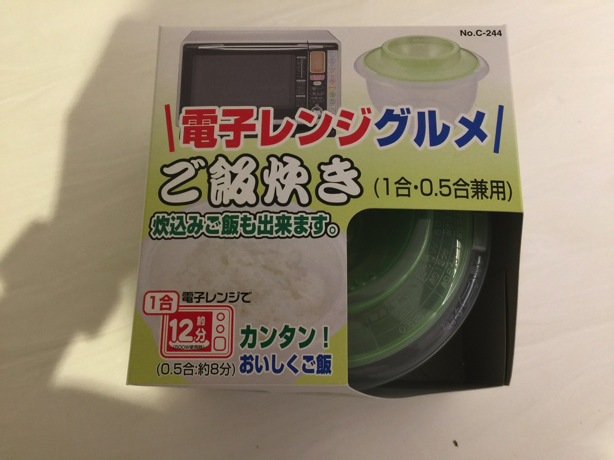

電子レンジでご飯が炊けちゃうという優れものです。ただし水を入れてレンジでチンすればいいというものではなく、30分水につけておく必要があるのが難点です。そうでないとちょっと芯が残った硬いものになってしまいます。

無洗米をおすすめします。給湯室でお米を研いでいるのは相当へんなので恥ずかしいです。
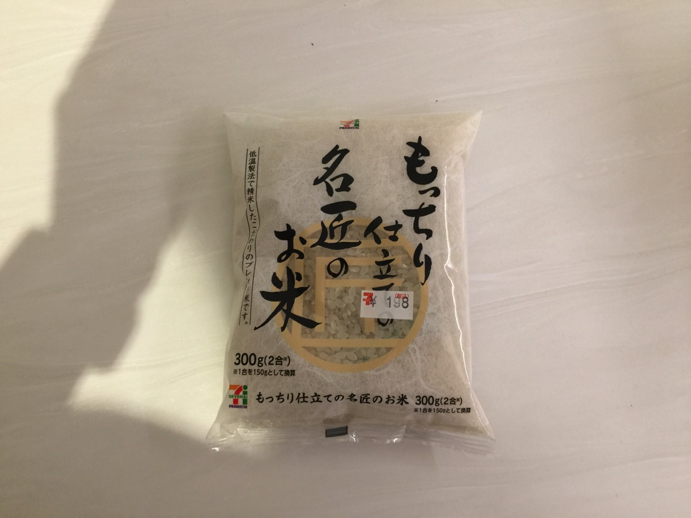

しっかりと水につけたのでふっくらで芯がないご飯が炊けました。少しだけべちゃってなってしまったのは水が多かったか米が少なかったのかも。分量をきちんと測ればよかった。
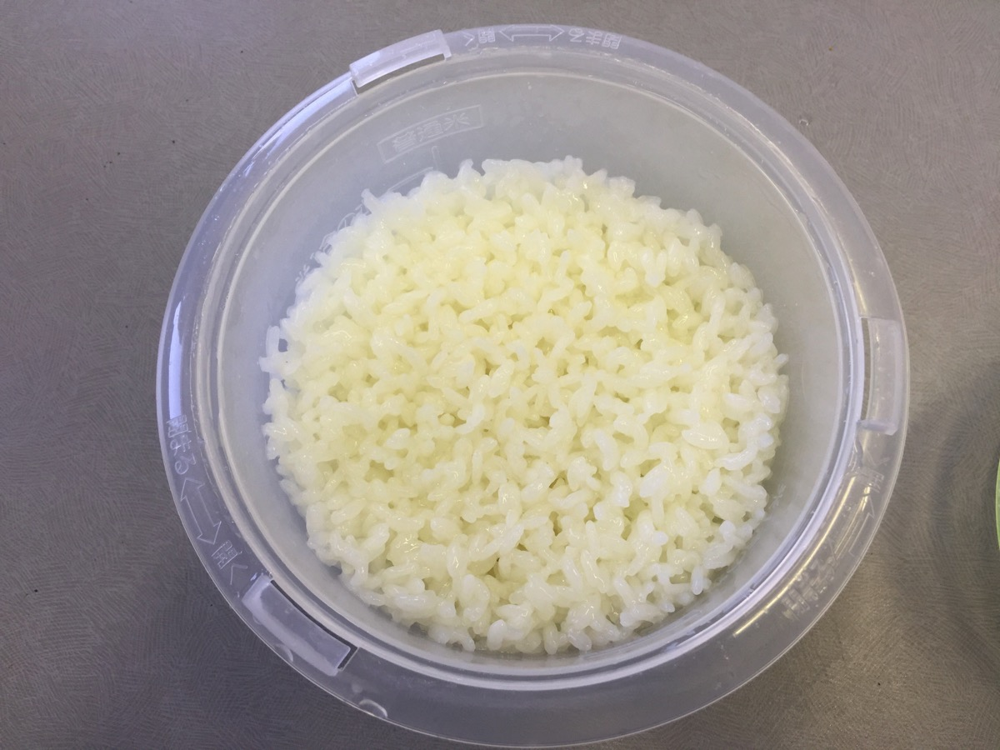

買っておいた卵を落として卵かけご飯にして食べました。美味しかったです。
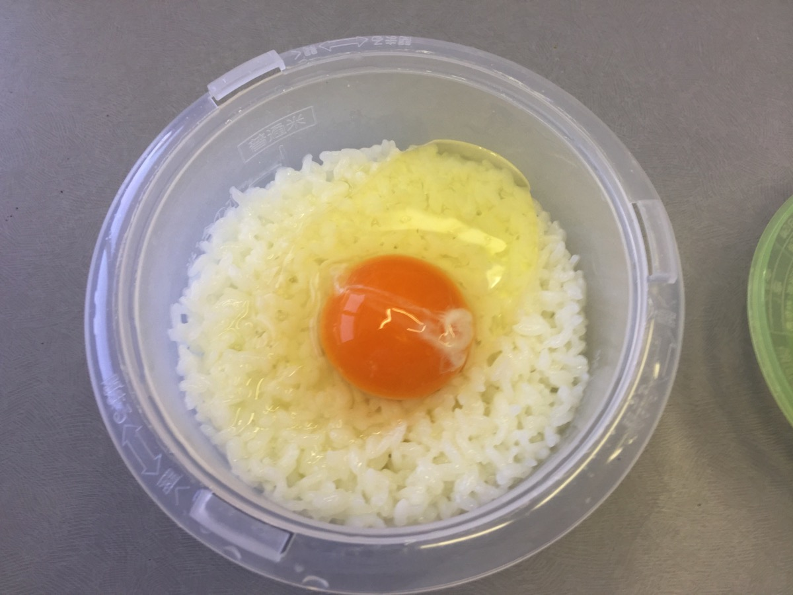

この専用機を使いました。

<a href="http://www.amazon.co.jp/exec/obidos/ASIN/B005M0BQEW/warawareotoko-22/" target="_blank" rel="noopener noreferrer">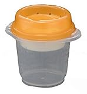</a>

<a href="http://www.amazon.co.jp/exec/obidos/ASIN/B005M0BQEW/warawareotoko-22/" target="_blank" rel="noopener noreferrer">イノマタ化学 電子レンジ容器 レンジで簡単ごはん炊き</a>

posted with <a href="http://kaereba.com" target="_blank" rel="nofollow noopener noreferrer">カエレバ</a>

イノマタ化学

<a href="http://www.amazon.co.jp/gp/search?keywords=%E3%82%A4%E3%83%8E%E3%83%9E%E3%82%BF%E5%8C%96%E5%AD%A6%20%E9%9B%BB%E5%AD%90%E3%83%AC%E3%83%B3%E3%82%B8%E5%AE%B9%E5%99%A8%20%E3%83%AC%E3%83%B3%E3%82%B8%E3%81%A7%E7%B0%A1%E5%8D%98%E3%81%94%E3%81%AF%E3%82%93%E7%82%8A%E3%81%8D&amp;__mk_ja_JP=%E3%82%AB%E3%82%BF%E3%82%AB%E3%83%8A&amp;tag=warawareotoko-22" target="_blank" rel="noopener noreferrer">Amazon</a>

<a href="https://hb.afl.rakuten.co.jp/hgc/0f6e221b.2eb9748a.0f6e221c.35cc1e84/?pc=http%3A%2F%2Fsearch.rakuten.co.jp%2Fsearch%2Fmall%2F%25E3%2582%25A4%25E3%2583%258E%25E3%2583%259E%25E3%2582%25BF%25E5%258C%2596%25E5%25AD%25A6%2520%25E9%259B%25BB%25E5%25AD%2590%25E3%2583%25AC%25E3%2583%25B3%25E3%2582%25B8%25E5%25AE%25B9%25E5%2599%25A8%2520%25E3%2583%25AC%25E3%2583%25B3%25E3%2582%25B8%25E3%2581%25A7%25E7%25B0%25A1%25E5%258D%2598%25E3%2581%2594%25E3%2581%25AF%25E3%2582%2593%25E7%2582%258A%25E3%2581%258D%2F-%2Ff.1-p.1-s.1-sf.0-st.A-v.2%3Fx%3D0%26scid%3Daf_ich_link_urltxt%26m%3Dhttp%3A%2F%2Fm.rakuten.co.jp%2F" target="_blank" rel="noopener noreferrer">楽天市場</a>

<a href="//ck.jp.ap.valuecommerce.com/servlet/referral?sid=3041033&amp;pid=882528283&amp;vc_url=http%3A%2F%2Fsearch.shopping.yahoo.co.jp%2Fsearch%3Fp%3D%25E3%2582%25A4%25E3%2583%258E%25E3%2583%259E%25E3%2582%25BF%25E5%258C%2596%25E5%25AD%25A6%2520%25E9%259B%25BB%25E5%25AD%2590%25E3%2583%25AC%25E3%2583%25B3%25E3%2582%25B8%25E5%25AE%25B9%25E5%2599%25A8%2520%25E3%2583%25AC%25E3%2583%25B3%25E3%2582%25B8%25E3%2581%25A7%25E7%25B0%25A1%25E5%258D%2598%25E3%2581%2594%25E3%2581%25AF%25E3%2582%2593%25E7%2582%258A%25E3%2581%258D&amp;vcptn=kaereba" target="_blank" rel="noopener noreferrer">Yahooショッピング</a>

おかずはコンビニのお惣菜かなんかを買ってくれば200~400円くらいで抑えられそうですし、レトルトのカレーを買ってきてかけてもいいかも
<h2>デスクでインスタントラーメンを食べてみた</h2>
さて、お米を炊くことができるようになったので、次にオフィスで食べたいもの、それはラーメンです。

ということで、カップ麺よりも多少調理している感と満足感があるインスタントラーメンもオフィスで作って食べてみたいと思います。

こちらもレンジでチンで調理ができる優れものです。
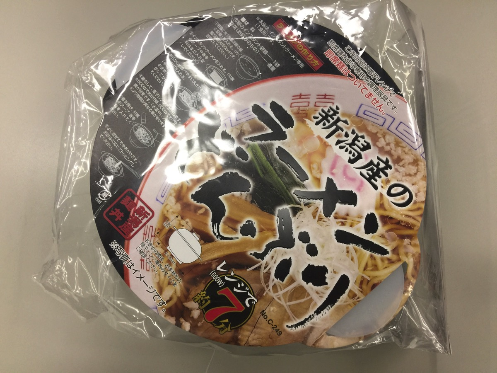

水を規定量いれてお好みのインスタントラーメンを投入
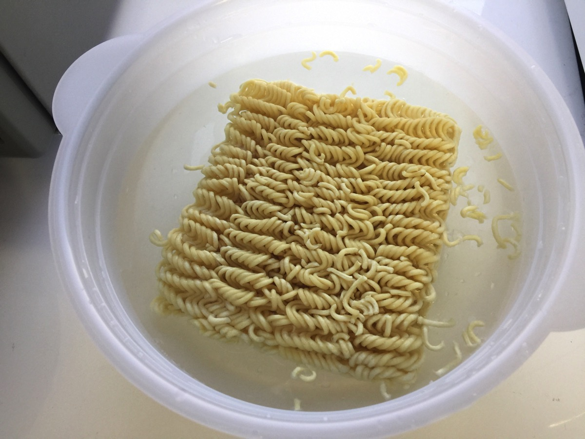

伸びすぎずちょうどいい柔らかさにできました。
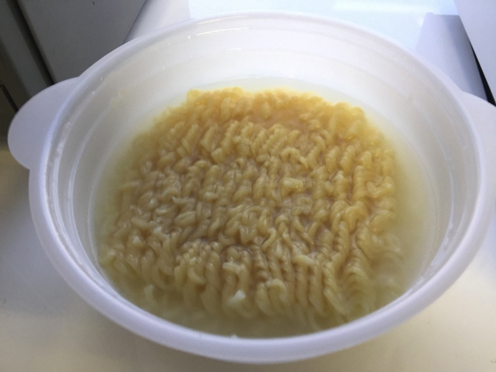

スープの粉を入れてできあがり
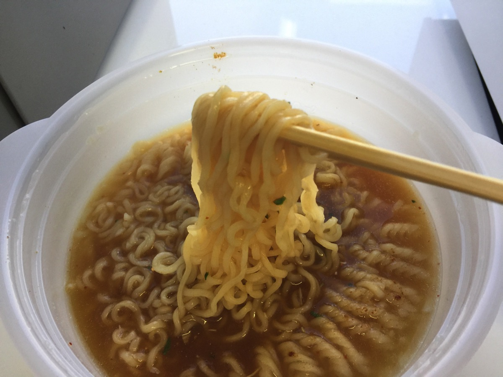

こちらはラーメン専用機で作りました。

<a href="http://www.amazon.co.jp/exec/obidos/ASIN/B00N7444WQ/warawareotoko-22/" target="_blank" rel="noopener noreferrer">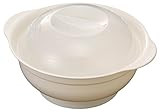</a>

<a href="http://www.amazon.co.jp/exec/obidos/ASIN/B00N7444WQ/warawareotoko-22/" target="_blank" rel="noopener noreferrer">イノマタ化学 電子レンジ容器 レンジで簡単ラーメン</a>

posted with <a href="http://kaereba.com" target="_blank" rel="nofollow noopener noreferrer">カエレバ</a>

inomata

<a href="http://www.amazon.co.jp/gp/search?keywords=%E3%82%A4%E3%83%8E%E3%83%9E%E3%82%BF%E5%8C%96%E5%AD%A6%20%E9%9B%BB%E5%AD%90%E3%83%AC%E3%83%B3%E3%82%B8%E5%AE%B9%E5%99%A8%20%E3%83%AC%E3%83%B3%E3%82%B8%E3%81%A7%E7%B0%A1%E5%8D%98%E3%83%A9%E3%83%BC%E3%83%A1%E3%83%B3&amp;__mk_ja_JP=%E3%82%AB%E3%82%BF%E3%82%AB%E3%83%8A&amp;tag=warawareotoko-22" target="_blank" rel="noopener noreferrer">Amazon</a>

<a href="https://hb.afl.rakuten.co.jp/hgc/0f6e221b.2eb9748a.0f6e221c.35cc1e84/?pc=http%3A%2F%2Fsearch.rakuten.co.jp%2Fsearch%2Fmall%2F%25E3%2582%25A4%25E3%2583%258E%25E3%2583%259E%25E3%2582%25BF%25E5%258C%2596%25E5%25AD%25A6%2520%25E9%259B%25BB%25E5%25AD%2590%25E3%2583%25AC%25E3%2583%25B3%25E3%2582%25B8%25E5%25AE%25B9%25E5%2599%25A8%2520%25E3%2583%25AC%25E3%2583%25B3%25E3%2582%25B8%25E3%2581%25A7%25E7%25B0%25A1%25E5%258D%2598%25E3%2583%25A9%25E3%2583%25BC%25E3%2583%25A1%25E3%2583%25B3%2F-%2Ff.1-p.1-s.1-sf.0-st.A-v.2%3Fx%3D0%26scid%3Daf_ich_link_urltxt%26m%3Dhttp%3A%2F%2Fm.rakuten.co.jp%2F" target="_blank" rel="noopener noreferrer">楽天市場</a>

<a href="//ck.jp.ap.valuecommerce.com/servlet/referral?sid=3041033&amp;pid=882528283&amp;vc_url=http%3A%2F%2Fsearch.shopping.yahoo.co.jp%2Fsearch%3Fp%3D%25E3%2582%25A4%25E3%2583%258E%25E3%2583%259E%25E3%2582%25BF%25E5%258C%2596%25E5%25AD%25A6%2520%25E9%259B%25BB%25E5%25AD%2590%25E3%2583%25AC%25E3%2583%25B3%25E3%2582%25B8%25E5%25AE%25B9%25E5%2599%25A8%2520%25E3%2583%25AC%25E3%2583%25B3%25E3%2582%25B8%25E3%2581%25A7%25E7%25B0%25A1%25E5%258D%2598%25E3%2583%25A9%25E3%2583%25BC%25E3%2583%25A1%25E3%2583%25B3&amp;vcptn=kaereba" target="_blank" rel="noopener noreferrer">Yahooショッピング</a>

<h2>デスクで茹でたてのパスタを食べてみた</h2>
インスタント麺に飽きた時のためにパスタも食べらえるように用意しました。パスタならソースを変えれば飽きずに食べることができます。

こちらは割と知られている電子レンジでパスタを茹でられるやつです。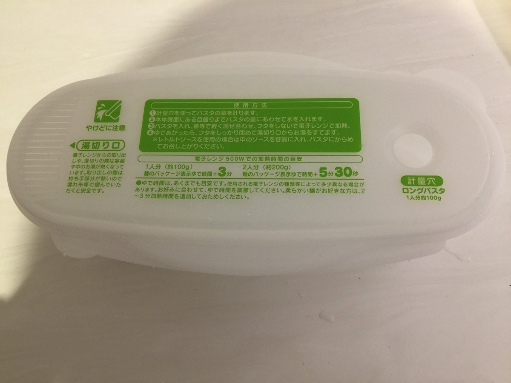

規定量の水を入れるとレンジ内に水が噴きこぼれるのが難点です。

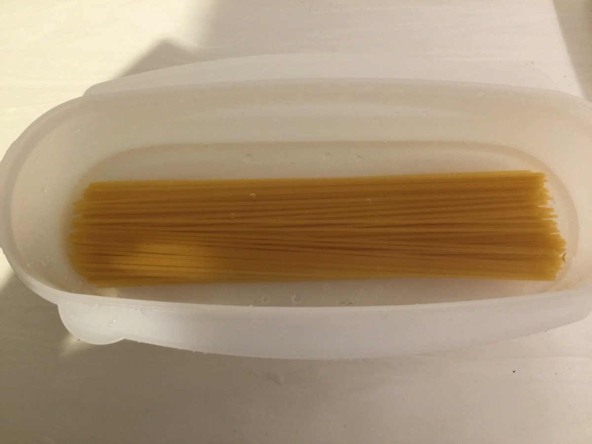

出来上がってかき混ぜた後です。粉チーズも買ってきてあるので美味しくいただけました。
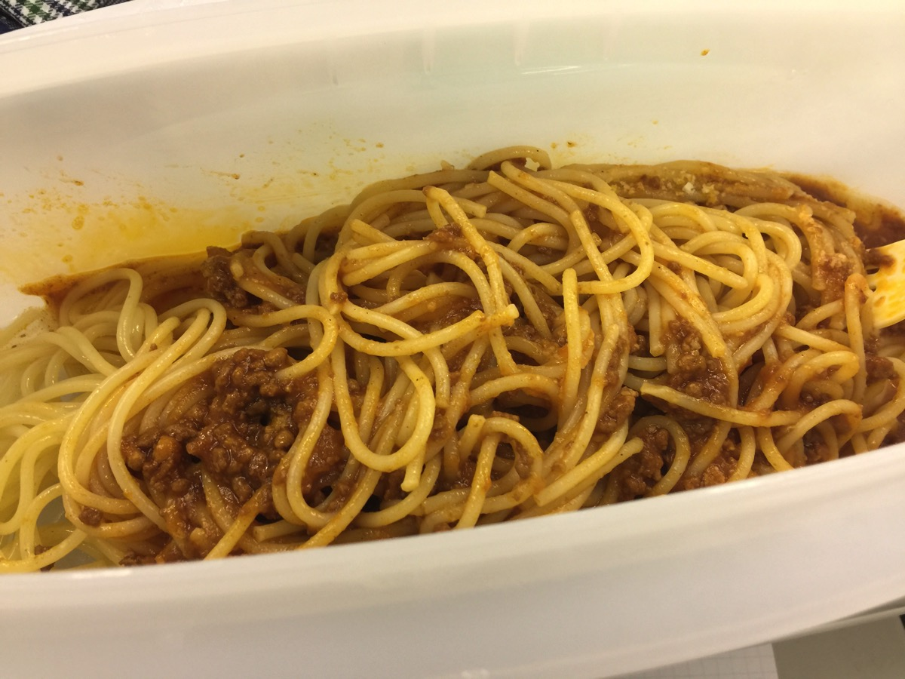

ちなみにソースは断然青の洞窟がおすすめです。
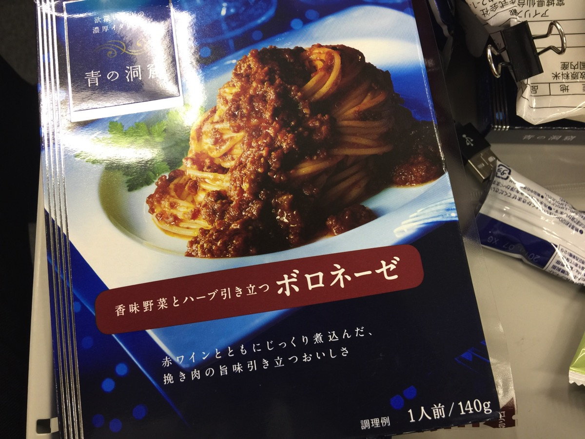

パスタ専用機

<a href="http://www.amazon.co.jp/exec/obidos/ASIN/B0026ZH3IY/warawareotoko-22/" target="_blank" rel="noopener noreferrer">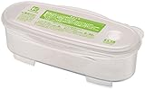</a>

<a href="http://www.amazon.co.jp/exec/obidos/ASIN/B0026ZH3IY/warawareotoko-22/" target="_blank" rel="noopener noreferrer">ゆで パスタ調理 ケース ベーシック</a>

posted with <a href="http://kaereba.com" target="_blank" rel="nofollow noopener noreferrer">カエレバ</a>

スケーター

<a href="http://www.amazon.co.jp/gp/search?keywords=%E3%82%86%E3%81%A7%20%E3%83%91%E3%82%B9%E3%82%BF%E8%AA%BF%E7%90%86%20%E3%82%B1%E3%83%BC%E3%82%B9%20%E3%83%99%E3%83%BC%E3%82%B7%E3%83%83%E3%82%AF&amp;__mk_ja_JP=%E3%82%AB%E3%82%BF%E3%82%AB%E3%83%8A&amp;tag=warawareotoko-22" target="_blank" rel="noopener noreferrer">Amazon</a>

<a href="https://hb.afl.rakuten.co.jp/hgc/0f6e221b.2eb9748a.0f6e221c.35cc1e84/?pc=http%3A%2F%2Fsearch.rakuten.co.jp%2Fsearch%2Fmall%2F%25E3%2582%2586%25E3%2581%25A7%2520%25E3%2583%2591%25E3%2582%25B9%25E3%2582%25BF%25E8%25AA%25BF%25E7%2590%2586%2520%25E3%2582%25B1%25E3%2583%25BC%25E3%2582%25B9%2520%25E3%2583%2599%25E3%2583%25BC%25E3%2582%25B7%25E3%2583%2583%25E3%2582%25AF%2F-%2Ff.1-p.1-s.1-sf.0-st.A-v.2%3Fx%3D0%26scid%3Daf_ich_link_urltxt%26m%3Dhttp%3A%2F%2Fm.rakuten.co.jp%2F" target="_blank" rel="noopener noreferrer">楽天市場</a>

<a href="//ck.jp.ap.valuecommerce.com/servlet/referral?sid=3041033&amp;pid=882528283&amp;vc_url=http%3A%2F%2Fsearch.shopping.yahoo.co.jp%2Fsearch%3Fp%3D%25E3%2582%2586%25E3%2581%25A7%2520%25E3%2583%2591%25E3%2582%25B9%25E3%2582%25BF%25E8%25AA%25BF%25E7%2590%2586%2520%25E3%2582%25B1%25E3%2583%25BC%25E3%2582%25B9%2520%25E3%2583%2599%25E3%2583%25BC%25E3%2582%25B7%25E3%2583%2583%25E3%2582%25AF&amp;vcptn=kaereba" target="_blank" rel="noopener noreferrer">Yahooショッピング</a>

<h2>しんぺーはこう思った。</h2>
思いの外美味しく出来上がりました！今後はハムエッグを作ったり色々とレパートリーを増やしていきたいと思います！

ただ、この方法難点が一個だけあります。それはレンジにかける時間が通常の弁当の数倍かかるため、レンジが込み合う時間に使うと他人に迷惑がかかる可能性があります。

そこだけ注意です。

と言ったところで本日は以上になります。
おやすみなさい。
そして、また明日。