---
categories:
- レビュー
date: Sun, 09 Apr 2017 10:13:15 +0000
slug: post-10534
tags:
- ガジェット
- ジンバル
title: 激安ジンバル ZHIYUN「Smooth-Q」レビュー！軽くて手軽でいい！
---

注文から数週間ZHIYUNから発売した激安高性能ジンバル「Smooth-Q」がようやく到着しました！これがあればでぶれしない綺麗な動画が撮影できるのです！ということで本日は「Smooth-Q」のインプレッションです。<!--more--><h2>ジンバルとは？</h2>

カメラの振動を軽減してくれる電動スタビライザーのことです。この「Smooth-Q」は3つの軸で振動を補正しています。

詳細は<a href="https://www.warawareotoko.com/2017/03/21/post-10497/">こちらの記事</a>にも買いていますが、制御する軸が増えるごとに金額もあがっていきます。また当然2軸よりも3軸の方が綺麗に制御できます。

ちなみにこの方の動画を見てジンバルというものを購入しようと思いました。

<iframe width="560" height="315" src="https://www.youtube.com/embed/5BnmZqUQNks" frameborder="0" allowfullscreen></iframe>

高性能なカメラだと手ぶれ補正機能なんかがついていたりもしますがそれも限界があります。また、スマホなんかでも同様です。そんな時にジンバルで物理的に手ぶれを制御することでより綺麗な画像を撮影することができるのです。

ただ、3軸制御のジンバルなんかだとどうしても3万円は超えてしまっていてなかなか手が出しづらかったのですが、今回ZHIYUNという中国メーカーより今までの最安機の半額でエントリーモデルが発売されました。それが「Smooth-Q」です。

<h2>開封してみた</h2>

国際便なので外箱は割ときたなかったですが、中身は綺麗でした。ご覧の通りZHIYUNとは中国のメーカーです。中国のメーカーと聞いて警戒する人もいるかもしれませんが、実はこのメーカー、ジンバルでは有名なメーカーなのです。

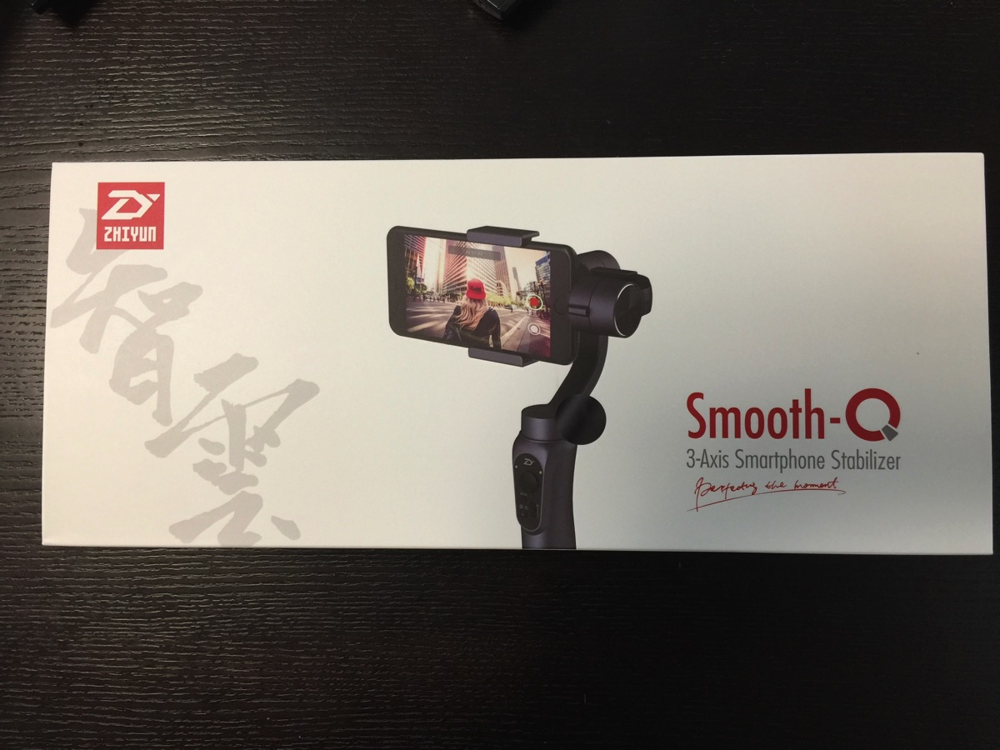

スナイパーライフルのようなケースに入っていました。
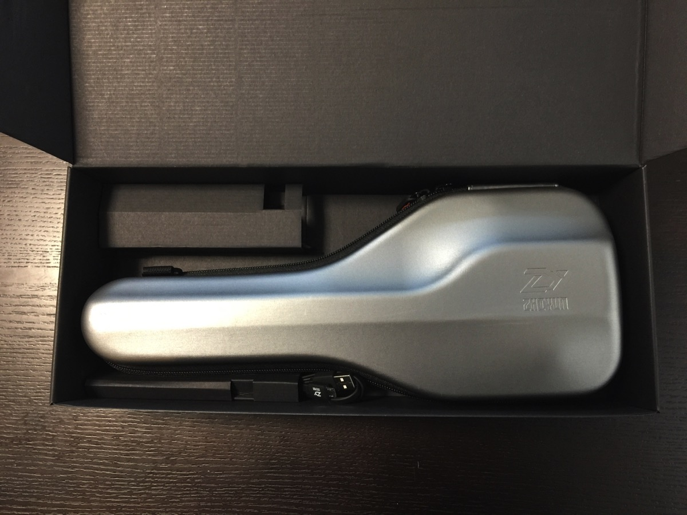

説明書とケーススラップと充電ケーブルのみ
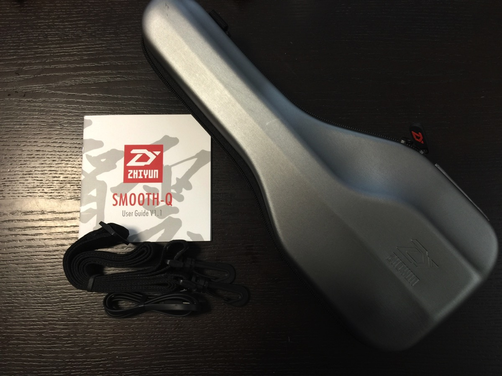

そしてこれが本体です。割とごついです。
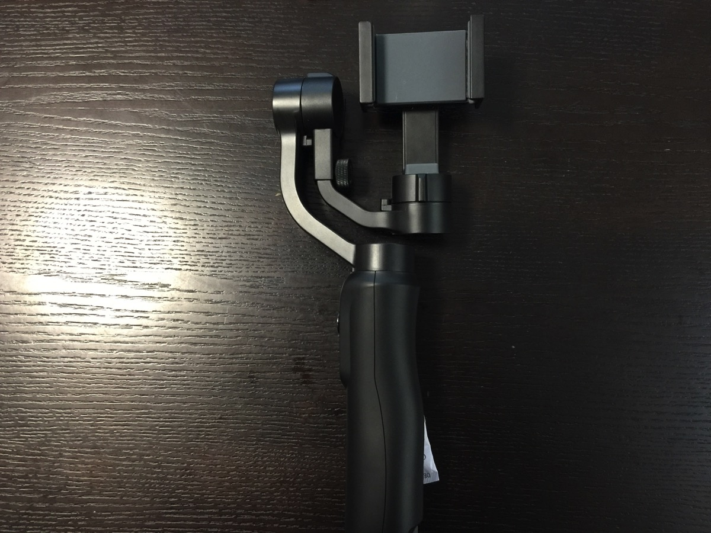

ここで操作できます。上の丸いところがジョイスティックみたいになっていて装着したスマホを上下左右に動かすことができます。
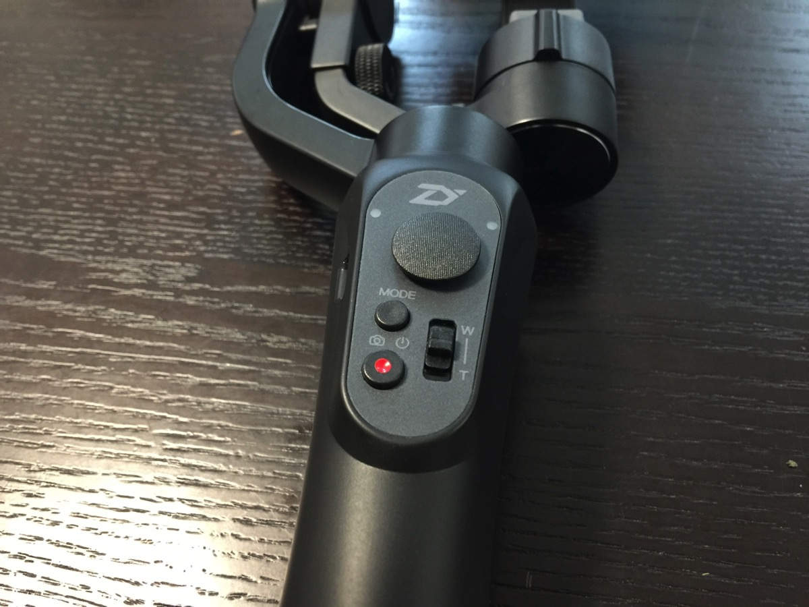

スマホ取り付け部分です。硬めになっており、上下にスマホを挟み込む構造になっています。
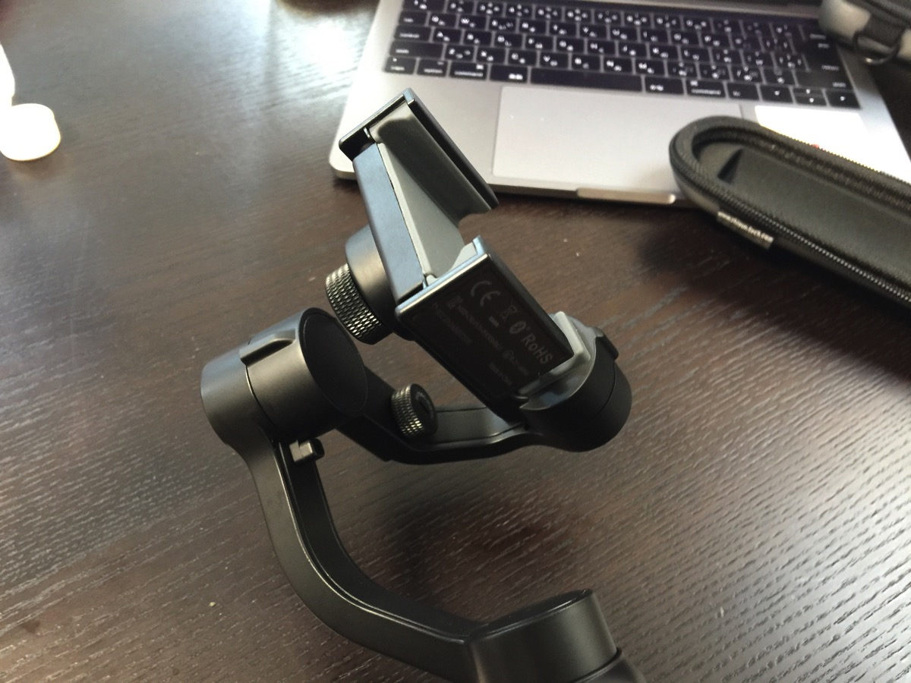

<h2>セッティング</h2>

装着時に少し調整が必要なのがめんどくさいです。スマホを装填した時に水平になるように調整します。そのあとでスイッチを入れてジンバル側に水平に物理的な調整をしてもらいます。

接続部分のネジで調整します。
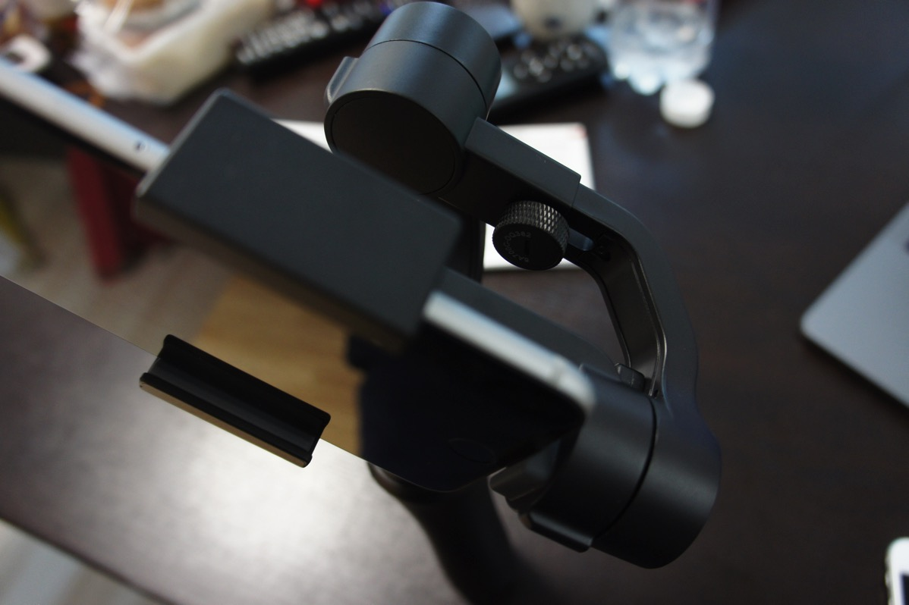

具体的にはこんな感じです。

調整前だとこんな感じ
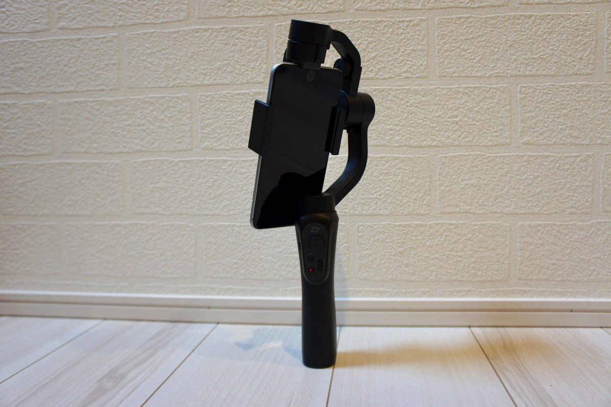

これを水平に調整します。
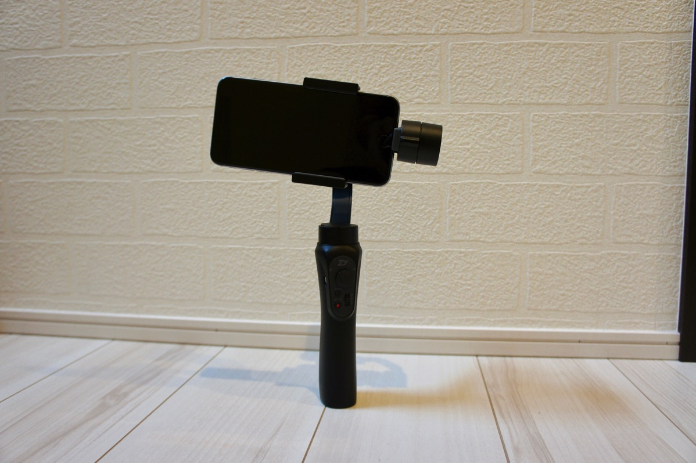

電源をつけて制御が入るとこんな感じ。
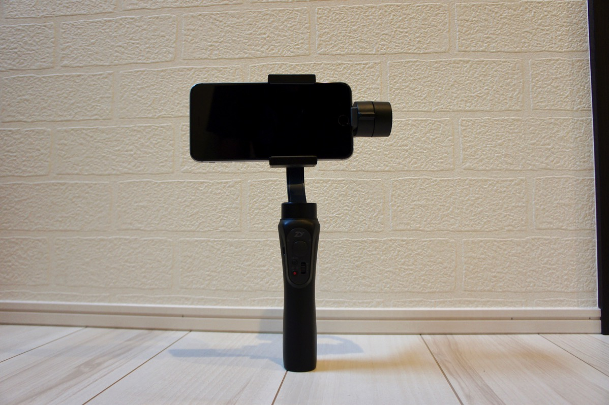

<blockquote class="twitter-tweet" data-lang="ja">
ジンバル届いたーいい感じ <a href="https://t.co/EN0v9Ut9Wb">pic.twitter.com/EN0v9Ut9Wb</a>
&mdash; しんぺー@mode of マロウ (@s_s_p_y) <a href="https://twitter.com/s_s_p_y/status/851049877534420992">2017年4月9日</a></blockquote>

わかりにくいですが、これで動かしても水平がたもたれてます。

ちなみに専用のアプリを使えば被写体を自動追尾したりもできます。

<a href="https://itunes.apple.com/jp/app/%E6%99%BA%E4%BA%91camera/id1123311040?mt=8&uo=4&at=11ld5P" target="_blank" >智云Camera</a>&nbsp;(無料)

<a href="https://itunes.apple.com/jp/developer/%E6%A1%82%E6%9E%97%E6%99%BA%E7%A5%9E%E4%BF%A1%E6%81%AF%E6%8A%80%E6%9C%AF%E6%9C%89%E9%99%90%E5%85%AC%E5%8F%B8/id1068407352?uo=4&at=11ld5P" target="_blank" >桂林智神信息技术有限公司</a>&nbsp;<a href="https://itunes.apple.com/jp/app/%E6%99%BA%E4%BA%91camera/id1123311040?mt=8&uo=4&at=11ld5P" target="_blank" style="width:100px;color:#ffffff;background:#298CDA;font-size:10px;font-weight:bold;text-align:center;display:inline;text-decoration:none;border:0px;padding:5px;border-radius:10px;background:-moz-linear-gradient(rgba(85,182,237,0.5), rgba(41,140,218,1));background:-webkit-gradient(linear, 100% 0%, 100% 100%, from(rgba(85,182,237,0.5)), to(rgba(41,140,218,1)));white-space: nowrap;">iTunes で見る</a>

(2017.04.09時点)

posted with <a href="http://pochireba.com" rel="nofollow" target="_blank">ポチレバ</a>

<h2>しんぺーはこう思った。</h2>

試しに動画を撮って見ましたが、手ぶれがなくなったぶん、動画の画質が綺麗に見える気がします。とにく花見なんかで桜をとったりするときに重宝します。

今月はせっかく沖縄に行くのでこいつを使って色々撮影したいと思います。

と言ったところで本日は以上になります。 
おやすみなさい。 
そして、また明日。

<a href="http://www.amazon.co.jp/exec/obidos/ASIN/B06XVXHZM5/warawareotoko-22/" target="_blank" >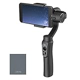</a>

<a href="http://www.amazon.co.jp/exec/obidos/ASIN/B06XVXHZM5/warawareotoko-22/" target="_blank" >SZABTO Zhiyun Smooth-Q スマホ用 3軸手持ちジンバル スタビライザー ハンドルグリップ 手振れ防止 撮影安定化 handheld Gimbal iPhone5 iPhone6s iPhone7 plus Sony Nexus等機種対応 6inch以内携帯用拭き布付き4色選択可能 (黒)</a>
posted with <a href="http://kaereba.com" rel="nofollow" target="_blank">カエレバ</a>

 Shenzhen Chengyi Security Co.,Ltd     

<a href="http://www.amazon.co.jp/gp/search?keywords=%20Zhiyun%20SMOOTH-Q%E3%80%80&__mk_ja_JP=%E3%82%AB%E3%82%BF%E3%82%AB%E3%83%8A&tag=warawareotoko-22" target="_blank" >Amazon</a>

<a href="https://hb.afl.rakuten.co.jp/hgc/0f6e221b.2eb9748a.0f6e221c.35cc1e84/?pc=http%3A%2F%2Fsearch.rakuten.co.jp%2Fsearch%2Fmall%2F%2520Zhiyun%2520SMOOTH-Q%25E3%2580%2580%2F-%2Ff.1-p.1-s.1-sf.0-st.A-v.2%3Fx%3D0%26scid%3Daf_ich_link_urltxt%26m%3Dhttp%3A%2F%2Fm.rakuten.co.jp%2F" target="_blank" >楽天市場</a>

<a href="//ck.jp.ap.valuecommerce.com/servlet/referral?sid=3041033&pid=882528283&vc_url=http%3A%2F%2Fsearch.shopping.yahoo.co.jp%2Fsearch%3Fp%3D%2520Zhiyun%2520SMOOTH-Q%25E3%2580%2580&vcptn=kaereba" target="_blank" >Yahooショッピング</a>

