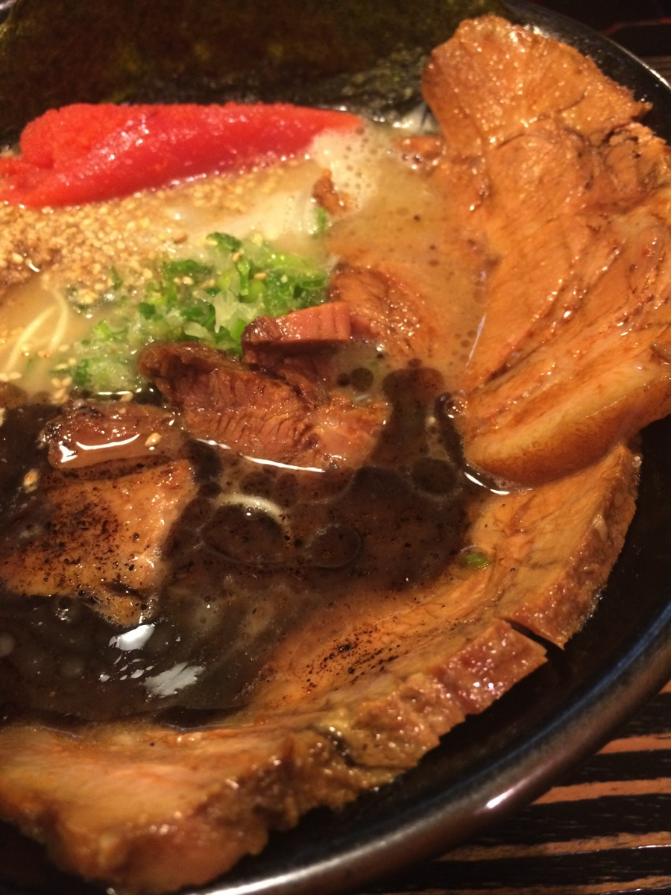
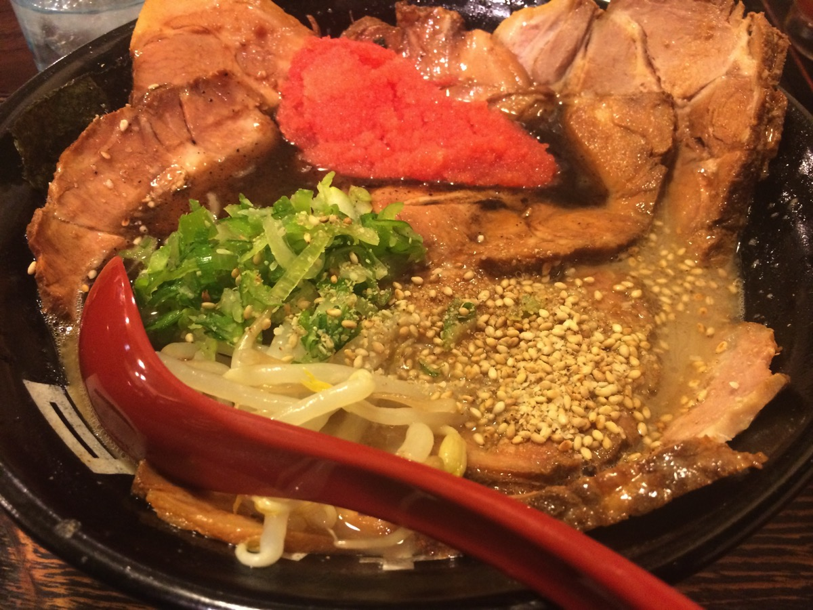
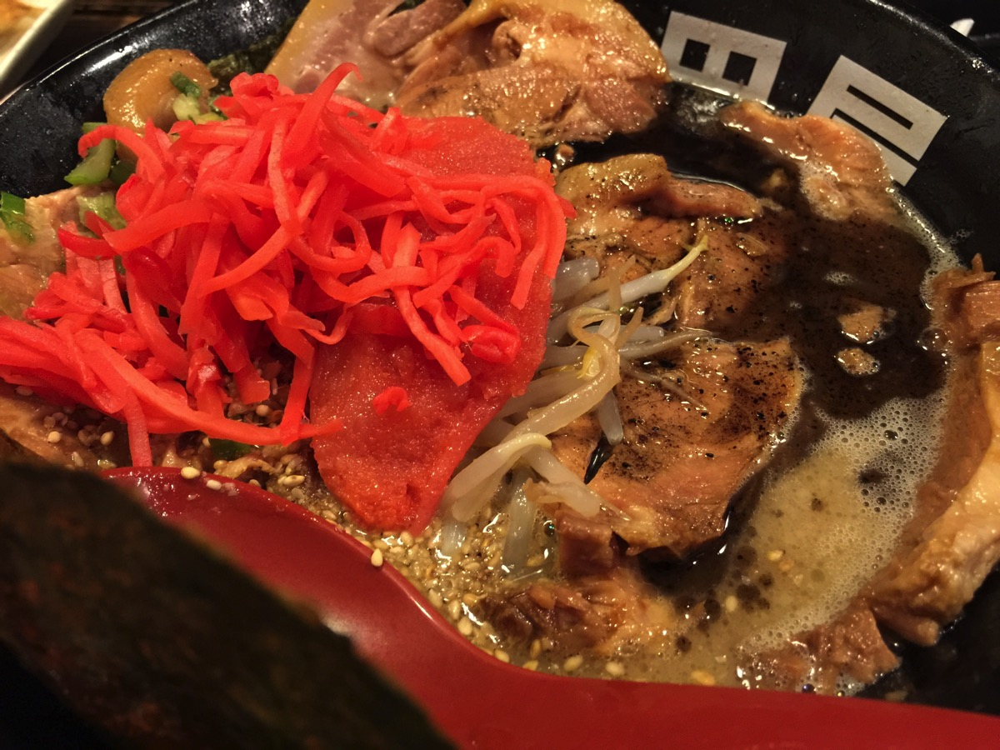

---
categories:
- グルメ
date: Mon, 24 Apr 2017 13:33:56 +0000
slug: post-10642
tags:
- ブログ
title: 明日地球がこなごなになるなら村田屋のラーメンが食べたい
---

巷では明日がXデーという噂が飛び交っている。具体的な時刻やらなんやら。そんなことよりも、明日もし地球がこなごなになるんだったらぼくは村田屋のラーメンが食べたい。<!--more-->村田屋とは神奈川県相模原市にあるラーメン屋である。

ぼくはここのラーメンが、それこそ死ぬほど好きだ。思い浮かべるだけでよだれがでてくる。思い浮かべるだけでよだれが出てくるのは梅干し以来はじめてだ。とにかく、うまい。うますぎて、食べに行った数時間後にまた行ったことがあるくらいだ。

あのとんこつスープで洗顔したい。コテっこてに黒ごまの焦がし油が浮いたスープのシャワーが浴びたい。チャーシューましにして明太子をトッピングしたあのいつものラーメンのスープを点滴で直接摂取したい。

一口目を口に含んだ時の、あの生きている実感。食べ終わった時の充実感、これが生というものなんだと確信できる。食べることは生きること。村田屋のラーメンを食べるということは生きているということ。そのためにぼくは生まれたんだと思える。

もし明日地球がこなごなになるなら、もしぼくが明日死ぬなら、村田屋のラーメンを食べたい。

しかしながr、そんな村田屋にもう2年近くいけていない。車を手放してから行けなくなってしまった。だいたいが車でも数十分かかる距離。思い出す。どうしても食べたくて、人をひく勢いで村田屋を目指し、食べ終わったあとは自転車にも追い抜かれるくらいの速度で帰路につく。

あの道がぼくの青春であり、そしてこれからも通るべき道なのだ。

また村田屋に行きたい。先日久しぶりによく行ってた別のラーメン屋に行った。そこもそこで美味しいのだが、やはり村田屋には及ばない。村田屋の代替えなんてない。村田屋に行きたい。

あれは数年前、何個か前にいた部署でぼくは到底終わらない量の仕事をもっていた。毎晩自動で落ちる照明を再度点灯させるのが日課になっていた。もちろんその後帰宅しても終わらない仕事を続ける。それでも終わらない、でもあと2時間でまた会社に行かないといけない。寝るのは1、2時間だけ。月曜日から金曜日までそんな日を過ごして、上司の目を盗んで逃げる金曜日。くらい裏道を足早に通り過ぎる時、今週も生き延びたと安堵する。そして村田屋のいっぱいを味わい生き抜いた喜びを実感する。

村田屋があったから生き残ってこれた。

村田屋に行きたい。

明日地球がこなごなになるなら

村田屋に行きたい。

