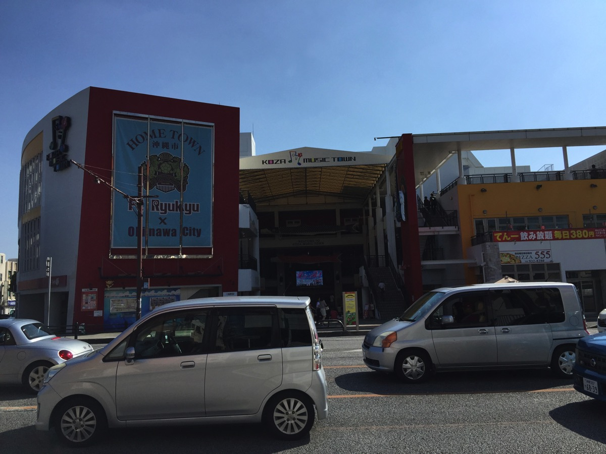
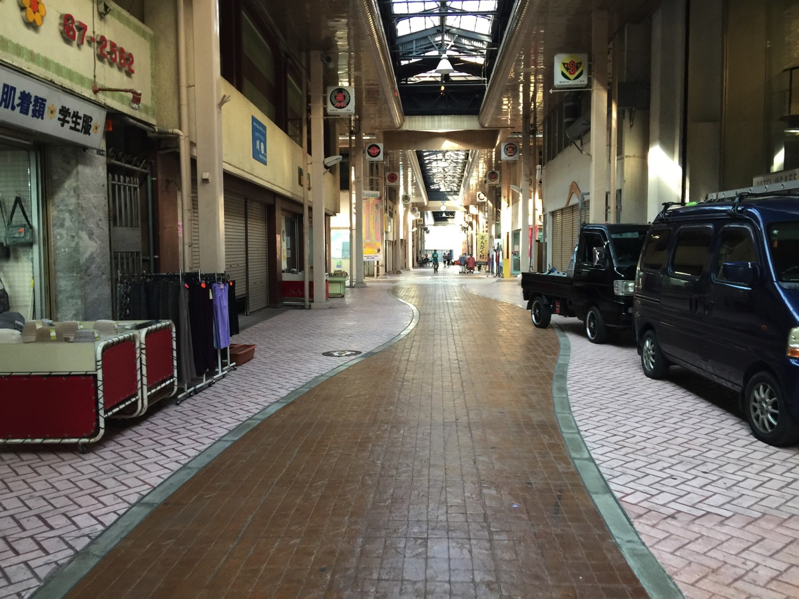

---
categories:
- DIR EN GREYのLIVEレポ
- TOUR16-17 [mode of THE MARROW OF A BONE]
date: Wed, 03 May 2017 12:02:26 +0000
slug: post-10653
tags:
- DIR EN GREY
- LIVEレポ
title: 【ライブレポ】DIR EN GREY TOUR16-17 FROM DEPRESSION TO ________ [mode of THE MARROW
  OF A BONE]ファイナル2017_4_29@沖縄ミュージックタウン音市場
---

DIR EN GREY史上初の沖縄公演ということでこれはいくしかないと思い、人生で数回目の遠征に行って来ました。本日は2017/4/29に行われたTOUR16-17 FROM DEPRESSION TO ________ [mode of THE MARROW OF A BONE]のファイナル沖縄ミュージックタウン音市場のLIVEレポです。<!--more--><h2>会場</h2>

会場はミュージックタウン音市場

<iframe src="https://www.google.com/maps/embed?pb=!1m18!1m12!1m3!1d3575.734202070193!2d127.79718431503264!3d26.335104983379825!2m3!1f0!2f0!3f0!3m2!1i1024!2i768!4f13.1!3m3!1m2!1s0x34e5120d95fd481b%3A0x6f3d6d1d0b61f0ed!2z44Of44Ol44O844K444OD44Kv44K_44Km44Oz6Z-z5biC5aC0!5e0!3m2!1sja!2sjp!4v1493775244083" width="600" height="450" frameborder="0" style="border:0" allowfullscreen></iframe>

タクシーに乗って行き先をいってもすぐにわかるくらいには知名度がある場所っぽい
時間まで周辺を歩いて見たけど、商店街がヤバイ
シャッター商店街というかもう人の気配がほぼしない廃墟みたいな感じだった。
ただ、そのぶん新しくお店を出そうとする人たちが工事してたりしてた。あとスタートアップ用のノマドカフェみたいなおしゃれな空間もあったり。あとは大通りに面してマックやモスやスーパーなんかもありました。

<blockquote data-width="500" data-height="375" class="ricoh-theta-spherical-image" >Post from RICOH THETA. - <a href="https://theta360.com/s/iVRk2nKL7t48lu1qQpZQbyUyK" target="_blank" rel="noopener noreferrer">Spherical Image - RICOH THETA</a></blockquote>

ちなみに会場のキャパシティは1100人らしいのですが、感覚的に新木場の１階の階段手前くらいの広さという感じでした。横幅はそこまで広くはなさそう。それくらいのスペースに柵が割と多めに設置されちました。

なお、下の画像がミュージックタウン1階からの画像です。フロアごとにグルーっと並んで、階段で3階まであがっていって最上階に会場があります。ぼくが到着した時は、1階の広場でイベントやってました。

<blockquote data-width="500" data-height="375" class="ricoh-theta-spherical-image" >Post from RICOH THETA. - <a href="https://theta360.com/s/fjOD3afDj2nk3QCiVlPPGsVxE" target="_blank" rel="noopener noreferrer">Spherical Image - RICOH THETA</a></blockquote>

<h2>セトリ</h2>

割と現地ファンが多かったのだろうか、遠征組が大半を占めてたのだろうか。割と見渡すと知ってる顔が多かったように思う。ただ、いつも起こらない歓声や拍手があったので、割と特別感があった。

それと途中何かの曲でマイク不具合だか、ケーブルがひっかかったのかでずーっと歌わせる感じになっていました。いつもなら京のご機嫌が心配な場面ですが、逆に盛り上がる要因になりました。陵辱の雨が歌詞表示になってました。若干。

あと、もしかしてTHE FINALやったのはツアー中はじめて？？
久しぶりにきくFINALに思わず涙がでました。

ラスト「何かラジオで二度とこーへんゆうたけど。もっかい来たいね沖縄。おやすみ」とのことでした。

CONCEIVED SORROW
LIE BURIED WITH A VEGEANCE
Agitated Screams of Maggots
THE PLEDGE
ROTTING ROOT
REPETITION OF HATRED
Midwife
凌辱の雨
艶めかしき安息、躊躇いに微笑み
DISABLED COMPLEXES
THE FATAL BELIEVER
THE DEEPER VILENESS
CLEVER SLEAZOID
激しさとこの胸の中で絡みついた灼熱の闇

EN.
秒「」深 旧ver
GRIEF
THE FINAL
詩踏み
Sustain the Untruth

<h2>セットと衣装</h2>

今回は前回の新木場と違ってわりと全体を見ることはできたと思いますが、思い返してみるとメンバーの個々の衣装の印象があまりない・・・　薫の網タイツを除いては

京はコートを着ていたきがする、DieとToshiyaはわりといつも通り？Shinyaは相変わらず白いお召し物

薫はロングのコートに、メイクはおそらく目の周りだけだった気がします。そして、スカートっぽいものに網タイツ

ステージはシンプルでしたがバックの下の方にだけ照明がありました。他の会場でも同様にあったのかな？全く気がつかなかった。

アンコールの時京はなんかのTシャツ（映画のTシャツっぽいなーと思ったら「死霊のはらわた」らしい）

<blockquote class="twitter-tweet" data-lang="ja">
本日の戦利品、薫がマイクスタンドに頭をぶつけながら投げたペットボトル <a href="https://t.co/kEgGBMC2tj">pic.twitter.com/kEgGBMC2tj</a>
&mdash; しんぺー@ (@s_s_p_y) <a href="https://twitter.com/s_s_p_y/status/858274625276436480">2017年4月29日</a></blockquote>

<h2>しんぺーはこう思った。</h2>

人生初めて沖縄にいったのですが、美ら海水族館ってめちゃくちゃ遠いのね！空港からだと100km離れてて、東京から山梨くらいの距離でしたw

高速のっちゃえば1時間、2時間でつくみたいだけどレンタカー借りなかったのとバスツアーとか申し込まなかったので、タクシーだと往復で30000円くらいになりそうだったので今回は断念。

また行く機会があったらばその時は海を満喫したいと思います。

次回のツアーもどこかしら遠征できればなー

と言ったところで本日は以上になります。 
おやすみなさい。 
そして、また明日。