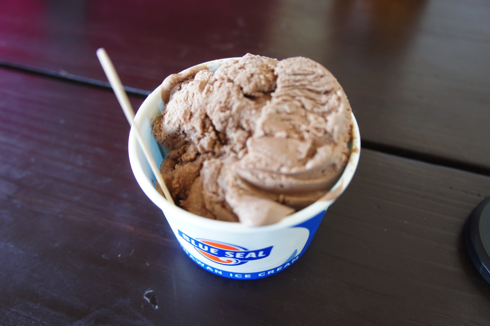
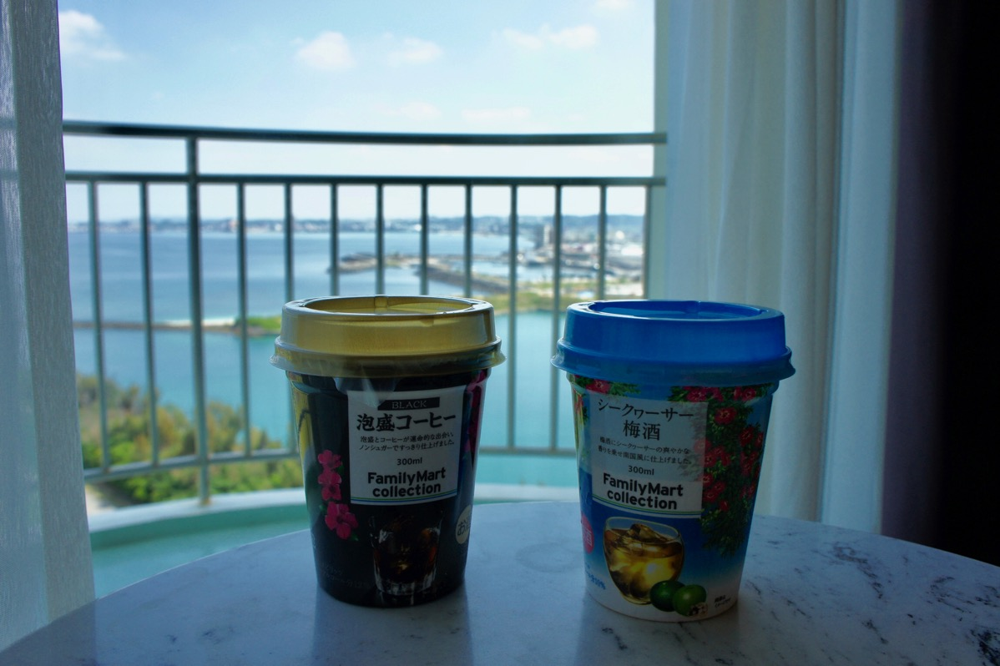
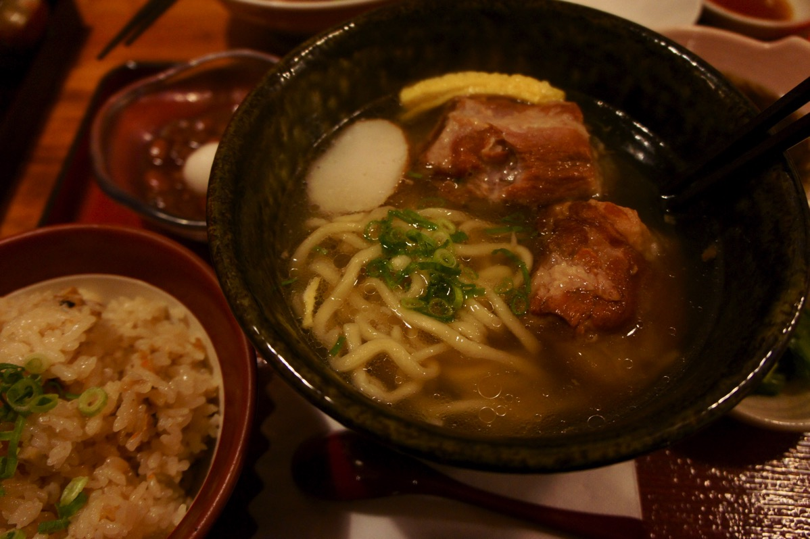
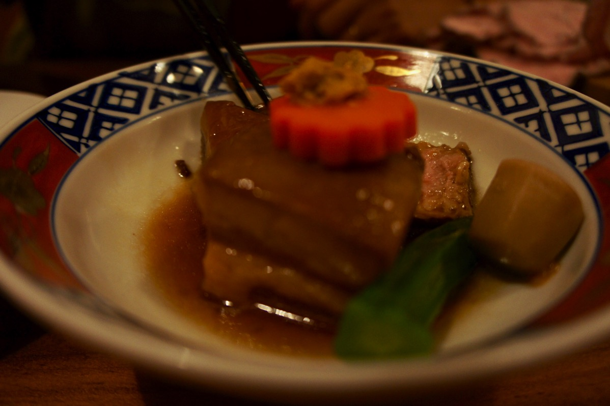
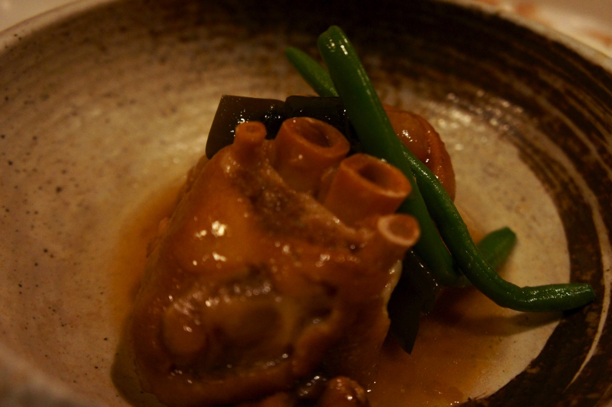
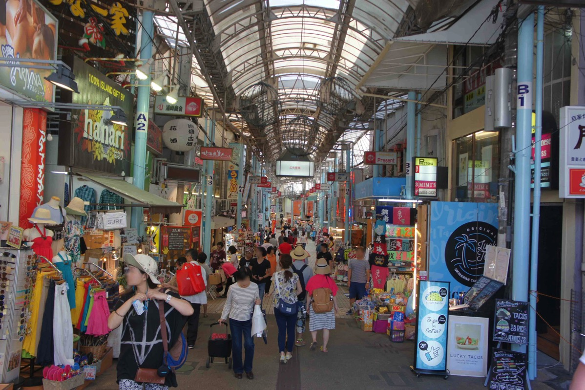
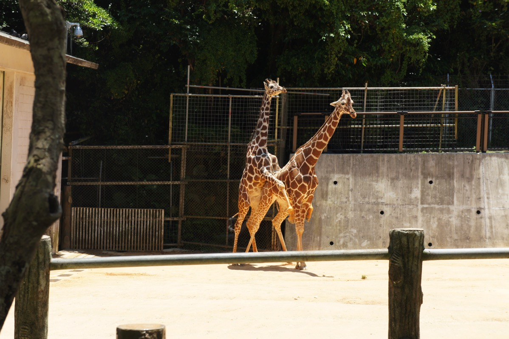
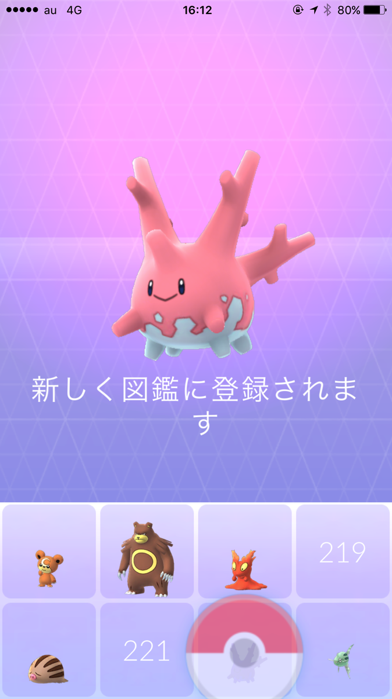

---
categories:
- ブログ
date: Sun, 07 May 2017 00:18:10 +0000
slug: post-10672
tags:
- ブログ
title: 個人的沖縄遠征備忘録
---

LIVEレポと内容分けます。

今回、1泊2日でLIVEがメインだったので大した観光ができませんでした。しかも行こうと思ってた美ら海水族館は思ってたよりも遠すぎて断念。その結果、市内くらいしかいけずに目新しい体験もとくにありませんでした。見たことのあるチェーン店と観光地化したゴミゴミした場所ばかりで、期待してた沖縄感はなかったなぁ。たぶん離島とかいかないと南国感ないかも

まぁそれでもそれなりに楽しかったのは確か！次回はもっと満喫したい！<!--more--><h2>食べたもの</h2>

コンビニよりも数が多いアイス屋

コンビニのコービーみたいなカップに入ってるコーヒー泡盛と梅酒。どちらも美味しかった！

ソーキそばというやつ。ソーキとは上にのってる豚肉のことらしい

ラフティーとたぶん豚足的なもの

<h3>国際通り</h3>
すごいゴミゴミしてていかにも観光地という感じでした。竹下通り感
修学旅行の学生がいるような感じ。振り返ってみると写真をほとんどとっていませんでした。

唯一あったのが、国際通り内にアーケードみたいなところの画像だけ。ここは商店街感がすごい。お土産もほぼここで買いました。

<iframe src="https://www.google.com/maps/embed?pb=!1m18!1m12!1m3!1d3579.43061848318!2d127.68272465063383!3d26.215194183351638!2m3!1f0!2f0!3f0!3m2!1i1024!2i768!4f13.1!3m3!1m2!1s0x34e56977701f0ffb%3A0x137a2164664af9fc!2z6YKj6KaH5Zu96Zqb6YCa44KK5ZWG5bqX6KGX!5e0!3m2!1sja!2sjp!4v1494128915141" width="600" height="450" frameborder="0" style="border:0" allowfullscreen></iframe>

<h3>子どもの国</h3>
割とちゃっち目な動物園です。多摩動物園とか上野動物園とかズーラシアに比べると手狭かつ動物の種類も少なく、沖縄にきてまで行く必要性があるのかはなはだ疑問

ただ、広くなくて動物も少ないので帰りのフライトまで時間が微妙に余ってるからどこか観光したいというような人にはむいているかも

<iframe src="https://www.google.com/maps/embed?pb=!1m18!1m12!1m3!1d3575.9827894731247!2d127.80206155063624!3d26.327056783301693!2m3!1f0!2f0!3f0!3m2!1i1024!2i768!4f13.1!3m3!1m2!1s0x34e512738000a60d%3A0x8be494fd3bd9ee0b!2z5rKW57iE44GT44Gp44KC44Gu5Zu9!5e0!3m2!1sja!2sjp!4v1494128847991" width="600" height="450" frameborder="0" style="border:0" allowfullscreen></iframe>

<h3>美ら海水族館</h3>
ここはいっていませんが、一つわかったこと。めちゃくちゃ遠いっぽいということ。ぱっといってぱっと帰ろうとか思っていましたが、那覇市内から100kmくらい離れてるし、時間にして2-3時間かかるっぽいし、タクシーだと往復2-3万くらいになりそうなので断念しました。

レンタカーを借りるのが最上の選択な気がします。バスツアーなんかもあるみたい。
それと帰る日に行くのは渋滞なんかもあるみたいなので危険かも。時間に余裕をもっていくことをお勧めします。

次回機会があれば行きたい！

<iframe src="https://www.google.com/maps/embed?pb=!1m18!1m12!1m3!1d3564.572301658487!2d127.8757379506437!3d26.694157983139913!2m3!1f0!2f0!3f0!3m2!1i1024!2i768!4f13.1!3m3!1m2!1s0x34e4fa3152619e3d%3A0xea08a6700fdd9ffe!2z5rKW57iE576O44KJ5rW35rC05peP6aSo!5e0!3m2!1sja!2sjp!4v1494128877729" width="600" height="450" frameborder="0" style="border:0" allowfullscreen></iframe>

<h2>カメラの話</h2>
今回持参したカメラは激安中華製アクションカム、ミラーレス一眼レフ、theta、あとはスマホでの撮影用にジンバル
正直色々持って行きすぎて全部中途半端だった。しかも荷物が多くなって撮影自体が億劫になってもうた。

今回の装備の欠点はミラーレスが重いのとiphoneの画角が絶望的に狭すぎる点
iPhone6plusだからなのか、iPhone7や次期iPhoneは手ぶれもついてるだろうし画角も広くなってるなら、もう旅行用はそれだけでいいんでないだろうか。多分理想は、ウェアラブルのジンバルにアクションカムマウントして、最新のiPhoneにしてスマホ用ジンバルは廃止してウェアラブルジンバルで代用。thetaはもってていいけど。

<h2>しんぺーはこう思った。</h2>

LIVEがメインだったので、海いって泳いだりもしてないし特に沖縄っぽいことは何もしませんでした。
次回はもっと観光したいなと

あ、唯一沖縄っぽいことしたとすると沖縄限定のポケモン「サニーゴ」をゲットしたことくらいでしょうか。ま、それでも沖縄十分楽しかった！次回は満喫したい！

といったところで本日は以上です。おやすみなさい。
そして、また明日。