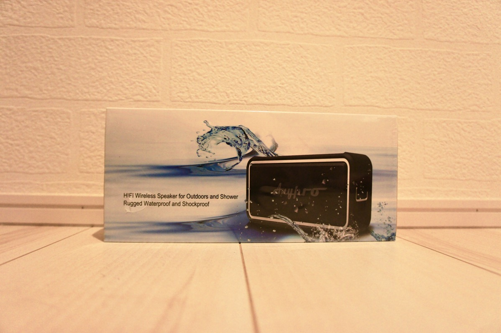
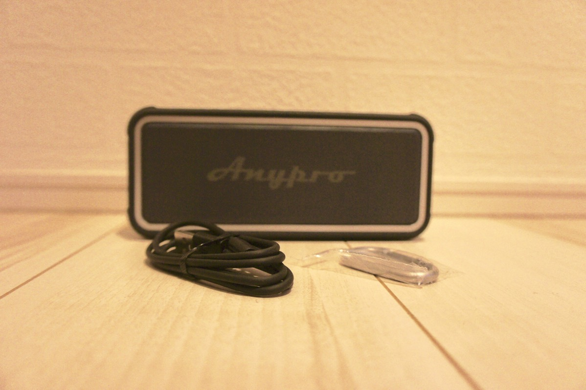
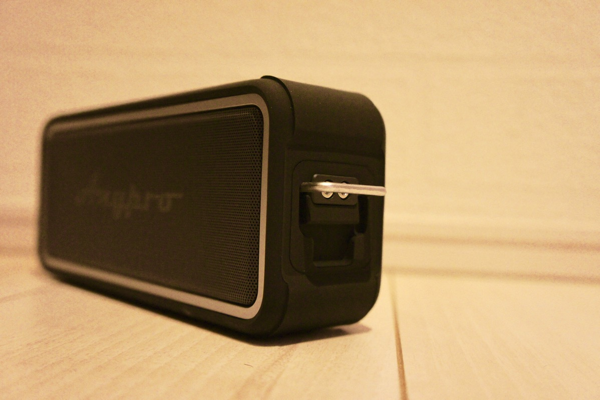
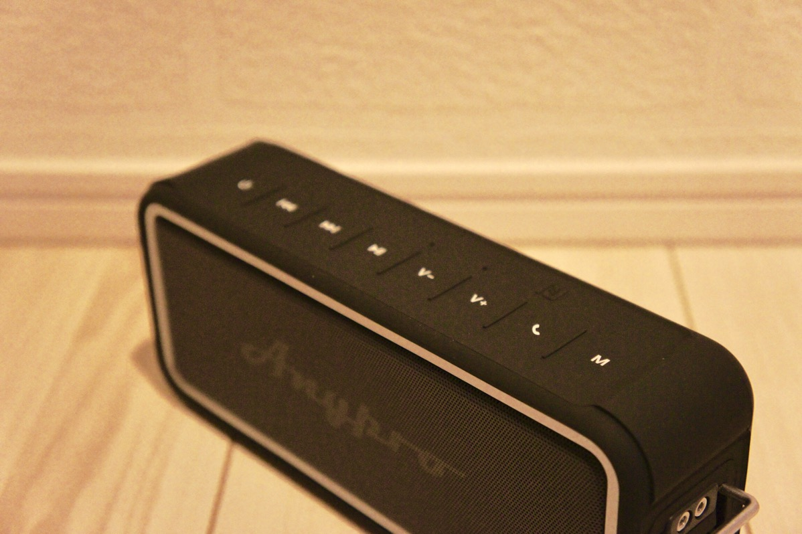
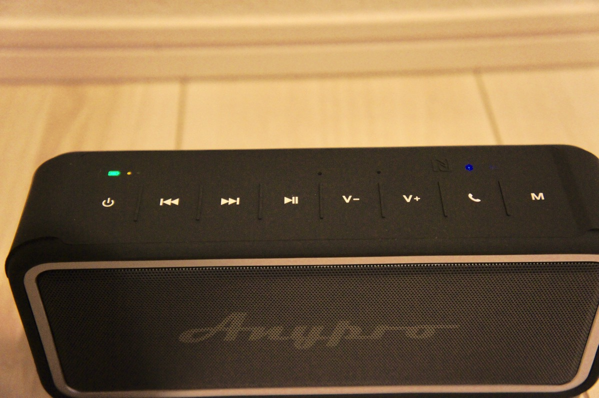
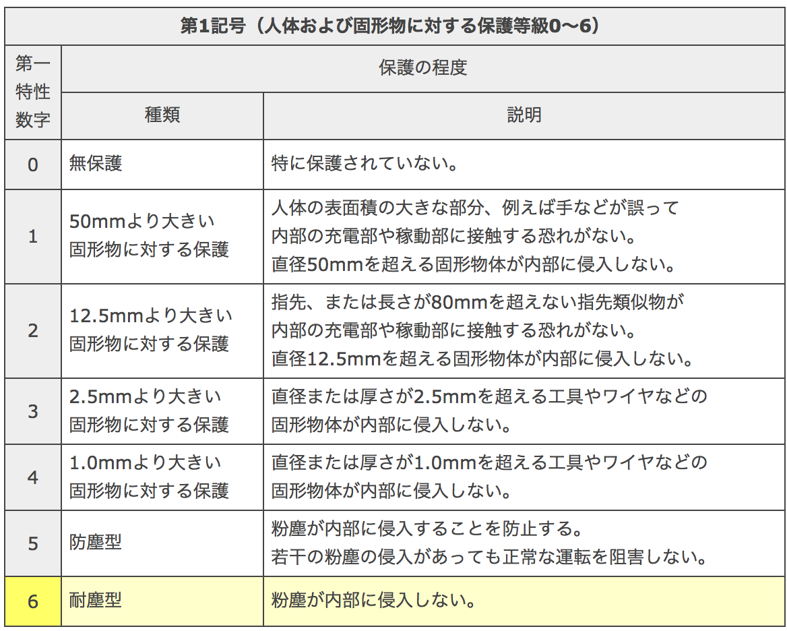
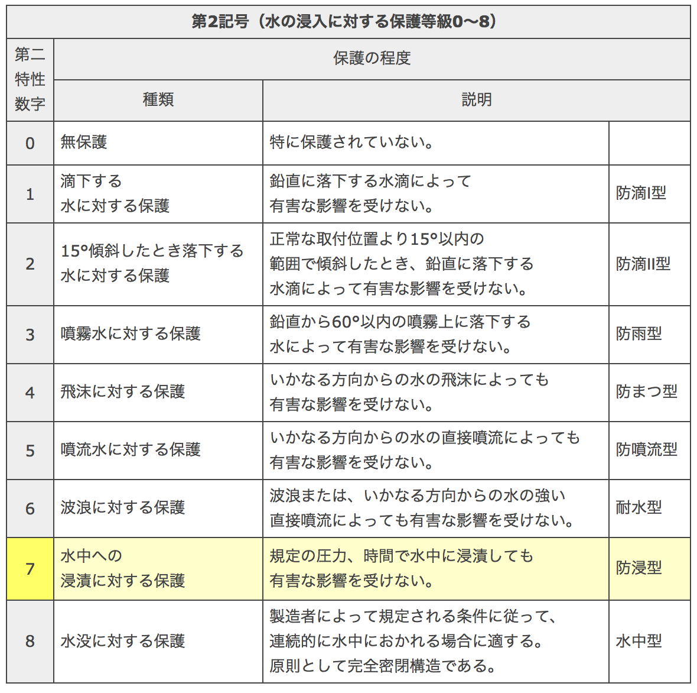
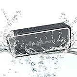

---
categories:
- レビュー
date: Tue, 09 May 2017 22:30:00 +0000
slug: post-10695
tags:
- ガジェット
title: ポータブルBluetoothスピーカー「AnyproQ1」が想像以上のクオリティだった【PR】
---

ブログを初めて4年くらいたちましたでしょうか。弱小ブログのぼくのところにもようやくきました商品提供。おそらく中国の方がGoogle翻訳を使ってメールを送ってきてくれたと思われますが、数回のやりとりを終えて配送いただきました商品のレビューでございます。<!--more--><h2>スペック</h2>

内臓電池：充電式リチウム電池 3.7v/4400mAh
入力電圧：3.7V
出力電圧：5V
オーディオ出力：5W ×　2
充電時間：5-6h
周波数特性：60Hz-18kHz
再生可能時間：6h
サイズ：189mm　×　51mm　×80mm

重量はわりとしっかりとしてて、500gくらいはありそうでした。<strong>カバンに入れて持ち運びするには少し重いかなという感じ</strong>です。

<h2>機能</h2>

内容物は本体と、USBケーブルとカラビナ

この側面をカラビナなりなんなりにつなげて落下防止とかに使用するみたいです。

上部にボタンがついていて、電源・曲送り・曲戻し・ボリューム・再生一時停止・通話・入力モード切り替えとか

伝わりずらいですが、全体的にゴムっぽいというかシリコン。砂とかがこびり付きそうな気がしますが防水なので多少ついてもさっと水で流せそうです。

スマホとの接続も簡単で、再生ボタン長押し。レスポンスもスピーカーから音声でかえってくるのでわかりやすいです。

電話マークのボタンを押すと接続しているiPhoneのSiriが起動します。また通常はハンズフリーで通話などもできるようです。（再生ボタンと、ボリュームボタンの上あたりにマイクが埋まってます。）

あと本体上側に有線で接続できるコネクタがついていました。AUX、Micro SDカードの接続もできるようです。

それとぼくはNFC端末をもっていないので試していませんが、NFC対応端末だと本体上部に近づけることでペアリングするみたいです。

<h2>防水機能はどれくらい？</h2>

こちらの商品防水をうたっていますが果たしてどれくらいの防水能力があるのでしょうか？
説明書には時に記載がなかったので、Amazonの商品詳細文を見てみるとIP67という等級のようです。

IPとはIEC（国際電気標準会議）およびJIS（日本工業規格）によると電気機器内への異物の侵入に対する保護の等級のことをさします。

IP67とは「粉塵が内部に侵入しない」かつ「規定の圧力、時間（30分間）で水中に浸漬しても有害な影響を受けない。」というものらしいです。

引用：http://www.nissinsan.jp/FAQ/faq1-4.html

ちなみにですがiPhone7が同じくIP67です。なので、完全なる防水ではないという印象です。どちらかというと耐水に近いかも。

多少水につけても大丈夫だけど、長時間だと浸水するかもしれないのでなるべく水をかけない方がいいかもしれません。というくらいに思っておいた方がいいかもしません。

<h2>Bluetoothなので遅延が発生する</h2>

当然ですがMacもBluetooth接続できました。Youtubeなどの動画などの音声もかなり綺麗でした。

<strong>ただし、Bluetoothですので当然遅延が発生します。</strong>

動画の視聴では画面と音声が微妙に遅れてきこえます。そんなには気になりませんが。
ただ、ゲームなんかをやろうとすると致命的かもしれません。それ以外にも動画編集や音楽制作などのクリエイティブな作業にも当然向いていません。

あくまで、音楽などを流す用途向きです。ただ音質は値段の割にはかなりいいと思いますので、コスパ的にはかなりよいものだと思います。またコンパクトな割に低音がかなりいい感じに出てます。床に置いていると響くのを感じられるくらいです。

<h2>しんぺーはこう思った。</h2>

ちょうど卓上のスピーカーを買おうかと思っていたのですが、これはかなり役にたつのではないかと思います。

と言ったところで本日は以上になります。 
おやすみなさい。 
そして、また明日。

<a href="http://www.amazon.co.jp/exec/obidos/ASIN/B01IEKTTDG/warawareotoko-22/" target="_blank" >Anypro ポータブル Bluetooth スピーカー IP67防塵＆防水認証 【全音域が自然のバランスで長時間持続再生】 低音強化 内蔵高質マイク搭載 NFC、Siri対応 デュアルドライバー臨場感 HFD-895</a>
posted with <a href="http://kaereba.com" rel="nofollow" target="_blank">カエレバ</a>

 Anypro     

<a href="http://www.amazon.co.jp/gp/search?keywords=Anypro&__mk_ja_JP=%E3%82%AB%E3%82%BF%E3%82%AB%E3%83%8A&tag=warawareotoko-22" target="_blank" >Amazon</a>

<a href="https://hb.afl.rakuten.co.jp/hgc/0f6e221b.2eb9748a.0f6e221c.35cc1e84/?pc=http%3A%2F%2Fsearch.rakuten.co.jp%2Fsearch%2Fmall%2FAnypro%2F-%2Ff.1-p.1-s.1-sf.0-st.A-v.2%3Fx%3D0%26scid%3Daf_ich_link_urltxt%26m%3Dhttp%3A%2F%2Fm.rakuten.co.jp%2F" target="_blank" >楽天市場</a>

<a href="//ck.jp.ap.valuecommerce.com/servlet/referral?sid=3041033&pid=882528283&vc_url=http%3A%2F%2Fsearch.shopping.yahoo.co.jp%2Fsearch%3Fp%3DAnypro&vcptn=kaereba" target="_blank" >Yahooショッピング</a>

