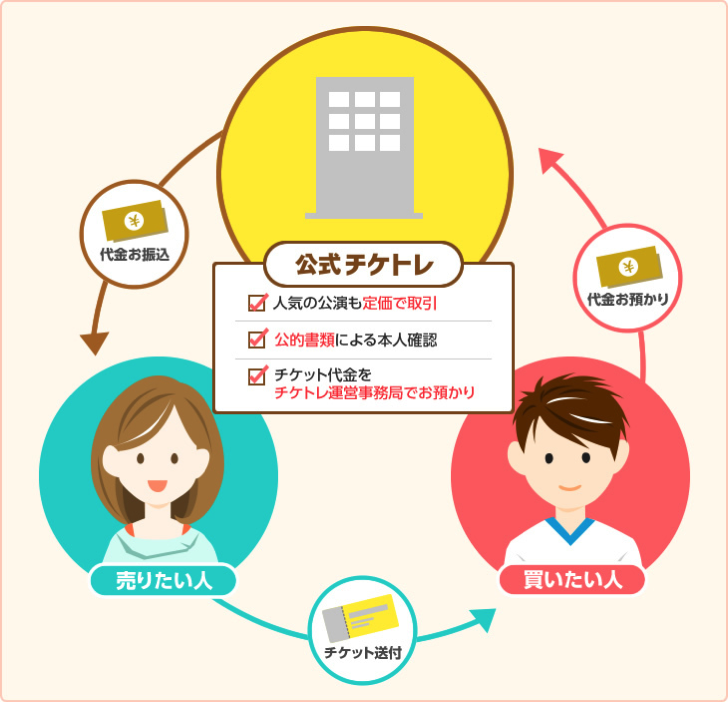

---
categories:
- music
date: Wed, 10 May 2017 22:30:00 +0000
slug: post-10706
tags:
- チケトレ
title: ぴあ初「チケトレ」が完全なる漁夫の利狙ってて全く使えなさそうな件
---

ぴあが運営を5月10日に発表しました業界初の公式チケットリセールサービス「チケトレ」を発表しました。昨今の<strong>チケット高額転売禁止</strong>の流れの一貫で定価での取引促進と悪質ではない高額転売への抑止になりそうな雰囲気をかもしだしていましたが、ふたを開けて見てびっくり。公式による手数料二重取り施策でございました。はい！かいさん！<!--more--><h2>「チケトレ」とは？</h2>

<a href="https://tiketore.com/">https://tiketore.com/</a>

ざっくりいうと次の3点
<ul>
	<li>公式のリセールサービス</li>
	<li>チケット券面金額での出品</li>
	<li>購入者には保証がある</li>
</ul>

まず、このサービスは音楽業界の各協会から委託をうけてチケットぴあが運営を行う公式の２次売買サイトです。チケットの出品は全て券面金額でされ、出品者・購入者のどちらも本人確認のために公的書類による情報登録が必要必須となっています。

また、購入証明書の発行もあります。さらに万が一購入したチケットが偽造チケットや不正チケットであったりして、コンサートへの参加ができなかった場合などは、全額返金保証なども用意されているようです。

<h3>取引の流れ</h3>

<ol>
	<li>公的書類による本人確認を行い登録した出品者が公演名を選んで出品</li>
	<li>公的書類による本人確認を行い登録した購入者が落札</li>
	<li>出品者がチケットを発送</li>
	<li>購入者がチケットを受け取る</li>
	<li>公演日の4日後に運営から出品者にお金が振り込まれる</li>
</ol>

こんな感じです。

<h3>手数料</h3>

出品及び購入には取引手数料が発生します。

・出品手数料：出品チケット金額の10％　3999円以下は400円（出品者）
・購入手数料：購入チケット金額の10%（購入者）

さらに、決済システム手数料が購入したチケット金額の3%かかります。（購入者）
さらに、送金システム手数料として380円かかります。（出品者）

定価7000円のチケットが取引される場合

出品者は700円＋380円の手数料と送料の負担をすることになります。

7000円　ー（出品手数料700円＋送金システム手数料380円+送料約400円）＝ 5520円

負担する手数料は1880円
手元に入るお金は5520円

購入者は700円＋210円の手数料を負担することになります。

7000円　＋（購入手数料700円＋決済システム手数料210円）＝ 7910円

負担する手数料は910円
かかるお金は7910円

<h2>こんなの高額転売の抑止にすらなっていない</h2>

これ全くの本末転倒でしょう。

だいたい高額転売がなぜ禁止だと言われているのかというと、業者によるチケットの買い占めがされ一般のファンがこれなくなるからというのと、高額転売チケットを購入することによる可処分所得の減少という2点が問題なわけです。

このサービスを利用する出品者が仮に定価でしか譲りたくないという普通の人だったとします。SNSで実費分こみで取引してくれる人を探すでしょう。

なんで、高額な手数料を負担してまでこんなサービスを使わなきゃいけないのよ

で、一方出品者が場合によっては定価以上で売ることも辞さない人だった場合、他のサービスに比べて優位性が皆無なのに抑止にはなりえない。高額手数料を払わずにもうかるチケキャンで売りにだすに決まってんじゃん。

ということで、これ何の役にも立たないサービスです。

映画上映の前に客を泥棒呼ばわりするあのCMと同じ構造で警告を待ちがったところに流してる。

取り締まるべきは転売業者だろ

<h2>しんぺーはこう思った。</h2>

オリラジの転売撲滅の話もそうだけど結局はどっかに負担を押し付ける構造になるわけです。

音楽業界というよりもこれチケット業界の構造の問題ですな。

業者じゃなくて個人を取り締まりたいなら、善人による相互管理システムを作る方が早いんじゃないかと感じてる。マストドン的な。

全員に、だれがどのチケットを譲りたくて、だれがどのチケットを譲ってほしいかわかる相互監視的なという意味でのブロックチェーン的発想のなんかを作るしかないんじゃねと思いました。

そうすれば、あ、あいつ定価以上で売ろうとしてるわーって。でなみにそこでやりとりされるのは参加権だけで、チケットのやり取りはしない。

最終的に権利者に対してデジタルチケットが送られてきて、入り口でピッてやって入場的な。

コストの部分は出品者に対して月額制で請求。もちろんどちらも低額で。

出品者の月額制ってのは結構現実的だと思うけど。だって複数公演友達と一緒に申し込んでどっちも当選したらさばかなくちゃいけないわけで、そうなると保険みたいな感じで登録しておいた方が結果的に早く確実にはけさせられるでしょう。これうまくいけば販売した分のチケット枚数＝動員数になるんじゃないかろうか。

ま、眠いまなこをこすりながら適当に書いてるん真に受けないで

と言ったところで本日は以上になります。 
おやすみなさい。 
そして、また明日。