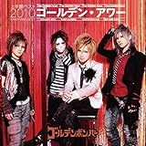

---
categories:
- music
date: Sat, 13 May 2017 07:34:04 +0000
slug: post-10710
tags:
- ブログ
title: 岡崎体育とゴールデンボンバーの類似性に対する私的見解
---

岡崎体育の新曲がでるみたいでMVをちらっと見ました。そしたらこれまた衝撃的だったので2回ほど聴いた時点での感想を書きたいと思います。<!--more--><h2>岡崎体育の新曲「感情のピクセル」の解釈</h2>

<iframe width="560" height="315" src="https://www.youtube.com/embed/3yoJY0IqiV0" frameborder="0" allowfullscreen></iframe>

これ見て、こういう若手バンドいるよねって思ったあとに「うんぱっぱーの」の部分見て、若手ロックバンドへのパロディだと解釈するのは早計だとぼくは思います。

ぼくは、これ見ててむしろ<strong>最近のリスナーは歌詞なんか聴いてなくて雰囲気重視</strong>ということを言ってるように思いました。作り手に対してももちろん揶揄がある一方で聴き手にもメッセージがあると思います。

岡崎体育のことはMUSIC VIDEOくらいしか知らないしLIVEも見たことないのですが、新曲のMV見てるとそういえばこういう表現方法って知ってるなーってのを感じました。

<strong>それがゴールデンボンバーです。</strong>

自身のバックボーンにたちつつ、ジャンルの雰囲気へのアンチテーゼをいかにもそれっぽい曲調と歌詞で表明する手法。それでいて特定の誰かをディスっているわけでもなく誰を傷つけるでもない。今風のパンクロックだと思う。

ゴールデンボンバーの「†ザ・V系っぽい曲†」という曲がまさにそれ。ぼくはこの曲で初めてゴールデンボンバーを知り笑い転げました。

<a href="http://www.amazon.co.jp/exec/obidos/ASIN/B00OM9VJJQ/warawareotoko-22/" target="_blank" >†ザ・V系っぽい曲†</a>
posted with <a href="http://kaereba.com" rel="nofollow" target="_blank">カエレバ</a>

ゴールデンボンバー eulid agency 2010-08-18    

<a href="http://www.amazon.co.jp/gp/search?keywords=v%E7%B3%BB%E3%81%A3%E3%81%BD%E3%81%84&__mk_ja_JP=%E3%82%AB%E3%82%BF%E3%82%AB%E3%83%8A&tag=warawareotoko-22" target="_blank" >Amazon</a>

<a href="https://hb.afl.rakuten.co.jp/hgc/0f6e221b.2eb9748a.0f6e221c.35cc1e84/?pc=http%3A%2F%2Fsearch.rakuten.co.jp%2Fsearch%2Fmall%2Fv%25E7%25B3%25BB%25E3%2581%25A3%25E3%2581%25BD%25E3%2581%2584%2F-%2Ff.1-p.1-s.1-sf.0-st.A-v.2%3Fx%3D0%26scid%3Daf_ich_link_urltxt%26m%3Dhttp%3A%2F%2Fm.rakuten.co.jp%2F" target="_blank" >楽天市場</a>

<a href="//ck.jp.ap.valuecommerce.com/servlet/referral?sid=3041033&pid=882528283&vc_url=http%3A%2F%2Fsearch.shopping.yahoo.co.jp%2Fsearch%3Fp%3Dv%25E7%25B3%25BB%25E3%2581%25A3%25E3%2581%25BD%25E3%2581%2584&vcptn=kaereba" target="_blank" >Yahooショッピング</a>

この２組にはぜひツーマンでLIVEやってもらいたい。ロフトあたりで。

ちなみにゴールデンボンバーは「女々しくて」しか知らんという人もいるかもしれないけど他に名曲はいくらでもある。

「トラウマキャバ嬢」「ultra PHANTOM」「ワンマン不安」「タイムマシンが欲しいよ」とか

おすすめです。

<h2>しんぺーはこう思った。</h2>

岡崎体育ちゃんと聴いたら奥が深そうで深くなさそう。。。とりあえず前回DIR EN GREYも出たフェスには行かなかったので今後機会があれば見てみたい。すっごい面白いらしい。。。

と言ったところで本日は以上になります。 
おやすみなさい。 
そして、また明日。