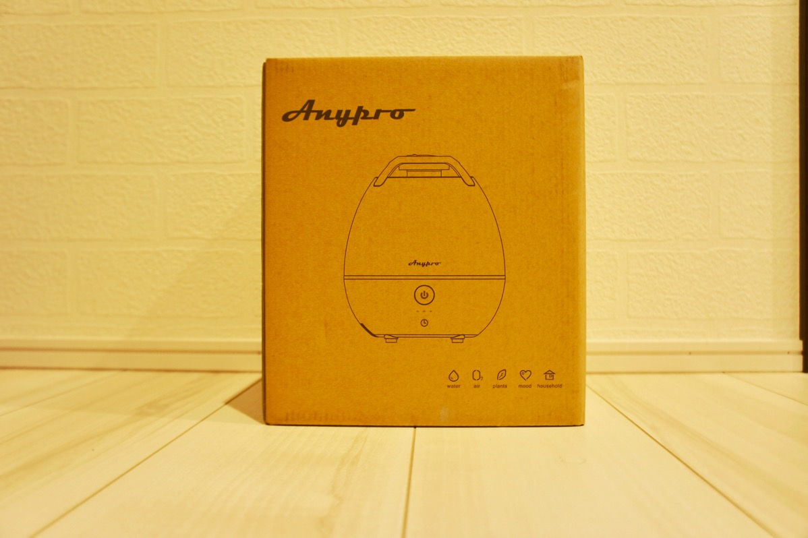
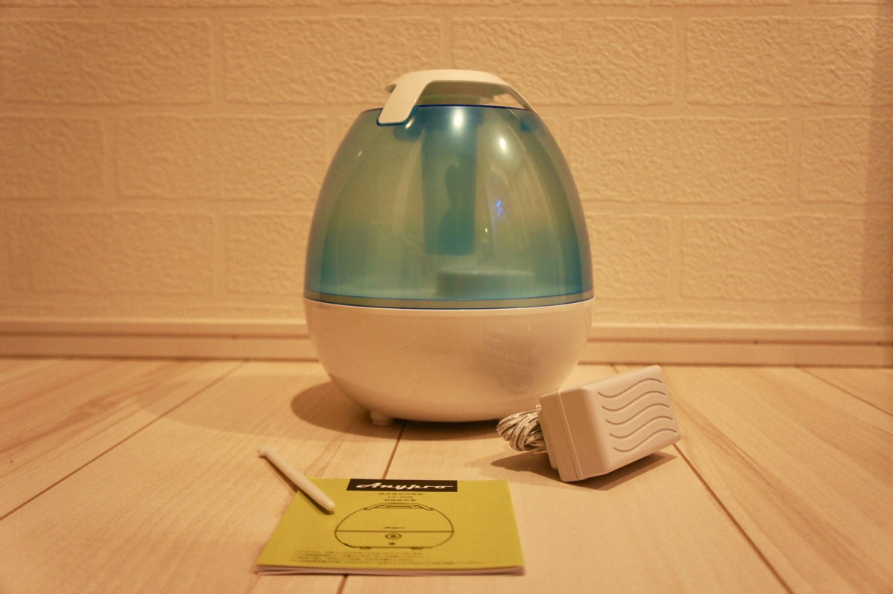
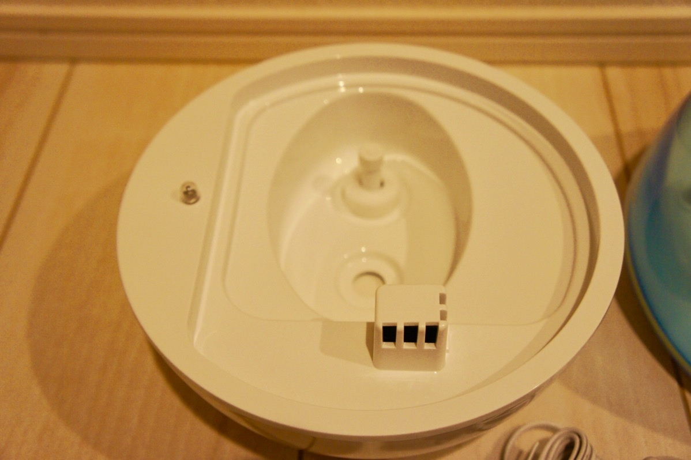
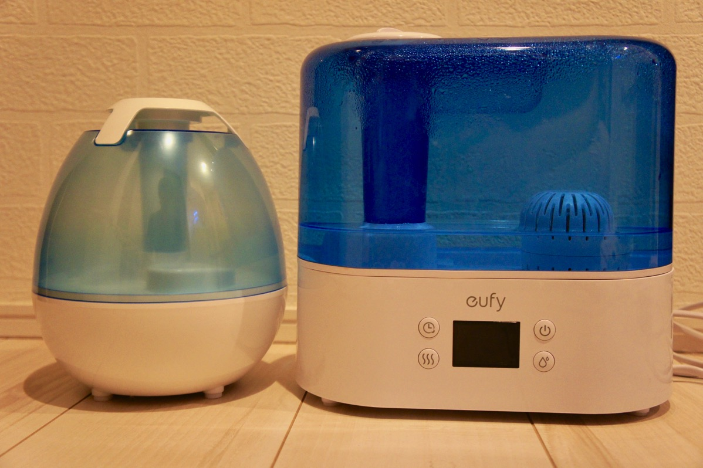
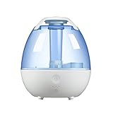

---
categories:
- レビュー
date: Mon, 15 May 2017 22:30:00 +0000
slug: post-10752
tags:
- ガジェット
title: Anyproの2L加湿器が一晩越すにはちょうどいい大きさという話【PR】
---

前回Bluetoothスピーカーを提供いただきましたAnyproさんから、また商品提供をいただきました。今回ご紹介するのは加湿器「CF-2520」です。ちょっと時期が若干外れちゃっていますが、たまにすっごい寒い夜があるので暖房をつけて寝ます。そんな時に使ってみました。<!--more--><h2>超音波式でタンクは2L。普通の家ならちょうどいい</h2>

加湿器は大別して大体3種類あります。水に風をあてて水分を気化させることで加湿する<strong>「気化式」</strong>、超音波により水を振動させて水を細かな分子にして噴出し加湿する<strong>「超音波式」</strong>、沸騰させて加湿する<strong>「スチーム式」</strong>です。

今回提供いただいた商品は超音波式に分類させる製品です。超音波式の製品は小型で安価という特徴があります。

こちらも想像以上に小型な製品でした。

同梱物はかなり少ない。本体とアダプターと説明書と掃除するためのブラシのみ

ここが超音波を発生する部分

ちなみにeufyの4Lの加湿器だとだいたいこんくらいの違いです。夜中寝る時だけつける寝室用だとすると、水がなくなるのが4Lだとだいたい2~3日くらいかかります。2Lだと1日〜2日くらい水を継ぎ足すことなく使えることでしょう。

無駄な既往はついていません、水を入れてスイッチを入れるだけ。空焚き防止器機能はついているみたいですが、一応1,3,6時間のタイマー設定も可能。

ざっとこんなところでしょうか。思っていたよりも小型な部分がかなりちょうど良いかなと思いました。適用床面積は木造和室約５畳、プレハブ洋室約８畳ということで一人暮らしの部屋や寝室用などにもってこいの大きさだと思います。

eufyの加湿器4Lは正直大きすぎですが、こっちはちょうど良い

<h2>気になるところ</h2>

形状がボール型なので万が一足に引っ掛けた場合、水がこぼれやすそうなのではと思いました。

あとは超音波式なので雑菌の繁殖も気をつけたいところ。eufyの場合はタンクと本体部分の間に活性炭フィルターが付いていましたがこちらの製品はそういったものはなく、極力シンプルな構造となっています。なので、あまった水はこまめに捨てて、使わない時は本体とタンクを別にして感想させておくなどした方がよいかもしれません。

ただ、この製品の売りは安価なのとちょうど良い大きさという点だと思いますので、そのあたりを気をつければ全然買いの製品です。

<h2>しんぺーはこう思った。</h2>

あと超音波式全般に言えることは、水分を振動させて気化させる時にミネラルやカルシウム分も空気中に送り込みます。そのため部屋の壁や物に多少それらが付着して白くベタつく可能性があります。

eufyを使っている部屋でその現象が顕著に起きています。
その辺りはまぁ超音波式加湿器の宿命かな

とりあえずこの製品自体は「ちょうど良い」のでとても満足です。

と言ったところで本日は以上になります。 
おやすみなさい。 
そして、また明日。

<a href="http://www.amazon.co.jp/exec/obidos/ASIN/B01NCVDC5J/warawareotoko-22/" target="_blank" >Anypro 加湿器 卓上 加湿器 枕元 加湿器【最初代1/3/6hタイマー付加湿器】2L 持続加湿 自然に潤う加湿器 超音波クールミスト 水漏れ防止 ミスト360度垂直噴出 空焚き防止機能付き加湿器 省エネ 大切な方へ CF－2520</a>
posted with <a href="http://kaereba.com" rel="nofollow" target="_blank">カエレバ</a>

 Anypro     

<a href="http://www.amazon.co.jp/gp/search?keywords=anypro%20%E5%8A%A0%E6%B9%BF%E5%99%A8&__mk_ja_JP=%E3%82%AB%E3%82%BF%E3%82%AB%E3%83%8A&tag=warawareotoko-22" target="_blank" >Amazon</a>

<a href="https://hb.afl.rakuten.co.jp/hgc/0f6e221b.2eb9748a.0f6e221c.35cc1e84/?pc=http%3A%2F%2Fsearch.rakuten.co.jp%2Fsearch%2Fmall%2Fanypro%2520%25E5%258A%25A0%25E6%25B9%25BF%25E5%2599%25A8%2F-%2Ff.1-p.1-s.1-sf.0-st.A-v.2%3Fx%3D0%26scid%3Daf_ich_link_urltxt%26m%3Dhttp%3A%2F%2Fm.rakuten.co.jp%2F" target="_blank" >楽天市場</a>

<a href="//ck.jp.ap.valuecommerce.com/servlet/referral?sid=3041033&pid=882528283&vc_url=http%3A%2F%2Fsearch.shopping.yahoo.co.jp%2Fsearch%3Fp%3Danypro%2520%25E5%258A%25A0%25E6%25B9%25BF%25E5%2599%25A8&vcptn=kaereba" target="_blank" >Yahooショッピング</a>

