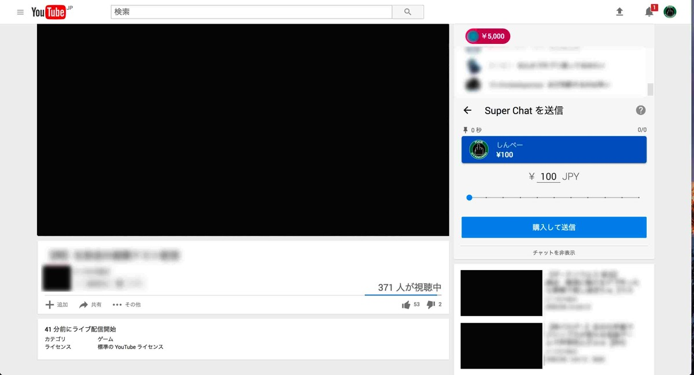

---
categories:
- youtube
date: Tue, 16 May 2017 22:13:00 +0000
slug: post-10756
tags:
- youtube
title: クリエーター支援は自分の内面的行為。Youtubeの投げ銭システム「SUPER CHAT」をご存知でしょうか？
---

Youtubeの投げ銭システム「SUPER CHAT」をご存知でしょうか？生放送をしているチャンネルに対してコメントを残しつつクリエーターに直接お金を振り込める仕組みです。最近youtubeは生放送に力を入れているようで、こうした機能が最近追加されました。

金額は200円からあり、金額に応じてコメント欄の1番上に表示される時間がことなります。より高額の投げ銭をした人のコメントが上位に表示されるようになっており、自分の好きなクリエーターに見てもらいたいユーザーがより高額を振り込むような形になっています。うまいですねー

<!--more-->

実際の投げ銭画面はこんな感じ

で、今日はなんでこの機能について書いているかというとぼくが自分が好きなクリエーターを支援するのが好きだから。Youtubeは無料で視聴できて、配信者には広告費用振り込まれるけど、自分がすっごい好きな配信者にはもっと具体的に支援したいし何より<strong>帰属を示したい</strong>と思ったからです。

<h2>要は、お布施がしたんです。</h2>

ただ勘違いしないでいただきたいのは、よく言われる「CDを買ってくれないとバンドが解散するから買って」的なことではないんです。そんなの知ったこっちゃない。買われないことで解散するバンドなんか、流行らないから潰れる飲食店と同じだろ。時流にあってないし、必要とされてないから解散すんだろ。ファンが少ないならそれでも存続できるようなビジネスしなさいやという感じ。

そうじゃなくて、このお布施っていう行為は自分の内向きな表現の表出なんだと思ってます。自分の中で自分がファンであるということを明確に具現化する行為の１つ。

もちろんこれを他人への表現として行う人もいると思う。ホストに貢ぐ女性のそれが近いかな。このホストに私こんだけ金出してるのよ！っていう周囲への威嚇と自尊心の表現。

投げ銭システムはどちらかというとこれに近い気がするけどね。

でも自分がやりたいのはそういうベクトルじゃないんですわ。自分の満足のためにやってるだけです。

ということで、ぼくはこれからもyoutubeゲーム実況者の「けつ毛中級兵」を応援いたします。

<h2>しんぺーはこう思った。</h2>

最近youtubeはLIVE配信機能「Youtube Live」にかなり力を入れている様な気がします。いま配信中のLIVEなどをレコメンドされたりするし。

配信者側もLIVE機能をうまく活用している人が増えてきている気がしますし。

ただ割とマメな配信者でないとアーカイブとして残してくれないのでなるべく通知を見逃さない様に気をつけるしかないのが難点です。

といったところで本日は以上です。おやすみなさい。
そして、また明日。