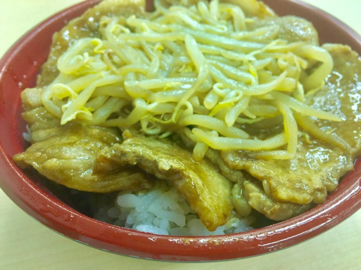

---
categories:
- ブログ
date: Wed, 17 May 2017 21:14:22 +0000
slug: post-10759
title: 食べものをカット制限するくらいなら運動した方がマシ！３日間だけ糖質気にしてみたけど意味なかった
---

体重を今から2kgほど減らしたくて、月曜日から3日ほど糖質を気にして食事してみました。ちょっと前まではランチなんか何も気にせずに好きなものを食べてたんですが、会社付近に美味しいお店がなかったので自炊するようになりました。会社の電子レンジを使ってご飯を炊いたり、パスタ茹でたり、インスタントラーメン作ってみたりして食べるようになりました。その結果、普段のランチ代が800～1,000円くらい節約できるようになりました。体重も心なしか1~2kg減りました。これをさらに減らしたくて流行りの糖質制限というのをちょっとやってみました。が、全く変化がありませんでした。

<!--more-->

具体的に食べたものは以下の通り

1日目
<ul>
	<li>朝食　コンビニのチキン揚げたやつ</li>
	<li>昼食　カルボナーラ大盛り</li>
	<li>夕食    肉と野菜(ご飯抜き)</li>
</ul>

2日目
<ul>
	<li>朝食　コンビニのチキン揚げたやつ</li>
	<li>昼食　大戸屋の生姜焼き定食(五穀米)</li>
	<li>夕食    肉と野菜(ご飯抜き)</li>
</ul>

3日目
<ul>
	<li>朝食　おにぎりとワンタン</li>
	<li>昼食　ミートソーススパゲティチーズトッピング400g</li>
	<li>夕食    肉と野菜(ご飯抜き)</li>
</ul>

振り返ってみると、気合い入れてやって人からするとはいー？？？ってくらい緩いと思います。ただ夕食には白米を取らなかったりしてるので、いつもに比べると多少は制限しています。

でも、一切体重は変わりませんでした。むしろランチ肉断ちしてた時の方が若干減ってた気すらする。

なので、糖質制限はこれくらいの緩さじゃすぐに効果はでなさそうなのと、好きなものを食べるの我慢するのやめようて筋トレとか運動やろうと思います。

好きなものを好きな様に食べられないなんていやー！！！ 
ということで本日のランチ！

<h2>Uner EATSにて注文「アシェット」の巨大豚肉丼</h2>

ずっと気になってたインスタ映えしそうな豚肉丼

Uberが持って来てくれるメニューは2種類だけ。豚肉丼の並盛りと大盛り。といっても並盛りで400g、大盛りで650g。デカすぎwww

今回は並盛りを注文しました。

キャンペーンコード使えば1000円分ただですよ〜

eats-c2p8i

<h2>しんぺーはこう思った。</h2>

食べたいもの食べて、しっかり運動して、しっかり眠る。そうすればきっと体重減るはず！！ということで食べ物じゃなくて筋トレとかをちゃんとしようと思います。

といったところで本日は以上です。おやすみなさい。
そして、また明日。