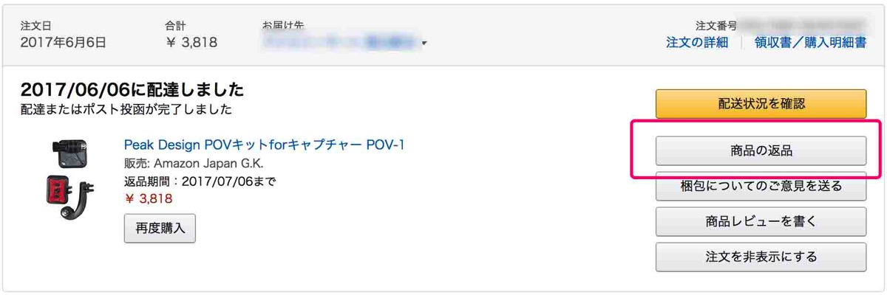
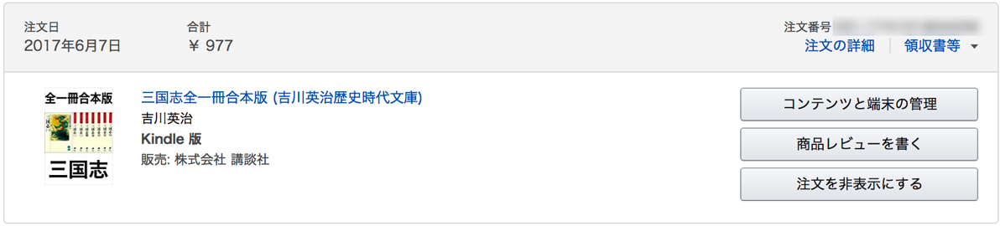
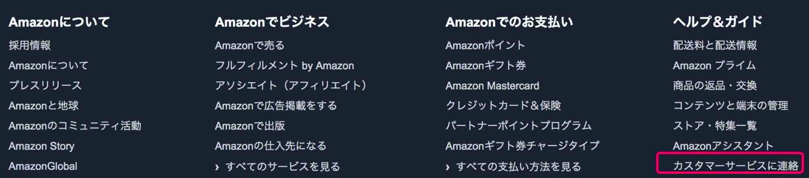
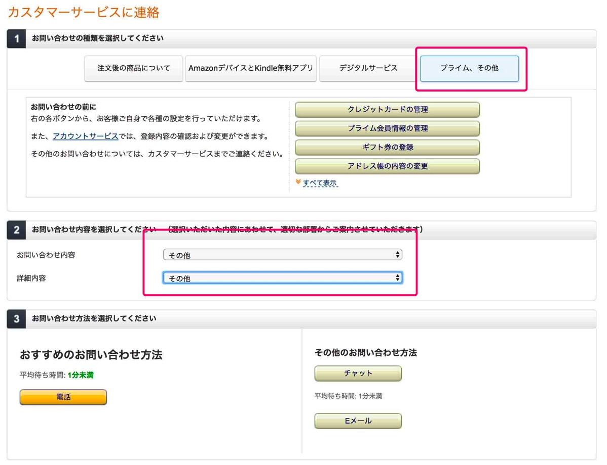

---
categories:
- レビュー
date: Wed, 07 Jun 2017 21:48:00 +0000
slug: post-10783
tags:
- kindle
title: kindle本を間違えて購入してしまった場合にキャンセルする唯一の方法
---

先日kindleのセールでお気に入りの本がめちゃくちゃ安くなっているのを見つけました。もう躊躇することなくすぐさま購入ボタンを押してダウンロードしました！！が、、、、なんとその本すでに買ってもってるものでした。その本というのが吉川英治の三国志なんですが、吉川英治は没後50年経っていうため著作権が切れています。なので基本的に、吉川英治の作品は青空文庫なんかで無料で読むことができます。また吉川英治全集という作品全部が収録されたkindle本なんかもでてて、かなりの安価で購入することができます。

ちなみに今回ぼくは三国志全巻セットを1000円くらいで購入してしまったんですが、そのずっと前に吉川英治全集を200円で購入していましたwww さらにそれ以外の作品も複数ポチってしまったので（全集に全て収録されています）、キャンセルすることにしました。

ということで本日はkindle本を間違って購入してしまったときのキャンセル方法をご紹介いたします。<!--more-->
<h2>kindle本を間違って購入してしまった場合のキャンセル方法</h2>
普通の商品を<strong>Amazonから</strong>購入した場合、購入履歴から返品をすることができます。

しかしながら、kindle本の場合は「返品」ボタンがありません。そのためキャンセルができなさそうな気がします。この時点で諦めちゃったりする人もいるんじゃないかと思うんですが、諦めるのはまだはやい

そのまま画面の一番下までいきましょう。右下に「カスタマーサービスに連絡」というリンクがあります。

そのあと返品についての条件をいれます。すると電話で連絡するかメールなどで連絡するかが選択できます。どちらでも大丈夫ですが電話の方が対応が早いイメージです。その場でやってくれるので。

間違えて買ってしまったKindle本一回も開かずにどうしてもという時にこれで返品させてもらってます。
<h2>しんぺーはこう思った。</h2>
全ての返品に対応してもらえるかはマチマチだと思いますので利用する場合は相談という感じで連絡するのが良いかと思います。

といったところで本日は以上です。おやすみなさい。