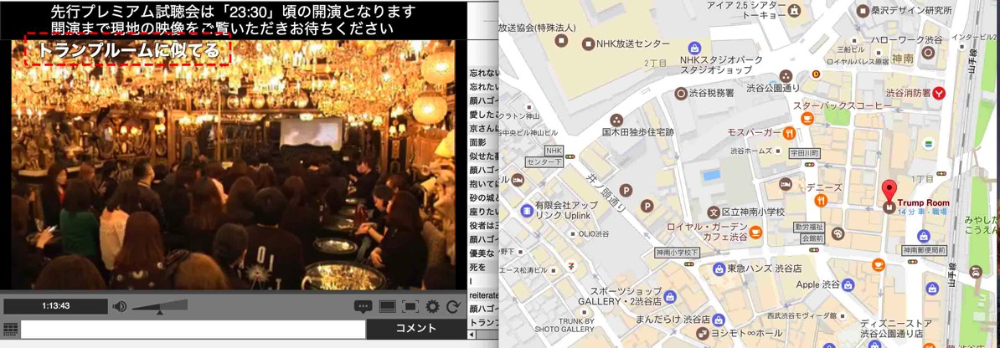

---
categories:
- sukekiyo
date: Mon, 26 Jun 2017 16:15:00 +0000
slug: post-10790
tags:
- sukekiyo
title: sukekiyo「ADORATIO」全曲解説「黝の密会」ニコ生放送部分情報
---

京曰く、現時点でのsukekiyoの最高傑作。CD、アルバムではなく音源という位置付けの全１３曲入りの作品となっている。今のデジタル社会においてアルバムやCDという位置付けがどんどん薄れていく中で、作り手の自分たちが思うCDという物質と聴き手の思うCDに対してギャップがあり、その中でも作品として価値あるものにしようとした時に「作品集」にしたかったという思いから音源と呼んでいるようです。

読み方はアドーラーティオ。礼拝、崇拝、敬愛という意味のラテン語です。

一般流通はしておりません。手に入れるのはfreewill通販サイト「<a href="http://www.galaxybroadshop.com/artist/sukekiyo/">GALAXY BROAD</a>」で予約するか会場販売にて購入するしかありません。（ちなみに記事公開時点ではすでに在庫がなそうです。）

収録内容はCDが2枚（うち1枚はコラボ）にミュージックビデオとLIVEの様子を納めたBlu-rayが1枚で、価格は7,500円です。

早期予約特典としてポストカードと直筆サインがランダムで入っています。
公式通販限定特典として8cmシングルと烏丸新聞の第八號が入っています。
公演会場限定特典としてじ8cmシングルがつきます。

なお通販と会場特典とでは収録曲が異なっています。
通販は2月公演より「nine melted fiction」、会場特典は「vandal」となっています。

また、通販にて購入した方の中からさらに抽選の申し込みで先行視聴会「黝の密会」に参加できます。一部ニコ生でも視聴できましたが、途中で切られました。

「黝の密会」参加者はその様子を口外することは禁じられています。ぼくは落選したためニコ生で視聴しておりました。ニコ生は口外禁止に当たらないだろうという前提にてこの記事を書いています。

<iframe width="560" height="315" src="https://www.youtube.com/embed/XeqHPh-GzyU" frameborder="0" allowfullscreen></iframe><!--more--><h2>「ADORATIO」全曲解説</h2>

黝の密会会場は渋谷のナイトクラブ「トランプルーム」とみられます。

曲順に冒頭を少し聞いて、そのあとメンバーが解説するという形。メモ書きを元にしてますので多少間違ってる部分もあるかもですがご了承ください。

1. 擬似ネクロマンサー
2. グニャ結論。そして血眼。
3. 襞謳
4. 純朴、無垢であろうが
5. マニエリスムな冷たい葬列者
6. 艶
7. 首吊り遊具
8. されど道連れ
9. 死霊のアリアナ
10. 嬲り
11. 耳ゾゾ
12. 黝いヒステリア
13. 白濁

<h3>擬似ネクロマンサー</h3>

最後にレコーディングした曲。ディレクターに出された締め切りを過ぎてから録音した。
これがなかったら12曲の収録になっていた。

3年前に匠が作った曲をYuchiがいじり、京発案でUTAの作ってきたマニアックな曲とをくっつけてできた曲
京的にはこのメンバーでなんとなくやってくれるだろうという安心感で無茶を言ったとのこと
京のアイデアで鳥の声を入れた。匠が艶のPV撮影の時に鳥の声撮ってきた。京に聞いたら「鳥元気すぎひん？若い」とのこと「チュンチュン！」

<h3>グニャ結論。そして血眼。</h3>
原曲Yuchi
去年の夏くらいに作った。原曲は1年前くらいから
割と今回のアルバムは古いのだと3-4年前のとかもある。京から溜まってるやつくれって言われて渡したら使えるの「めっちゃあるやん」ってなった。

<h3>襞謳</h3>

読み方は<strong>ひだうた</strong>

UTA原曲。最初のイメージは思い出せない。
最初はプログレッシブな感じで複雑な感じでUTAの頭の中ってこうなってるんだーと匠は思ってた。
（京がYuchiのコップにビール注ぐ）

京さんMVに選んだけど、なんでですか？（匠）
監督と相談した（京）

<iframe width="560" height="315" src="https://www.youtube.com/embed/hd5qSWlbAeo" frameborder="0" allowfullscreen></iframe>

<h3>純朴、無垢であろうが</h3>
匠原曲
途中で激しくなる部分はYuchi。もともとはワンテーマだった

<h3>マニエリスムな冷たい葬列者</h3>
原曲UTA　ふわふわ　このメロ個人的に大好き（UTA)）
匠がピアノが好き過ぎてオフィシャルのトレーラーに採用した（未架）
あそこきくと冬になる。（冬がイメージされる）
いろんな曲をプリプロしている段階でこの曲を割と早い段階で進めようと判断したのはなぜ（匠）
自分のイメージに近い形でとれたから。入りやすかった（京）
サビはシンベ

<h3>艶</h3>

原曲は匠
sukekiyoの結成当初から提示したいなーと思ってるものを具現化させたもの
京もすぎに気に入り歌入れした　どうでしたか京さん（匠）
求めていたものがダイレクトにきてさすがやな〜（京）
一個一個の楽器がいきてるバンドスコアにしてもいいくらい（匠）
去年の夏につくった
匠がつくった間奏は明るいと京に言われて3パターンつくった
波の音は匠の録音集の一つ。海にいったら必ず海の音録る。
今までとったやつ全部並べてみた
山口県から京都までの山陰地方の波の音

<iframe width="560" height="315" src="https://www.youtube.com/embed/hd5qSWlbAeo" frameborder="0" allowfullscreen></iframe>

<h3>首吊り遊具</h3>

yuchiが原曲で2015の元旦に送ってきた曲
vitium作ってる時にあんまりにパツパツだった時にこんな想いはしたくないと思って先に先にと思って製作中にもかかわらずだした（Yuchi）
UTA　一番アレンジ悩んだ曲。ジャズっぽくてその中でsukekiyo感を出すのに悩んだ。

<h3>されど道連れ</h3>

UTIUM候補曲　UTA原曲

<h3>死霊のアリアナ</h3>

元ネタ曲は匠、Yuchiがいじった。
UTA　Yuchiにすっごい褒められてうれしかった

<h3>嬲り</h3>

原曲UTA　前半まで
後半は別の人。合体系

<h3>耳ゾゾ</h3>

おまけで作ったらUTAからこの曲なの？って言われた

<h3>黝いヒステリア</h3>

Yuchiと匠がアレンジでだいぶもめた
この歳になって喧嘩できるっていいな（匠）
夜中に1時間くらい電話した（Yuchi）
Yuchi　だいぶ今回言い過ぎたかなと思うこととかもあった
匠　sukekiyoはだいぶ大人が集まってるからこういうのがあって嬉しかった
これがあったからADORATIOにつながった
これを会場限定に選んだ理由は？(Yuchi）
８曲くらいできてて一番完成形に近くてみんながつかみやすそうなわかりやすい雰囲気がしてたから（京）
冒頭でぎろぎろーっていってる曲はANIMAのPVの廃墟にあったピアノ
今も上にあった壊れたピアノをサンプリングさせてもらってた

<h3>白濁</h3>

原曲匠
最初はピアノメインだった、1発目で京もきにいってくれた
sukekiyoっぽくて代表曲になりそうだった（京）
ファンの人も好きなんじゃないかな〜そこ大事にしながら進めてったらいいんじゃないかな（京）
プロトゥース（ソフト）のコメント欄でやり取りした曲
ギター3日かけてとった（匠）

<h2>disc2収録各アーティストについて少しだけ調べてみた</h2>
本当に感謝しかない感が溢れていました・・・

収録曲は7曲

1. mama　Collaboration with ガラ (MERRY)
2. in all weathers　Collaboration with YUKIYA (Kαin)
3. 鵠　Collaboration with 藤崎 賢一 (Justy-Nasty)
4. elisabeth addict　Collaboration with kyo (D’ERLANGER)
5. 斑人間　Collaboration with 福井 祥史 (VINYL, ex.STRAWBERRY FIELDS, ex.D’ERLANGER)
6. 耳ゾゾ　Collaboration with KONTA (ex.BARBEE BOYS)
7. maniera　Remixed by Daniel Ash (Bauhaus, Tones On Tail,Love And Rockets, Poptone)

以下、京談
はじめていったLIVEが京都MUSEでのストロベリーフィールズ
どうしても歌ってほしくてデランジェのkyoさんに連絡先をきき、初めてくらいの長文のラブレターをかき、これをきいていたから今の僕たちがあるくらいのことを書いておくった。
今回のメンツの中になぜガラを入れたのかをガラはもっと考えてほしい
夢がかなったDISC2

ぼく個人的にあまり知らないアーティストも混ざっていたのでそれぞれ調べてみました。

<h3>ガラ（MERRY）</h3>

言わずとしれたMERRYのボーカルです。sukekiyoとツアー一緒に回ったりイベントしたりするので知らない人はいないでしょう。事務所の後輩でもあります。
収録曲のmamaは、以前赤坂BLITZにて行われた「異形の間」にて披露されたものとはちょっと感じが違っています。京とのコラボで2人のボーカルが絡む形です。

また「誰も救ってなんかくれない」の部分はMERRYっぽさを全面に出しています。

<h3>Yukiya（Kαin）</h3>

DIR EN GREYの元プロデューサーです。薫のトークイベント「虎の穴」なんかにもゲストとして呼ばれたりで知っている方も多いかと思います。

twitter:<a href="https://twitter.com/yukiya1999">@YUKIYA1999</a>

経歴はD≒SIRE→JILS→Kαinという形でバンドの主にボーカルとして活動。ソロでも活動しています。
10年以上前にLIVEにいったことありますが、演奏している時間よりもMCの方が長いイメージ。

<h3>藤崎賢一（Justy-Nasty）</h3>

ぼくは全く存じ上げなかった方でしたが、AIONでも活動されたことがあるようでかなり歴史のある方でした。wikipediaにかなり細かく記載されています。

<a href="http://fujisakikenichi.com/">http://fujisakikenichi.com/</a>

twitter:<a href="https://twitter.com/rodrockinfo">@RodrockInfo</a>

<h3>kyo(D’ERLANGER)</h3>

cali≠gariのイベントにsukekiyoが出た時に一緒だったので、みたことある人もいるかと思いますが大御所バンドD’ERLANGERのボーカルです。
後述の福井 祥史さんの連絡先を京に教えたとのことです。

twitter:<a href="https://twitter.com/KainAbelinc">@KainAbelinc</a>

個人的に今回のコラボでこの曲が一番驚いた。エリザベスアディクトがここまでデュエット曲だったのかと。
最初からデュエット前提で作れてたんじゃないかと思ってしまうくらいの進化だった。京の甲高い声が完全に女性の声に聞こえてくる。

<h3>福井 祥史 (VINYL, ex.STRAWBERRY FIELDS, ex.D’ERLANGER)</h3>

D’ERLANGERの初代ボーカル、というかkyoさんは三代目のボーカルだったんですね、知りませんでした。というかあれだけの大御所バンドなのにボーカルが変わってることに驚きです。
D’ERLANGER脱退以降に結成したSTRAWBERRY FIELDSというバンドを結成、このバンドのメンバーが前述の藤崎賢一さんとJusty-Nastyで活動されていたLEZYNAさんらしいです。

今回20年ぶりのレコーディングだったとのこと。

<h3>KONTA (ex.BARBEE BOYS)</h3>

80年代に活動したツインボーカル編成の男女5人組で構成されるバンド。1992年に解散。
KONTAはボーカルで本名は近藤敦。ミュージシャン、サックスプレイヤー、俳優、声優、ナレーターとしても活動している。

<h3>Daniel Ash (Bauhaus, Tones On Tail,Love And Rockets, Poptone)</h3>

1979年にデビューしたイギリスのロックバンド「バウハウス（Bauhaus）」のギター。そのため今回の収録曲で唯一ボーカルでのコラボではない。

全て見てみると80年代末から90年代前半に活動している方々がほとんどでその頃に京が影響を受けていた方々を集めたようです。ここまで調べてようやく「ガラはこのメンバーの中に入ってることをもっと考えてほしい」発言の真意が見えてきました。

<h2>しんぺーはこう思った。</h2>

さて、しばらくsukekiyoとしてのLIVEはなさそうです。あれば秋以降くらいでしょうか。
それにしても聞けば聞くほど新しい発見があるADRATIO。毎回違う曲を聴いてるのかと思って画面を確認してしまうレベルです。あれ？こんな展開だったっけ？とかこんな歌詩だったっけ？とか

次回作が本当に待ち遠しいです！

と言ったところで本日は以上になります。 
おやすみなさい。 
そして、また明日。