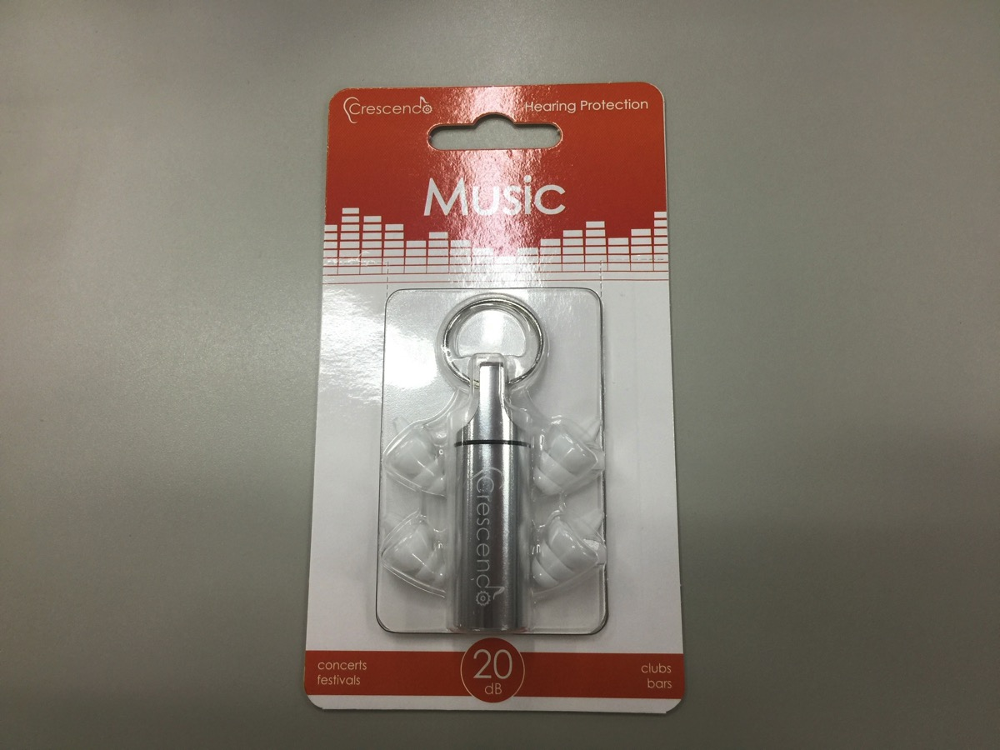
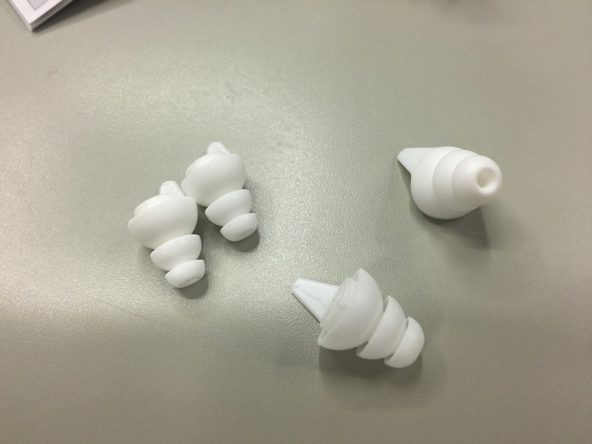
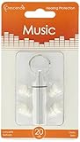

---
categories:
- レビュー
date: Thu, 15 Jun 2017 22:30:00 +0000
slug: post-10810
tags:
- ガジェット
title: Amazonで一番売れているLIVE用の耳栓を仕事場で使ったらすごい集中できた話
---

最近ずっと体調がすぐれません。原因はわかっています。会社でぼくの隣に座っているおばさんの<stgrong>声がうるさすぎる</stgrong>ことです。それが原因で4月から軽い鬱状態だったっぽいです。最近は原因がわかったのと寝酒をするようになって少しは緩和されましたが根本的な解決にはいたっていません。

ある研究によると人間は他人が罵倒されているのを見るだけで、自分の生産性も下がってしまうらしいです。そのおばさんはよく他人を罵倒して追い詰めているので、まさにそれというわけです。イヤホンさして音楽を聴くという手もあるんですが当然禁止されていますので、代わりに耳栓をしてみることにしました。<!--more--><h2>LIVE用耳栓とは？</h2>
選んだのはこちら

これLIVE用の耳栓です。耳栓は通常そとからの音を一切遮断するために使用しますが、これは音を軽減することを目的としています。そのため、LIVE中に装着していてもしっかりと音楽が聞こえるようになっています。
説明によると20dBの音量をカットしてくれるみたいです。

サイズとしては大きいサイズと小さいサイズが入っていて、キャップが１セット入っています。このキャップが重要で、これが音量の低減をしてくれています。

<!--ご覧のように完全に密封していないため音が聞こえます。-->

<h2>使ってみた感想</h2>

実際にLIVEで使用したわけではないのですが感想を述べたいと思います。

ヘドバンしても落ちないくらいにフィットする
他人の声もしっかり聞こえる
周囲の音量そのものが小さくなる

イヤホンから流れてくる音楽のボリュームをそのまま下げたような印象です。騒音が小さくなり、すごい集中できます。しかもかなり小さいのつけていても、たにんに気づかれにくく気になりません。

LIVEのあとに耳がおかしくなるとかという人は使ってみてもいいかもしれません。あとはぼくみたいに職場にモンスターがいるという人もストレス軽減のためにおすすめです。

<h2>しんぺーはこう思った。</h2>

<blockquote class="twitter-tweet" data-lang="ja">
最近会社の騒音おばさんのせいで軽いうつ状態だったんだが、LIVE用の耳栓したらストレス軽減されたし、会話も聞こえるし、すごい良い。イヤホンのボリュームを下げましたって感じで周囲の音がちょっと小さくなるような感じ。 <a href="https://t.co/BUKmFZfbFp">pic.twitter.com/BUKmFZfbFp</a>
&mdash; しんぺー@ (@s_s_p_y) <a href="https://twitter.com/s_s_p_y/status/875460989013053441">2017年6月15日</a></blockquote>

LIVEは自分が欲している音ですが、自分が欲していない音はもれなく騒音です。
騒音は思ったよりも心身を蝕み、体調にも変化を与えてしまうようです。もし近くに騒音を出す人や物があって、最近なんだか体調がよくないとか集中できないなんて人は一度試してみてください。

もしかしたら、改善されるかもしれません。

<a href="http://www.amazon.co.jp/exec/obidos/ASIN/B00IYJ8VOG/warawareotoko-22/" target="_blank" >CRESCENDO 耳栓 ライブ用 イヤープロテクター Music</a>
posted with <a href="http://kaereba.com" rel="nofollow" target="_blank">カエレバ</a>

 CRESCENDO     

<a href="http://www.amazon.co.jp/gp/search?keywords=%E3%81%84%E3%82%84%E3%83%BC%E3%83%97%E3%83%AD%E3%83%86%E3%82%AF%E3%82%BF%E3%83%BC&__mk_ja_JP=%E3%82%AB%E3%82%BF%E3%82%AB%E3%83%8A&tag=warawareotoko-22" target="_blank" >Amazon</a>

<a href="https://hb.afl.rakuten.co.jp/hgc/0f6e221b.2eb9748a.0f6e221c.35cc1e84/?pc=http%3A%2F%2Fsearch.rakuten.co.jp%2Fsearch%2Fmall%2F%25E3%2581%2584%25E3%2582%2584%25E3%2583%25BC%25E3%2583%2597%25E3%2583%25AD%25E3%2583%2586%25E3%2582%25AF%25E3%2582%25BF%25E3%2583%25BC%2F-%2Ff.1-p.1-s.1-sf.0-st.A-v.2%3Fx%3D0%26scid%3Daf_ich_link_urltxt%26m%3Dhttp%3A%2F%2Fm.rakuten.co.jp%2F" target="_blank" >楽天市場</a>

<a href="//ck.jp.ap.valuecommerce.com/servlet/referral?sid=3041033&pid=882528283&vc_url=http%3A%2F%2Fsearch.shopping.yahoo.co.jp%2Fsearch%3Fp%3D%25E3%2581%2584%25E3%2582%2584%25E3%2583%25BC%25E3%2583%2597%25E3%2583%25AD%25E3%2583%2586%25E3%2582%25AF%25E3%2582%25BF%25E3%2583%25BC&vcptn=kaereba" target="_blank" >Yahooショッピング</a>

