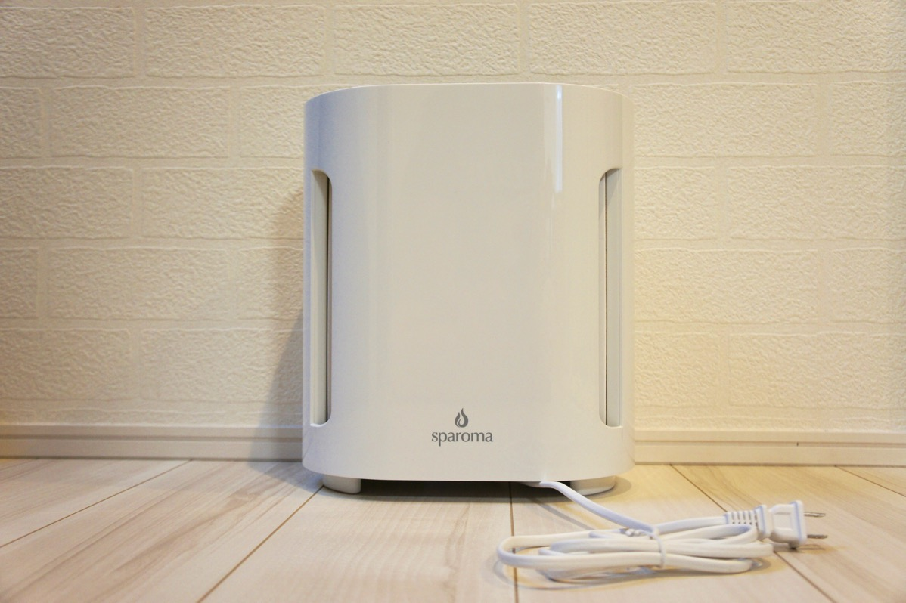
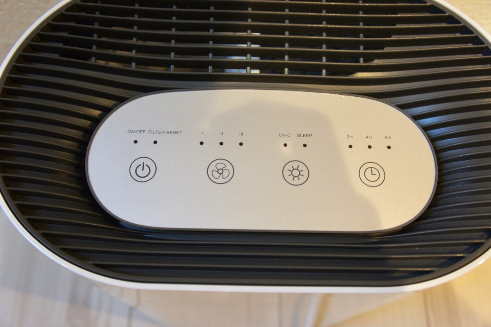
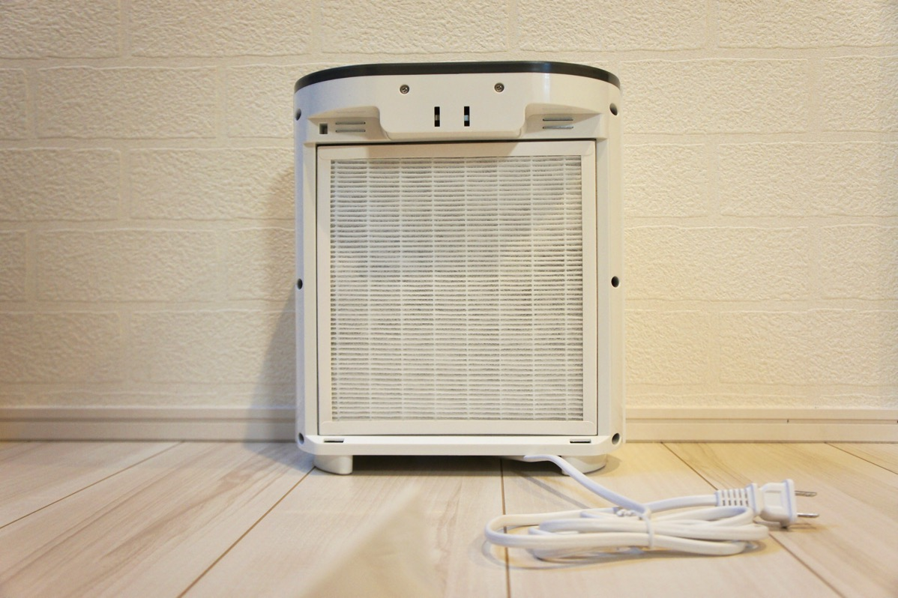
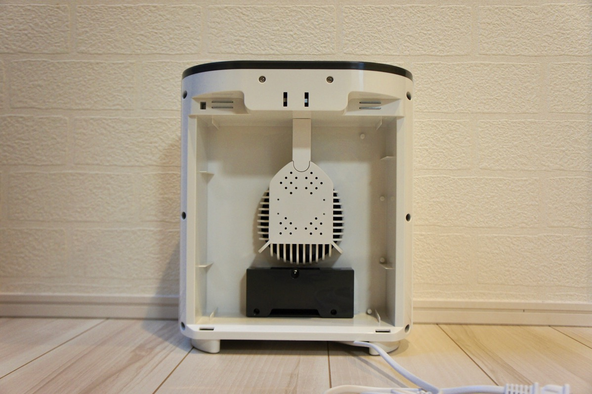
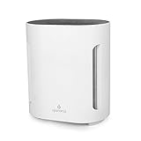

---
categories:
- レビュー
date: Sat, 24 Jun 2017 00:00:00 +0000
slug: post-10820
tags:
- ガジェット
title: ちょうどいい！Sparomaの空気清浄機はサブ機としておすすめ【PR】
---

SHARPの加湿機能付きの空気清浄機を使っているのですが、寝室用にもう一つほしいなと思っていました。そんな中、Anyproさんよりコンパクトサイズの空気清浄機を提供いただきましたので、１ヶ月ほど使用してみました。

感想としては、なかなか気に入っております！ということで本日はSparoma（Anyproの別ブランド）の空気清浄機のレビューです。<!--more--><h2>ここがいいなという点</h2>

提供もらってみて初めてAnypro製品を使っているのですが、どれもコンパクトで一人暮らしとかサブ機に使うのにちょうどいいものばかりです。この空気清浄機もまさにその特色がでています。

使っていて「ここがいいな」と感じたのは次の３点

<ul>
	<li>音が静か</li>
	<li>コンパクトなのにパワフル</li>
	<li>デザインがいい</li>
</ul>

音はレベルによってだいぶ変わりますが、一番低いレベルなら寝る時にほぼ気になりません。ただ若干駆動音（低音）が気になる人がいるかもしれません。そこまで大きな音はしませんが。

吸気レベルは3段階まで変えられます。一番強いレベルだと4上半の部屋が涼しくなるレベルの風量がでます。

外見はこんな感じ

ボタンは押し込み式ではなく、軽く触れることで反応します。全体的に凹凸がないデザインです。

内部構造もかなりシンプルです。

吸気レベルは3段階まで変えられます。一番強いレベルだと4上半の部屋が涼しくなるレベルの風量がでます。

<h2>ここはちょっとという点</h2>

実は思ったよりもちょっとだけちょうどよくないかなと思ったところがあります。
それが値段が安くない。このレベル感だともうちょっとだけ安い値段を期待するかなーと思います。とはいえ性能は標準だと思いますので、これくらいの値段はするのかなと。

ただ、同じくらいの値段で加湿機能がついているものが売っていたりしますので、自分の使いたい方を買うのがいいと思います。過失機能付きの空気清浄機はどうしても手入れが大変だったり、清潔な状態を保たないことで変な匂いがしたりカビを部屋中に拡散してしまうおそれもあります。

そういった部分でいうと単一機能で空気清浄機能しかない本製品を選ぶというのもありかなと思います。

またサブ機とか寝室用で手頃なものがほしい人にもおすすめかなと。あと１ルームに住んでる一人暮らしの人とか。

<h2>しんぺーはこう思った。</h2>

空気清浄機は１年間を通して使うものなので、加湿器つきだと結構使い所が難しいです。
今は冬ではないので加湿していないのですが、ただフィルターの水垢はそのまんまです。だいたい空気清浄機のフィルターって掃除機で吸って終わりとかって人もけっこういると思うのですが、加湿フィルターはカルキとかミネラル分がくっついていて絶対交換しなければなりません。

そこがめんどくさいんですよね〜ほんと

これからの季節、加湿がいらいないのでこういう製品を選んでみるのもいいんじゃないかと思います！

と言ったところで本日は以上になります。 
おやすみなさい。 
そして、また明日。

<a href="http://www.amazon.co.jp/exec/obidos/ASIN/B01IQW2FZQ/warawareotoko-22/" target="_blank" >Sparoma 空気清浄機 殺菌空気清浄機 静音 風量切替 切りタイマー付き 微粒子99.9%除去 省電力 CF-8005</a>
posted with <a href="http://kaereba.com" rel="nofollow" target="_blank">カエレバ</a>

 Sparoma     

<a href="http://www.amazon.co.jp/gp/search?keywords=sparoma&__mk_ja_JP=%E3%82%AB%E3%82%BF%E3%82%AB%E3%83%8A&tag=warawareotoko-22" target="_blank" >Amazon</a>

<a href="https://hb.afl.rakuten.co.jp/hgc/0f6e221b.2eb9748a.0f6e221c.35cc1e84/?pc=http%3A%2F%2Fsearch.rakuten.co.jp%2Fsearch%2Fmall%2Fsparoma%2F-%2Ff.1-p.1-s.1-sf.0-st.A-v.2%3Fx%3D0%26scid%3Daf_ich_link_urltxt%26m%3Dhttp%3A%2F%2Fm.rakuten.co.jp%2F" target="_blank" >楽天市場</a>

<a href="//ck.jp.ap.valuecommerce.com/servlet/referral?sid=3041033&pid=882528283&vc_url=http%3A%2F%2Fsearch.shopping.yahoo.co.jp%2Fsearch%3Fp%3Dsparoma&vcptn=kaereba" target="_blank" >Yahooショッピング</a>

