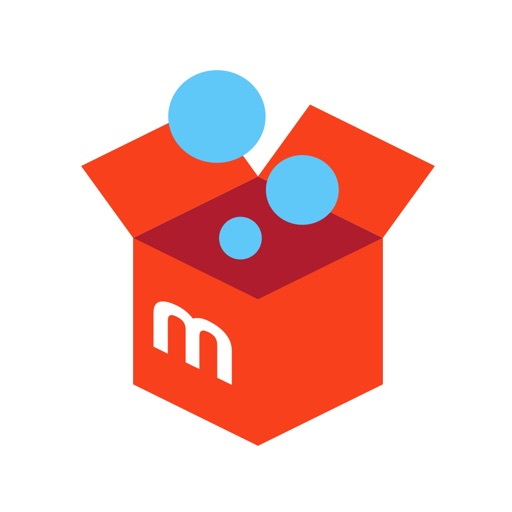

---
categories:
- アプリ
- レビュー
date: Tue, 04 Jul 2017 23:42:30 +0000
slug: post-10828
tags:
- メルカリ
title: 独自ルール多すぎ！メルカリを使ってみた感想。ヤフオクとの違い
---

最近メルカリをよく使っています。ガジェット関連のものを購入したり、自分でゲームを出品して売ってみたりしています。何回か使って見てだいたい勝手がわかってきたので感想をご紹介したいと思います。なんとなく不安でまだ使ったことがない人の参考になればと思います。<!--more-->
<h2>メルカリとは</h2>

もはや言わずと知れたフリマアプリです。ラテン語で「商いする」の意味の「mercari」に由来しているそうです。

古い人だとヤフオクと何が違うのかわからないかもしれませんが、こっちはフリマアプリです。そのため、入札という概念がありません。売値に対して、その金額で購入することになります。

ただし、フリマのため交渉などで値引きをしてもらうことは可能だったりもします。これはシステムとして組み込まれているというよりもあくまで売り手と買い手の裁量に任されているという感じです。

ヤフオクと違って<strong>「すぐに購入できる点」</strong><strong>「金額が高くならない点」</strong>が若い層に受けており、ユーザーは大半が10~20代くらいという印象です。
<h2>使って見た感想</h2>
使うまではなんとなく頭のおかしい人が多そうとか、若い人が多そうだからちゃんと取引できるのか不安でした。

ただ、そんなことはなく思った以上にスムーズで、ヤフオク以上にビジネスライクな印象でした。

が、<strong>独自ルール</strong>が多い！こにお独自ルールを外すと低評価もらっちゃったりします。なのでこのあたり気をつけましょう。
<h3>独自ルールとは</h3>
メルカリを見ていると気がつくと思います。商品名とは全く関係のない画像になっているものや、商品の画像なんだけど文字で「◯○様専用」と書かれているものです。

それはなんなのかというと、売り手と買い手の売買交渉が成立して、その人に売りますというメッセージです。メルカリはヤフオクと違ってフリーマーケットサービスです。そのため、購入前に売り手に対して値切り交渉などができるのです。

その際、両者合意の上で値切りが成立すると、その人に買ってもらうように周囲に対してバリアーを貼ります。それが「○◯様専用」商品なのです。

ただ、これ別にメルカリの公式ルールでも機能でもありません。単純に売り手と買い手がそう言ってるだけで、横から他の人が購入することができます。買われてしまったら売り手は、その人に売らないと低評価をされてしまうので、さらに交渉でキャンセルしてもらうなどの手間が発生します。このあたりトラブルの原因になりそうな気がします。

それもあってか基本的には交渉の過程をずっと監視しておく必要があります。欲しい商品が交渉の末値引きされたらすぐに購入しないといけません。

次にぼくが出会った独自ルールは、特定の売り手の独自ルールです。
購入した商品が郵送で届くのですが、時間指定などしなかったためたまたま受け取りが遅れてしまいました。

するとなぜか評価の段階で低評価を受けてしまいました。理由は「受け取りが遅れたため」
まったく意味が不明・・・

入金が遅れるからということでしょうか？？それにしても1日遅れただけでしかも連絡できなかっただけで低評価とは驚きました。「プロフィールにも受け取りが遅れるなら連絡くださいと書いています。」と低評価のコメントに書かれていたので、プロフィールを見に行きましたが、書いてませんでした・・・

このあたりの独自ルールは、ヤフオク世代の自分には全くなじめませんでした。
<h2>ヤフオクとの違い</h2>
ヤフオクもいまでこそ色々と整備されてきた感じがありますけど10年くらい前はユーザー同士が直接やりとりしてアドレスなんかも開示しあって、色々とトラブルが起きまくったりもしていました。

その辺メルカリはうまくやっています。例えばお金のやりとりなんかは、全てメルカリを通すようになっています。そのため「入金されてないんですけど」みたいない問題が起こりにくいようです。

そしてさらに特徴的なのが、<strong>ポイント制度</strong>です。
売上金はそのまま口座に入金することもできますが、ポイントとしてプールされます。

そのポイントはメルカリでの購入の際に使えます。つまり売った側が次回買う側に回れるような仕組みになっているのです。

今ではヤフオク側が焦っシステムをメリカリに近づけているほどなので、そのユーザビリティは圧倒的です。

あと、ヤフオクですと通常、落札金額と送料は別となっています。しかし、メルカリはほとんどが送料込みで取引されます。そのあたり感覚を慣らすのに時間がかかりました。ヤフオクユーザーとしては違和感がありました。
<h2>しんぺーはこう思った。</h2>
ゲームやCDなんかはAmazonのマーケットプレイスで出品するとそれなりの値段がついていたんですが、最近中国の不正出品アカウント問題で色々と出品しにくくなりました。

メルカリも色々と問題が取りざたされていますが、気をつけて使えば問題なさそうです。
ぼくももっと経験を積んでなんとなくやばそうな出品者からは購入しないように気をつけたいと思います。

と言ったところで本日は以上になります。
おやすみなさい。
そして、また明日。

<a href="https://itunes.apple.com/jp/app/%E3%83%95%E3%83%AA%E3%83%9E%E3%82%A2%E3%83%97%E3%83%AA-%E3%83%A1%E3%83%AB%E3%82%AB%E3%83%AA-%E3%83%95%E3%83%AA%E3%83%9E%E3%81%A7%E3%81%8B%E3%82%93%E3%81%9F%E3%82%93%E3%82%B7%E3%83%A7%E3%83%83%E3%83%94%E3%83%B3%E3%82%B0/id667861049?mt=8&amp;uo=4&amp;at=11ld5P" target="_blank" rel="noopener">フリマアプリ-メルカリ フリマでかんたんショッピング</a> (無料)

<a href="https://itunes.apple.com/jp/developer/mercari-inc/id667861052?uo=4&amp;at=11ld5P" target="_blank" rel="noopener">Mercari, Inc.</a> <a style="width: 100px; color: #ffffff; background: -webkit-gradient(linear, 100% 0%, 100% 100%, from(rgba(85,182,237,0.5)), to(rgba(41,140,218,1))); font-size: 10px; font-weight: bold; text-align: center; display: inline; text-decoration: none; border: 0px; padding: 5px; border-radius: 10px; white-space: nowrap;" href="https://itunes.apple.com/jp/app/%E3%83%95%E3%83%AA%E3%83%9E%E3%82%A2%E3%83%97%E3%83%AA-%E3%83%A1%E3%83%AB%E3%82%AB%E3%83%AA-%E3%83%95%E3%83%AA%E3%83%9E%E3%81%A7%E3%81%8B%E3%82%93%E3%81%9F%E3%82%93%E3%82%B7%E3%83%A7%E3%83%83%E3%83%94%E3%83%B3%E3%82%B0/id667861049?mt=8&amp;uo=4&amp;at=11ld5P" target="_blank" rel="noopener">iTunes で見る</a>

(2017.07.05時点)

posted with <a href="http://pochireba.com" target="_blank" rel="nofollow noopener">ポチレバ</a>

