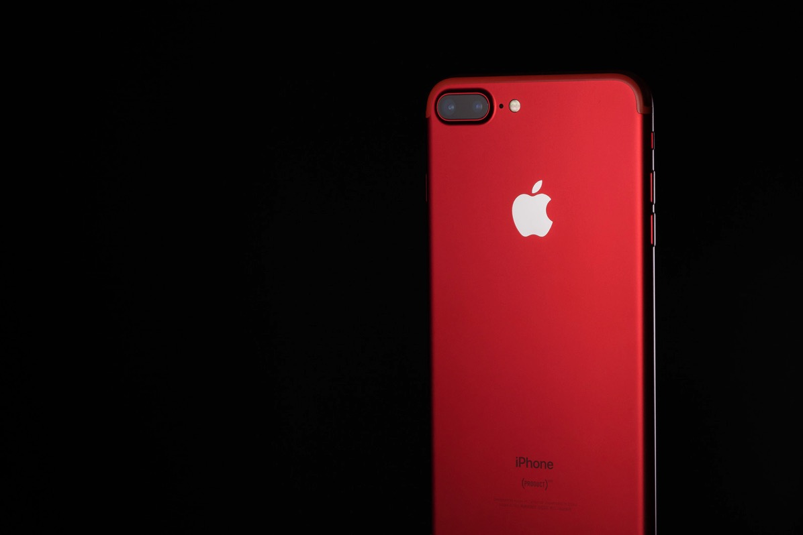

---
categories:
- レビュー
date: Sat, 15 Jul 2017 15:18:25 +0000
slug: post-10846
tags:
- Android
- iPhone
title: iPhoneユーザーがAndroidに乗り換えてやっていけるか現実的に考えてみた
---

ぼくはずっとiPhoneを使って着ました。初めて買ったのはiPhone3GSでスマホの選択肢はほぼiPhoneしかありませんでした。（それかブラックベリー）しかし、だんだんとAndroid端末も出始めてスマホ市場が活況となっていきました。しかしながら、当時のAndroidはかなり作りがひどく、本当にリアルにさわれたもんじゃありませんでした。ただ、iPhoneもiPhoneで脆弱な電波帯しかもたないソフトバンクが一社独占で販売しており、端末は最高なんだけど、電波がクソという状況でガラケーと2台持ちをする人もいました。かくいうぼくも2台持ちでした。

それでもiPhoneは常に最高でした。しかし、最近のAppleはクソです。本当にクソです。今この記事を書いているMac Book Proなんてキーボードが打ちづらすぎてミスタッチしまくるし、タッチバーは全く使わない上に間違って際割っちゃうし、値段だけめちゃくちゃ高い。同じくらいのスペックのWindowsなら半分くらいで買えるんじゃね？

新製品発表会も感動もクソもない。だからどうせ次のiPhoneも今のアップデートでクソなんだろ？いらない新機能とかつけちゃって誰も使わないみたいな。どうせクソなんだろ？

それに比べて最近ぼくがキテると思っているのがSAMSUNG

スマホ爆発問題なんてのもありましたが、それでも見てるととても魅力的な製品を出していると思う。
昔のAppleに感じていたワクワク感を感じる！今しきりにテレビCMでも流れているGALAXY S8が超セクシー！！ということで実際にiPhoneヘビーユーザーのぼくがAndroidに乗り換えた場合、不便がないのか、問題がないのかについて真剣に考えてみました。<!--more-->

<h2>料金の違いは？</h2>

まず料金ですが、GALAXY S8+とiPhone7 plusだと本体価格はiPhoneの方が安いみたいです。

iPhone7 plus 104,760円
GALAXY S8+ 106,800円

といっても2,000円程度です。

次に月額の内訳です。現時点で契約できるプランに違いがあるようです。auの料金シュミレーターで計算してみました。

iPhone7plus機種代金104,760円　月額　11,208円
　auフラット30（スーパーカケホ） 1700円
　データ定額　8000円
　LTE NET 300円
　apple care 600円

GALAXY S8+　月額11,880円
　auフラット30（スーパーカケホ） 8500円
　auスマートバリュー　-1000円
　ビッグニュースキャンペーン　-1000円（１年間）
　故障紛失サポート　380円

ほぼ誤差です。値段での差はほぼなしです。

<h2>iOSとAndroid OSの違いは？</h2>

iPhoneに最近追加された機能として、防水（防滴）とApple PayによるSuica機能があります。ぼくはiPhone6 plusなのでどちらも非対応ですが、きっとどっちも便利なんだろうな〜と羨んでおります。
ちなみにGALAXY　S8は当然のごとくどちらも対応しております。

このあたりは問題ないでしょう。

<h3>よく使うアプリはちゃんとあるの？</h3>
基本的にアプリはどちらのOSでも出していることがほとんどですし、大手のアプリならそもそもブラウザで利用できたりするのでアプリはあまり問題がないかと思います。

それでもちょっと心配だったので、いつも使ってるアプリがAndroidにあるか調べてみました。

<ul>
	<li>MoneyForward</li>
	<li>Play Music</li>
	<li>UberEats</li>
	<li>Evernote</li>
	<li>twitter</li>
</ul>

どれも当然のようにAndroid版ありました。しかし気をつけなければいけないのがiOS版とAndroid版でアプリのUIが違っているという点です。なぜかというとAppleが規定している使いやすいデザインルールとGoogleが規定するルールが異なっているからです。

twitterなんかiOSだとボタン（ナビゲーション）が画面の下部に配置されていますが、Android版は画面上部に配置されています。ブラウザで見たtwitterに近い感じです。

そんな感じでおそらく最初戸惑う可能性があります。また画面サイズが大きい端末だったり、GALAXY S8のように縦長の端末だとボタンが上に配置さていると使いづらいのではないかなーと思ったりします。

あと、今使っているアプリのデータの引き継ぎがちゃんとできるなかが心配。アカウントベースでどっちからでも利用できますよーというアプリならいいんですが、LINEみたいに電話番号認証とか端末に紐づいてたりするとやっかいかも。下手したらAndroidに乗り換えた瞬間にデータがふっとんだり、今まで課金したものが台無しになったりするかも。

そこはちょっとわからない

<h3>基本機能の違い</h3>
一般的なアプリはiOSとAndroid両方ある前提でいいとして、それ以外の純正アプリや基本機能は代替があるんでしょうか。見て見ましょう。

iPhon独自の機能としてsiri、icloud、写真アプリなんかを使っています。「え、siri使ってんの？」と思った人、そうなんです。多くの人がそうだと思うんですが、siriなんか使わないですよね。でも、ぼくは1日1回必ず使っています。というのも、朝ちゃんと起きられるようにiPhoneの目覚ましを10回くらいかけます。ただ、3回目くらいでだいたい目が覚めるので、そのあと全部の目覚ましを解除します。その際に一つずつ主導で解除していくわけではなく、siriで一括で解除します。「目覚まし全部解除して」で一括で解除できます。

これだけ、使ってます。ま、あまり使ってないに等しいので代替機能なくてもOKでしょう。

で、次にicloudです。ほとんど使っていません。おそらくパスワードとかiPhoneをなくした時に探すためとかそういう時に使っているんでしょうけど、自分で使っている自覚ありません。Androidにも端末を探すという機能があります。googleが提供している機能です。なので、これも代替OKです。

写真アプリ、これがちょっと心配。ぼくはMacを使っていますのでiPhoneの写真をMacの写真アプリで保存しています。それをTime Capsuleに保存して、さらに全部Google Photoにアップするようにしています。

そのため、最悪Macに写真が保存されなくなっても、直接Google Photoにアップすればいいんですが、今までと異なったフローになるのがちょっと気持ちわるいかなーという感じです。

そんくらいでしょうか。

まぁ、あまり気にならないかな。。。

<strong>まぁ全体的に問題なさそうです。</strong>

<h2>周辺機器はそのまま使える？</h2>

アプリとか機能面は問題なさそうです。では、次に周辺機器です。
周辺機器といってもiPhone専用でぼくが使っているものといえばライトニングケーブルだけです。

充電やデータ転送などに使用します。

一方GALAXY S8とはというとなんとUSB-Cを搭載しているそうです。
USB-Cといえば、最新Mac Book ProがUSB-Cにしか対応していないということで話題になりました。それです。

ただ、もしスマホをGALAXY S8にすればケーブルを全部USB-Cに統一できます。いまはMacと接続する時、いちいち変換ハブを挿してから、ライトニングケーブルを挿してiPhoneに接続しています。めちゃくちゃく面倒です。

それがケーブル一つでいけちゃうわけです。これはこれで便利ですね。

<h2>iPhoneにできなくてAndroidでできること</h2>

これが一番やりたいことです。それは<strong>Youtubeのバックグラウンド再生</strong>です。

しかも他の画面に移ってもワイプでYoutube画面を再生してくれるというアプリです。これはマジで素晴らしくないですか？？Kindle読みながら動画流せるし、twitterやりながらyoutube見れるわけですよ。
すんげーーーーすんげーー

iPhoneはなぜかYoutubeのバックグラウンド再生ができません。できる方法も実はありますが、それももぐら叩きのようにいつのまにか使えなくなったりします。それがAndroidではできちゃうんです。すばらしい！！

あと、見た時すっごい衝撃的だったのが<strong>dex station</strong>

なんとGALAXY S8をdex stationというドックに設置しモニターとマウス、キーボードがあればそんまんまパソコンとして機能しちゃうんです。
わかりにくいと思いますので、こちらの動画をご覧ください。(1分40秒くらいから）

<iframe width="560" height="315" src="https://www.youtube.com/embed/uOFDmbUlrT4" frameborder="0" allowfullscreen></iframe>

こういう最新技術というか、今までみたことのない技術、それでいていほしい！とかやってみたい！とか思わせる、要はセクシーさが今のAppleにはない！！！
ここ！！！ここが違うんだよ！！！Appleよ！！

<h2>結論</h2>

さて、ここまで見てきて結論です。

<strong>乗り換えても多分問題なさそう！</strong>

ただし、今すぐ乗り換えなくてもいいかも・・・

なぜなら、9月に新しいiPhoneが出るからです。あと2ヶ月まてば新しい発表があります。
どうせ、Appleのことですから別に目新しいものはないでしょうけど、その発表を見てからでも遅くはないかなーと思います。

あと今使ってるiPhone6plusで今んところ問題はないのもありますけど。

とりあえずまとめますと、

<strong>料金、機能、アプリなどの面では乗り換えても問題なさそう。</strong>
ただし、LINEなどの一部のアプリのデータの引き継ぎは気をつけないと引き継げないかも

<strong>周辺機器は人によってはかえってまとめられて便利かも</strong>

こんな感じです。

<h2>しんぺーはこう思った</h2>

ずーっとiPhoneを使っていたのでAndroidにあまりいい印象がありませんでした。
しかし、こうやってちゃんと調べてみると、とくに問題がなさそうな気がしてきました。

それにしても最近のAppleについては不信感しかないので、乗り換えはiPhoneの新機種を見て見てから判断しようと思います。

といったところで本日は以上です。
おやすみなさい。